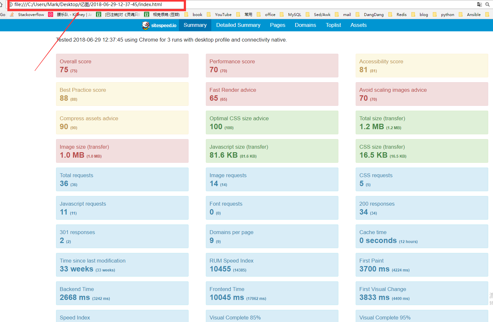
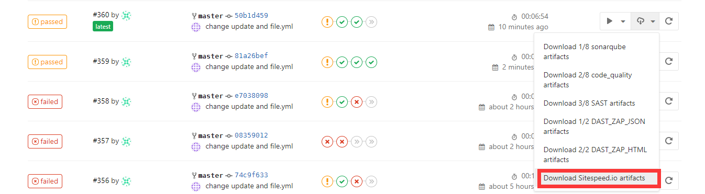

## sitespeed.io
Sitespeed.io是一[组开源工具](https://www.sitespeed.io/documentation/)，可以轻松监控和衡量您网站的性能。
衡量并不是很难：`https://www.sitespeed.io/documentation/sitespeed.io/`
Sitespeed.io参考:
```
https://docs.gitlab.com/ee/ci/examples/browser_performance.html
https://www.sitespeed.io/documentation/sitespeed.io/configuration/
https://www.sitespeed.io/documentation/sitespeed.io/continuous-integration/
```
pull images
```
[gitlab-runner@www.linuxea.com linuxea]$ docker pull sitespeedio/sitespeed.io:7.1.3
```
简单测试一下
```
[gitlab-runner@www.linuxea.com linuxea]$ docker run --shm-size=1g --rm -v "$(pwd)":/sitespeed.io sitespeedio/sitespeed.io:7.1.3 http://www.linuxea.com/ -b chrome --speedIndex --video
Google Chrome 67.0.3396.99 
Mozilla Firefox 61.0
[2018-06-29 12:37:45] INFO: Versions OS: linux 4.16.13-1.el7.elrepo.x86_64 nodejs: v8.11.1 sitespeed.io: 7.1.3 browsertime: 3.1.4 coach: 2.0.4
[2018-06-29 12:37:46] INFO: Starting chrome for analysing http://www.linuxea.com/ 3 time(s)
[2018-06-29 12:37:46] INFO: Testing url http://www.linuxea.com/ iteration 1
[2018-06-29 12:38:32] INFO: BackEndTime: 3242 DomInteractiveTime: 15760 DomContentLoadedTime: 15760 FirstPaint: 4224 PageLoadTime: 20314
[2018-06-29 12:38:32] INFO: VisualMetrics FirstVisualChange: 4400 SpeedIndex: 11630 PerceptualSpeedIndex: 9421 LastVisualChange: 22133
[2018-06-29 12:38:32] INFO: Testing url http://www.linuxea.com/ iteration 2
[2018-06-29 12:39:04] INFO: BackEndTime: 2668 DomInteractiveTime: 5797 DomContentLoadedTime: 5797 FirstPaint: 3672 PageLoadTime: 12645
[2018-06-29 12:39:04] INFO: VisualMetrics FirstVisualChange: 3833 SpeedIndex: 6462 PerceptualSpeedIndex: 5649 LastVisualChange: 14500
[2018-06-29 12:39:04] INFO: Testing url http://www.linuxea.com/ iteration 3
[2018-06-29 12:39:35] INFO: BackEndTime: 2638 DomInteractiveTime: 6498 DomContentLoadedTime: 6499 FirstPaint: 3700 PageLoadTime: 12690
[2018-06-29 12:39:35] INFO: VisualMetrics FirstVisualChange: 3833 SpeedIndex: 7681 PerceptualSpeedIndex: 5652 LastVisualChange: 14833
[2018-06-29 12:39:35] INFO: 36 requests, 1224.04 kb, backEndTime: 2.85s (±160.46ms), firstPaint: 3.87s (±146.57ms), firstVisualChange: 4.02s (±154.32ms), DOMContentLoaded: 9.35s (±2.62s), Load: 15.22s (±2.08s), speedIndex: 8591 (±1273.50), visualComplete85: 13.06s (±3.14s), lastVisualChange: 17.16s (±2.03s), rumSpeedIndex: 11685 (±1103.72) (3 runs)
[2018-06-29 12:39:37] INFO: HTML stored in /sitespeed.io/sitespeed-result/www.linuxea.com/2018-06-29-12-37-45
[2018-06-29 12:39:37] INFO: Finished analysing http://www.linuxea.com/
[gitlab-runner@www.linuxea.com linuxea]$ 
```
产生一个目录。
```
[gitlab-runner@www.linuxea.com linuxea]$ ls sitespeed-result/www.linuxea.com/2018-06-29-12-37-45/
assets.html  css  detailed.html  domains.html  font  help.html  img  index.html  js  logs  pages  pages.html  toplist.html
[gitlab-runner@www.linuxea.com linuxea]$ 
```
我们打开它既能看到页面的状态


### 集成GitLab
写入到.gitlab.yml中
$PWD当前目录挂在进去
将JSON文件复制到当前目录，并且让sitespeed-results和JSON文件提供下载
```
#Sitespeed 
Sitespeed.io:
  <<: *performance
  script:
    - mkdir gitlab-exporter
    - wget -O ./gitlab-exporter/index.js https://gitlab.com/gitlab-org/gl-performance/raw/master/index.js
    - mkdir sitespeed-results
    - docker run --shm-size=1g --rm -v "$(pwd)":/sitespeed.io sitespeedio/sitespeed.io:7.1.3 --plugins.add ./gitlab-exporter --outputFolder sitespeed-results $website || true
    - cp sitespeed-results/data/performance.json $PWD/performance.json
    - sudo chown -R gitlab-runner.gitlab-runner $PWD
  artifacts:
    paths:
    - performance.json
    - sitespeed-results/ 
```
运行完成后的报告在页面中下载

打开页面index.html即可查看