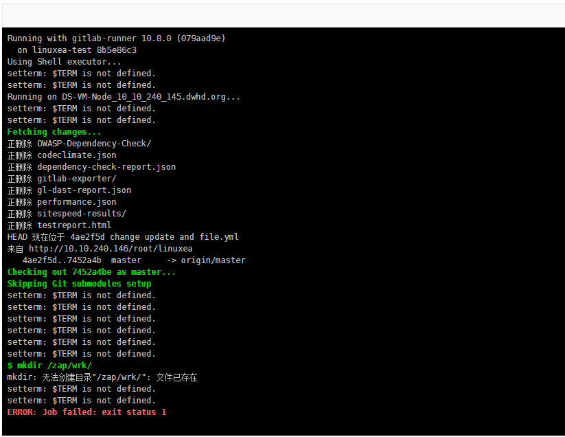
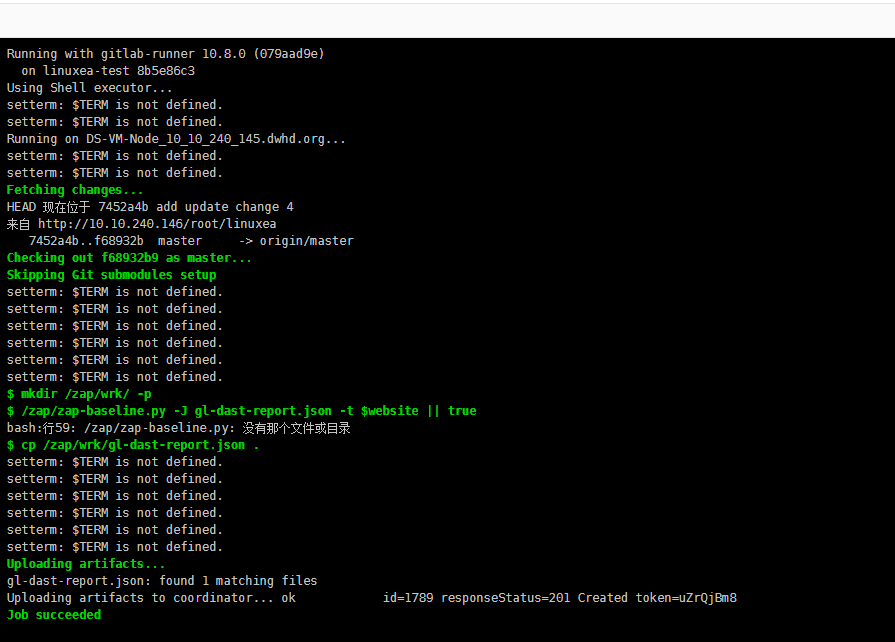
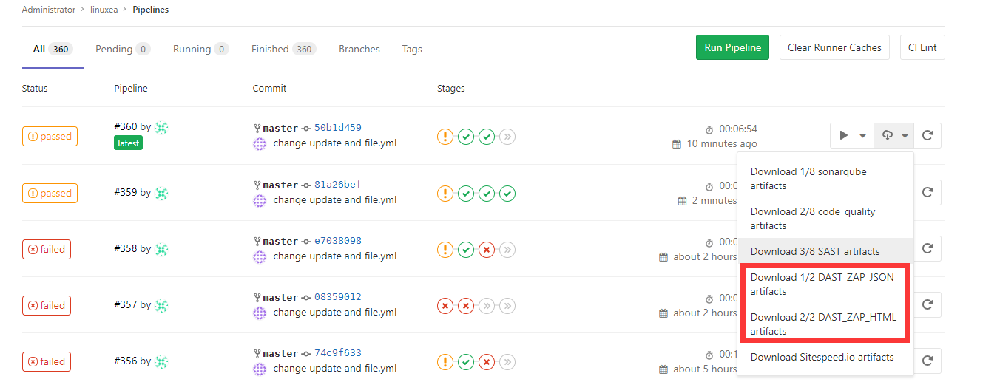
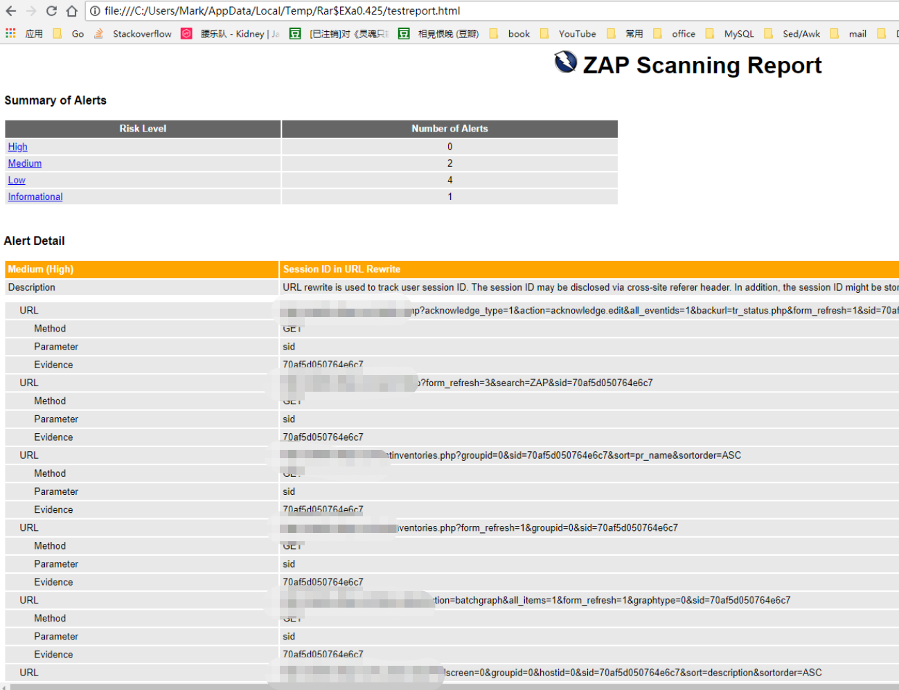

## DAST
DAST全称Dynamic Application Security Testing，使用流行的开源工具[OWASP ZAProxy](https://github.com/zaproxy/zaproxy) 对正在运行的Web应用程序执行分析 
OWASP Zed Attack Proxy（ZAP）是全球最受欢迎的免费安全工具之一 ，它可以在测试应用程序自动查找web应用程序中的安全漏洞，也可以用作手动安全测试

## gitlab官网集成的
按照官网`https://docs.gitlab.com/ee/ci/examples/dast.html`这里来操作，结果失败了，来往下看
官网示例如下：

```
dast:
  image: registry.gitlab.com/gitlab-org/security-products/zaproxy
  variables:
    website: "https://example.com"
  allow_failure: true
  script:
    - mkdir /zap/wrk/
    - /zap/zap-baseline.py -J gl-dast-report.json -t $website || true
    - cp /zap/wrk/gl-dast-report.json .
  artifacts:
    paths: [gl-dast-report.json]
```
在执行DAST检查之前，还可以对用户进行身份验证：
```
dast:
  image: registry.gitlab.com/gitlab-org/security-products/zaproxy
  variables:
    website: "https://example.com"
    login_url: "https://example.com/sign-in"
    username: "john.doe@example.com"
    password: "john-doe-password"
  allow_failure: true
  script:
    - mkdir /zap/wrk/
    - /zap/zap-baseline.py -J gl-dast-report.json -t $website
        --auth-url $login_url
        --auth-username $username
        --auth-password $password || true
    - cp /zap/wrk/gl-dast-report.json .
  artifacts:
    paths: [gl-dast-report.json]
```
### 写yml文件
写一个非常简短的测试，如下
```
stages:
  - dast
dast:
  stage: dast
  image: registry.gitlab.com/gitlab-org/security-products/zaproxy
  variables:
    website: "https://www.linuxea.com"
  allow_failure: true
  script:
    - mkdir /zap/wrk/ -p
    - /zap/zap-baseline.py -J gl-dast-report.json -t $website || true
    - cp /zap/wrk/gl-dast-report.json .
  artifacts:
    paths: [gl-dast-report.json]  
```
运行第一次，报文件已存在，因为我之前手动本地创建过(我与我的顽皮)，我加了-p在跑了一次(我与我的顽皮2)

跑第二次告诉我没有那个文件

这很明显，这条命令被放在本地运行了，并没有在容器内运行，才会报这个错，so，我就改了命令如下开始

* 如果是我手动运行的问题，或者是我用法问题，请留言告诉我，感激不尽
## 优化后集成GitLab
pull images(当然，你前面的步骤也需要pull这个image)
```
[gitlab-runner@LinuxEA-VM-Node_10_10_240_145 ~]$  docker pull registry.gitlab.com/gitlab-org/security-products/zaproxy
```
也可以使用官网的镜像：`owasp/zap2docker-stable`和每周的`owasp/zap2docker-weekly `
YML的JSON部分
### 安全测试
Dynamic Application Security Testing
这里有两部分，分别是json和html的产生文件，html相对来说更直观，所以有了两个，任选其一即可
其中 $website是一个URL，在后面的部分会提到(以上部分已经提到了一次)，这里主要展示zaproxy
其中的$PWD部分，是把当前目录挂载到容器内，JSON和HTML文件会生成在$PWD目录中(当然，也可以是其他目录)
||true用法在这里主要是返回一个文件(如果运行完成的话)，且不论结果如何都会为真，则会进行下一步，也就是返回文件，因为要的就是那份JSON或者HTML文件
JSON部分如下：
```
1/2 DAST_ZAP_JSON:
  stage: code-check
  image: docker:stable
  variables:
    DOCKER_DRIVER: overlay2
    PATHD: /home/gitlab-runner/Increment/
  allow_failure: true
  services:
    - docker:stable-dind 
  script:
    - if [ `docker ps -a|egrep "owasp"|wc -l` -gt 0 ];then  echo "this $(docker ps -a|awk '/owasp/{print $2}') been deleted" && docker ps -a|docker rm -f $(egrep "owasp"|awk -F' ' 'END{print $NF}'); else echo "Nothing owasp/.... Runing"; fi    
    - docker run --rm
      --volume /etc/localtime:/etc/localtime:ro    
      --volume $PWD:/zap/wrk/:rw -t "registry.gitlab.com/gitlab-org/security-products/zaproxy" zap-baseline.py -t $website -g gen.conf -J gl-dast-report.json || true    
    - date      
  dependencies:
    -  deploy
  artifacts:
    paths: [gl-dast-report.json]       
```
YML的HTML部分
```
2/2 DAST_ZAP_HTML:
  stage: code-check
  image: docker:stable
  variables:
    DOCKER_DRIVER: overlay2
    PATHD: /home/gitlab-runner/Increment/
  allow_failure: true
  services:
    - docker:stable-dind 
  script:   
    - if [ `docker ps -a|egrep "owasp"|wc -l` -gt 0 ];then  echo "this $(docker ps -a|awk '/owasp/{print $2}') been deleted" && docker ps -a|docker rm -f $(egrep "owasp"|awk -F' ' 'END{print $NF}'); else echo "Nothing owasp/.... Runing"; fi   
    - docker run --rm
     --volume /etc/localtime:/etc/localtime:ro    
     --volume $PWD:/zap/wrk/:rw -t "registry.gitlab.com/gitlab-org/security-products/zaproxy" zap-baseline.py -t $website -g gen.conf -r testreport.html  || true     
    - date     
  artifacts:
    paths: [testreport.html] 
```
当运行完成后，我们可以下载查看文件的结果

直接打开html它可能是这样的

在上面用的是gitlab官网的镜像，也可以直接用zaproxy的镜像来做
DAST集成参考：

```
https://docs.gitlab.com/ee/ci/examples/dast.html
https://gitlab.com/gitlab-org/security-products/zaproxy
```
ZAP参考：
```
https://github.com/zaproxy/zaproxy
https://github.com/zaproxy/zaproxy/wiki/Packaged-Scans
https://github.com/zaproxy/zaproxy/wiki/Docker
```