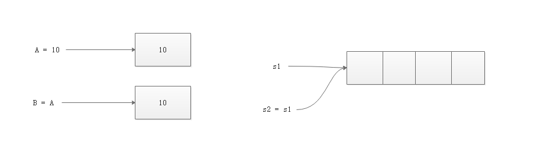
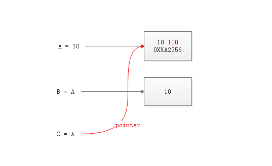

## 1.函数

- go没有默认值，go的函数传递是非常简单，安装参数位置进行传递。

函数对代码进行复用。这和定义一个函数类似，不同的是是对代码块起一个名字，并且可以定义一些参数，这些参数可以进行传递和接收后进行处理 ，处理的结果也需要返回。可见，函数定义有：**函数名**，**函数体**，**函数参数**，**返回值**。

其中，参数和返回值是可以有，也可以没有的。

如果代码形式就成了下面这样

```
func 函数名(函数参数) (返回值) {}
```

函数参数(行参)，是函数快的局部变量。行参返回值都需要描述参数类型和返回值的类型。

- 如果行参配置后，也必须传入相应的值

此前，使用的 `fnuc main`也是函数

```
func main(){}
```

函数也可以赋值给变量，存储在数组，切片，映射中，也可以作为参数传递给函数或作为函数返回值进行返回。函数的参数，数量，对应类型，以及函数返回值称为函数的签名。

###1.1无参数无返回值函数

现在，简单写一个hello world.

```
package main
import "fmt"
func sayHello(){
	fmt.Println("Hello world!")
}
```

而后在main函数中调用,并打印类型

```
func main(){
	fmt.Printf("%T",sayHello)
	sayHello()
}
```

代码块

```
package main
import "fmt"
func sayHello(){
	fmt.Println("Hello world!")
}
func main(){
	fmt.Printf("%T",sayHello)
	sayHello()
}
```

运行

```
[root@linuxea.com /opt/Golang/work3]# go run func.go
func()Hello world!
Hello world!
```

在main函数中可以调用多次sayHello函数

```
package main
import "fmt"
func sayHello(){
	fmt.Println("Hello world!")
}
func main(){
	fmt.Printf("%T",sayHello)
	sayHello()
	sayHello()
	sayHello()
	sayHello()
	sayHello()
}
```

运行

```
[root@linuxea.com /opt/Golang/work3]# go run func.go
func()Hello world!
Hello world!
Hello world!
Hello world!
Hello world!
Hello world!
```

### 1.2有参数无返回值函数

如上，在sayHello中加上参数`name string`。这里的参数也可以称为***行参***

> 如果设置了多少个***行参***，也必须传入多个。

```
func sayHello(name string){
	fmt.Printf("Hello %s!",name)
}
```

`name string`是字符串类型，调用的时候也需要传入字符串.

这里传入的是`"mark"`给`sayHello`，打印的时候打印的`name`就是`mark`。main函数中传递的参数也可以称为***实参***

```
func main(){
	sayHello("mark")
}
```

代码块

```
[root@linuxea.com /opt/Golang/work3]# cat func2.go
package main
import "fmt"
func sayHello(name string){
	fmt.Printf("Hello %s!",name)
}
func main(){
	sayHello("mark")
}
```

运行

```
[root@linuxea.com /opt/Golang/work3]# go run func2.go
Hello mark!
```

或者也可以赋值传递

```
	name := "sean"
	sayHello(name)
```

代码块

```
[root@linuxea.com /opt/Golang/work3]# cat func2.go
package main
import "fmt"
func sayHello(name string){
	fmt.Printf("Hello %s!",name)
}
func main(){
	sayHello("mark")

	fmt.Println("\n")
	name := "sean"
	sayHello(name)
}
```

运行

```
[root@linuxea.com /opt/Golang/work3]# go run func2.go
Hello mark!

Hello sean!
```

### 1.3有返回值有参数函数

写一个计算加法的函数，如下

```
func add(a,b int)int{
	return a + b
}
```

有俩个参数，分别是a和b，都是int类型，返回值也是Int类型。直接return行参即可

在main函数中给add传入两个实参。并且需要一个值来接收。比如a。并且打印

```
func main(){
	a := add(1,2)
	fmt.Println(a)
}
```

> 也可以直接打印`fmt.Println(add(1,2))`

代码块

```
package main
import "fmt"
func add(a,b int)int{
	return a + b
}
func main(){
	a := add(1,2)
	fmt.Println(a)
}
```

运行

```
[root@linuxea.com /opt/Golang/work3]# go run add.go
3
```

### 1.4可变参数

可变参数也需要定义名称，参数类型使用`...`。三个点

- 可变参数只能定义一个，并且一般只能定义在末尾

定义a和b，而后定义可变参数args，可以有，也可以没有，使用三个点表示，而后写上类型，这里使用的是int，最后打印并返回一个0 .如下：

并且打印出args类型：

```
func addN(a,b int,args ...int)  int {
	fmt.Println(a,b,args)
	fmt.Printf("%T",args)
	return 0
}
```

在main中调用的时候，可以传入args，也可以不传

```
func main(){
	fmt.Println(addN(1,2))
	fmt.Println(addN(1,2,3,4,5,6))
}
```

运行

```
[root@linuxea.com /opt/Golang/work3]# go run addn.go
1 2 []
[]int0
1 2 [3 4 5 6]
[]int0
```

可以看到，args的类型是一个切片。

### 1.5计算可变参数值

如上，现在将可变参数中的值进行相加，可变元素和a,b相加，args是切片。那么，现在通过遍历进行相加。

首先，将a,b相加

```
	titak := a + b
```

而后遍历args切片，进行相加

```
	for _,v := range args {
		titak += v
	}
```

最后返回

```
	return titak
```

代码块

```
[root@linuxea.com /opt/Golang/work3]# cat addn.go
package main
import "fmt"

func addN(a,b int,args ...int) int  {

	titak := a + b

	for _,v := range args {
		titak += v
	}
	return titak
	
}
func main(){
	fmt.Println(addN(1,2))
	fmt.Println(addN(1,2,3,4,5,6))
}
```

运行

```
[root@linuxea.com /opt/Golang/work3]# go run addn.go
3
21
```

### 1.6args函数中传递

接上述的函数。现在创建一个cacl的函数，将addN的args传递进来。

args默认是一个空切片，这时候就可以使用args的解包操作`args...`。解包的作用是将args从传递中进行解包（在本节案例中，解包后就是int类型），所以这里是有三个点，否则就变成了传递args元素。

>...操作只能在切片上

如下:

```
func cacl(op string,a,b int,args ...int) int {
	switch op {
	case "add":
		return addN(a,b,args...)
	}
	return -1
}
```

而后在main函数中传递op字符串参数，a,b的int类型，args是可选参数。

`cacl("add",1,2)`：传递给`cacl`，第一个参数add，第二个1，1对于a，第二个2，2对应2。第三个参数没有，args为空切片。调用addN函数相加

`cacl("add",1,2,5)`：传递给`cacl`，第一个参数add，第二个1，1对于a，第二个2，2对应2。第三个参数是5，args解包切片中是5。调用addN函数相加

`cacl("add",1,2,5,8)`：传递给`cacl`，第一个参数add，第二个1，1对于a，第二个2，2对应2。第三个参数是5，args解包切片中是5。第四个参数是8，args解包切片中是8。调用addN函数相加

如下：

```
func main(){
	fmt.Println(cacl("add",1,2))
	fmt.Println(cacl("add",1,2,5))
	fmt.Println(cacl("add",1,2,5,8))
}
```

代码块

```
[root@linuxea.com /opt/Golang/work3]# cat addn2.go
package main
import "fmt"

func addN(a,b int,args ...int) int  {
 
	titak := a + b

	for _,v := range args {
		titak += v
	}
	return titak
	
}
func cacl(op string,a,b int,args ...int) int {
	switch op {
	case "add":
		return addN(a,b,args...)
	}
	return -1
}

func main(){
	fmt.Println(cacl("add",1,2))
	fmt.Println(cacl("add",1,2,5))
	fmt.Println(cacl("add",1,2,5,8))
}
```

运行

```
[root@linuxea.com /opt/Golang/work3]# go run addn2.go
3
8
16
```

> 除了以上的方式，在main函数中还可以修改，通过args的方式传入
> ```
> func main(){
> 
> 
> 	args := []int{1,2,3,4,56,67}
> 	
> 	fmt.Println(addN(1,2,args...))
> 	
> 	fmt.Println(cacl("add",1,2,args...))
> }
> ```
> 运行
> ```
> [root@linuxea.com /opt/Golang/work3]# go run addn2.go
> 136
> 136
> ```

### 1.7解包删除切片

如下：

```
nums := []int{1,2,5,8,0}
```

删除中间的5

和之前的copy删除类型，用`nums[:2]`，拿出索引`start-2`，在用`nums[3:]`，拿出索引`3到END`。

将`nums[:2]`,`nums[3:]...`打印

```
	fmt.Println("nums[:2]:",nums[:2])
	fmt.Println("nums[3:]:",nums[3:])
```

拿到的结果是

```
[root@linuxea.com /opt/Golang/work3]# go run del.go
nums[:2]: [1 2]
nums[3:]: [8 0]
```

加在一起就是`1，2，8，0`，而后使用append添加到`nums`中。

- 这里必须用到`nums[3:]...`的解包。这是核心

```
nums = append(nums[:2],nums[3:]...)
```

代码块

```
package main
import "fmt"
func main(){
	nums := []int{1,2,5,8,0}
	nums = append(nums[:2],nums[3:]...)
	fmt.Println(nums)
}
```

运行

```
[root@linuxea.com /opt/Golang/work3]# go run del.go 
[1 2 8 0]
```

### 1.8返回值

go中，函数所有的分支必须有返回值。在一个函数的逻辑中需要。在上述代码中return了-1，这里返回-1是因为返回值是int类型。如下：

```
func cacl(op string,a,b int,args ...int) int {
	switch op {
	case "add":
		return addN(a,b,args...)
	}
	return -1
}
```

> return -1，-1在这里是说(只要是int类型就可以 )，不管有没有返回的结果，这里都会返回-1。因为在函数逻辑中这里是有返回值的。

这似乎并不明了，写个简单的示例.

执行两次

```
	return 1
	return 0
```

并进行标注，看会发生什么

```
package main
import "fmt"
func testReturn() int {
	fmt.Println("return 1 前")
	return 1
	fmt.Println("return 1 后")
	return 0
}
func main(){
	fmt.Println(testReturn())
}
```

运行

```
[root@linuxea.com /opt/Golang/work3]# go run return.go
return 1 前
1
```

这里看到只是执行了`return 1`，这是因为代码执行到return后就不会在执行后面的了。而上述定义的`return 2`在执行了`return 1`后是永远都不会执行的。

- 而在go中支持多个返回值。

####多返回值示例：

cacl函数，有a和b两个行参，满足加减乘除。在go中，支持多个返回值，于是，代码就可以写成这样

```
return a+b,a-b,a*b,a/b
```

而return了四个返回值后，也需要4个类型来接收

```
func calc(a,b int) (int,int,int,int) {
	return a+b,a-b,a*b,a/b
}
```

代码块

```
package main
import "fmt"
func calc(a,b int) (int,int,int,int) {
	return a+b,a-b,a*b,a/b
}
func main(){
	fmt.Println(calc(9,3))
}
```

运行计算，a是9，b是3的加减乘除计算结果

```
[root@linuxea.com /opt/Golang/work3]# go run calc.go 
12 6 27 3
```

当然，在main函数中，这里也可以分开传递，并且可以进行单个屏蔽，比如屏蔽a4，也就是除法，使用下划线即可。

```
func main(){
	a1,a2,a3,_ := calc(9,3)
	fmt.Println(a1,a2,a3)
}
```

运行

```
[root@linuxea.com /opt/Golang/work3]# go run calc.go
12 6 27
```

#### 命名返回值

上述的返回值是没有定义名称的，我们也可以定一个名称，定义名称后就可以直接return 返回值变量的最终结果返回。还是以加减乘除，如下：

```
func calc2(a,b int) (sum int,diff int,product int,merchant int) {
	sum = a + b
	diff = a - b
	product = a * b 
	merchant = a / b
	return
}
```

```
func main(){
	fmt.Println(calc2(10,2))
}
```

运行

```
[root@linuxea.com /opt/Golang/work3]# go run calc2.go
12 8 20 5
```

如果没有任何赋值就会返回0。

> 命名返回值在代码量较多的时候查看和使用较为不便。

### 1.9递归

递归是指函数直接或间接调用自己，递归常用于解决分治问题，为相同的小问题进行解决，需要关注终止条件。

计算0到100的和，用n的阶乘：`f(n) 1...n`

`0 - 100`的和，等于`0-99`的和加上100，用函数表示就是`f(99)+100`

`0 - 99`的和，等于`0-98`的和加上99，用函数表示就是`f(98)+99`

函数就成了`f(n) = n + f(n-1)`，而f(1) = 1的时候

- 使用递归实现

仍然计算一个1到100的和，假设是Addn的函数，返回值也是int.

return的结果就是`n + Addn(n-1)`

```
func Addn(n int) int{
	return n + Addn(n-1)
}
```

计算0-5的和.

```
func main(){
	fmt.Println(Addn(5))
}
```

这样就相当于从5开始计算

```
Addn(5) => 5 + Addn(4)
Addn(4) => 4 + Addn(3)
Addn(3) => 3 + Addn(2)
Addn(2) => 2 + Addn(1)
Addn(1) = 1 + Addn(0)
```

####终止条件

这样就会一直执行，递归会一直调用自己，形成了死循环。需要一个结束条件语句。

当n等于1的时候就返回

```
	if n == 1 {
		return 1
	}
```

如下：

```
func Addn(n int) int{
	if n == 1 {
		return 1
	}
	return n + Addn(n-1)
}
```

这样代码执行完成

```
package main
import "fmt"

func Addn(n int) int{
	if n == 1 {
		return 1
	}
	fmt.Println("计算f(n):",n)
	return n + Addn(n-1)
}
func main(){
	fmt.Println(Addn(5))
}
```

运行

```
[root@linuxea.com /opt/Golang/work3]# go run add2.go
计算f(n): 5
计算f(n): 4
计算f(n): 3
计算f(n): 2
15
```

### 练习

#### 阶乘

n的阶乘。定义一个factorial，计算n的阶乘，就是n*factorial(n-1)

```
func factorial(n int) int {
	return n * factorial(n-1)
}
```

假设现在计算factorial 5

```
func main(){
	fmt.Println(factorial(5))
}
```

我们仍然需要一个终止条件。如果n等于0，就结束

```
	if n == 0 {
		return 1
	}
```

代码块

```
package main
import "fmt"

func factorial(n int) int {
	if n == 0 {
		return 1
	}
	fmt.Println("factorial:",n)
	return n * factorial(n-1)
}
func main(){
	fmt.Println(factorial(5))
}
```

运行

```
[root@linuxea.com /opt/Golang/work3]# go run add3.go 
factorial: 5
factorial: 4
factorial: 3
factorial: 2
factorial: 1
120
```

#### 汉诺塔游戏

实现汉诺塔游戏

```
package main
import "fmt"

func tower(a,b,c string, layer int){
	if layer == 1 {
		fmt.Println(a,">",c)
		return
	}
	// n-1 a 借助 c 移动到 b
	tower(a,c,b,layer-1)
	fmt.Println(a,">",c)
	// b n-1 借助a 移动到c
	tower(b,a,c,layer-1)
}
func main(){
	fmt.Println("1层")
	tower("a","b","c",1)
	fmt.Println("2层")
	tower("a","b","c",2)
	fmt.Println("3层")
	tower("a","b","c",3)
}
```

运行

```
[root@linuxea.com /opt/Golang/work3]# go run add4.go 
1层
a > c
2层
a > b
a > c
b > c
3层
a > c
a > b
c > b
a > c
b > a
b > c
a > c
```

### 2.0函数赋值给变量

函数也可以赋值给变量，存储在数组，切片，映射中，也可以作为参数传递给函数或作为函数返回值进行返回。函数的参数，数量，对应类型，以及函数返回值称为函数的签名。

- 示例:

来看这样的示例.

定义了add函数，而后在main中将add赋值给f，而后打印出add和f的类型

```
package main
import "fmt"
func add(a,b int)int{
	return a + b
}
func main(){
	fmt.Printf("%T\n",add)
	
	f := add
	fmt.Printf("%T",f)
}
```

运行

```
[root@linuxea.com /opt/Golang/work3]# go run add5.go
func(int, int) int
func(int, int) int
```

当赋值后，f和add都是函数类型。

> 只有相同的函数签名才能赋值，如果函数签名的类型不一样就不可以赋值
>
> ```
> package main
> import "fmt"
> func add(a,b int)int{
> 	return a + b
> }
> func add1(a,b int,args ...string) int {
> 	return 0
> }
> func main(){
> 	fmt.Printf("%T\n",add)
> 	fmt.Printf("%T\n",add1)
> 
> 	var f func(int,int) int = add1
> 	fmt.Printf("%T",f)
> 
> }
> ```
>
> 运行
>
> ```
> [root@linuxea.com /opt/Golang/work3]# go run add6.go
> # command-line-arguments
> ./add6.go:13:6: cannot use add1 (type func(int, int, ...string) int) as type func(int, int) int in assignment
> ```

### 2.1函数传递

函数可以赋值给变量，那也就意味着可以能够进行作为实参进行传递。现在我们定义两个函数进行传参数。

通过函数定义一个行参的函数类型，并把函数通过行参和实参进行传递。

- print函数

先定义一个print函数，传递一个callback函数，

```
func print(callback )
```

callback函数用来格式化，将传递的数据按照每行打印，按|竖线分割打印。

这里使用可变参数，这里之所以使用`func(...string)`，是因为这里传递是一个函数，在print中的名称是callback。而对于print也是用一个 可变的string的行参。

```
func print(callback func(...string),args ...string) {}
```

这也就意味着callback可以接受任意多个字符串函数的变量。

并且进行callback还需要进行解包`callback(args...)`，如下：

```
func print(callback func(...string),args ...string) {
	fmt.Println("println函数:")
	callback(args...)
}
```

- list函数

再定义一个相同函数签名的list函数

```
func list(args ...string){}
```

我们知道，相同函数签名是可以进行赋值的。

并且对args进行遍历

```
func list(args ...string){
	for i,v :=  range args {
		fmt.Println(i,":",v)
	}
}
```

在main中进行调用

```
func main(){
	print(list,"A","C","E")
}
```

如下：

```
package main
import "fmt"
func print(callback func(...string),args ...string) {
	fmt.Println("println函数:")
	callback(args...)
}
func list(args ...string){
	for i,v :=  range args {
		fmt.Println(i,":",v)
	}
}
func main(){
	print(list,"A","C","E")
}
```

当在main中的print函数中调用list的时候，list会传递给callback，而`"A","C","E"`会传递到print的args里面。callback在使用解包将`"A","C","E"`传递到list的args中进行遍历打印

```
[root@linuxea.com /opt/Golang/work3]# go run add7.go
println函数:
0 : A
1 : C
2 : E
```

### 2.2匿名函数

如果一个函数只使用了一次，就可以定义一个匿名函数。匿名函数直接定义一个函数的变量等于一个函数。

- 示例

定义一个匿名函数，行参名称是name，string类型，而后打印name，赋值给sayHello，如下：

```
	sayHello := func(name string) {
		fmt.Println("hello",name)
	}
```

调用sayHello如下：

```
sayHello("mark")
```

代码块

```
package main
import "fmt"
func main(){
	sayHello := func(name string) {
		fmt.Println("hello",name)
	}
	sayHello("mark")
}
```

运行

```
[root@linuxea.com /opt/Golang/work3]# go run add8.go
hello mark
```

- 示例2

当然，我们也可以在定义的同时，直接使用。如下：

```
func(name string) {
		fmt.Println("hello",name)
	}("mark")
```

如下：

```
package main
import "fmt"
func main(){
	func(name string) {
		fmt.Println("hello",name)
	}("mark")
}
```

运行

```
[root@linuxea.com /opt/Golang/work3]# go run add9.go
hello mark
```

- 示例3

如下：

```
package main
import "fmt"
func print(callback func(...string),args ...string) {
	fmt.Println("println函数:")
	callback(args...)
}
func list(args ...string){
	for i,v :=  range args {
		fmt.Println(i,":",v)
	}
}
func main(){
	print(list,"A","C","E")
}
```

将list函数写成匿名函数进行调用

```
package main
import "fmt"
func print(callback func(...string),args ...string) {
	fmt.Println("println函数:")
	callback(args...)
}
func main(){

	list := func(args ...string){
		for i,v :=  range args {
			fmt.Println(i,":",v)
		}
	}
	print(list,"A","C","E")
}
```

运行

```
[root@linuxea.com /opt/Golang/work3]# go run add10.go
println函数:
0 : A
1 : C
2 : E
```

甚至可以在进行修改

- 在调用函数的时候使用匿名函数传递进去

```
package main
import "fmt"
func print(callback func(...string),args ...string) {
	fmt.Println("println函数:")
	callback(args...)
}
func main(){
	print(func(args ...string){
		for i,v :=  range args {
			fmt.Println(i,":",v)
		}
	},"A","C","E")
}
```

运行

```
[root@linuxea.com /opt/Golang/work3]# go run add11.go
println函数:
0 : A
1 : C
2 : E
```

## 2.函数-闭包

闭包通常指变量的生命周期，闭包指的是返回一个函数的时候用来外面的闭包。通常一个函数调用完成后是需要销毁的，但在被内部作用域引用的情况下，是不能进行销毁的。

- 示例

一般而言，在调用一个匿名函数的时候，通常如下：

```
	add30 := func(n int) int {
		return n + 30
	}
```

匿名函数赋值给`add30`，返回值是传递的行参加30.

比如有多个，写多次

```
	add30 := func(n int) int {
		return n + 30
	}
	add20 := func(n int) int {
		return n + 20
	}
	add10 := func(n int) int {
		return n + 10
	}
```

```
	fmt.Println(add30(10))
	fmt.Println(add20(10))
	fmt.Println(add10(10))
```

运行

```
[root@linuxea.com /opt/Golang/work3]# go run add13.go 
40
30
20
```

现在，换种写法.

定义一个addBase，在匿名函数中定义一个int类型的base行参，作为基数，返回一个int类型的函数类型。如下：

```
addBase := func(base int) func(int) int {}
```

而后在其中返回.

首先返回值的类型是一个int的函数，那么就返回一个int类型的函数签名

```
addBase := func(base int) func(int) int {
	return func(n int) int{
		
	}
}
```

在返回的函数类型中，在`return base + n`

```
	addBase := func(base int) func(int) int {
		return func(n int) int{
			return base + n
		}
	}
```

在`return base + n`中，base是匿名函数中的基数的变量，`return base + n`返回的就是匿名函数的基数base函数+返回值中的n

假如现在对`addBase`进行传参，比如传递一个实参，如8，`addBase(8)`，这样就变成了， `8 +n`，传递的8是base 

赋值一个变量进行调用

```
	add1 := addBase(8)
	fmt.Printf("%T\n",add1)
```

add1现在也是一个函数类型。并且进行传值，而后打印

```
	fmt.Println(add1(8))
```

代码块

```
package main
import "fmt"

func main(){

	addBase := func(base int) func(int) int {
		return func(n int) int{
			return base + n
		}
	}
	
	add1 := addBase(8)
	fmt.Printf("%T\n",add1)
	fmt.Println(add1(8))
}
```

运行

```
[root@linuxea.com /opt/Golang/work3]# go run add13.go
func(int) int
16
```

或者这样

```
package main
import "fmt"

func main(){

	addBase := func(base int) func(int) int {
		return func(n int) int{
			return base + n
		}
	}
	fmt.Println(addBase(8)(8))
}	
```

运行

```
[root@linuxea.com /opt/Golang/work3]# go run add14.go
16
```

## 3.函数-值类型引用类型

对于值类型和引用类型的区分，主要看变量赋值给新的变量后，修改新变量后如果对旧变量有影响，就是引用类型，如果没有影响就是值类型

针对值类型和引用类型在赋值后新旧变量的地址并不相同，只是引用类型在底层共享数据结构(其中包含指针类型元素)

值类型：int(数值),bool(布尔),float(浮点数),array,指针，数组，结构体

引用类型：slice(切片),map(映射)，接口等

- 示例

创建两个切片分别是array和slice，而后赋值给sliceA和arrayA，并且修改sliceA和arrayA的索引0位置的A修改成Z，而后打印结果

```
package main
import "fmt"
func main(){
	array := [3]string{"A","B","C"}
	slice := []string{"A","B","C"}
	arrayA := array
	sliceA := slice
	arrayA[0] = "Z"
	sliceA[0] = "Z"
	fmt.Println(arrayA,array)
	fmt.Println(sliceA,slice)
}
```

运行

```
[root@linuxea.com /opt/Golang/work3]# go run add16.go
[Z B C] [A B C]
[Z B C] [Z B C]
```

对于值类型，要修改需要通过指针来操作

- 示例

 定义age，分别通过赋值修改，和指针操作来修改值。如下：

```
package main
import "fmt"
func main(){
	age := 30
	ageA := age
	ageA = 31
	fmt.Println(ageA,age)

	pointer := &age
	*pointer = 31
	fmt.Println(*pointer,age)
}	
```

运行

```
[root@linuxea.com /opt/Golang/work3]# go run add17.go
31 30
31 31
```

最终指针修改会修改会影响到旧变量

## 4.函数-值传递指针传递

在go中只有值传递

- 值传递

在go语言中参数传递默认为值传递(形参为实参变量的副本)，对于引用类型数据因其底层共享数据结构，所以在函数内可对引用类型数据修改从而影响函数外的原变量信息。如下图



a赋值给b后，b是a复制的一份，而s1赋值给s2仍然共享底层数据

- 指针传递



指针赋值给函数后，将会指到原来的地址，并修改内存中的数据。变量的值也就变了。行参和实参都是通过拷贝的，只不过值的数据是一样的，但是值的地址指向是不一样的。

- 示例

值传递赋值的都是一个副本。引用类型数据因其底层共享数据结构。

创建一个`changeInt`和`changeSlice`函数，分别是int类型，和切片，而后分别赋值不同的类型元素通过参数传递给函数，而后打印结果

```
package main
import "fmt"
func changeInt(a int){
	a = 100
}
func changeSlice(s []int){
	s[0] = 100
}
func main(){
	num := 1
	changeInt(num)
	fmt.Println(num)
	
	nums := []int{1,2,3}
	changeSlice(nums)
	fmt.Println(nums)
}
```

运行

```
[root@linuxea.com /opt/Golang/work3]# go run add18.go
1
[100 2 3]
```

值类型传递并没有修改，说明`changeInt`修改没有影响，参数传递通过值类型传递给不同的地址。而引用类型传递后被修改，`changeSlice`修改完成，这些参数传递也是值类型传递，但是会指向同一一个内存区间。

如果此时要修改值类型，就需要指针操作

- 指针传递

在原有的代码中添加一个`changeIntByPoint`函数

```
func changeIntByPoint(a *int){}
```

而后通过指针操作

```
*a = 100
```

如下：

```
package main
import "fmt"
func changeInt(a int){
	a = 100
}
func changeSlice(s []int){
	s[0] = 100
}
func changeIntByPoint(a *int){
	*a = 100
}
func main(){
	num := 1
	changeInt(num)
	fmt.Println(num)
	
	nums := []int{1,2,3}
	changeSlice(nums)
	fmt.Println(nums)
	
	changeIntByPoint(&num)
	fmt.Println(num)
}
```

运行

```
[root@linuxea.com /opt/Golang/work3]# go run add19.go 
1
[100 2 3]
100
```

现在值就变成了100

## 5.错误处理`errors.New()`

- error接口

go语言通过error接口实现错误处理的标准模式，在go中山没有异常的，可以通过返回值信息告诉调用者是否发生了错误。一般而言，我们需要定义返回错误的值，如果没有定义错误处理，那就会抛出错误信。

通常error接口，通过errors包中的`errors.New()`和`fmt.Errorf`方法进行创建。

- error

error如果没有错误就会返回nil，如果有就返回创建的错误信息

我们先看没有错误处理的情景，比如下面这段代码：

```
package main
import "fmt"
func division(a,b int) int {
	return a / b
}
func main(){
	fmt.Println(division(9,3))
	fmt.Println(division(1,0))
}
```

运行

```
[root@linuxea.com /opt/Golang/work3]# go run error1.go
3
panic: runtime error: integer divide by zero

goroutine 1 [running]:
main.division(...)
	/opt/Golang/work3/error1.go:4
main.main()
	/opt/Golang/work3/error1.go:8 +0x88
exit status 2
```

- `errors.New()`

我们通过errors包中的`errors.New()`函数来创建

我们定义返回值的错误类型，如下：

首先判断，行参b等于0就返回-1，并且返回`errors.New("division by zero")`。反之返回a除以b，和nil

```
func division(a,b int) (int,error) {
	if b == 0 {
		return -1,errors.New("division by zero")
	}
	return a / b,nil
}
```

在main函数中，也需要做处理，division函数中返回了两个返回值，main中接收，在做处理，如果返回的是nil，说明没有错误，直接打印返回的int，否则就将接收的errors返回值打印出来

```
func main(){
	fmt.Println(division(9,3))
	if v,err := division(1,0);err != nil{
		fmt.Println(err)
	}else {
		fmt.Println(v)
	}
}
```

代码块

```
package main
import (
	"fmt"
	"errors"
)
func division(a,b int) (int,error) {
	if b == 0 {
		return -1,errors.New("division by zero")
	}
	return a / b,nil
}
func main(){
	fmt.Println(division(9,3))
	if v,err := division(1,0);err != nil{
		fmt.Println(err)
	}else {
		fmt.Println(v)
	}
}
```

运行

```
[root@linuxea.com /opt/Golang/work3]# go run error.go
3 <nil>
division by zero
```

- `fmt.Errorf()`

除了`errors.New`还有在`fmt`包中的`Errorf`函数。我们打印下它的类型

```
[root@linuxea.com /opt/Golang/work3]# cat error2.go
package main
import "fmt"
func main(){
	e := fmt.Errorf("Error: %s","division by zero")
	fmt.Printf("%T,%v\n",e,e)
}
```

运行

```
[root@linuxea.com /opt/Golang/work3]# go run error2.go 
*errors.errorString,Error: division by zero
```

## 6.延迟执行defer

在很多时候，不管程序异常或者正常，我们都希望它执行一些代码。就需要延迟执行

- defer

defer会在函数退出的时候执行。

- 示例

打印两个语句，分别用defer和不用defer。如下：

通常，defer会跟上一个匿名函数调用

```
	defer func(){
    	fmt.Println("defer")
	}()
```

我们在加上一个`fmt.Println("main")`

```
package main
import "fmt"
func main(){
	defer func(){
    	fmt.Println("defer")
	}()
	fmt.Println("main")
}	
```

运行

```
[root@linuxea.com /opt/Golang/work3]# go run defer.go
main
defer
```

可以发现，main先被打印，而后再打印的defer

- 多个defer

如果此刻有多个defer，打印的顺序将会是从后往前执行，如下：

- 示例

分别打印`defer one`,`defer two`和`main`

```
package main
import "fmt"
func main(){
	defer func(){
    	fmt.Println("defer two")
	}()
	defer func(){
    	fmt.Println("defer one")
	}()	
	fmt.Println("main")
}
```

运行

```
[root@linuxea.com /opt/Golang/work3]# go run defer1.go
main
defer one
defer two
```

这遵循栈规则，先进后出。或者说defer是从下往上执行的顺序。

## 7.panic与recover错误处理

go语言提供panic和recover函数用于处理运行时的错误，当调用panic抛出错误，中断原有的流程控制，常用于不可修复性错误。recover函数用于终止错误处理流程，仅在defer语句的函数中有效，用于截取错误处理流程，recover只能捕获到最后一个错误

- panic示例

我们在panic前后打印start和end

```
[root@linuxea.com /opt/Golang/work3]# cat panic.go
package main
import "fmt"
func main(){
	fmt.Println("main start")
	panic("error")
	fmt.Println("main end")
}
```

运行

```
[root@linuxea.com /opt/Golang/work3]# go run panic.go
main start
panic: error

goroutine 1 [running]:
main.main()
	/opt/Golang/work3/panic.go:5 +0x96
exit status 2
```

可以看到panic后面的print是没有执行的。在panic处就结束了。

- recover

recover函数一般用于做恢复的，主动处理panic的错误，必须用于defer中。

但是和之前不同的是，使用了recover后，发生错误后返回的是一个`panic error`信息

- 示例

recover是string类型的一个error，所以我们可以使用if判断是否等于nil或者不等于nil

如果不等于nil，那说明有错误，就可以抛出错误。这里手动加的`panic("the is error")`

```
package main
import "fmt"
func main(){
	defer func(){
		if err := recover(); err != nil{
			fmt.Println(err)
		}
	}()
	fmt.Println("start")
	panic("the is error")
	fmt.Println("end")
}
```

运行

```
[root@linuxea.com /opt/Golang/work3]# go run recover.go
start
the is error
```

如果没有panic错误，就不会执行recover()

```
[root@linuxea.com /opt/Golang/work3]# cat recover.go
package main
import "fmt"
func main(){
	defer func(){
		if err := recover(); err != nil{
			fmt.Println(err)
		}
	}()
	fmt.Println("start")
	fmt.Println("end")
}
```

运行

```
[root@linuxea.com /opt/Golang/work3]# go run recover.go
start
end
```

- 示例2

在其他函数中也可以直接这样抓取panic错误，如下：

```
func test(){
	defer func(){
		if err := recover(); err != nil{
			fmt.Println(err)
		}
	}()	
	panic("the test error")
}
```

或者返回一个error信息

首先定义一个error返回值，如果发生panic错误，就通过recover将值赋值给err，通过return返回

```
func test() (err error) {
	defer func(){
		if er := recover(); er != nil{
			err = fmt.Errorf("%v",er)
		}
	}()	
	panic("the test error")
	return
}
```

而后在main中，因为test有返回值，这里需要as接收，而后打印即可。

```
func main(){
	as := test()
	fmt.Println(as)
}
```

如下：

```
package main
import "fmt"
func test() (err error) {
	defer func(){
		if er := recover(); er != nil{
			err = fmt.Errorf("%v",er)
		}
	}()	
	panic("the test error")
	return
}
func main(){
	as := test()
	fmt.Println(as)
}
```

运行

```
[root@linuxea.com /opt/Golang/work3]# go run testerr.go
the test error
```

