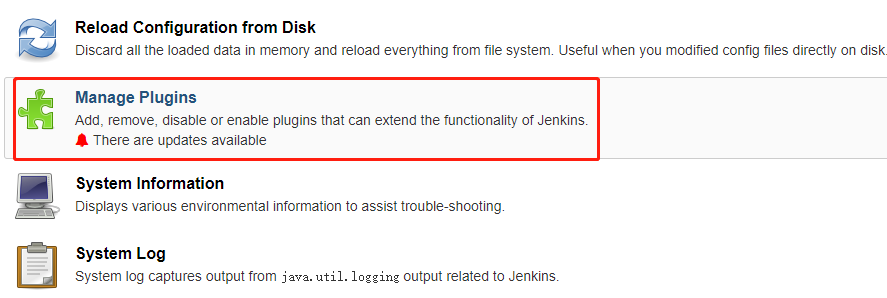
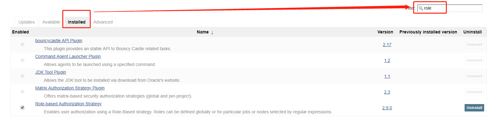
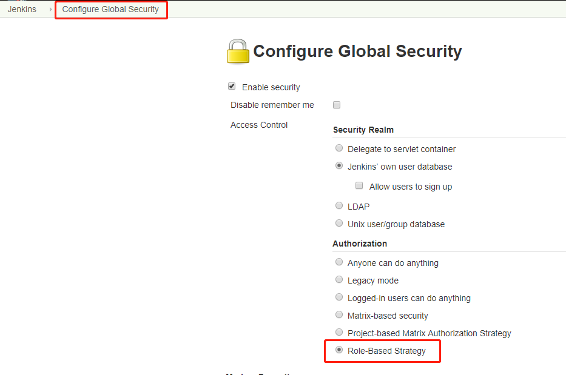
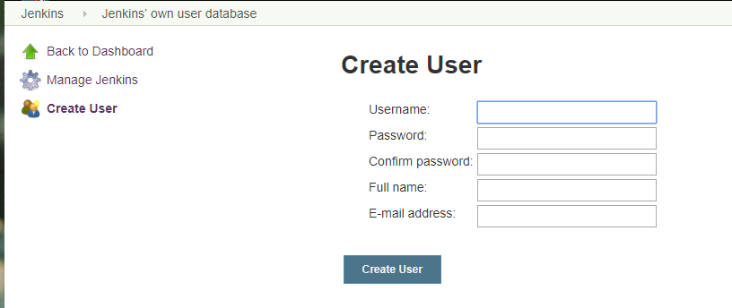
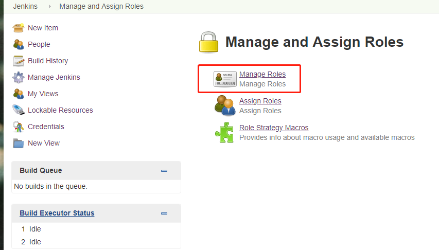
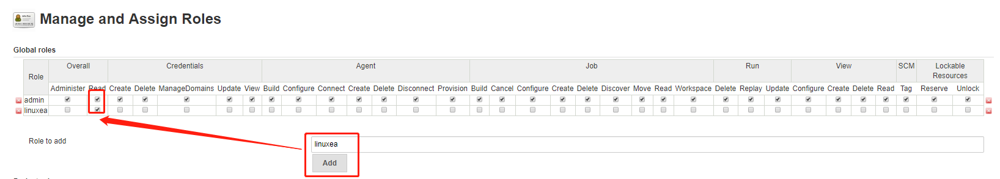
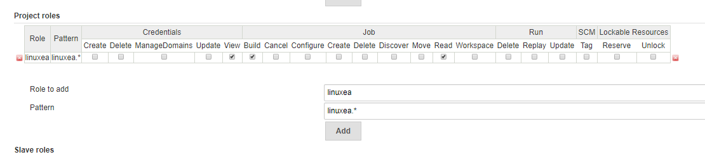
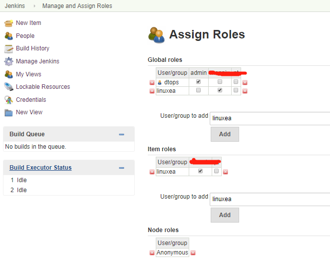

基于用户角色的权限控制

jenkins基于用户角色的权限控制需要Role-based Authorization Strategy插件的控制，其中需要借助jenkins用户对角色授权，而在角色下添加项目的所属角色，而这个角色通过正则匹配绑定项目，那这也就是说你的项目要想做控制，必须有统一的一个标签来进行区分。那如果你事先没有准备，也没有关系，Rename即可。这些绑定后，在到全局roles中勾选对应的：角色和项目，相互对应即可完成权限控制。

如果你可以打开官网，推荐阅读：https://wiki.jenkins.io/display/JENKINS/Role+Strategy+Plugin

> 先决条件：
> ​	 jenkins version: 2.138.2 
> ​	插件：Role-based Authorization Strategy

[TOC]

## 安装插件

登录jenkins，在左侧选择Manage Jenkins(**管理詹金斯**)

找到管理插件(Manage Plugins)

而后点击"Installed"，在右侧"Filter"中输入"role",可以看到我这里已经安装了一个`Role-based Authorization Strategy` ,如下图

而后仍然在Manage Jenkins页面中选择Configure Global Security，打开Role-Based Strategy

## 创建用户

在Manage Jenkins中选择Manage Users，点击Create User,创建用户

## Manage and Assign Roles

这时候Manage Jenkins页面就多了一个Manage and Assign Roles，进入选择Manage Roles

### Manage Roles

而后在Global roles 中的role to add中add一个输入角色role。这个角色的权限只有read

- 这里的图片太宽，请右击“在新的标签页打开”打开图片

而后在add一个Project roles

- 这里的Project  roles和Global roles是相互对应，Global roles是全局角色，而Project  roles是项目角色，为了便于区分，我建议将全局role或者项目role以及用户名设置成一样。
- 而Pattern是一个正则匹配。以项目开头来区分分配。如: linuxea.* 也就是说以linuxea开头的都划入linuxea角色中，linuxea*项目具备linuxea角色的授权权限

如下图

而后保存。

### Assign Roles 

回到Manage Jenkins中一个Manage and Assign Roles页面，选择Assign Roles进入

在Global roles和Item roles add 用户和item roles

- item roles关联了Project roles中的Pattern中的正则匹配和被正则匹配中的项目的项目权限。由此你可以控制你的项目权限

