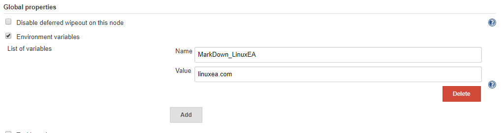
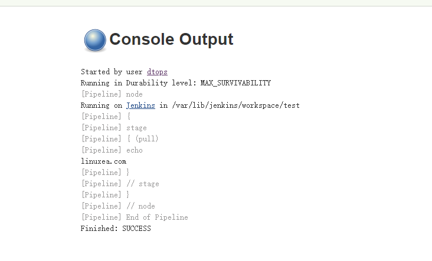
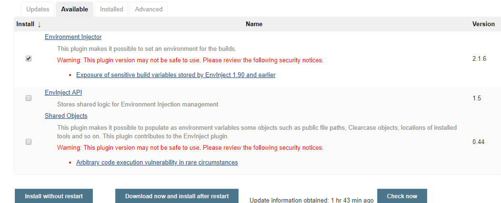
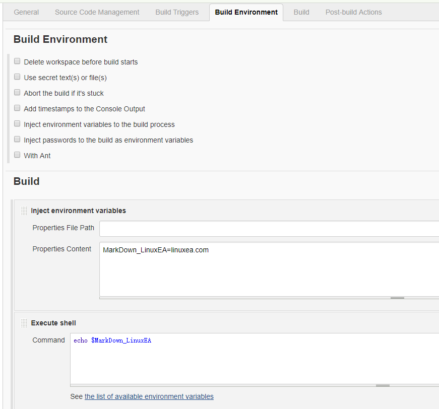
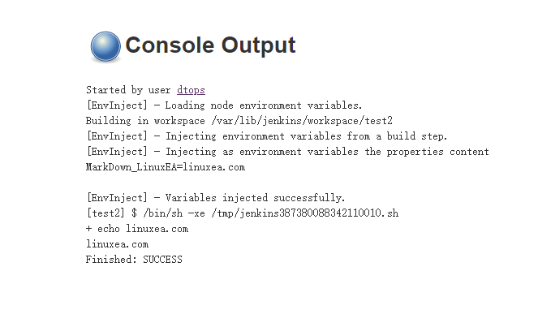
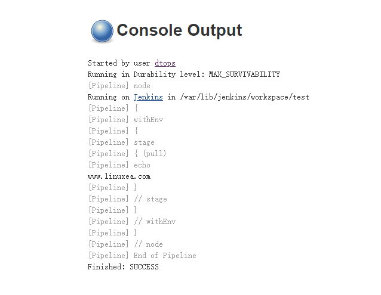

作为领先的开源自动化服务应用，Jenkins提供数百个插件来支持构建，部署和自动化任何项目。Jenkins使用Environment变量公开组件的一些常用的参数指标等。

阅读此章，你将了解关于环境变量的所有信息。

- 1，创建全局环境变量
- 2，访问全局环境变量。
- 3，在构建期间创建本地环境变量。

[TOC]


## 1.创建全局环境变量
------

### 1.1使用Jenkins控制台

我们可以轻松创建全局环境变量。

Manage Jenkins-->Configure System-->Global properties-->Environment variables，我们勾选Environment variables，配置一个名称为MarkDown_LinuxEA，值为linuxea.com的变量。如下：



## 2. 访问全局环境变量

### 2.1在詹金斯管道中

要在管道中使用上面定义的变量，我们可以使用env.Key让我们访问jenkins全局变量。

```
pipeline {
    agent any
    stages {
        stage('pull'){
            steps {
                echo env.MarkDown_LinuxEA
            }
        }
    }
}
```

build


在jenkins管道中，有很多其他有用的环境变量可以在构建执行期间访问。

最有用的环境变量。

1. **ENV**：环境变量是从Groovy代码的访问`env.VARNAME`，或简称为`VARNAME`。也可以写入此类属性（仅使用`env.`前缀）;
2. **currentBuild：**该`currentBuild`变量可用于引用当前运行的构建。
3. **params**：将构建中定义的所有参数公开为具有各种类型值的只读映射。
4. **docker**  ：该`docker`变量提供了从Pipeline脚本方便地访问与Docker相关的函数。

### 2.2 在Shell/Batch脚本中

在Shell脚本中，我们可以使用\$ Key或\$ {Key}来使用环境变量。同样在批处理中，我们可以使用％Key％来访问环境变量

### 2.3在FreeStyle项目中

在freestyle项目中，我们可以使用[EnvEnject插件](https://wiki.jenkins.io/display/JENKINS/EnvInject+Plugin)。搜索安装或者下载安装即可



而后我配置一个一样的变量，并且打印



观察日志



## 3.在构建期间创建本地环境变量。

3.1使用Declarative管道

```groovy
pipeline {
    agent any
    environment {
        MarkDown_LinuxEA = 'www.linuxea.com'
    } 
    stages {
        stage('pull'){
            steps {
                echo env.MarkDown_LinuxEA
            }
        }
    }
}
```

build



这样一来，如果是相同的变量名称，而在pipeline中的将会生效。全局的变量失效。

## 查看更多

如果你要查看更多关于jenkins和gitlab-ci/cd的文章，请关注一下分类。
- [gitlab-ci/cd](https://www.linuxea.com/tag/gitlab/)
- [jenkins](https://www.linuxea.com/tag/jenkins/)
- [持续集成](https://www.linuxea.com/tag/devops/)