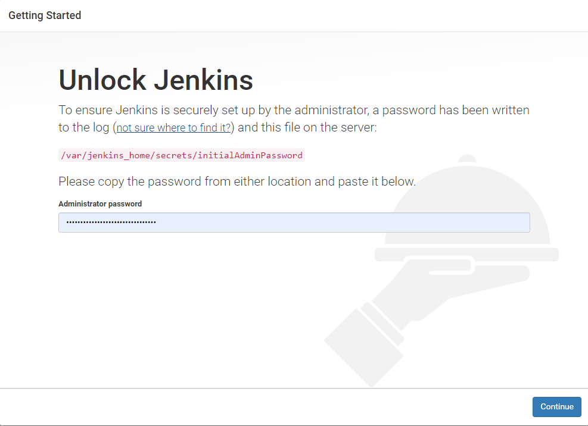

在很长一段时间里面，jenkins都没有升级，这些部署的工具事实上也不需要频繁的升级。如果一旦要升级，可能面临的不单单是主版本升级，而是插件升级。插件升级就意味着插件的配置很大可能会丢失。上次jenkins安装时间在一年半之前，想原封不动的平滑升级难度太大。为了解决这个问题，并且顺利的升级。我采用在一台机部署两个jenkins，而后将旧的配置迁移到新的jenkins之上，这样做的好处在于，我可以在升级的过程中继续使用jenkins，将空闲的项目一个个迁移到新版本的jenkins。

阅读本章节，你将了解如何单机部署两个jenkins(并非主从)，通过人为选择迁移，从而完成单机版jenkins升级。

[TOC]

## 配置端口

如果要在一台机器运行两个jenkins，那么端口必然要不同，为了简化操作，我使用官网提供的docker镜像包进行二次封装。

其中，我们仅仅需要修改启动脚本[jenkins.sh](https://github.com/jenkinsci/docker/blob/master/jenkins.sh)，在其中添加一条端口配置。

```bash
--httpPort=58080
```
添加的位置在exec中，如下
```bash
exec java -Duser.home="$JENKINS_HOME" "${java_opts_array[@]}" -jar ${JENKINS_WAR} --httpPort=58080 "${jenkins_opts_array[@]}" "$@"
```

最终的脚本如下:

```bash
#! /bin/bash -e

: "${JENKINS_WAR:="/usr/share/jenkins/jenkins.war"}"
: "${JENKINS_HOME:="/var/jenkins_home"}"
touch "${COPY_REFERENCE_FILE_LOG}" || { echo "Can not write to ${COPY_REFERENCE_FILE_LOG}. Wrong volume permissions?"; exit 1; }
echo "--- Copying files at $(date)" >> "$COPY_REFERENCE_FILE_LOG"
find /usr/share/jenkins/ref/ \( -type f -o -type l \) -exec bash -c '. /usr/local/bin/jenkins-support; for arg; do copy_reference_file "$arg"; done' _ {} +

# if `docker run` first argument start with `--` the user is passing jenkins launcher arguments
if [[ $# -lt 1 ]] || [[ "$1" == "--"* ]]; then

  # read JAVA_OPTS and JENKINS_OPTS into arrays to avoid need for eval (and associated vulnerabilities)
  java_opts_array=()
  while IFS= read -r -d '' item; do
    java_opts_array+=( "$item" )
  done < <([[ $JAVA_OPTS ]] && xargs printf '%s\0' <<<"$JAVA_OPTS")

  if [[ "$DEBUG" ]] ; then
    java_opts_array+=( \
      '-Xdebug' \
      '-Xrunjdwp:server=y,transport=dt_socket,address=5005,suspend=y' \
    )
  fi

  jenkins_opts_array=( )
  while IFS= read -r -d '' item; do
    jenkins_opts_array+=( "$item" )
  done < <([[ $JENKINS_OPTS ]] && xargs printf '%s\0' <<<"$JENKINS_OPTS")

  exec java -Duser.home="$JENKINS_HOME" "${java_opts_array[@]}" -jar ${JENKINS_WAR} --httpPort=58080 "${jenkins_opts_array[@]}" "$@"
fi

# As argument is not jenkins, assume user want to run his own process, for example a `bash` shell to explore this image
exec "$@"
```
> PS：我要运行更多的jenkins怎么办？

那么如果你要在机器上运行2个以上jenkins，那你至少要配置不同的端口。我这里演示的是写死了端口号，你也可以做变量传递，仍然通过这个脚本。

```
HHTTPORT=${HHTTPORT:-58080}
```

而后在这里调用

```
exec java -Duser.home="$JENKINS_HOME" "${java_opts_array[@]}" -jar ${JENKINS_WAR} --httpPort="${HHTTPORT}" "${jenkins_opts_array[@]}" "$@"
```

而后启动的时候传入HHTTPORT就可以设置端口了，如果不传递变量值，默认就使用58080

## 安装软件包

我使用的是dockerhub上[jenkins以alpine](https://hub.docker.com/r/jenkins/jenkins/tags)为基础的镜像，在后续的使用中，我会使用到ansible，在这次构建也会安装。如果你有其他的安装，你也需要在此安装。

```dockerfile
FROM jenkins/jenkins:2.164.1-alpine
USER root
COPY jenkins.sh /usr/local/bin/jenkins.sh
RUN apk update && apk add ansible bash sshpass\
	&& chown jenkins.jenkins /usr/local/bin/jenkins.sh \
	&& chmod +x /usr/local/bin/jenkins.sh
USER jenkins
```

这里的USER是要切换用户，这里的用户为jenkins，UID是1000，在此后的文件挂载中，jenkins如果要写入到挂载的目录，就需要授权1000目录属主权限。

编译完成后，push到dockerhub，名称是：`marksugar/jenkins:2.164.1-alpine-ansible-58080`

docker-compose如下：

```yaml
version: '2'
services:
  jenkins:
    image: marksugar/jenkins:2.164.1-alpine-ansible-58080
    container_name: jenkins
    restart: always
    network_mode: host
    volumes:
      - /data/2019_docker_jenkins/jenkins_home:/var/jenkins_home
      - /etc/ansible:/etc/ansible
    ports:
      - 58080:58080
```
这里需要挂在本地目录到容器内的目录，这样一来，容器内安装的插件和配置在docker容器删除后，是不会丢失的。
但在开始之前，你要授权这个目录为1000

```bash
chown -R 1000:1000 2019_docker_jenkins/
```

在启动之后，可以使用`docker logs jenkins`看到日志的中的密码文件

```yaml
INFO: 

*************************************************************
*************************************************************
*************************************************************

Jenkins initial setup is required. An admin user has been created and a password generated.
Please use the following password to proceed to installation:

18a1a76e02654bb5afaa4f17b44fafa5

This may also be found at: /var/jenkins_home/secrets/initialAdminPassword

*************************************************************
*************************************************************
*************************************************************

```

而后通过58080端口访问即可


## 查看更多

如果你要查看更多关于jenkins和gitlab-ci/cd的文章，请关注一下分类。
- [gitlab-ci/cd](https://www.linuxea.com/tag/gitlab/)
- [jenkins](https://www.linuxea.com/tag/jenkins/)
- [持续集成](https://www.linuxea.com/tag/devops/)