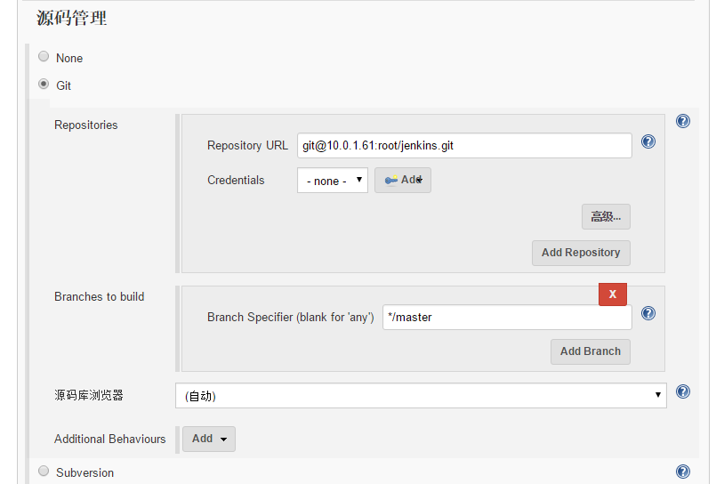
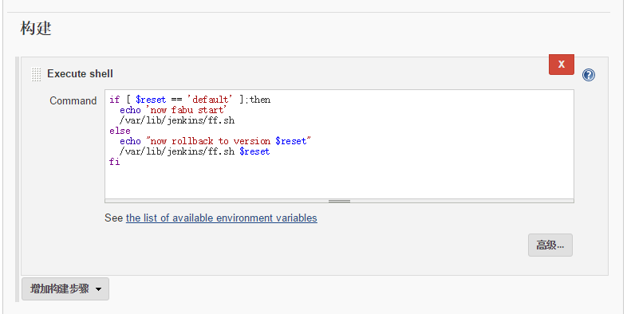

[TOC]

### 1， install gitlab

```
[root@linuxea-com ]#  yum install curl policycoreutils openssh-server openssh-clients
[root@linuxea-com ]# systemctl enable sshd
[root@linuxea-com ]# systemctl start sshd
[root@linuxea-com ]# yum install postfix
[root@linuxea-com ]# systemctl enable postfix
[root@linuxea-com ]# systemctl start postfix
[root@linuxea-com ]# systemctl mask firewalld
[root@linuxea-com ]# systemctl stop firewalld
[root@linuxea-com ]# yum install epel* -y
[root@linuxea-com ]# yum -y install iptables-devel iptables-services iptables vim wget bash-completion-extras.noarch
[root@linuxea-com ]# systemctl enable iptables
[root@linuxea-com ]# systemctl start iptables
[root@linuxea-com ]# iptables -F
[root@linuxea-com ]# curl -s https://packages.gitlab.com/install/repositories/gitlab/gitlab-ce/script.rpm.sh |bash
[root@linuxea-com ]# yum install gitlab-ce-8.15.1-ce.0.el7.x86_64
或者直接下载
[root@linuxea-com ]# axel -n 30 https://packages.gitlab.com/gitlab/gitlab-ce/packages/ol/7/gitlab-ce-8.15.1-ce.0.el7.x86_64.rpm
[root@linuxea-com ]# gitlab-ctl reconfigure
修改external_url
[root@linuxea-com ]# vim /etc/gitlab/gitlab.rb
external_url 'http://10.10.239.222'
登陆账户
root
5iveL!fe
```
其他文章推荐如下：
官网安装：http://www.linuxea.com/1407.html
国内源安装：http://www.fblinux.com/?p=662

### 2， install jenkins

```
[root@linuxea-com ]# curl -Lks4 http://pkg.jenkins-ci.org/redhat-stable/jenkins.repo -o /etc/yum.repos.d/jenkins.repo
[root@linuxea-com ]# rpm --import https://jenkins-ci.org/redhat/jenkins-ci.org.key
[root@linuxea-com ]# yum install jenkins
```
jenkins安装部署文章推荐：[http://www.fblinux.com/?p=705](http://www.fblinux.com/?p=705)
### 3，配置
 我这里的git和jenkins分离开的，当gitlab和jenkins分别安装配置完成后，开始做一些简单的部署测试。我这里使用ansible的synchronize来进行推送，我们先在jenkins上安装ansible，可以参考第二步中西门飞雪博客的文章，这里关键提到的是推送代码和回滚
#### 3.1 安装ansible配置hosts
```
[root@linuxea-com /var/lib/jenkins]# yum install ansible -y
```
配置hosts，最终脚本以jenkins用户执行，这里需要指定ansible_ssh_user=root
```
[root@linuxea-com /var/lib/jenkins]# cat /etc/ansible/hosts 
[php]
10.57.57.57 ansible_ssh_user=root
```
#### 3.2 配置jenkins
在jenkins中配置一个自由风格的项目，配置好源码管理git

在参数化构建过程选项卡中，设置如下：

在构建的Execute shell的command中，写入如下：

如果reset默认值为default（参数化构建过程 设置，如上图），也就是传入参数为空，则会执行脚本触发更新和发布，如果传入latest则运行git reset --hard HEAD^回退一个版本后进行发布，如果传入的不是latest，也不为空，则会进行git reset --hard进行固定版本好回退

ff.sh脚本如下
```
#!/bin/bash
#########################################################################
# File Name: ff.sh
# Author: mark
# Email: usertzc@gmail.com
# Version: 
# Created Time: 2016年12月27日 星期二 19时20分10秒
#########################################################################
wwwgit=/var/lib/jenkins/jenkins/
wwwroot=/data/wwwroot
if [ $# == 1 ];then
	banbenhao=`echo $1`
	cd $wwwgit
	if [ $banbenhao == 'latest' ];then
		git reset --hard HEAD^
	else
		git reset --hard $banbenhao
	fi
	ansible php -m synchronize -a "src=${wwwgit} dest=${wwwroot} rsync_opts=--delete"
	ansible php -a "chown -R www.www ${wwwroot}"
else
	cd ${wwwgit} && git pull 
	ansible php -m synchronize -a "src=${wwwgit} dest=${wwwroot} rsync_opts=--delete"
	ansible php -a "chown -R www.www ${wwwroot}"
fi
```