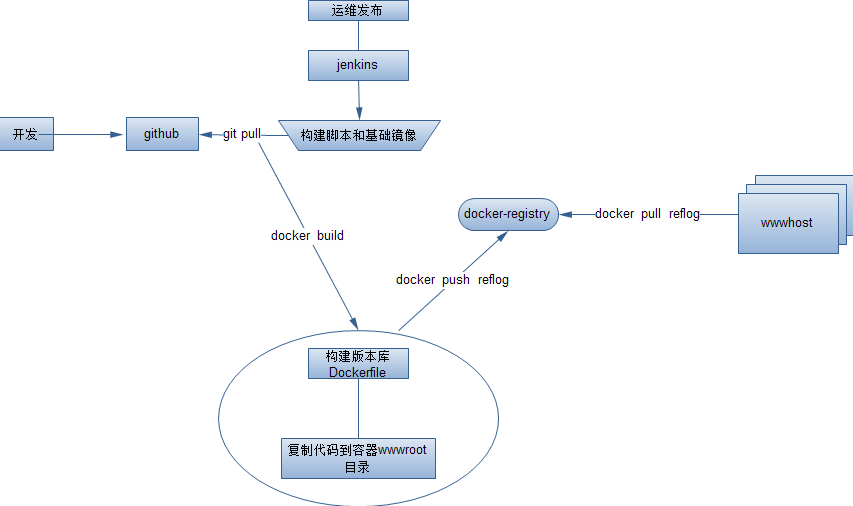
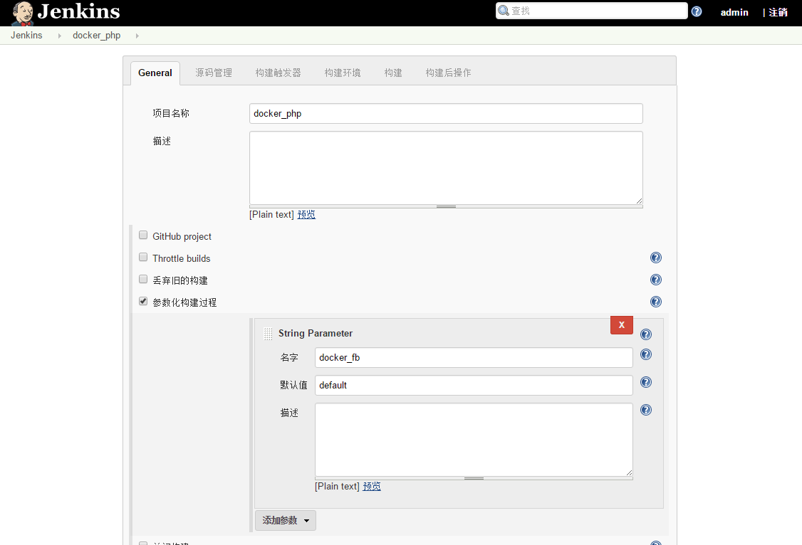
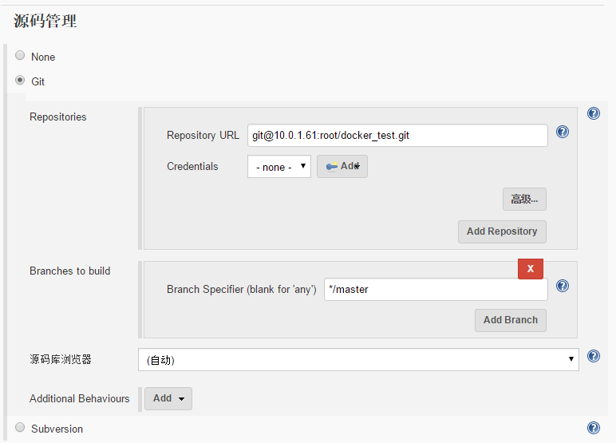
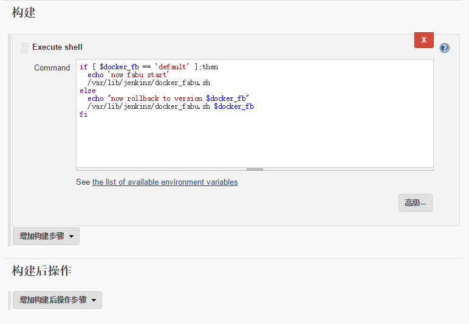

本章简单介绍docker+jenkins+gitlab发布和回滚，相比较上一篇中git+jenkins `http://www.linuxea.com/1537.html`来说，加入了docker，加入docker后，发布和回滚变得将是很简单，容器本身一次构建后，存放在docker仓库中，回滚只需要拉取仓库的镜像后直接run起来即可，回滚也是如此，而且他的备份可以直接打包成tar.gz压缩包，解压到其他机器，部署docker应用后，即可恢复。

[TOC]

### 一，本地仓库下载
1.1，参考本站中docker本地仓库搭建，链接：[Docker本地仓库简单使用][1]
1.2，安装
docker run -d -p 5000:5000 registry
这时候可以看到运行了两个容器
```
[root@linuxea-com ~]# docker ps -a
CONTAINER ID        IMAGE               COMMAND                  CREATED             STATUS              PORTS                    NAMES
ebe95cb71671        registry            "/entrypoint.sh /etc/"   2 minutes ago       Up 2 minutes        0.0.0.0:5000->5000/tcp   tender_wright
ca797ad15342        centos              "bash"                   20 hours ago        Up 20 hours                                  test
[root@linuxea-com ~]# 
```
### 二，构建一个docker的nginx镜像
首先，构建一个nginx基础镜像， 只需要将日志放出来即可。
当构建完成后，在编写一个Dockerfile，在本地通过git pull拉取代码到，COPY将本地代码复制到容器中后，build镜像并且push到本地仓库，此时。便可以使用远端docker pull拉取。其中每次构建会拿git reflog中的版本好做标记，回滚也是需要用上标记的版本号。如下图：

docker基础镜像Dockfile和代码构建的Dockfile，在github上存储，直接可以拿来使用

```
#!/bin/bash
#########################################################################
# File Name: jc.sh:wq
# Author: www.linuxea.com
# Email: usertzc@gmail.com
# Version:
# Created Time: 2016年12月31日 星期六 16时15分16秒
#########################################################################
wwwp=/wwwroot/docker
mkdir -p $wwwp
curl -Lks4 https://raw.githubusercontent.com/LinuxEA-Mark/jenkins_gitlab/master/Dockerfile -o  $wwwp/Dockerfile
cd $wwwp && docker build -t nginx . && rm -rf Dockerfile
culr -Lks4 https://raw.githubusercontent.com/LinuxEA-Mark/jenkins_gitlab/master/jenkins/Dockerfile -o $wwwp/Dockerfile
```
我们下载一个脚本
```
[root@linuxea-com ~]# curl -Lks4 https://raw.githubusercontent.com/LinuxEA-Mark/jenkins_gitlab_Docker/master/docker_fabu.sh -o /wwwroot/docker/docker_fabu.sh
[root@linuxea-com ~]# chmod +x /wwwroot/docker/docker_fabu.sh
[root@linuxea-com ~]# chown jenkins.jenkins /wwwroot/docker/docker_fabu.sh
```
脚本最终是由jenkins运行，需要在visudo中注释掉Defaults    requiretty，添加jenkins的命令权限，如下：
```
[root@linuxea-com ~]#  sed -i '/requiretty /s/^/#&/' /etc/visudoer
[root@linuxea-com ~]#  echo  jenkins ALL = (root)NOPASSWD:/usr/bin/docker,(root)NOPASSWD:/usr/local/bin/docker-compose,(root)NOPASSWD:/bin/rm,(root)NOPASSWD:/bin/cp,(ALL)NOPASSWD:/usr/bin/git >>  /etc/visudoer
```
在wwwroot目录下，克隆一次代码
```
[root@linuxea-com /wwwroot]# git clone git@10.0.1.61:root/docker_test.git
正克隆到 'docker_test'...
remote: Counting objects: 6, done.
remote: Compressing objects: 100% (3/3), done.
remote: Total 6 (delta 0), reused 0 (delta 0)
接收对象中: 100% (6/6), done.
```
### 三，jenkins构建
和之前的几乎一样，创建自由风格,细节可参考[git+jenkins发布和回滚示例][3] 

将jenkins和gitlab关联!

这里指向脚本存放位置

可以参考上一篇文章中的步骤，本章只是换了docker，加了docker仓库，其他没变：[git+jenkins发布和回滚示例][7]

[1]: http://www.linuxea.com/1424.html
[3]: http://www.linuxea.com/1537.html
[7]: http://www.linuxea.com/1537.html