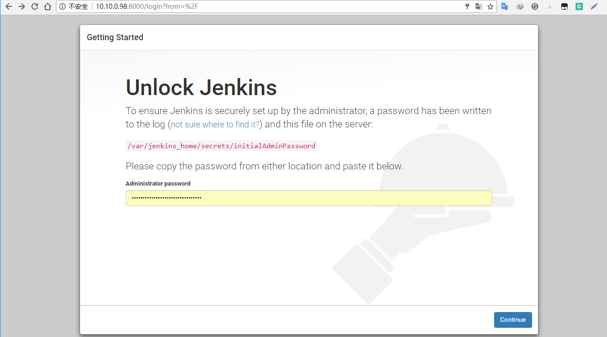
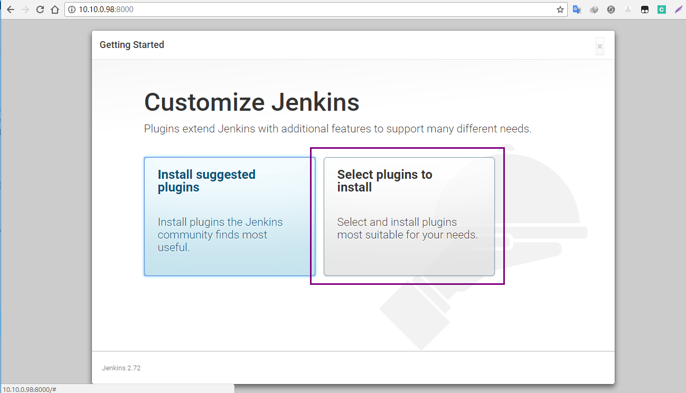
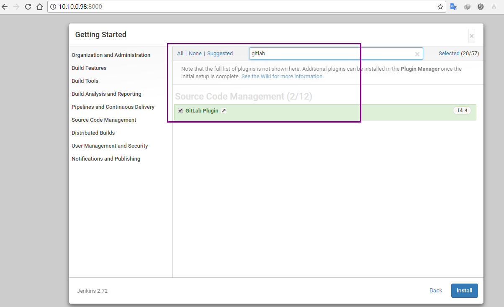
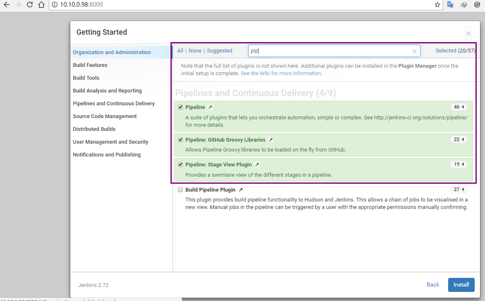
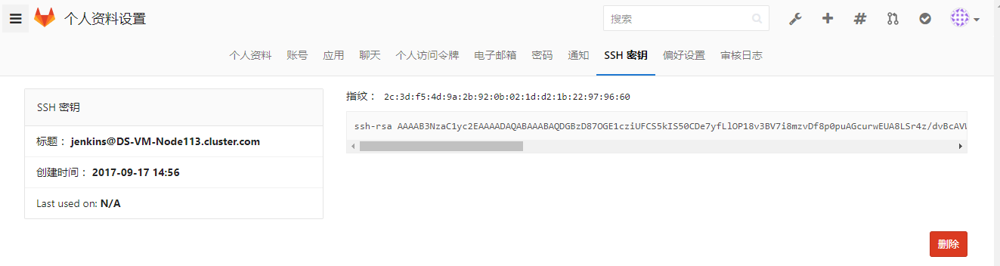
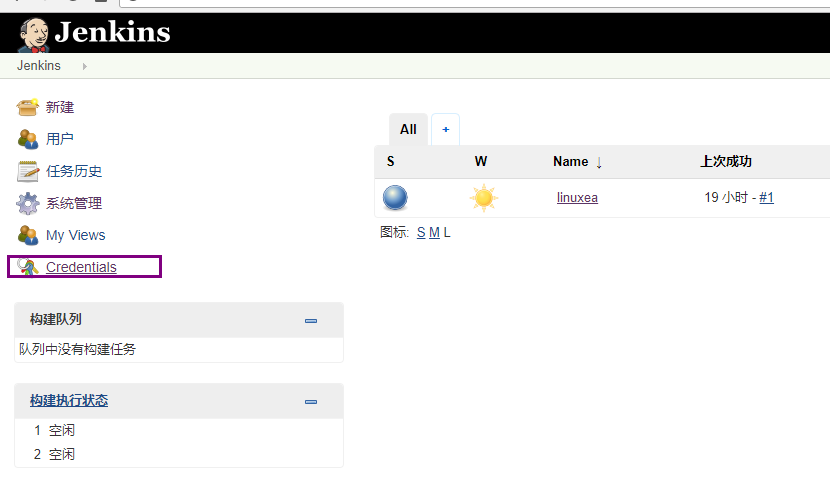
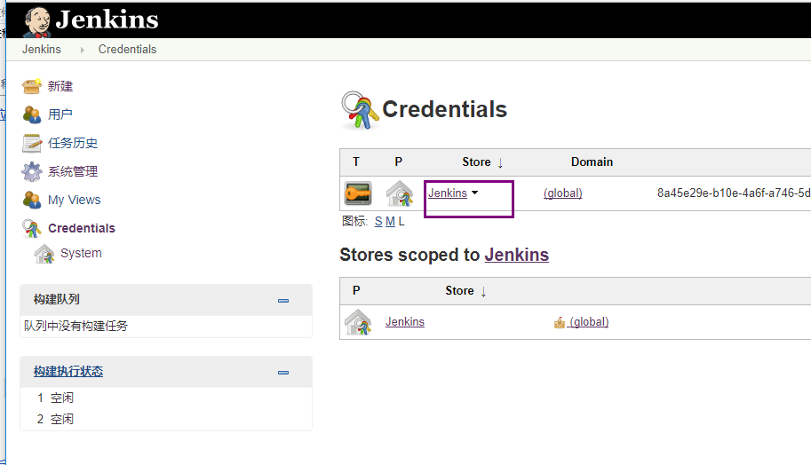
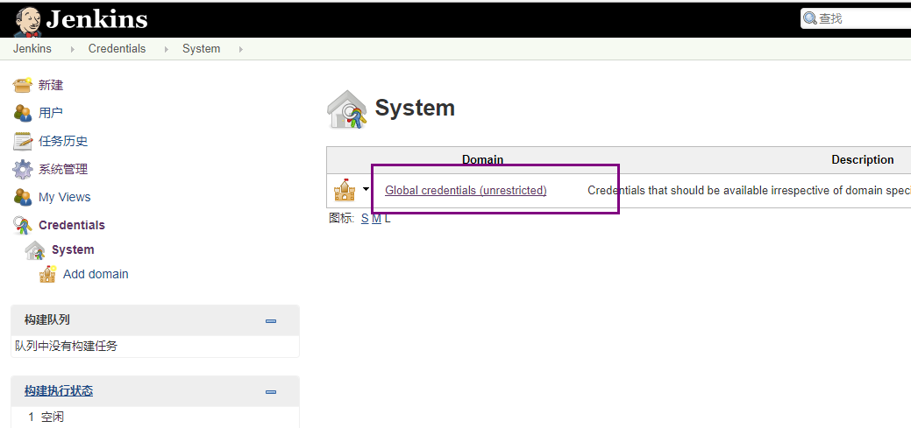
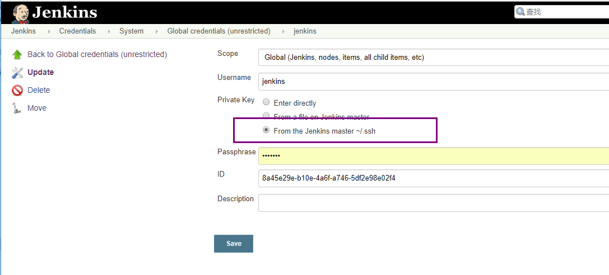

jenkins+gitlab+ansible配合使用

考虑了一下子，还是整理了一些图片和文字，简单的记录安装的过程，主要想玩pipeline。那么在后面的几篇文章中会介绍jenkins+sonarqube的构建，当然，还是用来做pipeline来玩，告别之前的那种模式，本章主要介绍jenkins+gitlab+ansible快速部署
sonarqube 安装：`https://www.linuxea.com/1722.html`
1，jenkins在这里负责发布构建，主要插件pipeline,gitlab,sonarqube
2，gitlab代码管理
3，ansible用来推送代码
jenkins安装参考：https://pkg.jenkins.io/redhat-stable/
我这里安装的是2.73.1

[TOC]

## 安装jenkins和插件
### 安装jenkins
```
[root@linuxea.com-Node113 ~]#  sudo wget -O /etc/yum.repos.d/jenkins.repo https://pkg.jenkins.io/redhat-stable/jenkins.repo
[root@linuxea.com-Node113 ~]#  sudo rpm --import https://pkg.jenkins.io/redhat-stable/jenkins.io.key
[root@linuxea.com-Node113 ~]#  yum install jenkins -y
[root@linuxea.com-Node113 ~]#  /etc/init.d/jenkins start
[root@linuxea.com-Node113 ~]#  iptables -I INPUT 5 -p tcp -m tcp -m state --state NEW -m multiport --dports 22,3306,10050,10051,8080 -m comment --comment "ALL" -j ACCEPT
```
打开浏览器进行安装和配置

`cat /var/lib/jenkins/secrets/initialAdminPassword`根据提示将密码输入


### 安装gitlab和pipeline插件
我这里有vpn，直接安装

安装pipeline


等待安装完成后进入界面

## 安装ansible和配置jenkins和gitlab
```
[root@linuxea.com-Node113 ~]# yum install jenkins
```
### 添加主机
```
[root@linuxea.com-Node113 ~]# cat /etc/ansible/hosts 
[webapp]
10.10.0.98 ansible_ssh_user=root ansible_ssh_port=22 ansible_ssh_pass="mima"
```
配置密钥和主机
### 配置jenkins用户终端
修改jenkins用户shell为bash
```
jenkins:x:989:985:Jenkins Automation Server:/var/lib/jenkins:/bin/bash
```
### 配置ansible和源站
测试连通性
```
[root@linuxea.com-Node113 /etc/ansible]# su - jenkins
```
尝试链接一次
```
[jenkins@linuxea.com-Node113 ~]$ ansible webapp -m  ping
10.10.0.98 | SUCCESS => {

	"changed": false, 
    "ping": "pong"
}
```
之后会用到sync模块，模块本身不支持密码，所以传递密钥即可
```
[jenkins@marksugar-Node113 ~]$ ssh-keygen -t rsa
```
传递密钥给源站机器
```
[jenkins@linuxea.com-Node113 ~]$ ssh-copy-id root@10.10.0.98
/bin/ssh-copy-id: INFO: attempting to log in with the new key(s), to filter out any that are already installed
/bin/ssh-copy-id: INFO: 1 key(s) remain to be installed -- if you are prompted now it is to install the new keys
root@10.10.0.98's password: 

Number of key(s) added: 1

Now try logging into the machine, with:   "ssh 'root@10.10.0.98'"
and check to make sure that only the key(s) you wanted were added.
```
测试
```
[jenkins@linuxea.com-Node113 ~]$ ssh root@10.10.0.98
Last login: Wed Sep 20 13:41:41 2017 from 10.10.240.113
[root@linuxea.com-Node98 ~]# 
```
### 配置gitlab密钥
同时也需要将jenkins的id_rsa.pub文件添加到gitlab项目中方便拉代码
```
[jenkins@linuxea.com-Node113 ~]$ cat /var/lib/jenkins/.ssh/id_rsa.pub 
```
复制信息到项目中


### 配置jenkins密钥
在jenkins中修改credentials

编辑



到此位置，安装配置完成