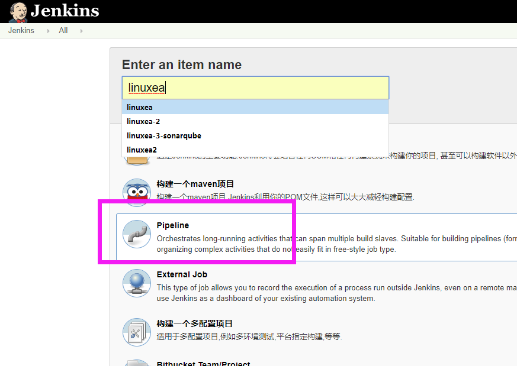
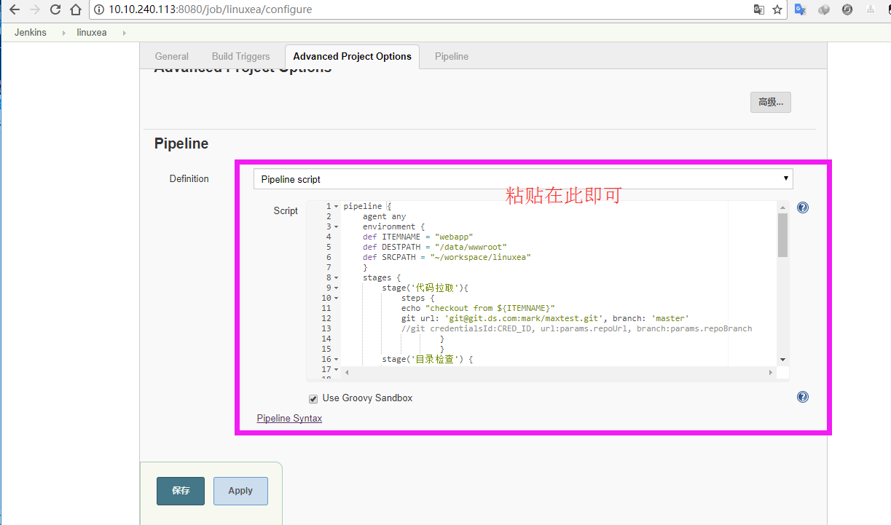
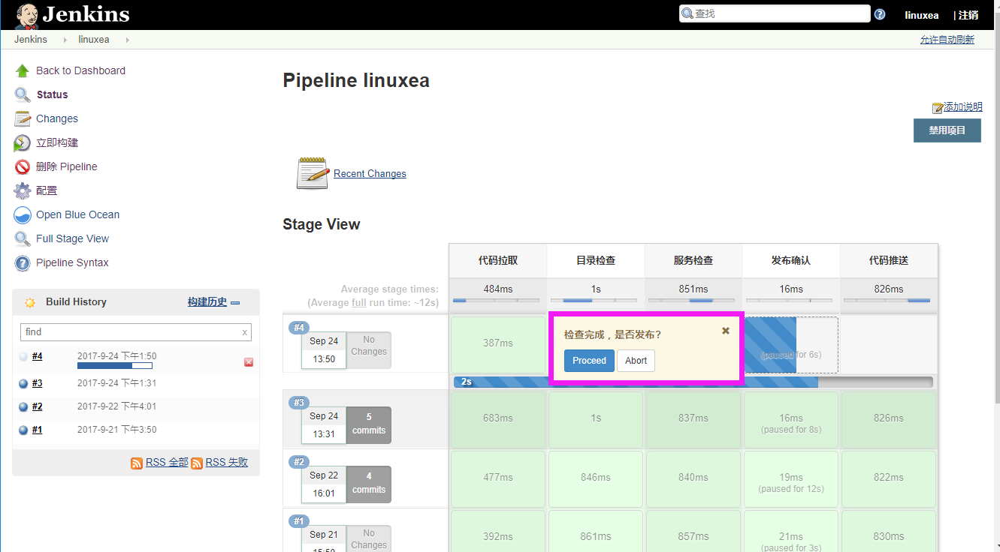
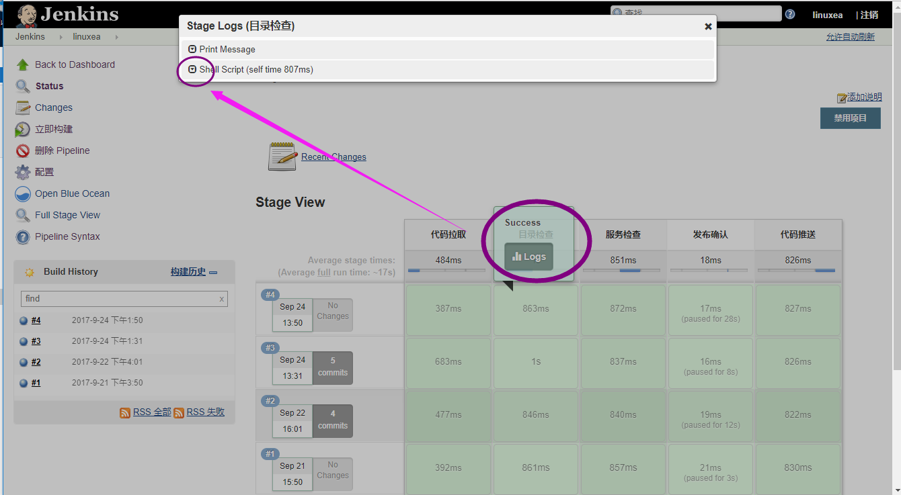

jenkins pipeline简单使用示例

[TOC]

## pipeline简述
Jenkins pipeline 是一套插件，支持将连续输送管道实施和整合到Jenkins。Pipeline提供了一组可扩展的工具，用于通过管道DSL为代码创建简单到复杂的传送流水线。他目前支持jenkins 2.x以上版本。pipeline是由groovy语言编写
## pipeline使用
pipeline分为两种一种为jenkinsfile使用，一种直接在网页界面中输入脚本内容，本章节则是第二种
## 文档参考
官方参考：https://jenkins.io/doc/book/pipeline/
语法参考：https://jenkins.io/doc/book/pipeline/syntax/
## 示例演示
简单的实现了php的代码发布：
1，定义了常用变量在全局的变量中
2，第一阶段代码拉取，到jenkins的目录中
3，第二阶段这里做了即将推送代码的目录的检查，是否存在，主要测试if语句
4，第三阶段检查进程是否存在(这没必要)
5，第四阶段推送代码前确认，是否发布，否则将暂停
6，第五阶段利用ansible推送代码
这里面有很多需要提前准备，比如权限问题，ansible配置等

jenkins+pipeline+gitlab+ansible快速安装配置(1)参考：[点击直达][1]
### 1，pipeline文件
```
pipeline {
	agent any
	environment { 
	def ITEMNAME = "webapp"
	def DESTPATH = "/data/wwwroot"
	def SRCPATH = "~/workspace/linuxea"
	}
	stages {	
		stage('代码拉取'){
			steps {
			echo "checkout from ${ITEMNAME}"
			git url: 'git@git.ds.com:mark/maxtest.git', branch: 'master'
			//git credentialsId:CRED_ID, url:params.repoUrl, branch:params.repoBranch
					}
					}
		stage('目录检查') {
			steps {
				echo "检查${DESTPATH}目录是否存在"
				script{
					def resultUpdateshell = sh script: 'ansible webapp -m shell -a "ls -d ${DESTPATH}"'
					if (resultUpdateshell == 0) {
						skip = '0'
						return
					}	
					}
					}
					}		
		stage('服务检查') {
			steps {
				echo "检查nginx进程是否存在"
				script{
					def resultUpdateshell = sh script: 'ansible webapp -m shell -a "ps aux|grep nginx|grep -v grep"'
					if (resultUpdateshell == 0) {
						skip = '0'
						return
					}	
					}
					}
					}
        stage('发布确认') {
            steps {
                input "检查完成，是否发布?"
            }
        }					
		stage('代码推送') {
		    steps {
			echo "code sync"
			sh "ansible ${ITEMNAME} -m synchronize -a 'src=${SRCPATH}/ dest=${DESTPATH}/ rsync_opts=-avz,--exclude=.git,--delete'"
		}
    	}
}
}
```
### 2，创建item

粘贴脚本到此处保存退出

立即构建会提示是否发布，选择Proceed 即可继续

不管更新过程中还是更新出错或者更新完成都可以在logs中查看进度和结果，如下图

后台console output文件执行结果如下

```
Started by user linuxea
[Pipeline] node
Running on master in /var/lib/jenkins/workspace/linuxea
[Pipeline] {
[Pipeline] withEnv
[Pipeline] {
[Pipeline] stage
[Pipeline] { (代码拉取)
[Pipeline] echo
checkout from webapp
[Pipeline] git
 > git rev-parse --is-inside-work-tree # timeout=10
Fetching changes from the remote Git repository
 > git config remote.origin.url git@git.ds.com:mark/maxtest.git # timeout=10
Fetching upstream changes from git@git.ds.com:mark/maxtest.git
 > git --version # timeout=10
 > git fetch --tags --progress git@git.ds.com:mark/maxtest.git +refs/heads/*:refs/remotes/origin/*
 > git rev-parse refs/remotes/origin/master^{commit} # timeout=10
 > git rev-parse refs/remotes/origin/origin/master^{commit} # timeout=10
Checking out Revision b6c6dc4140aa3a30de442c6d45fe327831cb9ee9 (refs/remotes/origin/master)
Commit message: "增加新文件"
 > git config core.sparsecheckout # timeout=10
 > git checkout -f b6c6dc4140aa3a30de442c6d45fe327831cb9ee9
 > git branch -a -v --no-abbrev # timeout=10
 > git branch -D master # timeout=10
 > git checkout -b master b6c6dc4140aa3a30de442c6d45fe327831cb9ee9
 > git rev-list b6c6dc4140aa3a30de442c6d45fe327831cb9ee9 # timeout=10
[Pipeline] }
[Pipeline] // stage
[Pipeline] stage
[Pipeline] { (目录检查)
[Pipeline] echo
检查/data/wwwroot目录是否存在
[Pipeline] script
[Pipeline] {
[Pipeline] sh
[linuxea] Running shell script
+ ansible webapp -m shell -a 'ls -d /data/wwwroot'
10.10.0.98 | SUCCESS | rc=0 >>
/data/wwwroot
[Pipeline] }
[Pipeline] // script
[Pipeline] }
[Pipeline] // stage
[Pipeline] stage
[Pipeline] { (服务检查)
[Pipeline] echo
检查nginx进程是否存在
[Pipeline] script
[Pipeline] {
[Pipeline] sh
[linuxea] Running shell script
+ ansible webapp -m shell -a 'ps aux|grep nginx|grep -v grep'
10.10.0.98 | SUCCESS | rc=0 >>
root     21209  0.0  0.1  13452  2752 ?        S    9月20   0:00 nginx: master process /usr/local/nginx/sbin/nginx
400      21210  0.0  1.0  34700 21852 ?        S    9月20   0:00 nginx: worker process
[Pipeline] }
[Pipeline] // script
[Pipeline] }
[Pipeline] // stage
[Pipeline] stage
[Pipeline] { (发布确认)
[Pipeline] input
检查完成，是否发布?
Proceed or Abort
Approved by linuxea
[Pipeline] }
[Pipeline] // stage
[Pipeline] stage
[Pipeline] { (代码推送)
[Pipeline] echo
code sync
[Pipeline] sh
[linuxea] Running shell script
+ ansible webapp -m synchronize -a 'src=~/workspace/linuxea/ dest=/data/wwwroot/ rsync_opts=-avz,--exclude=.git,--delete'
10.10.0.98 | SUCCESS => {
    "changed": false, 
    "cmd": "/bin/rsync --delay-updates -F --compress --archive --rsh 'ssh  -S none -o StrictHostKeyChecking=no -o Port=22' -avz --exclude=.git --delete --out-format='<<CHANGED>>%i %n%L' \"/var/lib/jenkins/workspace/linuxea/\" \"root@10.10.0.98:/data/wwwroot/\"", 
    "msg": "building file list ... done\n\nsent 256 bytes  received 12 bytes  536.00 bytes/sec\ntotal size is 47858  speedup is 178.57\n", 
    "rc": 0, 
    "stdout_lines": [
        "building file list ... done", 
        "sent 256 bytes  received 12 bytes  536.00 bytes/sec", 
        "total size is 47858  speedup is 178.57"
    ]
}
[Pipeline] }
[Pipeline] // stage
[Pipeline] }
[Pipeline] // withEnv
[Pipeline] }
[Pipeline] // node
[Pipeline] End of Pipeline
Finished: SUCCESS
```


[1]: https://www.linuxea.com/1733.html