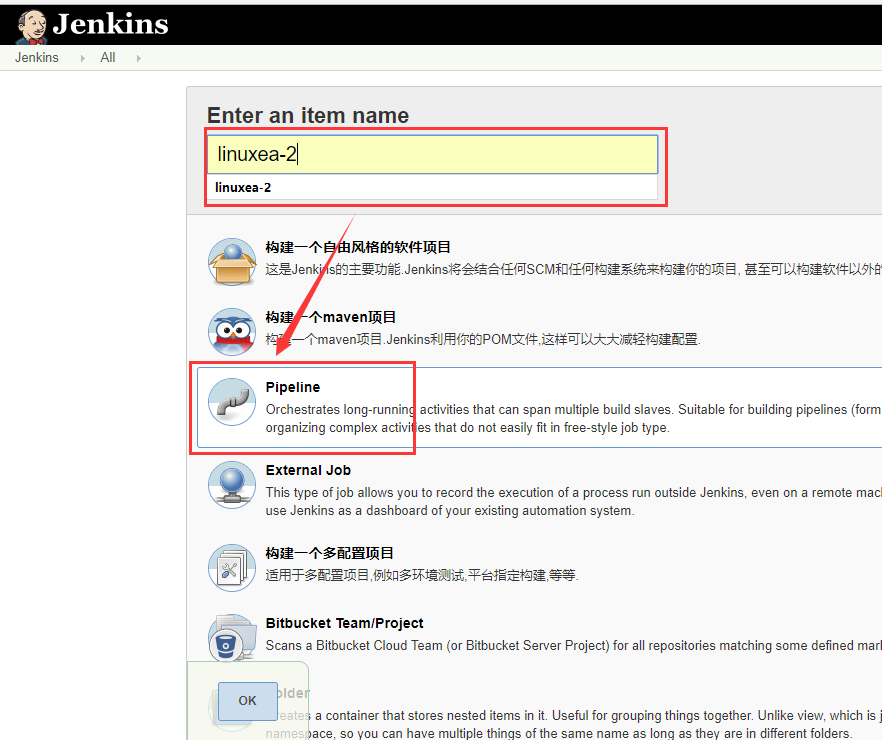
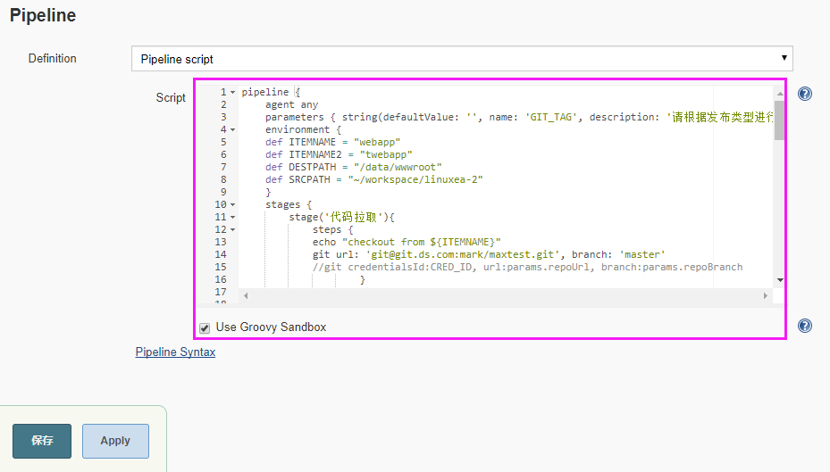
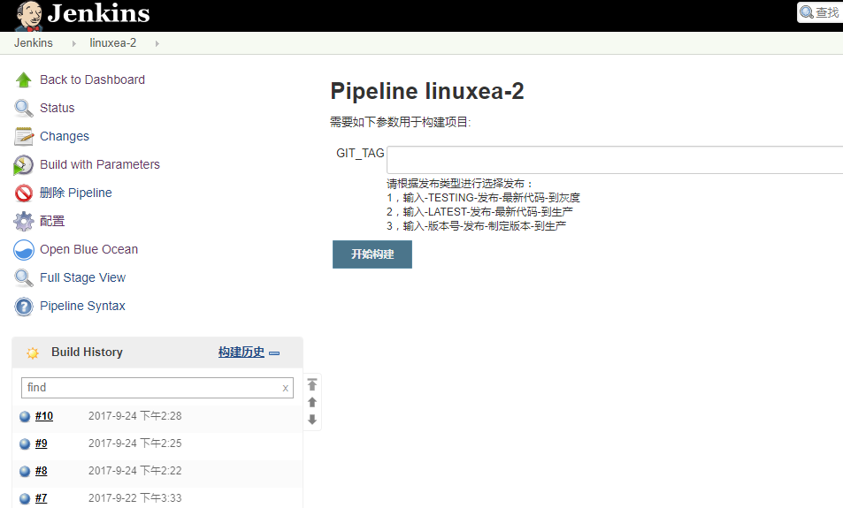

jenkins pipeline 发布和回滚

[TOC]

## jenkins pipeline参数化构建
在前面有章简单的介绍了pipeline用法,[jenkins pipeline简单使用示例(2)][1]
[jenkins+pipeline+gitlab+ansible快速安装配置(1)][2]
但是不够灵活，在经过资料查阅后，发现可以将条件构建步骤转换成jenkins pipeline，如下：
官方参考 : https://jenkins.io/doc/book/pipeline/syntax/#parameters
```
parameters { string(defaultValue: '', name: 'GIT_TAG', description: '请根据发布类型进行选择发布：\n1，输入-TESTING-发布-最新代码-到灰度\n2，输入-LATEST-发布-最新代码-到生产\n3，输入-版本号-发布-制定版本-到生产 ' ) }
```
## 发布和回滚
发布：代码仓库是gitlab，我们知道gitlab发布要么git pull 最新的代码(不需要版本号)，或者checkout 指定的版本号代码。我们把代码拉到本地jenkins，是用来发布，且不管拉取那个已经存在的版本
回滚：checkout，通常提供版本号即发布和回滚，因为通过版本号直接可以checkout git仓库已有的代码，了解这个后发布和回滚则变的简单起来
也可以git reset --hard HEAD^，^^来进行回退，在这里并没有介绍，通过简单的修改即可实现，如：git pull最新代码，git reset --hard HEAD^来进行回退

## pipeline if判断
参数化构建和发布方式确定后就可以编写pipeline文件来进行测试
其中内容和上一篇博客https://www.linuxea.com/1738.html中的做修改后使用的,
在参数化构建时，提示如下：
请根据发布类型进行选择发布：
1，输入-TESTING-发布-最新代码-到灰度
2，输入-LATEST-发布-最新代码-到生产
3，输入-版本号-发布-制定版本-到生产 
当GIT_TAG == 'TESTING'执行TESTING的脚本，等于LATEST则执行LATEST脚本，如果都不等于则git checkout，pipeline部分如下：
```
	stage('代码推送') {
		    steps {
			echo "code sync"
				script {
					if (env.GIT_TAG == 'TESTING') {
						echo 'TESTING'
							sh "ansible ${ITEMNAME2} -m synchronize -a 'src=${SRCPATH}/ dest=${DESTPATH}/ rsync_opts=-avz,--exclude=.git,--delete'"
						} else {
						if (env.GIT_TAG == 'LATEST') {
							echo 'LATEST'
							sh "ansible ${ITEMNAME} -m synchronize -a 'src=${SRCPATH}/ dest=${DESTPATH}/ rsync_opts=-avz,--exclude=.git,--delete'"						
						} else { 
							sh """
							git checkout ${GIT_TAG}
							}
							}
```
完整的如下所示
```
pipeline {
	agent any
	parameters { string(defaultValue: '', name: 'GIT_TAG', description: '请根据发布类型进行选择发布：\n1，输入-TESTING-发布-最新代码-到灰度\n2，输入-LATEST-发布-最新代码-到生产\n3，输入-版本号-发布-制定版本-到生产 ' ) }
	environment { 
	def ITEMNAME = "webapp"
	def ITEMNAME2 = "twebapp" 
	def DESTPATH = "/data/wwwroot"
	def SRCPATH = "~/workspace/linuxea-2"
	}
	stages {	
		stage('代码拉取'){
			steps {
			echo "checkout from ${ITEMNAME}"
			git url: 'git@git.ds.com:mark/maxtest.git', branch: 'master'
			//git credentialsId:CRED_ID, url:params.repoUrl, branch:params.repoBranch
					}
					}
		stage('目录检查') {
			steps {
				echo "检查${DESTPATH}目录是否存在"
				script{
					def resultUpdateshell = sh script: 'ansible webapp -m shell -a "ls -d ${DESTPATH}"'
					//def resultUpdateshell = sh script: 'ansible twebapp -m shell -a "ls -d ${DESTPATH}"'
					if (resultUpdateshell == 0) {
						skip = '0'
						return
					}	
					}
					}
					}		
		stage('服务检查') {
			steps {
				echo "检查nginx进程是否存在"
				script{
					def resultUpdateshell = sh script: 'ansible webapp -m shell -a "ps aux|grep nginx|grep -v grep"'
					//def resultUpdateshell = sh script: 'ansible twebapp -m shell -a "ps aux|grep nginx|grep -v grep"'					
					if (resultUpdateshell == 0) {
						skip = '0'
						return
					}	
					}
					}
					}
        stage('发布确认') {
            steps {
                input "检查完成，是否发布?"
            }
        }					
		stage('代码推送') {
		    steps {
			echo "code sync"
				script {
					if (env.GIT_TAG == 'TESTING') {
						echo 'TESTING'
							sh "ansible ${ITEMNAME2} -m synchronize -a 'src=${SRCPATH}/ dest=${DESTPATH}/ rsync_opts=-avz,--exclude=.git,--delete'"
						} else {
						if (env.GIT_TAG == 'LATEST') {
							echo 'LATEST'
							sh "ansible ${ITEMNAME} -m synchronize -a 'src=${SRCPATH}/ dest=${DESTPATH}/ rsync_opts=-avz,--exclude=.git,--delete'"						
						} else { 
							sh """
							git checkout ${GIT_TAG}
							ansible ${ITEMNAME} -m synchronize -a 'src=${SRCPATH}/ dest=${DESTPATH}/ rsync_opts=-avz,--exclude=.git,--delete'
							"""
						}
						}
					}
					}
					}
	}
	}
```
## 创建项目
创建item

直接把脚本复制进去即可

构建一次后，点击build with parameters



[1]: https://www.linuxea.com/1738.html
[2]: https://www.linuxea.com/1733.html