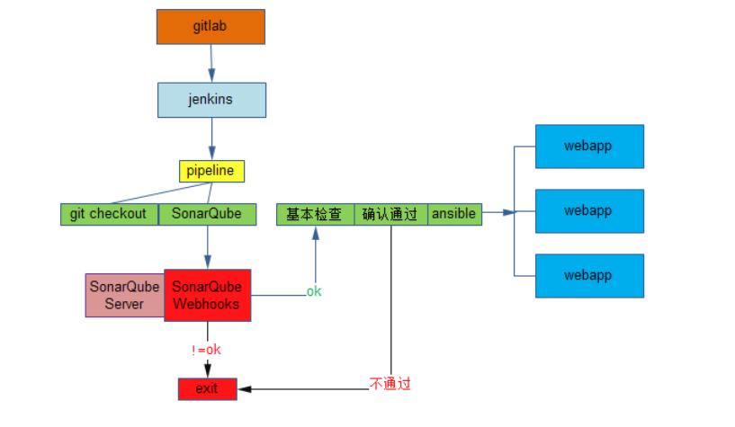
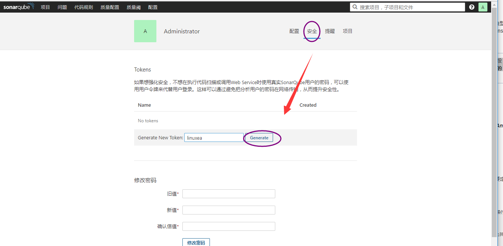
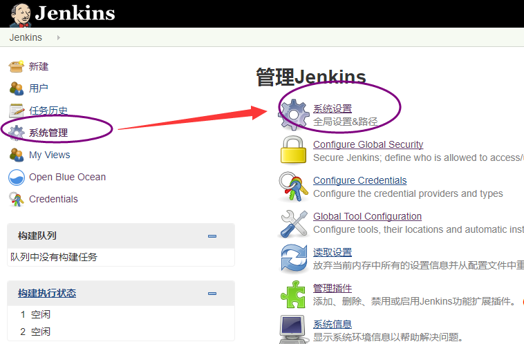
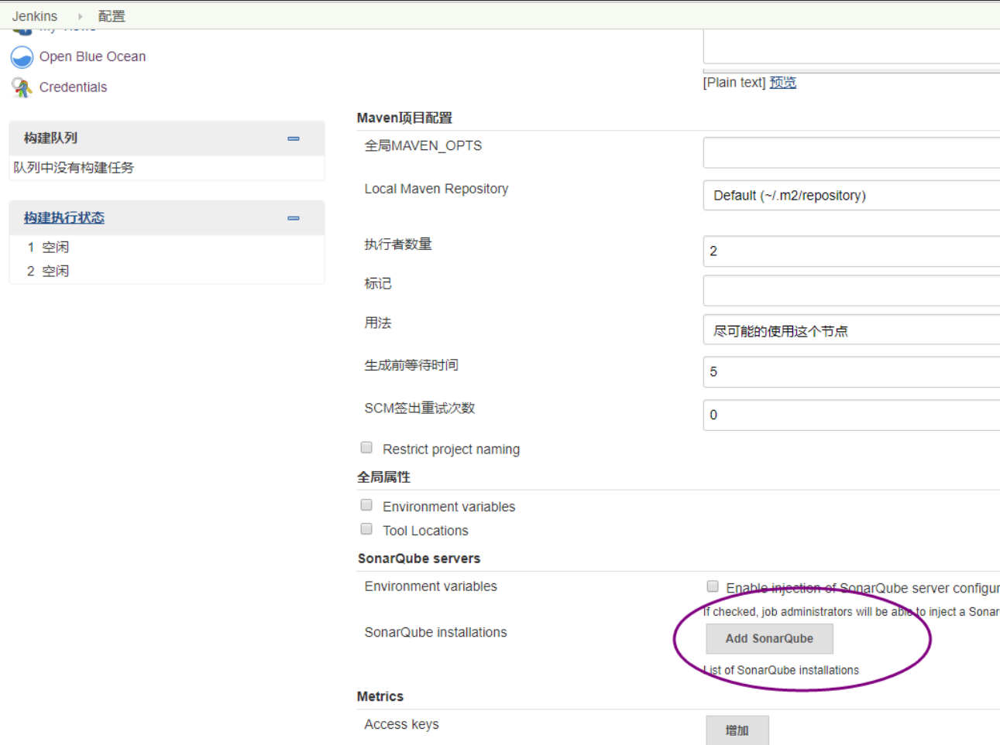
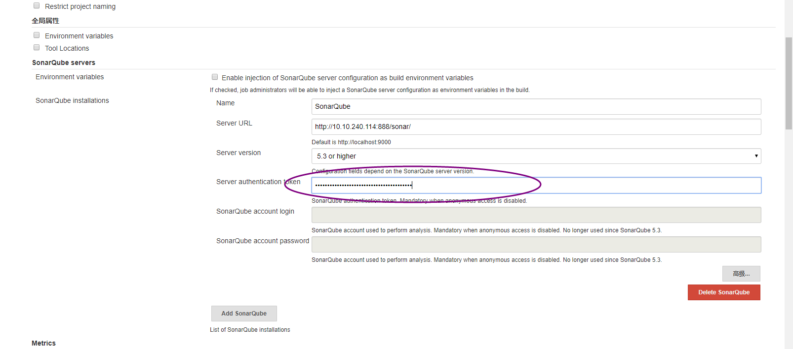
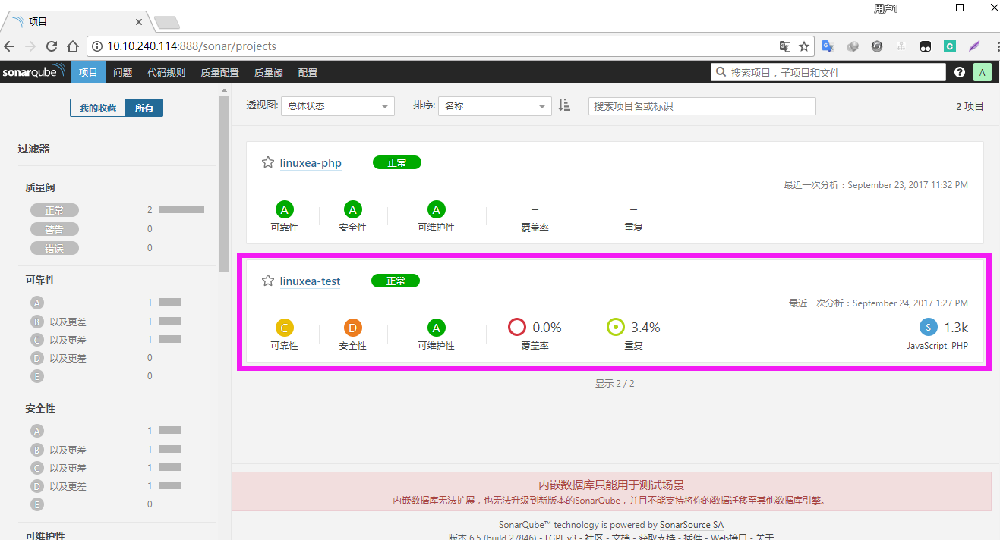
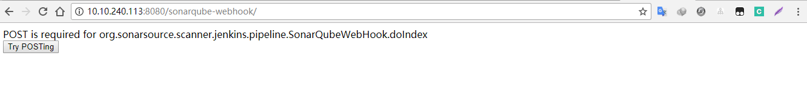
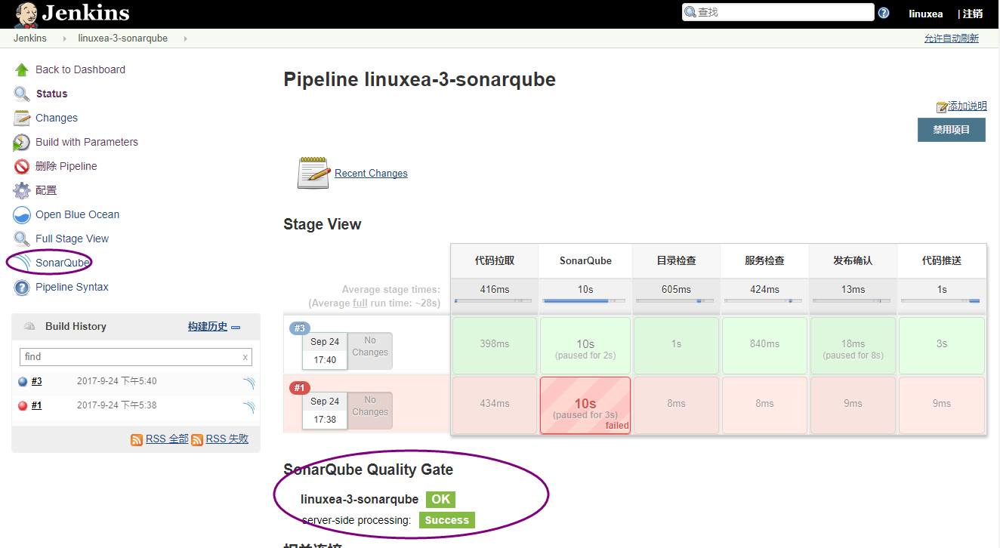
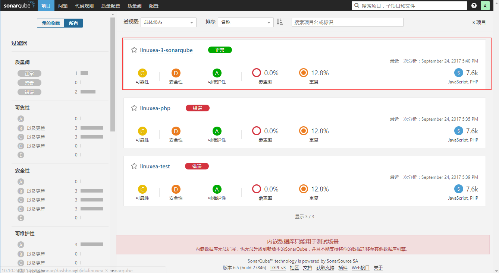

[TOC]

jenkins集成SonarQube Scanner，代码在发布之前通过SonarQube，通过后进入下一个环节，他的样子大致是这样的：

和之前相比，在pipeline中如果SonarQube检查通过才会进行下一个环节，否则就提前终止
参考：jenkins+pipeline+gitlab+ansible快速安装配置(1)`https://www.linuxea.com/1733.html`

## 插件配置
### 1，jenkins插件
打开jenkins登陆，系统管理-->管理插件--->搜索SonarQube Scanner for Jenkins-->安装[SonarQube Scanner for Jenkins]插件
### 2，生成token
其实在安装好sonarqube的时候第一次使用就提示过，不过在之前的文章中并未提到，现在重新生成即可
sonarqube安装参考：sonarqube-6.5_2代码质量管理系统配置和汉化`https://www.linuxea.com/1722.html`
我的账号-->安全-->输入,如下：

复制

### 3，配置jenkins集成插件SonarQube
在jenkins的插件管理中选择安装"SonarQube Scanner for Jenkins"，该插件可以使项目每次构建都调用sonar进行代码度量。
进入配置页面对sonar插件进行配置，如下图，sonar6只需要配置token即可。
系统管理-->系统设置

点击add sonarqube

将生成的token粘贴进去

### 4，sonar-scanner配置
下载安装
官网配置参考：`https://docs.sonarqube.org/display/SCAN/Analyzing+with+SonarQube+Scanner`
```
[root@linuxea.com-Node113 /usr/local]#  wget https://sonarsource.bintray.com/Distribution/sonar-scanner-cli/sonar-scanner-cli-3.0.3.778-linux.zip
[root@linuxea.com-Node113 /usr/local]# unzip sonar-scanner-cli-3.0.3.778-linux.zip 
[root@linuxea.com-Node113 /usr/local]# ln -s sonar-scanner-3.0.3.778-linux sonar-scanner
```
编辑配置文件
官网配置参考：`https://docs.sonarqube.org/display/SCAN/Analyzing+with+SonarQube+Scanner`
官网配置参考：`https://docs.sonarqube.org/display/SCAN/Advanced+SonarQube+Scanner+Usages`
```
[jenkins@linuxea.com-Node113 /usr/local/sonar-scanner/conf]$ cat sonar-scanner.test 
#Configure here general information about the environment, such as SonarQube DB details for example
#No information about specific project should appear here

#----- Default SonarQube server
sonar.host.url=http://10.10.240.114:888/sonar
sonar.projectKey=linuxea-test
sonar.projectName=linuxea-test
# Key and Name transfer SonarQube server name
#这里是php文件放的地方 
sonar.sources=/var/lib/jenkins/workspace/test
# Language 
sonar.languages=php,js,css,less
sonar.dynamicAnalysis=false 
# Encoding of the source files 
sonar.sourceEncoding=UTF-8
[jenkins@linuxea.com-Node113 /usr/local/sonar-scanner/conf]$ 
```
确保SonarQube server防火墙放行了888端口，也就是SonarQube的端口
### 5， 测试
测试：
由于项目比较多，使用-Dproject.settings指定配置文件
`/usr/local/sonar-scanner/bin/sonar-scanner  -Dproject.settings=/usr/local/sonar-scanner/conf/sonar-scanner.test`

```
[jenkins@linuxea.com-Node113 ~]$ /usr/local/sonar-scanner/bin/sonar-scanner  -Dproject.settings=/usr/local/sonar-scanner/conf/sonar-scanner.test
INFO: Scanner configuration file: /usr/local/sonar-scanner-3.0.3.778-linux/conf/sonar-scanner.properties
INFO: Project root configuration file: /usr/local/sonar-scanner/conf/sonar-scanner.test
INFO: SonarQube Scanner 3.0.3.778
INFO: Java 1.8.0_121 Oracle Corporation (64-bit)
INFO: Linux 4.8.5-1.el7.centos.x86_64 amd64
INFO: User cache: /var/lib/jenkins/.sonar/cache
INFO: Load global settings
INFO: Load global settings (done) | time=112ms
INFO: User cache: /var/lib/jenkins/.sonar/cache
INFO: Load plugins index
INFO: Load plugins index (done) | time=4ms
INFO: Plugin [l10nzh] defines 'l10nen' as base plugin. This metadata can be removed from manifest of l10n plugins since version 5.2.
INFO: SonarQube server 6.5.0
INFO: Default locale: "zh_CN", source code encoding: "UTF-8"
INFO: Process project properties
INFO: Load project repositories
INFO: Load project repositories (done) | time=49ms
INFO: Load quality profiles
INFO: Load quality profiles (done) | time=19ms
INFO: Load active rules
INFO: Load active rules (done) | time=834ms
INFO: Load metrics repository
INFO: Load metrics repository (done) | time=90ms
INFO: Publish mode
INFO: Project key: linuxea-test
INFO: -------------  Scan linuxea-test
INFO: Load server rules
INFO: Load server rules (done) | time=342ms
INFO: Base dir: /var/lib/jenkins
INFO: Working dir: /var/lib/jenkins/.scannerwork
INFO: Source paths: workspace/test
INFO: Source encoding: UTF-8, default locale: zh_CN
INFO: Index files
INFO: 11 files indexed
INFO: Quality profile for js: Sonar way
INFO: Quality profile for php: Sonar way
INFO: Sensor SonarJavaXmlFileSensor [java]
INFO: Sensor SonarJavaXmlFileSensor [java] (done) | time=1ms
INFO: Sensor PHP sensor [php]
INFO: 2 source files to be analyzed
INFO: No PHPUnit test report provided (see 'sonar.php.tests.reportPath' property)
INFO: 2/2 source files have been analyzed
INFO: No PHPUnit coverage reports provided (see 'sonar.php.coverage.reportPaths' property)
INFO: Sensor PHP sensor [php] (done) | time=569ms
INFO: Sensor Analyzer for "php.ini" files [php]
INFO: Sensor Analyzer for "php.ini" files [php] (done) | time=2ms
INFO: Sensor JavaScript Squid Sensor [javascript]
INFO: 1 source files to be analyzed
INFO: Unit Test Coverage Sensor is started
INFO: Integration Test Coverage Sensor is started
INFO: Overall Coverage Sensor is started
INFO: Sensor JavaScript Squid Sensor [javascript] (done) | time=1200ms
INFO: Sensor Zero Coverage Sensor
INFO: 1/1 source files have been analyzed
INFO: Sensor Zero Coverage Sensor (done) | time=39ms
INFO: Sensor CPD Block Indexer
INFO: Sensor CPD Block Indexer (done) | time=2ms
INFO: SCM Publisher is disabled
INFO: Calculating CPD for 3 files
INFO: CPD calculation finished
INFO: Analysis report generated in 98ms, dir size=137 KB
INFO: Analysis reports compressed in 19ms, zip size=47 KB
INFO: Analysis report uploaded in 57ms
INFO: ANALYSIS SUCCESSFUL, you can browse http://10.10.240.114:888/sonar/dashboard/index/linuxea-test
INFO: Note that you will be able to access the updated dashboard once the server has processed the submitted analysis report
INFO: More about the report processing at http://10.10.240.114:888/sonar/api/ce/task?id=AV6yWqf79bkYV2Lnt8O3
INFO: Task total time: 5.104 s
INFO: ------------------------------------------------------------------------
INFO: EXECUTION SUCCESS
INFO: ------------------------------------------------------------------------
INFO: Total time: 6.127s
INFO: Final Memory: 46M/259M
INFO: ------------------------------------------------------------------------
[jenkins@linuxea.com-Node113 ~]$ 
```
返回SonarQube Server查看

## 6，集成pipeline代码
### 项目linuxea-3-sonarqube
#### 1，sonar-scanner配置文件
```
[root@DS-VM-Node113 /usr/local/sonar-scanner/conf]# cat sonar-scanner.linuxea-3
#Configure here general information about the environment, such as SonarQube DB details for example
#No information about specific project should appear here

#----- Default SonarQube server
sonar.host.url=http://10.10.240.114:888/sonar
sonar.projectKey=linuxea-3-sonarqube
sonar.projectName=linuxea-3-sonarqube
#这里是php文件放的地方 
sonar.sources=/var/lib/jenkins/workspace/linuxea-3-sonarqube
# Language 
sonar.languages=php,js,css,less
sonar.dynamicAnalysis=false 
# Encoding of the source files 
sonar.sourceEncoding=UTF-8
```
#### 2，pipeline代码
这句很重要，指明文件位置`sh "/usr/local/sonar-scanner/bin/sonar-scanner  -Dproject.settings=/usr/local/sonar-scanner/conf/sonar-scanner.linuxea-3"`
代码如下：
官网配置参考：`https://docs.sonarqube.org/display/SCAN/Analyzing+with+SonarQube+Scanner+for+Jenkins`
官网配置参考：`https://jenkins.io/doc/pipeline/steps/sonar/#code-waitforqualitygate-code-wait-for-sonarqube-analysis-to-be-completed-and-return-quality-gate-status`
```
        stage('SonarQube') {
            steps {
            echo "正在开始代码检测........."
            withSonarQubeEnv('SonarQube') {
               sh "/usr/local/sonar-scanner/bin/sonar-scanner  -Dproject.settings=/usr/local/sonar-scanner/conf/sonar-scanner.linuxea-3"
            } // SonarQube taskId is automatically attached to the pipeline context
            script {
            timeout(time: 1, unit: 'HOURS') { // Just in case something goes wrong, pipeline will be killed after a timeout
            def qg = waitForQualityGate() // Reuse taskId previously collected by withSonarQubeEnv
            if (qg.status != 'OK') {
                error "Pipeline aborted due to quality gate failure: ${qg.status}"
            }
            }
            }
            }
			}
```
完整的这样
```
pipeline {
	agent any
	parameters { string(defaultValue: '', name: 'GIT_TAG', description: '请根据发布类型进行选择发布：\n1，输入-TESTING-发布-最新代码-到灰度\n2，输入-LATEST-发布-最新代码-到生产\n3，输入-版本号-发布-制定版本-到生产 ' ) }
	environment { 
	def ITEMNAME = "webapp"
	def ITEMNAME2 = "twebapp" 
	def DESTPATH = "/data/wwwroot"
	def SRCPATH = "~/workspace/linuxea-3-sonarqube"
	}
	stages {	
		stage('代码拉取'){
			steps {
			echo "checkout from ${ITEMNAME}"
			git url: 'git@git.ds.com:mark/maxtest.git', branch: 'master'
			//git credentialsId:CRED_ID, url:params.repoUrl, branch:params.repoBranch
					}
					}
        stage('SonarQube')	{
			steps {
				echo "starting codeAnalyze with SonarQube......"
               //sonar:sonar.QualityGate should pass
               withSonarQubeEnv('SonarQube') {
                 //固定使用项目根目录${basedir}下的pom.xml进行代码检查
                 sh "/usr/local/sonar-scanner/bin/sonar-scanner  -Dproject.settings=/usr/local/sonar-scanner/conf/sonar-scanner.linuxea-3"
               }
               script {
               timeout(10) { 
                   //利用sonar webhook功能通知pipeline代码检测结果，未通过质量阈，pipeline将会fail
                   def qg = waitForQualityGate() 
                       if (qg.status != 'OK') {
                           error "未通过Sonarqube的代码质量阈检查，请及时修改！failure: ${qg.status}"
                       }
                   }
               }
           }
       }				
			
		stage('目录检查') {
			steps {
				echo "检查${DESTPATH}目录是否存在"
				script{
					def resultUpdateshell = sh script: 'ansible webapp -m shell -a "ls -d ${DESTPATH}"'
					//def resultUpdateshell = sh script: 'ansible twebapp -m shell -a "ls -d ${DESTPATH}"'
					if (resultUpdateshell == 0) {
						skip = '0'
						return
					}	
					}
					}
					}		
		stage('服务检查') {
			steps {
				echo "检查nginx进程是否存在"
				script{
					def resultUpdateshell = sh script: 'ansible webapp -m shell -a "ps aux|grep nginx|grep -v grep"'
					//def resultUpdateshell = sh script: 'ansible twebapp -m shell -a "ps aux|grep nginx|grep -v grep"'					
					if (resultUpdateshell == 0) {
						skip = '0'
						return
					}	
					}
					}
					}
        stage('发布确认') {
            steps {
                input "检查完成，是否发布?"
            }
        }					
		stage('代码推送') {
		    steps {
			echo "code sync"
				script {
					if (env.GIT_TAG == 'TESTING') {
						echo 'TESTING'
							sh "ansible ${ITEMNAME2} -m synchronize -a 'src=${SRCPATH}/ dest=${DESTPATH}/ rsync_opts=-avz,--exclude=.git,--delete'"
						} else {
						if (env.GIT_TAG == 'LATEST') {
							echo 'LATEST'
							sh "ansible ${ITEMNAME} -m synchronize -a 'src=${SRCPATH}/ dest=${DESTPATH}/ rsync_opts=-avz,--exclude=.git,--delete'"						
						} else { 
							sh """
							git checkout ${GIT_TAG}
							ansible ${ITEMNAME} -m synchronize -a 'src=${SRCPATH}/ dest=${DESTPATH}/ rsync_opts=-avz,--exclude=.git,--delete'
							"""
						}
						}
					}
					}
					}
	}
}
```
在开始之前需要配置sonar-scanner的webhooks
参考 : `https://docs.sonarqube.org/display/SONAR/Webhooks`


jenkins状态如下：

sonar-scanner如下：
