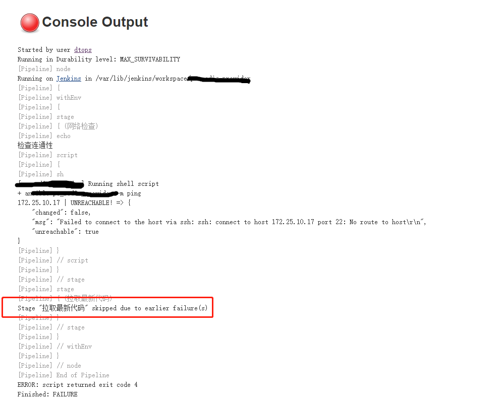

## 阶段终止

在管道中，声明的阶段里面是连续的，其中，可以配置的方式很多。且不管每个阶段运行的状态如何，都可以为配置成想要的一些操作，或者行为。如：发邮件，多条件判断等。
如果按照正常的运行，不做阶段处理，默认会依次执行多个阶段。这并不是我们想要的，因此，在每个阶段如果执行失败就终止，而不执行后面的是有必要的。当然，这里是有区分的，脚本管道可以使用[try](https://jenkins.io/doc/pipeline/examples/#external-workspace-manager)，而[post](https://jenkins.io/doc/book/pipeline/syntax/#post-conditions)作用范围更大
使用try 和`currentBuild.result = 'FAILURE'`即可

假如此阶段不通就停止了。相反的，假如此刻需求是，无论那个阶段执行失败都不应该终止，就默认即可。但是，需求如果变成，当执行失败后的还需要动作，参考[`external-workspace-manager`](https://jenkins.io/doc/pipeline/examples/#external-workspace-manager)