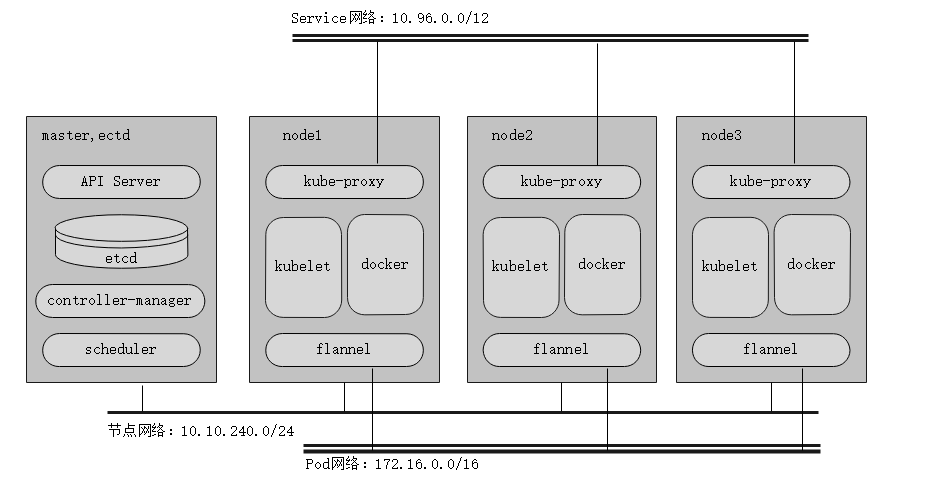

本次环境都在kebernetes v1.11.2，准备了四台使用[centos7.5](http://mirror.ehost.vn/centos/7.5.1804/isos/x86_64/)机器来做kubernetes的测试，有三台节点ip段均为10.10.240.0/24段(这意味着其他ip段无法加入)，pod网络使用172.16.0.0/16，server网络使用默认10.96.0.0/12

其中分别使用aliyun的镜象站点和谷歌官网的资源进行安装和配置，可做部分参考
大致的情况如下：


* 先决条件

1，关闭防火墙或者清空防火墙规则` iptables -F`
2，关闭`swap swapoff -a`
3，修改参数

```
 echo 1 > /proc/sys/net/bridge/bridge-nf-call-iptables
 echo 1 > /proc/sys/net/bridge/bridge-nf-call-ip6tables
 echo "net.ipv4.ip_forward=1" >>  /etc/sysctl.conf
 echo "net.bridge.bridge-nf-call-iptables=1" >> /etc/sysctl.conf
 echo "net.bridge.bridge-nf-call-ip6tables=1"　>> /etc/sysctl.conf
 sysctl -p
```
### 官网安装docker和k8s
#### install docker
```
yum install -y docker
systemctl enable docker && systemctl start docker
```
####  安装kubeadm，kubelet和kubectl
kubeadm：引导群集的命令。
kubelet：在群集中的所有计算机上运行的组件，并执行诸如启动pod和容器之类的操作。
kubectl：命令行util与您的群集通信。

kubeadm **不会**安装或管理`kubelet`或`kubectl`为您安装，因此您需要确保它们与您希望kubeadm为您安装的Kubernetes控制面板的版本相匹配。如果不这样做，则存在版本偏差的风险，这可能导致意外的错误行为。但是，支持kubelet和控制平面之间的*一个*次要版本倾斜，但kubelet版本可能永远不会超过API服务器版本。例如，运行1.7.0的kubelet应该与1.8.0 API服务器完全兼容，但反之亦然。 
```
cat <<EOF > /etc/yum.repos.d/kubernetes.repo
[kubernetes]
name=Kubernetes
baseurl=https://packages.cloud.google.com/yum/repos/kubernetes-el7-x86_64
enabled=1
gpgcheck=1
repo_gpgcheck=1
gpgkey=https://packages.cloud.google.com/yum/doc/yum-key.gpg https://packages.cloud.google.com/yum/doc/rpm-package-key.gpg
exclude=kube*
EOF
setenforce 0
yum install -y kubelet kubeadm kubectl --disableexcludes=kubernetes
systemctl enable kubelet && systemctl start kubelet
```
### aliyun 安装docker和k8s
* 准备repo

在node3，我这里使用国内阿里云的安装docker和k8s
```
[marksugar@www.linuxea.com /etc/yum.repos.d]# curl -Lk  https://mirrors.aliyun.com/docker-ce/linux/centos/docker-ce.repo -o /etc/yum.repos.d/docker-ce.repo
```
编辑k8s的repo文件
其中baseurl地址在阿里云的mirrors中的yum下的repos，这个根目录
其中gpgkey在yum下的doc下的yum-kye.gpg
```
[marksugar@www.linuxea.com /etc/yum.repos.d]# cat k8s.repo 
[k8s]
name=Kubernetes repo
baseurl=https://mirrors.aliyun.com/kubernetes/yum/repos/kubernetes-el7-x86_64/
gpgcheck=1
gpgkey=https://mirrors.aliyun.com/kubernetes/yum/doc/yum-key.gpg
enabled=1
```
* gpg导入

yum-key.gpg
```
curl -Lk https://mirrors.aliyun.com/kubernetes/yum/doc/yum-key.gpg -o  $PWD/yum-key.gpg 
rpm --import yum-key.gpg
```
rpm-package-key.gpg
```
curl -Lk  https://mirrors.aliyun.com/kubernetes/yum/doc/rpm-package-key.gpg -o $PWD/rpm-package-key.gpg
rpm --import  $PWD/rpm-package-key.gpg
```
随后yum repolist查看
```
[marksugar@www.linuxea.com /etc/yum.repos.d]# yum repolist|egrep "k8s|docker-ce"
docker-ce-stable/x86_64  Docker CE Stable - x86_64                            16
k8s                      Kubernetes repo                                     243
[marksugar@www.linuxea.com /etc/yum.repos.d]# 
```
#### 开始安装
```
[marksugar@www.linuxea.com ~]# yum install kubelet kubeadm kubectl docker-ce 
```
修改 /usr/lib/systemd/system/docker.service，添加加速配置
```Environment="HTTPS_PROXY=http://www.ik8s.io:10080 NO_PROXY=127.0.0.0/8,10.10.100.0/24"```
```Environment="HTTPS_PROXY=http://www.ik8s.io:10080"```
```Environment="NO_PROXY=127.0.0.0/8,10.10.100.0/24"```
当然，也可以直接sed

```
[marksugar@www.linuxea.com ~]# sed  -i '/Service/a\Environment="HTTPS_PROXY=http://www.ik8s.io:10080 NO_PROXY=127.0.0.0/8,10.10.100.0/24"' /usr/lib/systemd/system/docker.service
[marksugar@www.linuxea.com ~]# systemctl daemon-reload 
```
bridge-nf-call-iptables与bridge-nf-call-ip6tables设置为1
```
echo "net.ipv4.ip_forward=1" >>  /etc/sysctl.conf
echo "net.bridge.bridge-nf-call-iptables=1" >> /etc/sysctl.conf
echo "net.bridge.bridge-nf-call-ip6tables=1"　>> /etc/sysctl.conf
[marksugar@linuxea-VM-Node202 ~]# echo 1 > /proc/sys/net/bridge/bridge-nf-call-iptables
[marksugar@linuxea-VM-Node202 ~]# echo 1 > /proc/sys/net/bridge/bridge-nf-call-ip6tables
[marksugar@linuxea-VM-Node202 ~]# sysctl -p
```
或者这样
```
cat <<EOF >  /etc/sysctl.d/k8s.conf
net.bridge.bridge-nf-call-ip6tables = 1
net.bridge.bridge-nf-call-iptables = 1
EOF
sysctl --system
```
但安装完成后生成路径
```
[marksugar@linuxea-VM-Node202 ~]# rpm -ql kubelet
/etc/kubernetes/manifests
/etc/sysconfig/kubelet
/etc/systemd/system/kubelet.service
/usr/bin/kubelet
```
其中/etc/sysconfig/kubelet只有一项配置，你可以进行设置，比如，swap的配置等
设置开机自动启动
```
[marksugar@linuxea-VM-Node202 ~]# systemctl enable kubelet
[marksugar@linuxea-VM-Node202 ~]# systemctl enable docker
```
### 初始化kubuadm
忽略swap,否则启动会报错
1，修改配置文件和`--ignore-preflight-errors=Swap `
```
[marksugar@linuxea-VM-Node202 ~]# cat /etc/sysconfig/kubelet
KUBELET_EXTRA_ARGS="--fale-swap-on=false"
```
2，修改本地hosts，假如你没有bind的话（每台机器都加）
```
[marksugar@linuxea-VM-Node161 ~]# cat /etc/hosts
10.10.240.161 linuxea.master-1.com
10.10.240.202 linuxea.node-1.com
10.10.240.203 linuxea.node-2.com
10.10.240.146 linuxea.node-3.com
```
3，开始初始化
```
[marksugar@linuxea-VM-Node161 ~]# hostnamectl --static set-hostname linuxea.master-1.com
[marksugar@linuxea-VM-Node_10_10_240_202 ~]# hostnamectl --static set-hostname linuxea.node-1.com
[marksugar@linuxea-VM-Node203 ~]# hostnamectl --static set-hostname linuxea.node-2.comm
[marksugar@linuxea-VM-Node146 ~]# hostnamectl --static set-hostname linuxea.node-3.com
```
初始化命令
```
[marksugar@linuxea-VM-Node161 ~]# kubeadm init -v 5 --kubernetes-version=v1.11.2  --apiserver-advertise-address=10.10.240.161 --pod-network-cidr=172.16.0.0/16 --service-cidr=10.96.0.0/12 --ignore-preflight-errors=Swap
```
开始初始化
```
[marksugar@localhost ~]# kubeadm init --kubernetes-version=v1.11.2  --apiserver-advertise-address=10.10.240.161 --pod-network-cidr=172.16.0.0/16 --service-cidr=10.96.0.0/12 --ignore-preflight-errors=Swap
[init] using Kubernetes version: v1.11.2
[preflight] running pre-flight checks
I0820 09:21:45.815247   26511 kernel_validator.go:81] Validating kernel version
I0820 09:21:45.815703   26511 kernel_validator.go:96] Validating kernel config
[preflight/images] Pulling images required for setting up a Kubernetes cluster
[preflight/images] This might take a minute or two, depending on the speed of your internet connection
[preflight/images] You can also perform this action in beforehand using 'kubeadm config images pull'
[kubelet] Writing kubelet environment file with flags to file "/var/lib/kubelet/kubeadm-flags.env"
[kubelet] Writing kubelet configuration to file "/var/lib/kubelet/config.yaml"
[preflight] Activating the kubelet service
[certificates] Generated ca certificate and key.
[certificates] Generated apiserver certificate and key.
[certificates] apiserver serving cert is signed for DNS names [linuxea-k8s-master-1 kubernetes kubernetes.default kubernetes.default.svc kubernetes.default.svc.cluster.local] and IPs [10.96.0.1 10.10.240.161]
[certificates] Generated apiserver-kubelet-client certificate and key.
[certificates] Generated sa key and public key.
[certificates] Generated front-proxy-ca certificate and key.
[certificates] Generated front-proxy-client certificate and key.
[certificates] Generated etcd/ca certificate and key.
[certificates] Generated etcd/server certificate and key.
[certificates] etcd/server serving cert is signed for DNS names [linuxea-k8s-master-1 localhost] and IPs [127.0.0.1 ::1]
[certificates] Generated etcd/peer certificate and key.
[certificates] etcd/peer serving cert is signed for DNS names [linuxea-k8s-master-1 localhost] and IPs [10.10.240.161 127.0.0.1 ::1]
[certificates] Generated etcd/healthcheck-client certificate and key.
[certificates] Generated apiserver-etcd-client certificate and key.
[certificates] valid certificates and keys now exist in "/etc/kubernetes/pki"
[kubeconfig] Wrote KubeConfig file to disk: "/etc/kubernetes/admin.conf"
[kubeconfig] Wrote KubeConfig file to disk: "/etc/kubernetes/kubelet.conf"
[kubeconfig] Wrote KubeConfig file to disk: "/etc/kubernetes/controller-manager.conf"
[kubeconfig] Wrote KubeConfig file to disk: "/etc/kubernetes/scheduler.conf"
[controlplane] wrote Static Pod manifest for component kube-apiserver to "/etc/kubernetes/manifests/kube-apiserver.yaml"
[controlplane] wrote Static Pod manifest for component kube-controller-manager to "/etc/kubernetes/manifests/kube-controller-manager.yaml"
[controlplane] wrote Static Pod manifest for component kube-scheduler to "/etc/kubernetes/manifests/kube-scheduler.yaml"
[etcd] Wrote Static Pod manifest for a local etcd instance to "/etc/kubernetes/manifests/etcd.yaml"
[init] waiting for the kubelet to boot up the control plane as Static Pods from directory "/etc/kubernetes/manifests" 
[init] this might take a minute or longer if the control plane images have to be pulled
[apiclient] All control plane components are healthy after 40.503900 seconds
[uploadconfig] storing the configuration used in ConfigMap "kubeadm-config" in the "kube-system" Namespace
[kubelet] Creating a ConfigMap "kubelet-config-1.11" in namespace kube-system with the configuration for the kubelets in the cluster
[markmaster] Marking the node linuxea-k8s-master-1 as master by adding the label "node-role.kubernetes.io/master=''"
[markmaster] Marking the node linuxea-k8s-master-1 as master by adding the taints [node-role.kubernetes.io/master:NoSchedule]
[patchnode] Uploading the CRI Socket information "/var/run/dockershim.sock" to the Node API object "linuxea-k8s-master-1" as an annotation
[bootstraptoken] using token: lgcrl4.57twy4tb4f8mtamc
[bootstraptoken] configured RBAC rules to allow Node Bootstrap tokens to post CSRs in order for nodes to get long term certificate credentials
[bootstraptoken] configured RBAC rules to allow the csrapprover controller automatically approve CSRs from a Node Bootstrap Token
[bootstraptoken] configured RBAC rules to allow certificate rotation for all node client certificates in the cluster
[bootstraptoken] creating the "cluster-info" ConfigMap in the "kube-public" namespace
```
coredns之前已经更新到第三代，有需要新的功能
```
[addons] Applied essential addon: CoreDNS
[addons] Applied essential addon: kube-proxy
```
Your Kubernetes master has initialized successfully!
```
Your Kubernetes master has initialized successfully!
```
这里建议我们使用在家目录创建一个.kube目录，而后使用管理员sudo复制 /etc/kubernetes/admin.conf到ME/.kube/config，而后修改属组和属主
```
To start using your cluster, you need to run the following as a regular user:

  mkdir -p $HOME/.kube
  sudo cp -i /etc/kubernetes/admin.conf $HOME/.kube/config
  sudo chown $(id -u):$(id -g) $HOME/.kube/config

You should now deploy a pod network to the cluster.
Run "kubectl apply -f [podnetwork].yaml" with one of the options listed at:
  https://kubernetes.io/docs/concepts/cluster-administration/addons/
```
在其他节点使用一下命令加入到当前k8s集群中
```
You can now join any number of machines by running the following on each node
as root:
```
其他节点加入集群命令
```
  kubeadm join 10.10.240.161:6443 --token pcwcxz.9dmh9dl6e2femgv9 --discovery-token-ca-cert-hash sha256:f78481eb5c37f34c96d1d15f2be773dcaa4205ca158ef9f00a47507a23c5bfa3
```
* 镜像已经被下载

```
[marksugar@localhost ~]# docker images
REPOSITORY                                 TAG                 IMAGE ID            CREATED             SIZE
k8s.gcr.io/kube-apiserver-amd64            v1.11.2             821507941e9c        12 days ago         187 MB
k8s.gcr.io/kube-controller-manager-amd64   v1.11.2             38521457c799        12 days ago         155 MB
k8s.gcr.io/kube-proxy-amd64                v1.11.2             46a3cd725628        12 days ago         97.8 MB
k8s.gcr.io/kube-scheduler-amd64            v1.11.2             37a1403e6c1a        12 days ago         56.8 MB
k8s.gcr.io/coredns                         1.1.3               b3b94275d97c        2 months ago        45.6 MB
k8s.gcr.io/etcd-amd64                      3.2.18              b8df3b177be2        4 months ago        219 MB
quay.io/coreos/flannel                     v0.10.0-amd64       f0fad859c909        6 months ago        44.6 MB
k8s.gcr.io/pause                           3.1                 da86e6ba6ca1        8 months ago        742 kB
[marksugar@localhost ~]# 
```
其中k8s.gcr.io/pause提供基础架构容器
* 其中6443端口已经启动，等待其他节点加入

```
[marksugar@linuxea-VM-Node161 ~]# ss -tln
State       Recv-Q Send-Q                                                                                         Local Address:Port                                                                                                        Peer Address:Port              
LISTEN      0      128                                                                                                        *:22                                                                                                                     *:*                  
LISTEN      0      100                                                                                                127.0.0.1:25                                                                                                                     *:*                  
LISTEN      0      128                                                                                                127.0.0.1:6010                                                                                                                   *:*                  
LISTEN      0      128                                                                                                        *:10050                                                                                                                  *:*                  
LISTEN      0      32768                                                                                              127.0.0.1:15495                                                                                                                  *:*                  
LISTEN      0      32768                                                                                              127.0.0.1:10248                                                                                                                  *:*                  
LISTEN      0      32768                                                                                              127.0.0.1:10249                                                                                                                  *:*                  
LISTEN      0      32768                                                                                                      *:10250                                                                                                                  *:*                  
LISTEN      0      32768                                                                                              127.0.0.1:10251                                                                                                                  *:*                  
LISTEN      0      32768                                                                                                      *:6443                                                                                                                   *:*                  
LISTEN      0      32768                                                                                              127.0.0.1:2379                                                                                                                   *:*                  
LISTEN      0      32768                                                                                              127.0.0.1:10252                                                                                                                  *:*                  
LISTEN      0      32768                                                                                              127.0.0.1:2380                                                                                                                   *:*                  
LISTEN      0      32768                                                                                                      *:10256                                                                                                                  *:*                  
[marksugar@linuxea-VM-Node161 ~]# 
```
现在我们执行，我是root,不需要修改主的权限
admin.conf中是一些配置文件和认证信息
```
[marksugar@linuxea-VM-Node161 ~]#   mkdir -p $HOME/.kube
[marksugar@linuxea-VM-Node161 ~]#   sudo cp -i /etc/kubernetes/admin.conf $HOME/.kube/config
```
#### 查看健康状态
```
[marksugar@linuxea-VM-Node161 ~]# kubectl get cs
NAME                 STATUS    MESSAGE              ERROR
scheduler            Healthy   ok                   
controller-manager   Healthy   ok                   
etcd-0               Healthy   {"health": "true"} 
```

```
[marksugar@linuxea-VM-Node161 ~]# kubectl get componentstatus
NAME                 STATUS    MESSAGE              ERROR
controller-manager   Healthy   ok                   
scheduler            Healthy   ok                   
etcd-0               Healthy   {"health": "true"} 
```
#### 查看node信息
```
[marksugar@linuxea-VM-Node161 ~]# kubectl get nodes
NAME                   STATUS     ROLES     AGE       VERSION
linuxea.master-1.com   NotReady     master    6s        v1.11.2
```
NotReady:未就绪状态，这是因为缺少一个网络组件
### 部署flannel
```
[marksugar@linuxea-VM-Node161 ~]# kubectl apply -f https://raw.githubusercontent.com/coreos/flannel/master/Documentation/kube-flannel.yml
clusterrole.rbac.authorization.k8s.io/flannel created
clusterrolebinding.rbac.authorization.k8s.io/flannel created
serviceaccount/flannel created
configmap/kube-flannel-cfg created
daemonset.extensions/kube-flannel-ds-amd64 created
daemonset.extensions/kube-flannel-ds-arm64 created
daemonset.extensions/kube-flannel-ds-arm created
daemonset.extensions/kube-flannel-ds-ppc64le created
daemonset.extensions/kube-flannel-ds-s390x created
```
- 注意 ，倘若你有多块网卡，你需要修改，你的操作大致如下：

1，下载kube-flannel.yml文件后修改
修改ip网络段，假如你需要的话
```
  net-conf.json: |
    {
      "Network": "172.16.0.0/16",
      "Backend": {
        "Type": "vxlan"
      }
    }
```
修改链接的网卡名称，默认使用第一张网卡，如果第一张网卡并不是你想指定的，他会默认这样做。如果你要改变，你需要修改配置文件。假如你用的是eth0的话：--iface=eth0.[参考](https://github.com/coreos/flannel/blob/master/Documentation/troubleshooting.md#vagrant)github
```
      containers:
      - name: kube-flannel
        image: quay.io/coreos/flannel:v0.10.0-amd64
        command:
        - /opt/bin/flanneld
        args:
        - --ip-masq
        - --kube-subnet-mgr
        - --iface=eth0
```
而后
```
[marksugar@linuxea-VM-Node161 ~]#  kubectl apply -f ./kube-flannel.yml 
clusterrole.rbac.authorization.k8s.io/flannel created
clusterrolebinding.rbac.authorization.k8s.io/flannel created
serviceaccount/flannel created
configmap/kube-flannel-cfg created
daemonset.extensions/kube-flannel-ds-amd64 created
daemonset.extensions/kube-flannel-ds-arm64 created
daemonset.extensions/kube-flannel-ds-arm created
daemonset.extensions/kube-flannel-ds-ppc64le created
daemonset.extensions/kube-flannel-ds-s390x created
```
当运行完成后，查看images镜像已经存在
```
[marksugar@linuxea-VM-Node161 ~]# docker images|grep flannel
quay.io/coreos/flannel                     v0.10.0-amd64       f0fad859c909        6 months ago        44.6MB
```
nodes状态变成ready
```
[marksugar@linuxea-VM-Node161 ~]# kubectl get nodes
NAME                   STATUS    ROLES     AGE       VERSION
linuxea.master-1.com   Ready     master    1m        v1.11.2
```
在看 kube-system的名称空间中 kube-flannel-ds-amd64-lqrl9  已经运行
```
[marksugar@linuxea-VM-Node161 ~]# kubectl get pods -n kube-system
NAME                                           READY     STATUS              RESTARTS   AGE
coredns-78fcdf6894-gc64f                       1/1       Running   0          1m
coredns-78fcdf6894-l67zq                       1/1       Running   0          1m
etcd-linuxea.master-1.com                      1/1       Running   0          54s
kube-apiserver-linuxea.master-1.com            1/1       Running   0          45s
kube-controller-manager-linuxea.master-1.com   1/1       Running   0          45s
kube-flannel-ds-amd64-dhppd                    1/1       Running   0          37s
kube-proxy-psqdc                               1/1       Running   0          1m
kube-scheduler-linuxea.master-1.com            1/1       Running   0          41s
```
稍等片刻后，他们已经准备完毕
```
[marksugar@linuxea-VM-Node161 ~]# kubectl get pods -n kube-system -o wide
NAME                                           READY     STATUS    RESTARTS   AGE       IP              NODE                   NOMINATED NODE
coredns-78fcdf6894-gc64f                       1/1       Running   0          1m        172.16.0.3      linuxea.master-1.com   <none>
coredns-78fcdf6894-l67zq                       1/1       Running   0          1m        172.16.0.2      linuxea.master-1.com   <none>
etcd-linuxea.master-1.com                      1/1       Running   0          1m        10.10.240.161   linuxea.master-1.com   <none>
kube-apiserver-linuxea.master-1.com            1/1       Running   0          1m        10.10.240.161   linuxea.master-1.com   <none>
kube-controller-manager-linuxea.master-1.com   1/1       Running   0          1m        10.10.240.161   linuxea.master-1.com   <none>
kube-flannel-ds-amd64-dhppd                    1/1       Running   0          52s       10.10.240.161   linuxea.master-1.com   <none>
kube-proxy-psqdc                               1/1       Running   0          1m        10.10.240.161   linuxea.master-1.com   <none>
kube-scheduler-linuxea.master-1.com            1/1       Running   0          56s       10.10.240.161   linuxea.master-1.com   <none>
```
* 注意：
```
Aug 19 16:13:41 k8s-master-1 kubelet: E0819 16:13:41.676662    1936 cni.go:260] Error adding network: open /proc/sys/net/ipv6/conf/eth0/accept_dad: no such file or directory
Aug 19 16:13:41 k8s-master-1 kubelet: E0819 16:13:41.676691    1936 cni.go:228] Error while adding to cni network: open /proc/sys/net/ipv6/conf/eth0/accept_dad: no such file or directory
Aug 19 16:13:41 k8s-master-1 kubelet: E0819 16:13:41.721579    1936 cni.go:260] Error adding network: open /proc/sys/net/ipv6/conf/eth0/accept_dad: no such file or directory
Aug 19 16:13:41 k8s-master-1 kubelet: E0819 16:13:41.721878    1936 cni.go:228] Error while adding to cni network: open /proc/sys/net/ipv6/conf/eth0/accept_dad: no such file or directory
```
如果此刻在报错。如上。请注意，你是否关闭了ipv6，在这个版本应该被开启，假如在内核中被禁用的话
-  名称空间

使用kubectl get ns可以看到4个名称空间，kube-system是系统名称空间，这些信息便在其中
```
[marksugar@linuxea-VM-Node161 ~]# kubectl get ns
NAME          STATUS    AGE
default       Active    7m
kube-public   Active    7m
kube-system   Active    7m
```
参考：https://github.com/coreos/flannel#deploying-flannel-manually
### 加入集群
准备工作:
在10.0.1.61上修改hostname
```
[marksugar@linuxea-VM-Node203 ~]# iptables -F
[marksugar@linuxea-VM-Node203 ~]# swapoff -a
[marksugar@linuxea-VM-Node203 ~]# cat /etc/hosts
127.0.0.1   localhost localhost.localdomain localhost4 localhost4.localdomain4
::1         localhost localhost.localdomain localhost6 localhost6.localdomain6
10.10.240.161 linuxea.master-1.com
10.10.240.202 linuxea.node-1.com
10.10.240.203 linuxea.node-2.com
10.10.240.146 linuxea.node-3.com
[marksugar@linuxea-VM-Node203 ~]# hostnamectl --static set-hostname linuxea.node-2.com
```
```
[marksugar@linuxea-VM-Node203 ~]# kubeadm join 10.10.240.161:6443 --token pcwcxz.9dmh9dl6e2femgv9 --discovery-token-ca-cert-hash sha256:f78481eb5c37f34c96d1d15f2be773dcaa4205ca158ef9f00a47507a23c5bfa3
[preflight] running pre-flight checks
I0822 23:50:12.426499   18753 kernel_validator.go:81] Validating kernel version
I0822 23:50:12.426658   18753 kernel_validator.go:96] Validating kernel config
	[WARNING SystemVerification]: docker version is greater than the most recently validated version. Docker version: 17.04.0-ce. Max validated version: 17.03
[discovery] Trying to connect to API Server "10.10.240.161:6443"
[discovery] Created cluster-info discovery client, requesting info from "https://10.10.240.161:6443"
[discovery] Requesting info from "https://10.10.240.161:6443" again to validate TLS against the pinned public key
[discovery] Cluster info signature and contents are valid and TLS certificate validates against pinned roots, will use API Server "10.10.240.161:6443"
[discovery] Successfully established connection with API Server "10.10.240.161:6443"
[kubelet] Downloading configuration for the kubelet from the "kubelet-config-1.11" ConfigMap in the kube-system namespace
[kubelet] Writing kubelet configuration to file "/var/lib/kubelet/config.yaml"
[kubelet] Writing kubelet environment file with flags to file "/var/lib/kubelet/kubeadm-flags.env"
[preflight] Activating the kubelet service
[tlsbootstrap] Waiting for the kubelet to perform the TLS Bootstrap...
[patchnode] Uploading the CRI Socket information "/var/run/dockershim.sock" to the Node API object "linuxea.node-2.com" as an annotation

This node has joined the cluster:
* Certificate signing request was sent to master and a response
  was received.
* The Kubelet was informed of the new secure connection details.

Run 'kubectl get nodes' on the master to see this node join the cluster.
```
分别在其他两台执行，加入完成，转到master上查看,nodes状态已经为 Ready 
```
[marksugar@localhost ~]# kubectl get nodes
NAME                   STATUS    ROLES     AGE       VERSION
linuxea.master-1.com   Ready     master    4m        v1.11.2
linuxea.node-1.com     Ready     <none>    1m        v1.11.2
linuxea.node-2.com     Ready     <none>    1m        v1.11.2
linuxea.node-3.com     Ready     <none>    1m        v1.11.2
```
我们可以使用 kubectl get pods -n kube-system -o wide查看
```
[marksugar@localhost ~]# kubectl get pods -n kube-system -o wide
NAME                                           READY     STATUS    RESTARTS   AGE       IP              NODE                   NOMINATED NODE
coredns-78fcdf6894-gc64f                       1/1       Running   0          4m        172.16.0.3      linuxea.master-1.com   <none>
coredns-78fcdf6894-l67zq                       1/1       Running   0          4m        172.16.0.2      linuxea.master-1.com   <none>
etcd-linuxea.master-1.com                      1/1       Running   0          3m        10.10.240.161   linuxea.master-1.com   <none>
kube-apiserver-linuxea.master-1.com            1/1       Running   0          3m        10.10.240.161   linuxea.master-1.com   <none>
kube-controller-manager-linuxea.master-1.com   1/1       Running   0          3m        10.10.240.161   linuxea.master-1.com   <none>
kube-flannel-ds-amd64-dhppd                    1/1       Running   0          3m        10.10.240.161   linuxea.master-1.com   <none>
kube-flannel-ds-amd64-kszn8                    1/1       Running   0          1m        10.10.240.203   linuxea.node-2.com     <none>
kube-flannel-ds-amd64-qpcpm                    1/1       Running   0          1m        10.10.240.146   linuxea.node-3.com     <none>
kube-flannel-ds-amd64-rwdfx                    1/1       Running   0          1m        10.10.240.202   linuxea.node-1.com     <none>
kube-proxy-8drz4                               1/1       Running   0          1m        10.10.240.146   linuxea.node-3.com     <none>
kube-proxy-psqdc                               1/1       Running   0          4m        10.10.240.161   linuxea.master-1.com   <none>
kube-proxy-s4khz                               1/1       Running   0          1m        10.10.240.202   linuxea.node-1.com     <none>
kube-proxy-zlnlf                               1/1       Running   0          1m        10.10.240.203   linuxea.node-2.com     <none>
kube-scheduler-linuxea.master-1.com            1/1       Running   0          3m        10.10.240.161   linuxea.master-1.com   <none>
```
按照之前的操作进行加入集群
当然，需要清理防火墙规则，关闭swap，重启docker，将docker设置为开机启动，而后加入
加入后会up4个容器
```
[marksugar@linuxea-VM-Node_10_10_240_202 ~]#  docker ps -a
CONTAINER ID        IMAGE                  COMMAND                  CREATED             STATUS                     PORTS               NAMES
83e7dc1ccc3f        f0fad859c909           "/opt/bin/flanneld -…"   2 minutes ago       Up 2 minutes                                   k8s_kube-flannel_kube-flannel-ds-amd64-rwdfx_kube-system_0d90c801-a623-11e8-9c95-88882fbd1028_0
9dc68e63148c        f0fad859c909           "cp -f /etc/kube-fla…"   2 minutes ago       Exited (0) 2 minutes ago                       k8s_install-cni_kube-flannel-ds-amd64-rwdfx_kube-system_0d90c801-a623-11e8-9c95-88882fbd1028_0
96f76a8398dd        46a3cd725628           "/usr/local/bin/kube…"   2 minutes ago       Up 2 minutes                                   k8s_kube-proxy_kube-proxy-s4khz_kube-system_0d8ffca0-a623-11e8-9c95-88882fbd1028_0
ffff0cd9ce33        k8s.gcr.io/pause:3.1   "/pause"                 2 minutes ago       Up 2 minutes                                   k8s_POD_kube-flannel-ds-amd64-rwdfx_kube-system_0d90c801-a623-11e8-9c95-88882fbd1028_0
98f88af949ba        k8s.gcr.io/pause:3.1   "/pause"                 2 minutes ago       Up 2 minutes                                   k8s_POD_kube-proxy-s4khz_kube-system_0d8ffca0-a623-11e8-9c95-88882fbd1028_0
```
master验证是否加入
```
[marksugar@www.linuxea.com  ~]# kubectl get nodes -o wide
NAME                   STATUS    ROLES     AGE       VERSION   INTERNAL-IP     EXTERNAL-IP   OS-IMAGE                KERNEL-VERSION               CONTAINER-RUNTIME
linuxea.master-1.com   Ready     master    5m        v1.11.2   10.10.240.161   <none>        CentOS Linux 7 (Core)   3.10.0-862.el7.x86_64        docker://1.13.1
linuxea.node-1.com     Ready     <none>    3m        v1.11.2   10.10.240.202   <none>        CentOS Linux 7 (Core)   4.17.4-1.el7.elrepo.x86_64   docker://18.5.0
linuxea.node-2.com     Ready     <none>    3m        v1.11.2   10.10.240.203   <none>        CentOS Linux 7 (Core)   4.9.12-1.el7.centos.x86_64   docker://17.4.0
linuxea.node-3.com     Ready     <none>    2m        v1.11.2   10.10.240.146   <none>        CentOS Linux 7 (Core)   4.9.12-1.el7.centos.x86_64   docker://17.4.0
```
* 注意

之前我准备了10.0.1.61的机器，没有无法成功加入，so,我又准备了一台10.10.240.146加入
`kubectl delete node linuxea-k8s-node-2 `刪除掉10.0.1.61的linuxea-k8s-node-2node后在加入146的机器