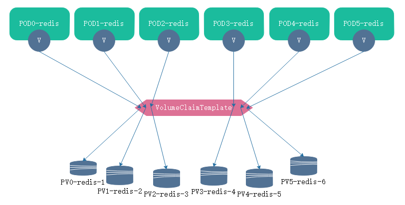
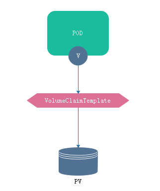
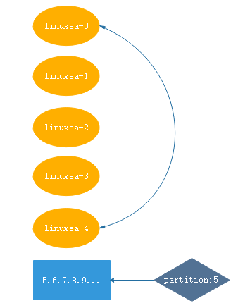

在之前，我们知道应用程序分为两类，一种是有状态，一种无状态。无状态的有nginx等。有状态的居多。

如：redis,mysql,zook集群等，其中一些不单单有主从状态，更有启动顺序等的区分。这时候可使用statefulse，但是statefulse在完成一些配置的时候仍然是非常麻烦的，很多时候需要手动编写脚本，或者依赖于地第三方的一些工具来做。statefulse在处理，特别是在一些运维逻辑非常复杂的时候，仍然是非常麻烦的。coreos提供了一种组件operator，可以将复杂的逻辑封装在这个组件当中。但是我们会使用kubernetes官网的statefulset-->有状态副本集。

无状态关注的更多的是群体，任何一个轻易的就会被其他所取代。没有 本地的数据，也没有独特的依赖状态。
但是对于有状态的应用来讲，就需要有个体的：cattle,pet。在之前称为petset，现在称为SatefulSet。

## SatefulSet
在kubernetes上的SatefulSet主要用于管理一下应用
1，具备稳定的环境，唯一的网络标识符
2，具备稳定持久的存储设备
3，有序，优雅平滑的部署和扩展，以及有序终止和删除，有序的滚动更新（如：启动顺序等，关闭顺序等）。

一般来讲SatefulSet将会由三个组件组成：headless service，SatefulSet控制器，VolumeClaimTemplate存储卷申请模板
- headless service

我们知道创建没每个pod的名称是无序的，但是在有状态的应用中节点的名称是不能变的，pod的名称是识别pod唯一性的标识符。这个标识符必须稳定持久有效，这时候就需要headless service（无头服务），解析的名称直达后端pod地址，并确保名称唯一。
- VolumeClaimTemplate

大多数有状态的pod都会用到持久存储，以redis cluster为例，假设有6台redis，每台redis的槽位是不一样的，数据也是不一样的(数据有可能，或者重名)，也就意味着至少需要6个单独的存储卷用来专用存储，不能够共享。因为数据名称是一样的，数据不一样。

此时基于pod模板定义则只能访问同一个存储卷，因此使用`VolumeClaimTemplate`(卷申请模板)在创建pod的时候会自动生成一个专有的pvc，请求绑定一个专有pv,从而有单独的存储



在SatefulSet中的pod不能够使用同一个存储卷，因此通过pod模板来创建pod是不适用的，这也就是为什么要用定义VolumeClaimTemplate的原因。

### 创建PV
尽管使用`VolumeClaimTemplate`会自动创建pvc并且绑定pv，但是pv在这里仍然需要自己手动创建(如果你有动态供给的话另说)。仍然使用之前的nfs
```
[marksugar@linuxea volume]# cat pv-demo.yaml 
apiVersion: v1
kind: PersistentVolume
metadata:
  name: linuxea-1
  labels: 
    name: v1
spec:
  nfs:
    path: /data/linuxea-volumes/linuxea-1
    server: 10.0.1.61
  accessModes: ["ReadWriteMany","ReadWriteOnce"]
  capacity:
    storage: 5Gi
---
apiVersion: v1
kind: PersistentVolume
metadata:
  name: linuxea-2
  labels: 
    name: v2
spec:
  nfs:
    path: /data/linuxea-volumes/linuxea-2
    server: 10.0.1.61
  accessModes: ["ReadWriteMany","ReadWriteOnce"]
  capacity:
    storage: 5Gi
---
apiVersion: v1
kind: PersistentVolume
metadata:
  name: linuxea-3
  labels: 
    name: v3
spec:
  nfs:
    path: /data/linuxea-volumes/linuxea-3
    server: 10.0.1.61
  accessModes: ["ReadWriteOnce"]
  capacity:
    storage: 5Gi
---
apiVersion: v1
kind: PersistentVolume
metadata:
  name: linuxea-4
  labels: 
    name: v4
spec:
  nfs:
    path: /data/linuxea-volumes/linuxea-4
    server: 10.0.1.61
  accessModes: ["ReadWriteMany","ReadWriteOnce"]
  capacity:
    storage: 5Gi
---
apiVersion: v1
kind: PersistentVolume
metadata:
  name: linuxea-5
  labels: 
    name: v5
spec:
  nfs:
    path: /data/linuxea-volumes/linuxea-5
    server: 10.0.1.61
  accessModes: ["ReadWriteMany","ReadWriteOnce"]
  capacity:
    storage: 5Gi
```
apply
```
[marksugar@linuxea volume]# kubectl apply -f pv-demo.yaml 
persistentvolume/linuxea-1 created
persistentvolume/linuxea-2 created
persistentvolume/linuxea-3 created
persistentvolume/linuxea-4 created
persistentvolume/linuxea-5 created
```
```
[marksugar@linuxea volume]# kubectl get pv
NAME        CAPACITY   ACCESS MODES   RECLAIM POLICY   STATUS      CLAIM     STORAGECLASS   REASON    AGE
linuxea-1   5Gi        RWO,RWX        Retain           Available                                      4s
linuxea-2   5Gi        RWO,RWX        Retain           Available                                      4s
linuxea-3   5Gi        RWO            Retain           Available                                      4s
linuxea-4   5Gi        RWO,RWX        Retain           Available                                      4s
linuxea-5   5Gi        RWO,RWX        Retain           Available                                      4s
```
```
[marksugar@linuxea volume]# kubectl get pvc
No resources found.
[marksugar@linuxea volume]# 
```
### 创建satefulset

此前，我们知道，集群内创建一个pod，pod中定义pvc类型的volumeMounts，并且关联到当前同一个名称空间的pvc,这个pvc关联集群的pv。pv我们在上面已经创建好了，而pvc则使用`volumeClaimTemplates`动态生成



开始先创建一个名称为satefulset-linuxea的service。并且是无头服务。selector是`my-satefulset`
每一个pod的存储卷是在`template`定义，而pvc是由`volumeClaimTemplates`自动生成

```
spec:
  serviceName: satefulset-linuxea # 关联到无头服务，基于这个无头服务分配唯一的标识符
  replicas: 2  # 副本个数
  selector:  # pod管理
    matchLabels:
      app: my-satefulset
    template:  # 定义pod模板
      metadata:
        labels:
          app: my-satefulset
      spec:
        containers:
          .....
          volumeMounts:     # 定义pod自己的存储卷   
          - name: wwwdata
            mountPath: /data/wwwroot     # 挂在到容器的目录          
    volumeClaimTemplates:   # 使用volumeClaimTemplates动态生成pod pvc
      spec:
        accessModes: ["ReadWriteOnce"]
        storageClassName: "gluster-dynamic"
        resources:
          requests:
            storage: 2Gi    
```
```
[marksugar@linuxea satefulset]# cat satefulset-demo.yaml 
apiVersion: v1
kind: Service
metadata:
  name: satefulset-linuxea
  labels:
    app: satefulset-app
spec:
  ports:
  - port: 80
    name: http
  clusterIP: None
  selector:
    app: my-satefulset
---
apiVersion: apps/v1
kind: StatefulSet
metadata:
  name: satefulset
spec:
  serviceName: satefulset-linuxea
  replicas: 2
  selector:
    matchLabels:
      app: my-satefulset
  template:
    metadata:
      labels:
        app: my-satefulset
    spec:
      containers:
      - name: satefulset
        image: "marksugar/nginx:1.14.a" 
        ports:
        - containerPort: 80
          name: http
        volumeMounts:
        - name: wwwdata
          mountPath: /data/wwwroot
  volumeClaimTemplates:
  - metadata:
      name: wwwdata
    spec:
      accessModes: ["ReadWriteOnce"]
      resources:
        requests:
          storage: 5Gi
```
apply
```
[marksugar@linuxea satefulset]# kubectl apply -f satefulset-demo.yaml 
service/satefulset-linuxea created
statefulset.apps/satefulset created
```
```
[marksugar@linuxea satefulset]# kubectl get  svc
NAME                 TYPE        CLUSTER-IP   EXTERNAL-IP   PORT(S)   AGE
kubernetes           ClusterIP   10.96.0.1    <none>        443/TCP   13d
satefulset-linuxea   ClusterIP   None         <none>        80/TCP    5s
```
sts是`satefulset`简写，可以使用`kubectl get sts`查看创建的`satefulset`状态
```
[marksugar@linuxea satefulset]# kubectl get sts
NAME         DESIRED   CURRENT   AGE
satefulset   2         2         9s
```
同时会自动创建pvc，为没个pod定义pv并且绑定。使用` kubectl get pvc`查看
```
[marksugar@linuxea satefulset]# kubectl get pvc
NAME                   STATUS    VOLUME      CAPACITY   ACCESS MODES   STORAGECLASS   AGE
wwwdata-satefulset-0   Bound     linuxea-3   5Gi        RWO                           17s
wwwdata-satefulset-1   Bound     linuxea-4   5Gi        RWO,RWX                       15s
```
可以通`kubectl get pv`查看被绑定的pv
```
[marksugar@linuxea satefulset]# kubectl get pv
NAME        CAPACITY   ACCESS MODES   RECLAIM POLICY   STATUS      CLAIM                          STORAGECLASS   REASON    AGE
linuxea-1   5Gi        RWO,RWX        Retain           Available                                                           27s
linuxea-2   5Gi        RWO,RWX        Retain           Available                                                           27s
linuxea-3   5Gi        RWO            Retain           Bound       default/wwwdata-satefulset-0                            27s
linuxea-4   5Gi        RWO,RWX        Retain           Bound       default/wwwdata-satefulset-1                            27s
linuxea-5   5Gi        RWO,RWX        Retain           Available                                                           27s
```
并且pod的名称是固定的，使用` kubectl get pods -o wide`查看到，这些pod的名称是可以被固定解析的
```
[marksugar@linuxea satefulset]# kubectl get pods -o wide
NAME           READY     STATUS    RESTARTS   AGE       IP             NODE                 NOMINATED NODE
satefulset-0   1/1       Running   0          29s       172.16.5.116   linuxea.node-3.com   <none>
satefulset-1   1/1       Running   0          27s       172.16.4.11    linuxea.node-2.com   <none>
```
只需要解析容器名称即可

```
[marksugar@linuxea satefulset]# kubectl get pods -o wide
NAME           READY     STATUS    RESTARTS   AGE       IP             NODE                 NOMINATED NODE
satefulset-0   1/1       Running   0          12m       172.16.5.117   linuxea.node-3.com   <none>
satefulset-1   1/1       Running   0          12m       172.16.4.12    linuxea.node-2.com   <none>
```

```
[marksugar@linuxea satefulset]# kubectl exec -it satefulset-0 nslookup satefulset-0
nslookup: can't resolve '(null)': Name does not resolve

Name:      satefulset-0
Address 1: 172.16.5.117 satefulset-0.satefulset-linuxea.default.svc.cluster.local
```

```
[marksugar@linuxea satefulset]# kubectl exec -it satefulset-1 nslookup satefulset-1
nslookup: can't resolve '(null)': Name does not resolve

Name:      satefulset-1
Address 1: 172.16.4.12 satefulset-1.satefulset-linuxea.default.svc.cluster.local
```
- 那这也就意味着直接使用pod名称就会被调用
  在集群内有可以直接dig解析。

dig的域是由pod名称和服务名称组合: `pod_name.service_name.ns_name.svc.cluster.local` 
  如：`satefulset-0.satefulset-linuxea.default.svc.cluster.local`

```
[marksugar@linuxea satefulset]# dig -t A satefulset-0.satefulset-linuxea.default.svc.cluster.local @10.96.0.10

; <<>> DiG 9.9.4-RedHat-9.9.4-61.el7 <<>> -t A satefulset-0.satefulset-linuxea.default.svc.cluster.local @10.96.0.10
;; global options: +cmd
;; Got answer:
;; ->>HEADER<<- opcode: QUERY, status: NOERROR, id: 62089
;; flags: qr aa rd ra; QUERY: 1, ANSWER: 1, AUTHORITY: 0, ADDITIONAL: 1

;; OPT PSEUDOSECTION:
; EDNS: version: 0, flags:; udp: 4096
;; QUESTION SECTION:
;satefulset-0.satefulset-linuxea.default.svc.cluster.local. IN A

;; ANSWER SECTION:
satefulset-0.satefulset-linuxea.default.svc.cluster.local. 5 IN	A 172.16.5.117

;; Query time: 0 msec
;; SERVER: 10.96.0.10#53(10.96.0.10)
;; WHEN: Sat Sep 29 15:12:16 BST 2018
;; MSG SIZE  rcvd: 159

[marksugar@linuxea satefulset]# 
```
- 并且这个名称和pvc绑定

```
[marksugar@linuxea satefulset]# kubectl get pvc
NAME                   STATUS    VOLUME      CAPACITY   ACCESS MODES   STORAGECLASS   AGE
wwwdata-satefulset-0   Bound     linuxea-3   5Gi        RWO                           1h
wwwdata-satefulset-1   Bound     linuxea-4   5Gi        RWO,RWX                       1h
```
### 删除和创建
- 注意：事实上当删除或者创建的时候，会进行顺向创建和逆向关闭

删除
```
[marksugar@linuxea satefulset]# kubectl delete -f satefulset-demo.yaml 
service "satefulset-linuxea" deleted
statefulset.apps "satefulset" deleted
```
创建
```
[marksugar@linuxea satefulset]# kubectl apply -f satefulset-demo.yaml 
service/satefulset-linuxea created
statefulset.apps/satefulset created
```
使用`kubectl get pods -w `观察整个过程
删除
```
[marksugar@linuxea volume]# kubectl get pods -w 
NAME           READY     STATUS    RESTARTS   AGE
satefulset-0   1/1       Running   0          22m
satefulset-1   1/1       Running   0          22m
satefulset-0   1/1       Terminating   0         23m
satefulset-1   1/1       Terminating   0         22m
satefulset-0   0/1       Terminating   0         23m
satefulset-1   0/1       Terminating   0         23m
satefulset-1   0/1       Terminating   0         23m
satefulset-1   0/1       Terminating   0         23m
satefulset-0   0/1       Terminating   0         23m
satefulset-0   0/1       Terminating   0         23m
```
启动
```
satefulset-0   0/1       Pending   0         0s
satefulset-0   0/1       Pending   0         0s
satefulset-0   0/1       ContainerCreating   0         0s
satefulset-0   1/1       Running   0         2s
satefulset-1   0/1       Pending   0         0s
satefulset-1   0/1       Pending   0         0s
satefulset-1   0/1       ContainerCreating   0         0s
satefulset-1   1/1       Running   0         1s
```
这个删除的过程是不会被删除的
```
[marksugar@linuxea satefulset]# kubectl get pvc
NAME                   STATUS    VOLUME      CAPACITY   ACCESS MODES   STORAGECLASS   AGE
wwwdata-satefulset-0   Bound     linuxea-3   5Gi        RWO                           28m
wwwdata-satefulset-1   Bound     linuxea-4   5Gi        RWO,RWX                       28m
```
### 扩展
现在有两个pod，当扩展到第三个甚至于第四个的时候，也会自动创建pvc请求绑定到符合的pv大小上，并且是顺序列的
使用` kubectl scale sts satefulset --replicas=5`进行扩展，将replicas设置为5个
```
[marksugar@linuxea satefulset]# kubectl scale sts satefulset --replicas=5
statefulset.apps/satefulset scaled
```
可以观察这个扩展的过程，从0-5
```
[marksugar@linuxea volume]# kubectl get pods -w 
NAME           READY     STATUS    RESTARTS   AGE
satefulset-0   1/1       Running   0          1h
satefulset-1   1/1       Running   0          1h
satefulset-2   0/1       Pending   0         0s
satefulset-2   0/1       Pending   0         0s
satefulset-2   0/1       Pending   0         0s
satefulset-2   0/1       ContainerCreating   0         0s
satefulset-2   1/1       Running   0         1s
satefulset-3   0/1       Pending   0         0s
satefulset-3   0/1       Pending   0         0s
satefulset-3   0/1       Pending   0         0s
satefulset-3   0/1       ContainerCreating   0         0s
satefulset-3   1/1       Running   0         1s
satefulset-4   0/1       Pending   0         0s
satefulset-4   0/1       Pending   0         0s
satefulset-4   0/1       Pending   0         0s
satefulset-4   0/1       ContainerCreating   0         0s
satefulset-4   1/1       Running   0         2s
```
而后创建完成
```
[marksugar@linuxea satefulset]# kubectl get pods
NAME           READY     STATUS    RESTARTS   AGE
satefulset-0   1/1       Running   0          1h
satefulset-1   1/1       Running   0          1h
satefulset-2   1/1       Running   0          16s
satefulset-3   1/1       Running   0          15s
satefulset-4   1/1       Running   0          14s
```
在上面提到过，创建一个pod后会自动创建pvc绑定pv。
查看下pvc`kubectl get pvc`，已经创建并且绑定
不是说水墨速度慢吗
```
[marksugar@linuxea satefulset]# kubectl get pvc
NAME                   STATUS    VOLUME      CAPACITY   ACCESS MODES   STORAGECLASS   AGE
wwwdata-satefulset-0   Bound     linuxea-3   5Gi        RWO                           1h
wwwdata-satefulset-1   Bound     linuxea-4   5Gi        RWO,RWX                       1h
wwwdata-satefulset-2   Bound     linuxea-2   5Gi        RWO,RWX                       3m
wwwdata-satefulset-3   Bound     linuxea-1   5Gi        RWO,RWX                       3m
wwwdata-satefulset-4   Bound     linuxea-5   5Gi        RWO,RWX                       3m
```
### 缩减
缩减和扩展相反，是逆序的
使用`kubectl scale sts satefulset --replicas=2`直接运行
```
[marksugar@linuxea satefulset]# kubectl scale sts satefulset --replicas=2
statefulset.apps/satefulset scaled
```
也可以打补丁进行缩减` kubectl scale sts satefulset -p '{"spec":{"replicas":2}'`
而后使用  来观察缩减顺序，逆序从4开始关闭到2。只剩下0和1。完成规模的缩减

```
[marksugar@linuxea volume]# kubectl get pods -w 
NAME           READY     STATUS        RESTARTS   AGE
satefulset-0   1/1       Running       0          1h
satefulset-1   1/1       Running       0          1h
satefulset-2   1/1       Running       0          20m
satefulset-3   1/1       Running       0          20m
satefulset-4   1/1       Terminating   0          20m
satefulset-4   0/1       Terminating   0         20m
satefulset-4   0/1       Terminating   0         20m
satefulset-4   0/1       Terminating   0         20m
satefulset-3   1/1       Terminating   0         20m
satefulset-3   0/1       Terminating   0         21m
satefulset-3   0/1       Terminating   0         21m
satefulset-3   0/1       Terminating   0         21m
satefulset-2   1/1       Terminating   0         21m
satefulset-2   0/1       Terminating   0         21m
satefulset-2   0/1       Terminating   0         21m
satefulset-2   0/1       Terminating   0         21m
```
```
[marksugar@linuxea volume]# kubectl get pods
NAME           READY     STATUS    RESTARTS   AGE
satefulset-0   1/1       Running   0          1h
satefulset-1   1/1       Running   0          1h
```

### 滚动

updateStrategy：自定义更新策略。updateStrategy默认滚动更新

```
satefulset:
  spec:
    updateStrategy:
      rollingUpdate:
        partition: # 默认为0
```

- (partition)更新边界



每个pod用名称进行标识，分别是linuxea-0,4。如果partition等于5，意味着大于等于5的pod编号将会被更新。如果没有，则不会进行更新。如上图。

此时如果配置partition等于4，那便意味着更新大于等于4的pod，但是最大的只有pod4一个，那就只会更新一个，当4更新完成，在将partition修改为0（但与等于0），那就进行全部更新

```
updateStrategy自定义更新策略
```

### 设定partition

设定partition为4：`kubectl patch sts satefulset -p '{"spec":{"updateStrategy":{"rollingUpdate":{"partition":4}}}}'`

```
[marksugar@linuxea satefulset]# kubectl patch sts satefulset -p '{"spec":{"updateStrategy":{"rollingUpdate":{"partition":4}}}}'
statefulset.apps/satefulset patched
```

而后通过`kubectl describe sts satefulset`查看状态

```
[marksugar@linuxea volume]# kubectl describe sts satefulset
...
Update Strategy:    RollingUpdate
  Partition:        4
Pod Template:
...
    Image:        marksugar/nginx:1.14.a  
...  
```

### 更新partition

将上面的image更新到marksugar/nginx:1.14.b，仍然通过打补丁的方式

```
 kubectl patch sts satefulset -p '{"spec":{"template":{"spec":{"containers[0]":{"image":"marksugar/nginx:1.14.b"}}}}}'
```


```
[marksugar@linuxea satefulset]# kubectl get sts -o wide
NAME         DESIRED   CURRENT   AGE       CONTAINERS   IMAGES
satefulset   5         5         15h       satefulset   marksugar/nginx:1.14.a
```

使用set image修改到`marksugar/nginx:1.14.b`

```
[marksugar@linuxea satefulset]# kubectl set image sts/satefulset satefulset=marksugar/nginx:1.14.b
statefulset.apps/satefulset image updated
```

```
[marksugar@linuxea satefulset]# kubectl get sts -o wide
NAME         DESIRED   CURRENT   AGE       CONTAINERS   IMAGES
satefulset   5         5         15h       satefulset   marksugar/nginx:1.14.b
```

此时如果pods运行的机器尚未拉取镜像，此时会进行拉取更新

```
[marksugar@linuxea satefulset]# kubectl get pods -o wide -w
NAME           READY     STATUS        RESTARTS   AGE       IP             NODE                 NOMINATED NODE
satefulset-0   1/1       Running       0          15h       172.16.5.117   linuxea.node-3.com   <none>
satefulset-1   1/1       Running       0          15h       172.16.4.12    linuxea.node-2.com   <none>
satefulset-2   1/1       Running       0          13h       172.16.3.43    linuxea.node-1.com   <none>
satefulset-3   1/1       Running       0          13h       172.16.3.44    linuxea.node-1.com   <none>
satefulset-4   0/1       Terminating   0          13h       172.16.4.13    linuxea.node-2.com   <none>
satefulset-4   0/1       Terminating   0         13h       172.16.4.13   linuxea.node-2.com   <none>
satefulset-4   0/1       Terminating   0         13h       172.16.4.13   linuxea.node-2.com   <none>
satefulset-4   0/1       Pending   0         0s        <none>    <none>    <none>
satefulset-4   0/1       Pending   0         0s        <none>    linuxea.node-3.com   <none>
satefulset-4   0/1       ContainerCreating   0         0s        <none>    linuxea.node-3.com   <none>
satefulset-4   1/1       Running   0         2s        172.16.5.119   linuxea.node-3.com   <none>
```

而后使用`kubectl get pods satefulset-4 -o yaml`查看`satefulset-4`,也就是设定的partition的pod更新

- partition定义的是4，也就是说大于等于4的被更新，其他的不会被更新

```
[marksugar@linuxea volume]# kubectl get pods satefulset-4 -o yaml|grep image
  - image: marksugar/nginx:1.14.b
    imagePullPolicy: IfNotPresent
    image: marksugar/nginx:1.14.b
```

此时，如果要将其他的镜像都更新到`marksugar/nginx:1.14.b`,将partition修改为0即可

`kubectl patch sts satefulset -p '{"spec":{"updateStrategy":{"rollingUpdate":{"partition":0}}}}'`

```
[marksugar@linuxea satefulset]# kubectl patch sts satefulset -p '{"spec":{"updateStrategy":{"rollingUpdate":{"partition":0}}}}'
statefulset.apps/satefulset patched
```

而后，pod会进行更新到`marksugar/nginx:1.14.b`

```
[marksugar@linuxea satefulset]# kubectl get pods -w
NAME           READY     STATUS    RESTARTS   AGE
satefulset-0   1/1       Running   0          15h
satefulset-1   1/1       Running   0          15h
satefulset-2   1/1       Running   0          13h
satefulset-3   1/1       Running   0          13h
satefulset-4   1/1       Running   0          11m
satefulset-3   1/1       Terminating   0         13h
satefulset-3   0/1       Terminating   0         13h
satefulset-3   0/1       Terminating   0         13h
satefulset-3   0/1       Terminating   0         13h
satefulset-3   0/1       Pending   0         0s
satefulset-3   0/1       Pending   0         0s
satefulset-3   0/1       ContainerCreating   0         0s
satefulset-3   1/1       Running   0         1s
satefulset-2   1/1       Terminating   0         13h
satefulset-2   0/1       Terminating   0         13h
satefulset-2   0/1       Terminating   0         13h
satefulset-2   0/1       Terminating   0         13h
satefulset-2   0/1       Pending   0         0s
satefulset-2   0/1       Pending   0         0s
satefulset-2   0/1       ContainerCreating   0         0s
satefulset-2   1/1       Running   0         1s
satefulset-1   1/1       Terminating   0         15h
satefulset-1   0/1       Terminating   0         15h
satefulset-1   0/1       Terminating   0         15h
satefulset-1   0/1       Terminating   0         15h
satefulset-1   0/1       Pending   0         0s
satefulset-1   0/1       Pending   0         0s
satefulset-1   0/1       ContainerCreating   0         0s
satefulset-1   1/1       Running   0         1s
satefulset-0   1/1       Terminating   0         15h
satefulset-0   0/1       Terminating   0         15h
satefulset-0   0/1       Terminating   0         15h
satefulset-0   0/1       Terminating   0         15h
satefulset-0   0/1       Pending   0         0s
satefulset-0   0/1       Pending   0         0s
satefulset-0   0/1       ContainerCreating   0         0s
satefulset-0   1/1       Running   0         1s
```
集群内访问的版本是`version number 2.0`
之前的`mage：marksugar/nginx:1.14.a`是`version number 1.0`，由此可见，更新已经完成。statefulset的更新顺序是从倒序的
```
[marksugar@linuxea volume]# curl 172.16.5.120/linuxea.html
linuxea-satefulset-0.com ▍ decd7c42de3ab ▍version number 2.0
[marksugar@linuxea volume]# curl 172.16.3.46/linuxea.html
linuxea-satefulset-1.com ▍ 33b9df88388ed ▍version number 2.0
[marksugar@linuxea volume]# curl 172.16.4.14/linuxea.html
linuxea-satefulset-2.com ▍ 5172054ce689c ▍version number 2.0
[marksugar@linuxea volume]# curl 172.16.3.45/linuxea.html
linuxea-satefulset-3.com ▍ edc72116a7040 ▍version number 2.0
[marksugar@linuxea volume]# curl 172.16.5.119/linuxea.html
linuxea-satefulset-4.com ▍ a978be23d0de0 ▍version number 2.0
```

