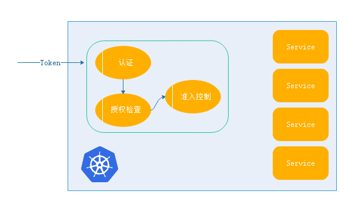
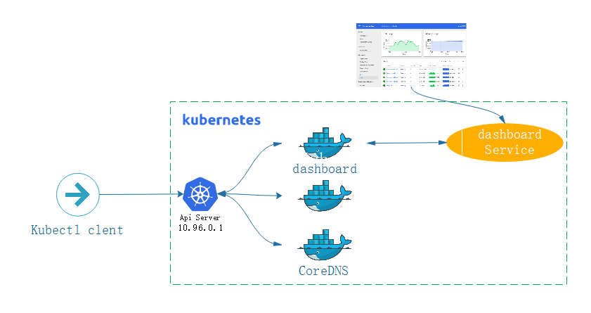
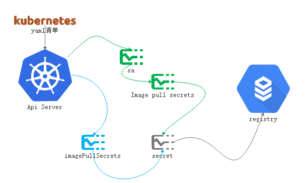

kubernetes上运行着众多的应用，特别是无状态的应用，更甚有一些核心的数据。对于这些数据的访问或者管理，并不是任何人可以随意的管理使用的。因此，kubernetes对于整个系统的认证，授权，以及后续的访问控制做了非常紧密和精心的设计。

通常，客户端通过客户端工具kubectl来访问kubernetes， 对于管理员或者kubectl来讲api server是作为管理的唯一入口。

这联想起了ingress。这与ingress不同，ingress只是暴露服务端口，对于pod内应用程序来讲，客户端访问是不用经过api server。而api server中有众多资源管理平台，管理对应的对象(多组API，且自我迭代)，不同于pod中应用。不论如何，任何用户试图在kubernetes平台操作资源对象时，出于安全考虑 ，在访问api server之前需要做三种安全相关的操作。如下图：



1，[任何访问到api server之前需要做认证](https://kubernetes.io/docs/reference/access-authn-authz/service-accounts-admin/#user-accounts-vs-service-accounts)操作，用户具备正确的权限账号，并且通过
2，认证通过，授权检查 
​      认证通过，仅仅说明是一个合法的用户，是否拥有其他权限。就要查看授权的资源可能存在链接到其他资源依赖是否具备权限访问，权限是否在允许操作的范围内，就来到第三步
3，[准入控制器(Service Account Admission Controller )](https://kubernetes.io/docs/reference/access-authn-authz/service-accounts-admin/#service-account-admission-controller)
​	当权限认证通过，且检查后，尽管已经拥有了操作的权限，但是用户的操作是否运行被执行，就进行准入控制

kubernetes是模块化设计，授权以及准入控制都可以通过插件的方式，可由用户自定义选择，经由什么插件，又如何控制？取决于用户本身。

## 认证

这类模块认证支持多种插件认证方式，如

- [API令牌(token-controller)](https://kubernetes.io/docs/reference/access-authn-authz/service-accounts-admin/#token-controller),交换共享密钥，[创建](https://kubernetes.io/docs/tasks/configure-pod-container/configure-service-account/#manually-create-a-service-account-api-token)等

所谓令牌认证就是双方都有共享密钥，服务端存放密码，在登陆时进行密码验证登陆，这种方式就是对称密钥认证方式。在k8s中提供的restful接口，通过http的方式，认证的协议通过http首部进行传递，这种认证首部在传递时的预共享密钥编码信息，就叫做令牌-->token。
- SSL认证

>  对于kubernetes来讲，ssl认证能让客户端认证，并且确认服务器身份

在与服务器通信之前，先要求发送一个证书是否是认可的CA签署。如果发送的信息与目标主机的信息保持一致没有问题， 那就可以认为服务器身份得到认证。而在k8s通信中，服务器也需要认证客户端的身份。因此kubectl也需要有一个证书和私钥，并且必须是server颁发签署的证书，而且客户端认证也要与证书中标识的身份保持一致。并且基于ssl加密会话进行通信

尽管支持多种认证，但是认证一旦通过某个插件认证通过后便认证通过，而无需向其他认证做串行检查。
## 授权
当认证完成就进入授权检查，在k8s 1.6后支持RBAC，以及node认证，web回调等。

使用kubeadm安装的kubernetes集群，默认强制启用RBAC认证。默认权限全部拒绝。RABC定制的权限非常灵活，可以针对名称空间做权限控制。

尽管支持多种授权，但是授权一旦通过某个插件授权通过后便获得了授权的权限，而无需向其他授权做串行检查。
准入控制用于授权完成后的一些其他安全操作

## 账号信息

在k8s中的一个用户账号，大致需要一下信息：

当客户端对api server发起请求，在识别的过程中，凭证有：用户名，用户id，用户组。当用户携带凭证请求的时候，会请求到一个特定的api资源。在k8s server中有多组，因此，在api请求的资源中必须标识Request Path标识，如：`/apis/apps/v1/namespace/default/deployments/myapp-deploy/`

### Request Path

- k8s兼容多个版本共存，这里的版本有多个，如：beta的版本叠加，apps/v1，apps/v1beta1，apps/v1beta2

`/namespace/default/deployments/myapp-deploy/`

在资源里面，要么属于名称空间，要么属于集群级别。名称空间，pv属于集群级别，而pod,serivce,pvc等等，属于名称空间级别，所有名称空间级别，所有名称空间级别访问需要指定：`/名称空间/default名称空间名称/`下找`deployments/名称叫myapp-deploy/`的资源。用户可以对这个资源发起增删改查操作。

kubectl create ,apply ,delete等操作，事实上都是被转换为一个Http协议的请求来请求的：如：`http://10.10.240.161:6443/apis/apps/v1/namespace/default/deployments/myapp-deploy/`

通常在操作kubectl时，由于kubectl自带了认证信息，所以kubectl能操作所有的操作。

- 在创建kubernetes集群时候，我们复制了一个配置文件到~/.kube/config。这个配置文件中包含了证书和私钥，所以我们在使用kubectl时候并不需要认证信息，如下：

```
[marksugar@linuxea satefulset]# cat ~/.kube/config 
apiVersion: v1
clusters:
- cluster:
    certificate-authority-data: 省略号。。。。。。。
    server: https://10.10.240.161:6443
  name: kubernetes
contexts:
- context:
    cluster: kubernetes
    user: kubernetes-admin
  name: kubernetes-admin@kubernetes
current-context: kubernetes-admin@kubernetes
kind: Config
preferences: {}
users:
- name: kubernetes-admin
  user:
    client-certificate-data: 省略号。。。。。。。
    client-key-data: 省略号。。。。。。。
```

我们可以使用curl进行curl请求这些url，但是curl的话就需要认证信息。可以使用`kubectl proxy --port=8080`创建一个porxy代理8080端口，proxy自动回和kubectl进行认证，而我们curl查看便不需要认证，而后跳过

```
[marksugar@linuxea satefulset]# kubectl proxy --port=8080
Starting to serve on 127.0.0.1:8080
```
端口已经启动
```
[marksugar@linuxea volume]# ss -tlnp|grep 8080
LISTEN     0      128    127.0.0.1:8080                     *:*                   users:(("kubectl",pid=10193,fd=3))
```
`curl http://localhost:8080/api/v1`curl本地的8080代理端口. 会得到一个json格式的结果。此前我们知道，编写的资源清单yaml最终也会转成json格式后提交给系统使用，如下：

- `api/v1` 此前的yaml文件的指定的`apiVersion: v1`则是指定的这里
```
[marksugar@linuxea volume]# curl http://localhost:8080/api/v1/namespaces
{
  "kind": "NamespaceList",
  "apiVersion": "v1",
  "metadata": {
    "selfLink": "/api/v1/namespaces",
    "resourceVersion": "2003021"
  },
  "items": [
    {
      "metadata": {
        "name": "default",
        "selfLink": "/api/v1/namespaces/default",
        "uid": "3914423a-b975-11e8-a8ab-88882fbd1028",
        "resourceVersion": "5",
        "creationTimestamp": "2018-09-16T05:56:15Z"
      },
      "spec": {
        "finalizers": [
          "kubernetes"
        ]
      },
      "status": {
        "phase": "Active"
      }
		省略.....		省略.....		省略.....		省略.....		省略.....
```

那么访问deploy也是如此，也是基于url进行增删改查，如：coredns

```
[marksugar@linuxea volume]# kubectl get deploy -n kube-system
NAME      DESIRED   CURRENT   UP-TO-DATE   AVAILABLE   AGE
coredns   2         2         2            2           14d
```

对于k8s来讲，所有的api资源都起源于api的父树apis，此前的`http://localhost:8080/api/v1/namespaces`特殊链接除外（核心群组特殊的访问逻辑）。我们试图获取deployments的对象列表`http://localhost:8080/apis/apps/v1/namespaces/kube-system/deployments/`

```
[marksugar@linuxea volume]# curl http://localhost:8080/apis/apps/v1/namespaces/kube-system/deployments/
{
  "kind": "DeploymentList",
  "apiVersion": "apps/v1",
  "metadata": {
    "selfLink": "/apis/apps/v1/namespaces/kube-system/deployments/",
    "resourceVersion": "2003887"
  },
  "items": [
    {
      "metadata": {
        "name": "coredns",
        "namespace": "kube-system",
        "selfLink": "/apis/apps/v1/namespaces/kube-system/deployments/coredns",
        "uid": "3bb90cc6-b975-11e8-a8ab-88882fbd1028",
        "resourceVersion": "600",
        "generation": 1,
        "creationTimestamp": "2018-09-16T05:56:19Z",
        "labels": {
          "k8s-app": "kube-dns"
        },
        "annotations": {
          "deployment.kubernetes.io/revision": "1"
        }
		省略.....		省略.....		省略.....		省略.....		省略.....
      "spec": {
```
或者请求coredns
```
[marksugar@linuxea volume]# curl http://localhost:8080/apis/apps/v1/namespaces/kube-system/deployments/coredns
```
这些都是http格式，可以编辑，查看，修改，删除这些操作的授权
- http request verb 

请求动作，包括: get ,post,put,delete,这些http的方法会转换成api requets verb的方法，如：get，list，create，update，patch，watch，proxy，redirect，delete，delete collection。

resource: 请求资源的id或者名称。subresource: 子资源。namespace,api group等。这些在request path中已经包含

api server是整个访问请求进入的网关接口，用户用于身份识别，授权用于权限检查，准入控制更多的补充了授权机制，一般会在删除，创建，修改或者代理时候做补充。

## pod用户信息认证

在kubernets上有一些服务和客户端需要与api server交涉，并且集群内部会运行类似的pod资源，这些资源是需要访问api server的 ，如: CoreDNS,以及dashboard

dashboard提供一个web界面来管理kubernetes，通过service暴漏到外部，通过浏览器打开使用。当然会有通过dashboard来进行增删改查资源，那意味着dashboard这个pod就有可能去创建pod，甚至于名称空间等，那这种操作明显是需要与api server交涉的。如下图：



与api server交涉的有两类：

- 集群之外的客户端 ，集群之外的客户端每次访问api server使用api server监听的节点地址

如kubectl，kubectl并没有运行在节点之上，可以运行在任何系统上，只要有配置文件，都可以进行链接。外部的链接通过api server对外的通信监听的地址，与远程客户端通讯。如上图。

- 集群内部POD客户端

pod有pod网络，pod工作在内部的网段内

集群内部范围api server是通过名称空间当中的kubernetes的service ip 10.96.0.1 进行通讯。将一个集群外部的服务以service的方式引入到集群内部来，事实上也是同一个主机上的，10.96.0.1也就是serviec所在的网络地址，pod本身也是可以和service通讯的，从而使得POD可以请求api server之上的服务。pod请求api service上的服务就是通过10.96.0.1进行的。如上图

```
[marksugar@linuxea volume]# kubectl describe svc kubernetes
Name:              kubernetes
Namespace:         default
Labels:            component=apiserver
                   provider=kubernetes
Annotations:       <none>
Selector:          <none>
Type:              ClusterIP
IP:                10.96.0.1
Port:              https  443/TCP
TargetPort:        6443/TCP
Endpoints:         10.10.240.161:6443
Session Affinity:  None
Events:            <none>
```

但是，api server是需要认证的，api server将认证传递给客户端，客户端校验api server的身份，同时api server校验客户端的身份。那就意味着api server发送给客户端的身份中表明的ip地址不能只是宿主机10.10.240.161这一个ip地址，并且要有coredns的10.96.0.1这个ip地址。因为pod客户端在集群内访问的是10.96.0.1这个IP地址。那也就是说证书持有者名称必须有两条a记录解析到这两个ip。

### serviceAccount

那也就是说证书持有者名称必须有两条a记录解析到这两个ip。任何pod只要需要访问到api server，api server必须要求认证pod，不认证就会被拒绝。而这个认证是由pod提供的，而`serviceAccountName`（服务账号名称）就是让pod链接api server进行认证用的账号。

- kubernetes集群中有两类认证账号，一种是管理人员用户操作类(``userAccountName`)，第二种是服务账号(`serviceAccountName`)，指运行在k8s集群上的pod，想访问当前k8s集群的api server的用户认证信息，服务帐户等。事实上每一种pod都会与api交互，只是权限大小不同而已

默认pod在运行时候，都会有相关信息，如下：

```
[marksugar@linuxea ~]# kubectl describe pods satefulset-2
......
Volumes:
  default-token-k25gj:
    Type:        Secret (a volume populated by a Secret)
    SecretName:  default-token-k25gj
    Optional:    false
QoS Class:       BestEffort
Node-Selectors:  <none>
.....
```

default-token-k25gj的认证资源保存在Secret vloume存储卷的方式关联到pod当中,从而来完成认证链接信息的

其次，在名称空间中默认会创建一个secret的名称空间。`default-token-k25gj  `

```
[marksugar@linuxea ~]# kubectl get secret
NAME                    TYPE                                  DATA      AGE
default-token-k25gj     kubernetes.io/service-account-token   3         15d
redis-passwd            Opaque                                1         2d
tomcat-ingress-secret   kubernetes.io/tls                     2         14d
```

之前创建的` ingress-nginx`名称空间，也有`default-token-s7f97 `,这个token让这个名称空间所有的pod资源联系api server时候预置的认证信息，不过仅限获取当前pod于自身的相关属性，并不能去管理别人的

```
[marksugar@linuxea ingress]# kubectl get secret -n ingress-nginx
NAME                                       TYPE                                  DATA      AGE
default-token-s7f97                        kubernetes.io/service-account-token   3         15d
nginx-ingress-serviceaccount-token-89ctc   kubernetes.io/service-account-token   3         15d
```

如果要扩展一个pod,就是用来管理其他的pod，或者说是管理类的其他资源对象，就必须手动创建一个`service-account-token`，并且创建pod时候附加手动定义的`service-account-token`，不去使用默认的即可。

- 默认的`service-account-token`一般权限非常小，如果需要提升权限就需要手动定义。

### 创建`serviceAccount`

`serviceAccount`属于k8s标准资源，可以创建完成后，使用`serviceAccountname`加载定义的``serviceAccount``

可以使用`create`创建`serviceAccount`，而后指定属性即可创建，这些属性使用`kubectl create serviceaccount -h`可以看到。如果不指定任何属性，也可以给定一个名称。

- `serviceAccount`本身是不带权限的，创建只是使他换了一个账号。而后使用RBAC授其他的权限给这个创建的`serviceAccount`。授权并不属于`serviceAccount`，可以使用一个专用的账号给POD使用，而后给这个专用的账号更大的权限使用。而默认的`serviceAccount`会让名称空间当中所有的pod都拥有这个权限。如果有这种专用的需求，就需要定义一个专用的账号来赋予权限。

#### 命令行创建

`--dry-run=false`: If true, only print the object that would be sent, without sending it.。我们可在加上`--dry-run`测试

```
[marksugar@linuxea ingress]#  kubectl create serviceaccount mysa --dry-run
serviceaccount/mysa created (dry run)
```

`--o yaml`指明输出格式，清单类型yaml

```
[marksugar@linuxea ingress]#  kubectl create serviceaccount mysa -o yaml --dry-run
apiVersion: v1
kind: ServiceAccount
metadata:
  creationTimestamp: null
  name: mysa
```

可以使用`--dry-run`将结果>输出重定向到文件中,如：

`kubectl create serviceaccount mysa -o yaml --dry-run > ./linuxea.yml`,支持create的都可以这么做。当然，也可以指定一个pod名称来查看，如：`kubectl get pods linuxea-tomcat-group-b77666d76-4h5mz -o yaml --export`

`serviceAccount`简称sa，在使用`kubectl get sa`即可。此时能看到默认的一个sa

```
[marksugar@linuxea ingress]# kubectl get sa
NAME      SECRETS   AGE
default   1         16d
```

#### 创建sa

创建一个名称为`admin-linuxea`的`serviceaccount`

```
[marksugar@linuxea ingress]# kubectl create serviceaccount admin-linuxea
serviceaccount/admin-linuxea created
[marksugar@linuxea ingress]# kubectl get sa
NAME            SECRETS   AGE
admin-linuxea   1         3s
default         1         16d
```

创建完成系统会自动生成secret。而系统也会自动生成一个tokens信息

```
[marksugar@linuxea ingress]# kubectl describe sa admin-linuxea
Name:                admin-linuxea
Namespace:           default
Labels:              <none>
Annotations:         <none>
Image pull secrets:  <none>
Mountable secrets:   admin-linuxea-token-4zpzk
Tokens:              admin-linuxea-token-4zpzk
Events:              <none>
```

生成的`admin-linuxea-token-4zpzk`secret

- 这个secret仅用于这个sa链接当前api server的认证信息，并不包含权限信息，如果需要什么权限，则需要另外授权

```
[marksugar@linuxea ingress]# kubectl get secret
NAME                        TYPE                                  DATA      AGE
admin-linuxea-token-4zpzk   kubernetes.io/service-account-token   3         1m
```

#### 应用sa到pod

创建一个linuxea-sa-demo的pod，在spec中添加`serviceAccountName: admin-linuxea`,也就是之前创建的`serviceAccount`

```
[marksugar@linuxea sa]# cat sa-demo.yaml 
apiVersion: v1
kind: Pod
metadata: 
  name: linuxea-sa-demo
  namespace: default
  labels:
    www: linuxea-com
    tier: backend
  annotations:
    www.linuxea.com/ops-by: "linuxea admin"
spec:
  containers:
  - name: linuxea-pod1-com
    image: "marksugar/nginx:1.14.a"
    ports:
      - containerPort: 80
  serviceAccountName: admin-linuxea
```
用`kubectl describe pods linuxea-sa-demo`查看`volumes`，`admin-linuxea-token-4zpzk:`已在其中，type为Secret，如下：
```
[marksugar@linuxea sa]# kubectl describe pods linuxea-sa-demo|tail -20
  Initialized       True 
  Ready             True 
  ContainersReady   True 
  PodScheduled      True 
Volumes:
  admin-linuxea-token-4zpzk:
    Type:        Secret (a volume populated by a Secret)
    SecretName:  admin-linuxea-token-4zpzk
    Optional:    false
QoS Class:       BestEffort
Node-Selectors:  <none>
Tolerations:     node.kubernetes.io/not-ready:NoExecute for 300s
                 node.kubernetes.io/unreachable:NoExecute for 300s
Events:
  Type    Reason     Age   From                         Message
  ----    ------     ----  ----                         -------
  Normal  Scheduled  33s   default-scheduler            Successfully assigned default/linuxea-sa-demo to linuxea.node-3.com
  Normal  Pulled     31s   kubelet, linuxea.node-3.com  Container image "marksugar/nginx:1.14.a" already present on machine
  Normal  Created    30s   kubelet, linuxea.node-3.com  Created container
  Normal  Started    30s   kubelet, linuxea.node-3.com  Started container
```

## 私有镜象认证的两种方式
在每一次提交资源清单到api server，api server传递至kubelet，而后创建并允许一个pod，而这个pod内的容器想要启动，就需要pull一个镜象仓库的镜象，而这个镜象参考需要认证。这个认证信息在之前的配置中使用`Secret`，并且定义，而后使用pod中的`imagePullSecrets`指明使用那个`Secret`对象，而这个`Secret`对象中包含了认证私有镜象仓库的账号和密码。

我们也可以在pod当中不使用`imagePullSecrets`来告诉pod怎么去认证下载镜象文件，而是用`serviceAccountName`，`serviceAccountName`相当于指定了sa账号，而这个sa账号附带可以认证到私有参考的认证信息的，如下：

在之前创建的sa -> admin-linuxea中`Image pull secrets`，也就是说创建的`secrets`可以直接定义在sa上，然后在把sa定义到pod上，这样sa通过`Image pull secrets`定义`secrets`也能完成image的资源认证。相比较`imagePullSecrets`，用户只能看见sa，对于sa来讲， 是或许不到`secrets`信息的，相对安全些

```
[marksugar@linuxea sa]# kubectl describe sa admin-linuxea
Name:                admin-linuxea
Namespace:           default
Labels:              <none>
Annotations:         <none>
Image pull secrets:  <none>
Mountable secrets:   admin-linuxea-token-4zpzk
Tokens:              admin-linuxea-token-4zpzk
Events:              <none>
```
这样一来获取私有镜象认证就 有两种方式：
1，`imagePullSecrets`字段指定认证的`secrets`对象
2，在pod上定义`serviceAccount`，而后在pod附加即可`Image pull secrets`

## RBAC

RBAC是基于角色的访问控制。Api server的客户端在认证时，如果要基于配置文件来保存配置信息，而并不是使用serviceAccount使用token认证，就应该配置为一个配置文件。

事实上，kubenetes中大大多数组件要连接api server都需要认证，这些都可以算作客户端。这些组件能够链接入正确的集群，就需要提供正确的证书，私钥等信息，这些信息保存在配置文件，这个配置文件有个专用的称呼叫做：kubeconfig，这个配置文件就是api server的客户端，连接api server时候的认证格式的配置文件。

可以通过`kubectl config view`查看字段

`·clusters`集群列表，如果有读个则显示多少

`contexts`列表中指明对应的访问权限，指明那个用户访问那个集群，当前用户访问集群的用户则是`current-context`

```
[marksugar@linuxea sa]# kubectl config view
apiVersion: v1
clusters: # 集群列表
- cluster:
    certificate-authority-data: REDACTED # 服务器发来认证集群的认证方式，REDACTED加密
    server: https://10.10.240.161:6443  # 服务器api server路径
  name: kubernetes # 集群名称
contexts: # 上下文列表
- context: # 指定是那个用户访问那个集群
    cluster: kubernetes # 访问的集群名称
    user: kubernetes-admin  # 范围集群的账号
  name: kubernetes-admin@kubernetes  # context名称，通常也是用户名
current-context: kubernetes-admin@kubernetes # 当前访问集群的用户 ，当前上下文
kind: Config
preferences: {}
users: # 用户列表
- name: kubernetes-admin # 用户名，集群管理员
  user: #用户被api server认证的证书
    client-certificate-data: REDACTED   # 客户端证书
    client-key-data: REDACTED # key # 客户端私钥
```

> 上下文：

这个配置文件不单单是说就只能访问一个集群。假如此刻有多个集群，我需要在集群间互相切换，使用一个帐号就可以完成。

为了使一个kubectl账号控制多个集群。那它可能需要这样，如：此刻有三个集群，分别是a,b,c。这a,b,c三个集群可能都有各自的账号，所以就提供了配置文件：集群列表，用户列表。

对每个集群可能都有不同的账号，也可能一样。我们事先定义好账号(也就是用户列表，用户可能有多个，和集群数目无直接关系，权限也不一样)，这些账号列表中某个账号去访问那个集群就取决于contexts定义。这样以来可能有多个contexts，但是当前使用那个账号访问那个集群就取决于current-context(当前帐号)。其中当创建一个config的时候，他的认证信息较为复杂。如下：


## 定义配置文件

定义配置文件需要一些参数，通过kubectl config --help获取：

```
  set-cluster     设定集群
  set-context     设定上下文
  set-credentials 设定用户账号
  unset           Unsets an individual value in a kubeconfig file
  use-context     设定谁说是当前上下文
  view            Display merged kubeconfig settings or a specified kubeconfig file
```

配置中，可以在当前一个配置中新增用户账号，也可以另建立配置文件提供账号。这样的好事就能让一个配置文件浮现负载很多用户账号。所以，是可以在这里添加账号的。

不过，在添加账号的时候，需要自带账号专门用于到服务端认证信息的。

我们在使用kubeadm初始化的时候，会为当前集群创建一个私有的CA，位于/etc/kubernetes/pki。这些ca被api server所信任，都可以认证连入集群。如果有需要，可以使用这里ca和key签署自定义是证书和私钥进行认证。这些信息尤为重要。

我们使用这里的证书和私钥做一个账号，来进行认证到api server

在使用kubeadm创建集群时候，会在`/etc/kubernetes/pki`创建私有CA

```
[marksugar@linuxea sa]# ll /etc/kubernetes/pki/
total 56
-rw-r--r--. 1 root root 1241 Sep 16 06:55 apiserver.crt
-rw-r--r--. 1 root root 1094 Sep 16 06:55 apiserver-etcd-client.crt
-rw-------. 1 root root 1675 Sep 16 06:55 apiserver-etcd-client.key
-rw-------. 1 root root 1679 Sep 16 06:55 apiserver.key
-rw-r--r--. 1 root root 1099 Sep 16 06:55 apiserver-kubelet-client.crt
-rw-------. 1 root root 1679 Sep 16 06:55 apiserver-kubelet-client.key
-rw-r--r--. 1 root root 1025 Sep 16 06:55 ca.crt
-rw-------. 1 root root 1675 Sep 16 06:55 ca.key
drwxr-xr-x. 2 root root  162 Sep 16 06:55 etcd
-rw-r--r--. 1 root root 1025 Sep 16 06:55 front-proxy-ca.crt
-rw-------. 1 root root 1675 Sep 16 06:55 front-proxy-ca.key
-rw-r--r--. 1 root root 1050 Sep 16 06:55 front-proxy-client.crt
-rw-------. 1 root root 1679 Sep 16 06:55 front-proxy-client.key
-rw-------. 1 root root 1679 Sep 16 06:55 sa.key
-rw-------. 1 root root  451 Sep 16 06:55 sa.pub
```

这里可是使用ca.key签署自定义的证书和私钥，也可以直接使用创建好的证书和私钥，这些文件非常重要。只要api server信任的私钥都可以链接到集群。

可以使用这里的证书制作另外一个账号进行认证到api server上。

### 生成私钥

生产一个专属证书，证书的持有者和用户名必须保持一致，证书的持有者名称就是账号名

```
[marksugar@linuxea sa]# (umask 077; openssl genrsa -out linuxea.key 2048)
Generating RSA private key, 2048 bit long modulus
............+++
..................................................................................................+++
e is 65537 (0x10001)
[marksugar@linuxea sa]# ll linuxea.key 
-rw-------. 1 root root 1679 Oct  3 15:01 linuxea.key
```

基于这个私钥生成一个证书，使用/etc/kubernetes/pki下的ca.crt签署

### 签署证书

```
[marksugar@linuxea pki]# openssl req -new -key linuxea.key -out linuxea.csr -subj "/CN=linuxea"
```

```
[marksugar@linuxea pki]# pwd
/etc/kubernetes/pki
```

```
[marksugar@linuxea pki]# openssl x509 -req -in linuxea.csr -CA ./ca.crt -CAkey ./ca.key -CAcreateserial -out linuxea.crt -days 36500
Signature ok
subject=/CN=linuxea
Getting CA Private Key
```

也可查看证书的信息

```
[marksugar@linuxea pki]# openssl x509 -in linuxea.crt -text -noout
Certificate:
    Data:
        Version: 1 (0x0)
        Serial Number:
            89:e9:b5:e3:21:06:0b:b9
    Signature Algorithm: sha256WithRSAEncryption
        Issuer: CN=kubernetes
        Validity
            Not Before: Oct  3 14:12:02 2018 GMT
            Not After : Sep  9 14:12:02 2118 GMT
        Subject: CN=linuxea
        Subject Public Key Info:
            Public Key Algorithm: rsaEncryption
                Public-Key: (2048 bit)
                Modulus:
	................                
```

### 应用证书

这个证书是由kubernetes同一个ca授权创建

可以指明认证方式，token,cert

指明刚创建的密钥，添加一个名称为linuxea的用户。--embed-certs=true： 隐藏起key和crt显示

```
[marksugar@linuxea pki]# kubectl config set-credentials linuxea --client-certificate=./linuxea.crt --client-key=./linuxea.key --embed-certs=true
User "linuxea" set.
```

在看`kubectl config view`的users字段就多出一个`- name: linuxea`

```
[marksugar@linuxea pki]# kubectl config view
apiVersion: v1
clusters:
- cluster:
    certificate-authority-data: REDACTED
    server: https://10.10.240.161:6443
  name: kubernetes
contexts:
- context:
    cluster: kubernetes
    user: kubernetes-admin
  name: kubernetes-admin@kubernetes
current-context: kubernetes-admin@kubernetes
kind: Config
preferences: {}
users:
- name: kubernetes-admin
  user:
    client-certificate-data: REDACTED
    client-key-data: REDACTED
- name: linuxea
  user:
    client-certificate-data: REDACTED
    client-key-data: REDACTED
```

而后设置上下文,使linuxea也能访问kubernetes集群，指定linuxea用户访问kubernetes集群。`linuxea@kubernetes`

```
[marksugar@linuxea pki]# kubectl config  set-context linuxea@kubernetes --cluster=kubernetes --user=linuxea
Context "linuxea@kubernetes" created.
```

此刻，context这里就多一条创建的linuxea用户

```
- context:
    cluster: kubernetes
    user: linuxea
  name: linuxea@kubernetes
```

如下：

```
[marksugar@linuxea pki]# kubectl config view
apiVersion: v1
clusters:
- cluster:
    certificate-authority-data: REDACTED
    server: https://10.10.240.161:6443
  name: kubernetes
contexts:
- context:
    cluster: kubernetes
    user: kubernetes-admin
  name: kubernetes-admin@kubernetes
- context:
    cluster: kubernetes
    user: linuxea
  name: linuxea@kubernetes
current-context: kubernetes-admin@kubernetes
kind: Config
preferences: {}
users:
- name: kubernetes-admin
  user:
    client-certificate-data: REDACTED
    client-key-data: REDACTED
- name: linuxea
  user:
    client-certificate-data: REDACTED
    client-key-data: REDACTED

```

切换到创建的linuxea用户

```
[marksugar@linuxea pki]# kubectl config use-context linuxea@kubernetes
Switched to context "linuxea@kubernetes".

```

`current-context:`当前账户`linuxea@kubernetes`

```
current-context: linuxea@kubernetes

```

如下：

```
[marksugar@linuxea pki]# kubectl config view
apiVersion: v1
clusters:
- cluster:
    certificate-authority-data: REDACTED
    server: https://10.10.240.161:6443
  name: kubernetes
contexts:
- context:
    cluster: kubernetes
    user: kubernetes-admin
  name: kubernetes-admin@kubernetes
- context:
    cluster: kubernetes
    user: linuxea
  name: linuxea@kubernetes
current-context: linuxea@kubernetes

```

使用创建的用户访问svc

但是，这个linuxea用户并没有管理员权限，这里报No resources found. Forbidden

```
[marksugar@linuxea pki]# kubectl get svc
No resources found.
Error from server (Forbidden): services is forbidden: User "linuxea" cannot list services in the namespace "default"
```

## 设置集群

如果是一个新集群定义，可以设置如下：

创建cluster集群配置文件，在创建之前需要切换到kubernetes-admin管理员账号

```
[marksugar@linuxea pki]# kubectl config use-context kubernetes-admin@kubernetes
Switched to context "kubernetes-admin@kubernetes".
```

kubectl默认加载当前用户在家目录下的.kube，当然，也可以在创建集群时可指定名称，指明配置文件位置，指明服务位置，并指明server，指明ca证书

- 指明集群的ca证书，因为ca证书要验证集群api server发过来的证书。

```
[marksugar@linuxea ~]# kubectl config set-cluster linuxeacluster --kubeconfig=/data/linuxea.conf --server="https://10.10.240.161:6443" --certificate-authority=/etc/kubernetes/pki/ca.crt --embed-certs=true 
Cluster "linuxeacluster" set.
```
而后就可以看到定义的集群，名称linuxeacluster，其他等信息。
```
[marksugar@linuxea ~]# kubectl config view --kubeconfig=/data/linuxea.conf 
apiVersion: v1
clusters:
- cluster:
    certificate-authority-data: REDACTED
    server: https://10.10.240.161:6443
  name: linuxeacluster
contexts: []
current-context: ""
kind: Config
preferences: {}
users: []
```

