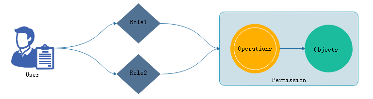
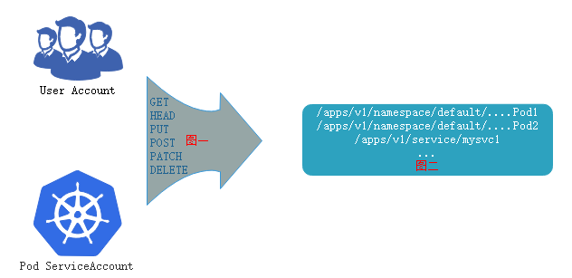
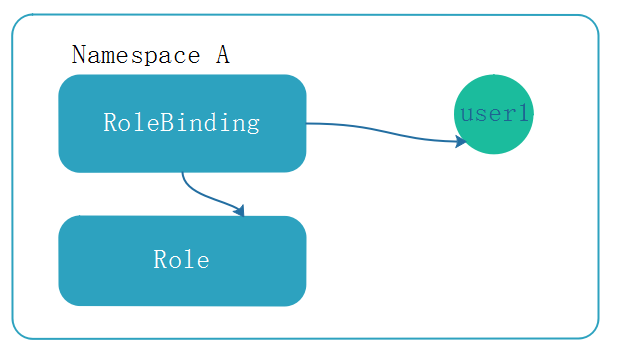
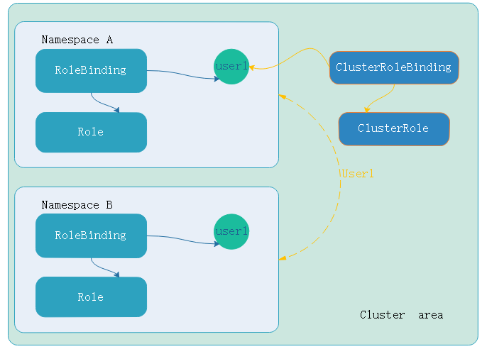
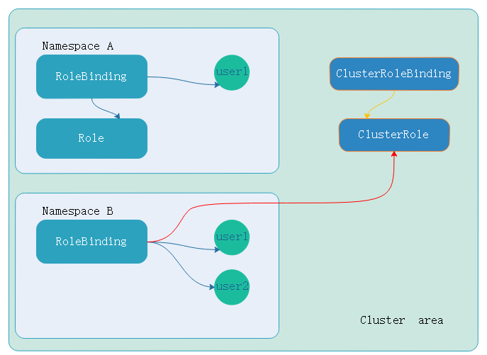

 之前我们知道kubernetes的授权是用插件来实现，并且支持很多插件，并且支持很多插件同时使用，且只要通过其中一个授权检查通过则不会在进行其他插件进行检查，而后由准入控制插件后续检查。

授权插件常用有四个：节点Node，ABAC属性访问控制，RBAC，Webhook回掉机制实现授权、

## RBAC

RBAC的全称是Role-based AC，在kubernetes中RBAC就是定义标准的资源：

- Role: 

operations(许可授权，在其中只要包含在内的写入的都是允许的，不能定义拒绝权限，因为没有就是拒绝权限),objects,

- rolebinding（角色绑定）

将用户(useraccount)或者serviceaccount绑定到那个角色上，让用户扮演那个角色

**其中role和rolebinding有两个级别**

在kubernetes中资源分属两种级别，**集群**和**名称空间**，role和rolebinding是名称空间级别内的许可权限。

基于角色的访问控制，用户作为访问的独立账号，角色(role)是授权机制：授权和许可(permission)

user扮演了角色1就拥有了角色1的权限，所有的授权都添加在角色上，用户扮演的 角色就拥有了角色权限

权限：对于对象，每一个被访问的组件都是对象，在restful 的api当中一切届对象，k8s上运行的组件分为三类， 对象占用了绝大部分，对象列表API，非对象资源，URL。在restful风格中的操作都是指在某个对象施加的(action)某种行为，称之operations。在一个对象上施加过程组合起来称为permissions. 而后可以在role上，授权于role拥有某个许可的权限(permissions)(在某些对象上实现某些操作的权限)。

如果需要使用基于角色访问控制，应该有user,role，permissions，而permissions就需要事先有一些objects，这些objects支持一些operations，这组合在一起就定义成了permissions。授于role，就完成了授权。

能够扮演角色并施加权限的有两个账号，如下：



userAccount和serviceAccount,serviceAccount，这些restful 接口执行类似与GET,PUT等操作，操作对象于位于url路径的对象列表或者一个具体的URL对象。把图一和图二绑定起来permissions，而后授予到角色上，让用户扮演角色，最后完成授权。

除开role和rol ebinding之外，还有两个组件clusterrole，clusetrrolebinding

在名称空间A中定义了角色(role)，角色和user1建立绑定关系(rolebinding)，user1就有了定义的角色(role)权限。user1的这些权限只能在当前名称空间下的所有pod生效。如下：

如果此时user1用户定义的是clusterRole，操作对象还是pod。user1用户和clusterRole建立绑定关系(也就是clusterRoleBinding)，那就会突破名称空间的边界，而是集群级别的权限，生效的范围在整个集群。如下：

那么如果名称空间b中的user1的rolebingding绑定集群级别的ClusterRole(角色)，而不是绑定namespace中的role(角色)，即便如此。权限仍然在namespace中，因为user使用rolebinding绑定的clusterRole，对用户来讲权限就限制在namespace中。这样以来clusterrole权限降级到rolebinding所有权限。如果要对某一个或几个名称空间做用户权限则可以如此。如下：


-  role定义的在那个名称空间，生效范围在那个名称空间

## 创建ROLE

不管是role，rolebinding还是clusterRole，clusterRolebinding都是资源清单中的标准资源
我么可以使用`kubectl create role --help`查看帮助信息
创建role，对pods有get,list权限，使用`-dry-run`运行是否有误
```
[marksugar@linuxea ~]# kubectl create role pods-read --verb=get,list,watch --resource=pods --dry-run
role.rbac.authorization.k8s.io/pods-read created (dry run)
```
甚至于可以使用`-o yaml`输出yaml格式
```
[marksugar@linuxea role]# kubectl create role pods-read --verb=get,list,watch --resource=pods --dry-run -o yaml >> ./role-demo.yaml
```
随后编辑添加上`namespace:default`
```
[marksugar@linuxea role]# cat ./role-demo.yaml 
apiVersion: rbac.authorization.k8s.io/v1
kind: Role
metadata:
  creationTimestamp: null
  name: pods-read
  namespace: default
rules:
- apiGroups:
  - ""
  resources:
  - pods
  verbs:
  - get
  - list
  - watch
```
apply
```
[marksugar@linuxea role]# kubectl apply -f ./role-demo.yaml
role.rbac.authorization.k8s.io/pods-read created
```
```
[marksugar@linuxea role]# kubectl get role
NAME        AGE
pods-read   3s
```
```
[marksugar@linuxea role]# kubectl describe pods-read
error: the server doesn't have a resource type "pods-read"
[marksugar@linuxea role]# kubectl describe role pods-read
Name:         pods-read
Labels:       <none>
Annotations:  kubectl.kubernetes.io/last-applied-configuration={"apiVersion":"rbac.authorization.k8s.io/v1","kind":"Role","metadata":{"annotations":{},"creationTimestamp":null,"name":"pods-read","namespace":"defaul...
PolicyRule:
  Resources  Non-Resource URLs  Resource Names  Verbs
  ---------  -----------------  --------------  -----
  pods       []                 []              [get list watch]
```
其中可以针对某一个资源做限制

objects：`Resources(资源名称)`下的 某个`Resource Name(资源类别)`

`Non-Resource URLs(非资源URL,不能对于成对象的资源，是定义成某种特殊操作)`

```
PolicyRule
Resources  Non-Resource URLs  Resource Names  Verbs
  ---------  -----------------  --------------  -----
  pods       []                 []              [get list watch]
```

此前创建了一个用户linuxea，linuxea用户并没有权限读取pod，此刻让linuxea扮演此role，那么就需要绑定rolebinding

## 创建Rolebinding

而rolebinding可以绑定role和clusterrole，我们选择role绑定，而后指定username或者groupname，如果绑定不是普通账号，而是service账号，就需要指定serviceaccount的名称

现在将之前创建的linxea绑定到pods-read的role上

创建一个叫`linuxea-readpod`的rolebinding，指定上述创建的role名称，绑定到pods-read ，指定--user=linuxea； 这个账号不存在系统上，只是标识

```
[marksugar@linuxea role]# kubectl create rolebinding linuxea-readpod --role=pods-read --user=linuxea --dry-run -o yaml >> ./rolebinding-demo.yaml
```
而在yaml文件定义中明确定义了roleRef的api组，组内的kind类型和名称。用户的api组，和组内的kind和用户名
```
[marksugar@linuxea role]# cat ./rolebinding-demo.yaml
apiVersion: rbac.authorization.k8s.io/v1
kind: RoleBinding
metadata:
  creationTimestamp: null
  name: linuxea-readpod
roleRef:
  apiGroup: rbac.authorization.k8s.io
  kind: Role
  name: pods-read
subjects:
- apiGroup: rbac.authorization.k8s.io
  kind: User
  name: linuxea
```
apply 
```
[marksugar@linuxea role]# kubectl apply -f rolebinding-demo.yaml 
rolebinding.rbac.authorization.k8s.io/linuxea-readpod created
```
```
[marksugar@linuxea role]# kubectl get rolebinding
NAME              AGE
linuxea-readpod   11s
```
```
[marksugar@linuxea role]# kubectl describe rolebinding linuxea-readpod 
Name:         linuxea-readpod
Labels:       <none>
Annotations:  kubectl.kubernetes.io/last-applied-configuration={"apiVersion":"rbac.authorization.k8s.io/v1","kind":"RoleBinding","metadata":{"annotations":{},"creationTimestamp":null,"name":"linuxea-readpod","names...
Role:
  Kind:  Role
  Name:  pods-read
Subjects:
  Kind  Name     Namespace

----  ----     ---------
  User  linuxea  
```

此刻，linuxea用户已经拥有了get,list权限。现在切换到linuxea用户get pods
```
[marksugar@linuxea ~]# kubectl config use-context linuxea@kubernetes
Switched to context "linuxea@kubernetes".
```
在看当前的用户则是`current-context: linuxea@kubernetes`
```
[marksugar@linuxea ~]# kubectl config view
....
- context:
    cluster: kubernetes
    user: linuxea
  name: linuxea@kubernetes
current-context: linuxea@kubernetes
....
```
而后get pods，由于之前对当前名称空的pods有get,list权限，查看是没有问题的
```
[marksugar@linuxea ~]# kubectl get pods
NAME                                   READY     STATUS    RESTARTS   AGE
linuxea-sa-demo                        1/1       Running   0          1d
linuxea-tomcat-group-b77666d76-4h5mz   1/1       Running   0          3d
linuxea-tomcat-group-b77666d76-89qnx   1/1       Running   0          3d
linuxea-tomcat-group-b77666d76-gvm4w   1/1       Running   0          3d
linuxea-tomcat-group-b77666d76-jszbg   1/1       Running   0          3d
linuxea-tomcat-group-b77666d76-l5nkq   1/1       Running   0          3d
linuxea-tomcat-group-b77666d76-lxr8r   1/1       Running   0          3d
linuxea-tomcat-group-b77666d76-m5sxg   1/1       Running   0          3d
satefulset-0                           1/1       Running   0          5d
satefulset-1                           1/1       Running   0          5d
satefulset-2                           1/1       Running   0          5d
satefulset-3                           1/1       Running   0          5d
satefulset-4                           1/1       Running   0          5d
```
其他删除也没权限操作
```
[marksugar@linuxea ~]# kubectl delete pods linuxea-tomcat-group-b77666d76-4h5mz
Error from server (Forbidden): pods "linuxea-tomcat-group-b77666d76-4h5mz" is forbidden: User "linuxea" cannot delete pods in the namespace "default"
```
其他名称空间仍然没有权限
```
[marksugar@linuxea ~]# kubectl get svc
No resources found.
Error from server (Forbidden): services is forbidden: User "linuxea" cannot list services in the namespace "default"
```
```
[marksugar@linuxea ~]# kubectl get pods -n ingress-nginx
No resources found.
Error from server (Forbidden): pods is forbidden: User "linuxea" cannot list pods in the namespace "ingress-nginx"
[marksugar@linuxea ~]# 
```

## 创建Cluster role

回到管理员账号创建clusterrole

```
[marksugar@linuxea ~]# kubectl config use-context kubernetes-admin@kubernetes
Switched to context "kubernetes-admin@kubernetes".
```

将配置追加到`./clusterrole.yaml`中.

创建一个名称为linuxea-cluster-read的clusterrole，权限是list和get，watch。在clusterrole中，授权集群级别

```
[marksugar@linuxea role]#  kubectl create clusterrole linuxea-cluster-read --verb=get,list,watch --resource=pods -o yaml --dry-run >> ./clusterrole.yaml
```

而后apply 

```
[marksugar@linuxea role]# kubectl apply -f clusterrole.yaml 
clusterrole.rbac.authorization.k8s.io/linuxea-cluster-read created
```
使用`kubectl get clusterrole`查看已经被创建的`linuxea-cluster-read`
```
[marksugar@linuxea role]# kubectl get clusterrole
NAME                                                                   AGE
....
linuxea-cluster-read                                                   13m
....
```

现在将linuxea用户绑定到clusterrolebinding上，先将刚才绑定的rolebinding删除

```
[marksugar@linuxea role]# kubectl get rolebinding
NAME              AGE
linuxea-readpod   1h
```

```
[marksugar@linuxea role]# kubectl delete rolebinding linuxea-readpod
rolebinding.rbac.authorization.k8s.io "linuxea-readpod" deleted
```

现在linuxea账号对任何名称空间都没有任何权限。并且已经创建好了cluster role。接着创建clusterrolebinding绑定

## 创建Clusterrolebinding

clusterrolebinding只能绑定clusterrole.

创建一个clusterrolebinding名称为linuxea-cluster-read，名称和clusterrole一样，绑定到clusterrolebinding的linuxea-cluster-read上

```
[marksugar@linuxea role]# kubectl create clusterrolebinding linuxea-cluster-read --clusterrole=linuxea-cluster-read --user=linuxea --dry-run -o yaml >> ./clusterrolebinding.yaml
[marksugar@linuxea role]# cat ./clusterrolebinding.yaml
apiVersion: rbac.authorization.k8s.io/v1beta1
kind: ClusterRoleBinding
metadata:
  creationTimestamp: null
  name: linuxea-cluster-read
roleRef:
  apiGroup: rbac.authorization.k8s.io
  kind: ClusterRole
  name: linuxea-cluster-read
subjects:
- apiGroup: rbac.authorization.k8s.io
  kind: User
  name: linuxea
```

使用`kubectl get clusterrolebinding`查看创建已经完成的`clusterrolebinding`

```
[marksugar@linuxea role]# kubectl get clusterrolebinding
NAME                                                   AGE
.....
linuxea-cluster-read                                   22s
.....
```

查看创建的clusterrolebinding的describe信息

```
[marksugar@linuxea role]# kubectl describe clusterrolebinding linuxea-cluster-read
Name:         linuxea-cluster-read
Labels:       <none>
Annotations:  kubectl.kubernetes.io/last-applied-configuration={"apiVersion":"rbac.authorization.k8s.io/v1beta1","kind":"ClusterRoleBinding","metadata":{"annotations":{},"creationTimestamp":null,"name":"linuxea-clu...
Role:
  Kind:  ClusterRole
  Name:  linuxea-cluster-read
Subjects:
  Kind  Name     Namespace
  ----  ----     ---------
  User  linuxea  
```

而后切换到linuxea用户下，验证下授予的clusterrole权限

```
[marksugar@linuxea role]# kubectl config use-context linuxea@kubernetes
Switched to context "linuxea@kubernetes".
```

之前授权的是名称空间下的pod的list,get

```
[marksugar@linuxea role]# kubectl get pods
NAME                                   READY     STATUS    RESTARTS   AGE
linuxea-sa-demo                        1/1       Running   0          2d
linuxea-tomcat-group-b77666d76-4h5mz   1/1       Running   0          3d
linuxea-tomcat-group-b77666d76-89qnx   1/1       Running   0          3d
linuxea-tomcat-group-b77666d76-gvm4w   1/1       Running   0          3d
linuxea-tomcat-group-b77666d76-jszbg   1/1       Running   0          3d
linuxea-tomcat-group-b77666d76-l5nkq   1/1       Running   0          3d
linuxea-tomcat-group-b77666d76-lxr8r   1/1       Running   0          3d
linuxea-tomcat-group-b77666d76-m5sxg   1/1       Running   0          3d
satefulset-0                           1/1       Running   0          5d
satefulset-1                           1/1       Running   0          5d
satefulset-2                           1/1       Running   0          5d
satefulset-3                           1/1       Running   0          5d
satefulset-4                           1/1       Running   0          5d
```
换名称空间到`pods -n kube-system`
```
[marksugar@linuxea role]# kubectl get pods -n kube-system
NAME                                           READY     STATUS    RESTARTS   AGE
coredns-78fcdf6894-mvdln                       1/1       Running   0          19d
coredns-78fcdf6894-zwqfw                       1/1       Running   0          19d
etcd-linuxea.master-1.com                      1/1       Running   0          19d
kube-apiserver-linuxea.master-1.com            1/1       Running   0          19d
kube-controller-manager-linuxea.master-1.com   1/1       Running   0          19d
kube-flannel-ds-amd64-5swqs                    1/1       Running   0          19d
kube-flannel-ds-amd64-fwzjl                    1/1       Running   0          19d
kube-flannel-ds-amd64-gtqhv                    1/1       Running   0          19d
kube-flannel-ds-amd64-qmhq9                    1/1       Running   0          19d
kube-proxy-64jwb                               1/1       Running   0          19d
kube-proxy-sllmj                               1/1       Running   0          19d
kube-proxy-tzdlj                               1/1       Running   0          19d
kube-proxy-vwtx4                               1/1       Running   0          19d
kube-scheduler-linuxea.master-1.com            1/1       Running   0          19d
```
或者名称空间`ingress-nginx`
```
[marksugar@linuxea role]# kubectl get pods -n ingress-nginx
NAME                                        READY     STATUS    RESTARTS   AGE
default-http-backend-6586bc58b6-n9qbt       1/1       Running   0          19d
nginx-ingress-controller-6bd7c597cb-krz4m   1/1       Running   0          19d
```

当然，除了授权的list,get之外，其他没授权的都是拒绝的，也就是说没有权限的

```
[marksugar@linuxea role]# kubectl delete pods kube-flannel-ds-amd64-qmhq9
Error from server (Forbidden): pods "kube-flannel-ds-amd64-qmhq9" is forbidden: User "linuxea" cannot delete pods in the namespace "default"
```

## 交叉绑定

上述绑定都是role绑定rolebinding，clusterrole绑定clusterrolebinding，现在使用rolebinding绑定clusterrole，这样以来权限就会降级到rolebinding所在的权限

- 我们想切换到kubernetes-admin用户下

```
[marksugar@linuxea role]# kubectl config use-context kubernetes-admin@kubernetes
Switched to context "kubernetes-admin@kubernetes".
```

上面创建的clusterrole的权限是list,get， 这些权限是集群级别的，也就是说所有的namespace都有给的get和list权限

此时，我们使用rolebinding绑定clusterrole，clusterrole的名称是linuxea-cluster-read。需要说明的是，此前的创建的pods-read只针对当前名称空间有list和get权限。如此此时clusterrole与rolebinding绑定，最终降级到是role角色的名称空间内的get，list权限。

```
[marksugar@linuxea role]# kubectl create rolebinding pods-read --clusterrole=linuxea-cluster-read --user=linuxea --dry-run -o yaml >> ./role-clusterrole.yaml
```
如下： `kind: RoleBinding`,但是roleRef的kind是ClusterRole
```
[marksugar@linuxea role]# cat ./role-clusterrole.yaml
apiVersion: rbac.authorization.k8s.io/v1
kind: RoleBinding
metadata:
  creationTimestamp: null
  name: pods-read
  namespace: default
roleRef:
  apiGroup: rbac.authorization.k8s.io
  kind: ClusterRole
  name: linuxea-cluster-read
subjects:
- apiGroup: rbac.authorization.k8s.io
  kind: User
  name: linuxea
```
为了避免权限重叠，将之前创建的clusterrolebinding删除
```
[marksugar@linuxea role]# kubectl delete clusterrolebinding linuxea-cluster-read
clusterrolebinding.rbac.authorization.k8s.io "linuxea-cluster-read" deleted
```
而后`apply -f role-clusterrole.yaml`
```
[marksugar@linuxea role]# kubectl apply -f ./role-clusterrole.yaml
rolebinding.rbac.authorization.k8s.io/pods-read created
```
```
[marksugar@linuxea role]# kubectl describe rolebinding pods-read
Name:         pods-read
Labels:       <none>
Annotations:  kubectl.kubernetes.io/last-applied-configuration={"apiVersion":"rbac.authorization.k8s.io/v1","kind":"RoleBinding","metadata":{"annotations":{},"name":"pods-read","namespace":"default"},"roleRef":{"ap...
Role:
  Kind:  ClusterRole
  Name:  linuxea-cluster-read
Subjects:
  Kind  Name     Namespace
  ----  ----     ---------
  User  linuxea  
```
切换到linuxea用户验证下权限
```
[marksugar@linuxea ~]# kubectl config use-context linuxea@kubernetes
Switched to context "linuxea@kubernetes".
```
此前的role角色权限是list，也就是说定义在namespace中，只有pods的list，get权限.
那么是没有其他namespace的权限

```
[marksugar@linuxea ~]# kubectl get pods -n ingress-nginx
No resources found.
Error from server (Forbidden): pods is forbidden: User "linuxea" cannot list pods in the namespace "ingress-nginx"
```
pod是可以进行get的
```
[marksugar@linuxea ~]# kubectl get pods
NAME                                   READY     STATUS    RESTARTS   AGE
linuxea-sa-demo                        1/1       Running   0          2d
linuxea-tomcat-group-b77666d76-4h5mz   1/1       Running   0          3d
linuxea-tomcat-group-b77666d76-89qnx   1/1       Running   0          3d
linuxea-tomcat-group-b77666d76-gvm4w   1/1       Running   0          3d
linuxea-tomcat-group-b77666d76-jszbg   1/1       Running   0          3d
linuxea-tomcat-group-b77666d76-l5nkq   1/1       Running   0          3d
linuxea-tomcat-group-b77666d76-lxr8r   1/1       Running   0          3d
linuxea-tomcat-group-b77666d76-m5sxg   1/1       Running   0          3d
satefulset-0                           1/1       Running   0          5d
satefulset-1                           1/1       Running   0          5d
satefulset-2                           1/1       Running   0          5d
satefulset-3                           1/1       Running   0          5d
satefulset-4                           1/1       Running   0          5d
[marksugar@linuxea ~]# 
```
## 绑定内置Role
内置的role有很多，其中包含有admin，尝试将linuxea绑定到admin
```
[marksugar@linuxea ~]# kubectl get clusterrole
NAME                                                                   AGE
admin                                                                  19d
```
admin的角色有很多，不一 一列举,可以查看这个文件
```
[marksugar@linuxea ~]# kubectl get clusterrole admin -o yaml >> /admin.yaml
[marksugar@linuxea ~]# cat /admin.yaml
aggregationRule:
  clusterRoleSelectors:
  - matchLabels:
      rbac.authorization.k8s.io/aggregate-to-admin: "true"
apiVersion: rbac.authorization.k8s.io/v1
kind: ClusterRole
metadata:
  annotations:
    rbac.authorization.kubernetes.io/autoupdate: "true"
  creationTimestamp: 2018-09-16T05:56:16Z
  labels:
    kubernetes.io/bootstrapping: rbac-defaults
  name: admin
  resourceVersion: "350"
  selfLink: /apis/rbac.authorization.k8s.io/v1/clusterroles/admin
  uid: 39a45e55-b975-11e8-a8ab-88882fbd1028
................  
```
直接绑定到linuxea用户上

```
[marksugar@linuxea ~]# kubectl create rolebinding linuxea-admin --clusterrole=admin --user=linuxea
rolebinding.rbac.authorization.k8s.io/linuxea-admin created
```
```
[marksugar@linuxea ~]# kubectl get rolebinding
NAME            AGE
linuxea-admin   8s
pods-read       3h
```
```
[marksugar@linuxea ~]# kubectl describe rolebinding linuxea-admin
Name:         linuxea-admin
Labels:       <none>
Annotations:  <none>
Role:
  Kind:  ClusterRole
  Name:  admin
Subjects:
  Kind  Name     Namespace
  ----  ----     ---------
  User  linuxea 
```

切换到linuxea用户下

```
[marksugar@linuxea ~]# kubectl config use-context linuxea@kubernetes
Switched to context "linuxea@kubernetes".
```

验证是否具有admin的角色权限

```
[marksugar@linuxea ~]# kubectl get pods
NAME                                   READY     STATUS    RESTARTS   AGE
linuxea-sa-demo                        1/1       Running   0          2d
linuxea-tomcat-group-b77666d76-4h5mz   1/1       Running   0          4d
linuxea-tomcat-group-b77666d76-89qnx   1/1       Running   0          4d
linuxea-tomcat-group-b77666d76-gvm4w   1/1       Running   0          4d
linuxea-tomcat-group-b77666d76-jszbg   1/1       Running   0          4d
linuxea-tomcat-group-b77666d76-l5nkq   1/1       Running   0          4d
linuxea-tomcat-group-b77666d76-lxr8r   1/1       Running   0          4d
linuxea-tomcat-group-b77666d76-m5sxg   1/1       Running   0          4d
satefulset-0                           1/1       Running   0          5d
satefulset-1                           1/1       Running   0          5d
satefulset-2                           1/1       Running   0          5d
satefulset-3                           1/1       Running   0          5d
satefulset-4                           1/1       Running   0          5d
```
```
[marksugar@linuxea ~]# kubectl get svc
NAME                 TYPE        CLUSTER-IP      EXTERNAL-IP   PORT(S)             AGE
kubernetes           ClusterIP   10.96.0.1       <none>        443/TCP             19d
linuxea-tomcat       ClusterIP   10.97.191.185   <none>        8080/TCP,8009/TCP   4d
satefulset-linuxea   ClusterIP   None            <none>        80/TCP              5d
```
```
[marksugar@linuxea ~]# kubectl get deploy
NAME                   DESIRED   CURRENT   UP-TO-DATE   AVAILABLE   AGE
linuxea-tomcat-group   7         7         7            7           4d
```
```
[marksugar@linuxea ~]# kubectl delete pods linuxea-tomcat-group-b77666d76-4h5mz
pod "linuxea-tomcat-group-b77666d76-4h5mz" deleted
```
```
[marksugar@linuxea ~]# kubectl get pods
NAME                                   READY     STATUS    RESTARTS   AGE
linuxea-sa-demo                        1/1       Running   0          2d
linuxea-tomcat-group-b77666d76-89qnx   1/1       Running   0          4d
linuxea-tomcat-group-b77666d76-fj2rk   1/1       Running   0          6s
linuxea-tomcat-group-b77666d76-gvm4w   1/1       Running   0          4d
linuxea-tomcat-group-b77666d76-jszbg   1/1       Running   0          4d
linuxea-tomcat-group-b77666d76-l5nkq   1/1       Running   0          4d
linuxea-tomcat-group-b77666d76-lxr8r   1/1       Running   0          4d
linuxea-tomcat-group-b77666d76-m5sxg   1/1       Running   0          4d
satefulset-0                           1/1       Running   0          5d
satefulset-1                           1/1       Running   0          5d
satefulset-2                           1/1       Running   0          5d
satefulset-3                           1/1       Running   0          5d
satefulset-4                           1/1       Running   0          5d
[marksugar@linuxea ~]# 
```

尽管如此，他是没有管理其他的namespace中的权限

```
[marksugar@linuxea ~]# kubectl get pods -n kube-system
No resources found.
Error from server (Forbidden): pods is forbidden: User "linuxea" cannot list pods in the namespace "kube-system"
```

## 内置Rolebinding

我们切换回kubernetes-admin

```
[marksugar@linuxea ~]# kubectl config use-context kubernetes-admin@kubernetes
Switched to context "kubernetes-admin@kubernetes".
```
在内置Rolebinding中已经有绑定admin的clusterrolebinding，cluster-admin    
```
[marksugar@linuxea ~]# kubectl get clusterrolebinding
NAME                                                   AGE
cluster-admin                                          19d
```

使用`-o yaml`查看describe信息

```
[marksugar@linuxea ~]# kubectl get clusterrolebinding cluster-admin -o yaml
apiVersion: rbac.authorization.k8s.io/v1
kind: ClusterRoleBinding
metadata:
  annotations:
    rbac.authorization.kubernetes.io/autoupdate: "true"
  creationTimestamp: 2018-09-16T05:56:16Z
  labels:
    kubernetes.io/bootstrapping: rbac-defaults
  name: cluster-admin
  resourceVersion: "110"
  selfLink: /apis/rbac.authorization.k8s.io/v1/clusterrolebindings/cluster-admin
  uid: 39d1bdfd-b975-11e8-a8ab-88882fbd1028
roleRef:
  apiGroup: rbac.authorization.k8s.io
  kind: ClusterRole
  name: cluster-admin
subjects:
- apiGroup: rbac.authorization.k8s.io
  kind: Group
  name: system:masters
```

 其中在system:masters组中有kubernetes-admin用户，kubetnetes-admin在pki中的CRT文件的cn对应就是`kube-apiserver-kubelet-client`，可以使用openssl查看crt文件

```
[marksugar@linuxea ~]# openssl x509 -in /etc/kubernetes/pki/apiserver-kubelet-client.crt -text -noout
Certificate:
    Data:
        Version: 3 (0x2)
        Serial Number: 8110592987322906857 (0x708e9d59a727f8e9)
    Signature Algorithm: sha256WithRSAEncryption
        Issuer: CN=kubernetes
        Validity
            Not Before: Sep 16 05:55:34 2018 GMT
            Not After : Sep 16 05:55:35 2019 GMT
        Subject: O=system:masters, CN=kube-apiserver-kubelet-client
        Subject Public Key Info:
            Public Key Algorithm: rsaEncryption
                Public-Key: (2048 bit)
                Modulus:
```

如果此时在创建用户或者授权时候，可以`O=system:masters`将用户绑定到admin组

在RBAC上授权时候，允许存在三类组件，分别是user,group以及serviceAccount

user可以绑定在group,role,serviceaccount。如果绑定在用户上，则只是授权在一个用户上，绑定在组，则组内用户都有这个权限，如果多个用户有同样的权限，可以授权成一个组。

如果serviceAccount与role或者clusterrole绑定，则意味着serviceAccount有访问权限，并且在serviceAccountName使用了这个serviceAccount的name，那么在service内的pod中的应用程序就有了serviceAccount的权限.

并且，在一些pod运行的时候就需要这种权限来以便于操作，如flannel，在github上有[flannel的yml文件](https://raw.githubusercontent.com/coreos/flannel/master/Documentation/kube-flannel.yml)文件以供参考

```
[marksugar@linuxea ~]# kubectl get pods -n kube-system
NAME                                           READY     STATUS    RESTARTS   AGE
...
kube-flannel-ds-amd64-5swqs                    1/1       Running   0          19d
...
```

可以查看`kube-flannel-ds-amd64-5swqs`yaml文件

```
[marksugar@linuxea ~]# kubectl get pods kube-flannel-ds-amd64-5swqs -o yaml -n kube-system
```

