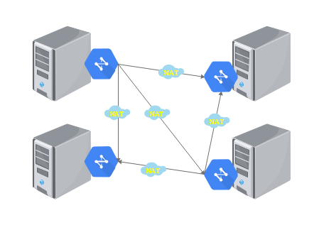
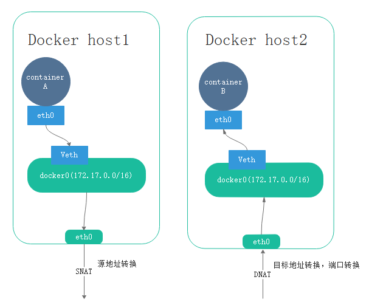
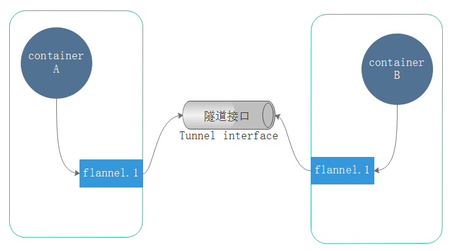
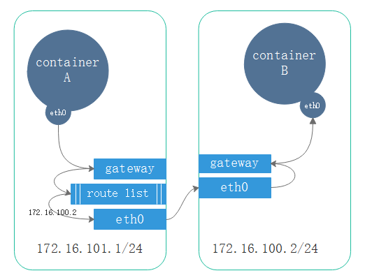
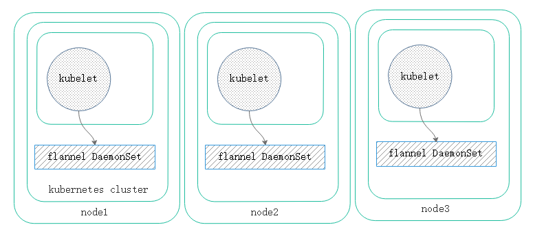
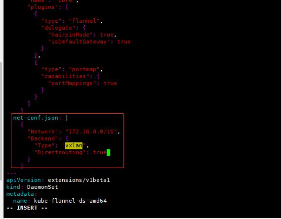

我们知道docker有四种网络模型，bridge(桥接)，joincd(联盟式)，open(开发式)，none(不适用任何网络模式)，那么，不管使用那种网络模式，在跨节点访问的时候都需要NAT机制来实现。
## docker网络通信


任何一个pod(pod的ip是私有地址)在离开本机时候都需要做源地址转换，确保能够携物理地址向外转发，如下：

containerA具有虚拟的eth0网卡，另外veth一边关联到宿主机的docker0网卡上，container1会获取到一个172.16.0.0/16网段的一个ip地址。通过打开转发，这个ip通过宿主机的eth0可以访问外部网络资源。为了确保响应报文能够顺利送回本机，就需要报文在离开本机时候做源地址转换。

comtainerB想要被别的主机访问到，就需要在宿主机物理接口做DNAT，将服务暴露。对于客户端来讲，访问的是eth0接口，而后由eth0做目标地址转换comtainerB的eth0地址上来。

如果containerA与comtainerB通信，那就需两级转换，containerA离开host1的eth0就需要做SNAT，而后报文经过物理网络发送至host2的eth0，在做一次DNAT到containerB。containerB响应报文也是如此，先从本机SNAT出，到host1做DNAT到containerA。这个SNAT和DNAT过程是自动实现的，也是比不可少的，并且双方只通过宿主机的ip和端口访问，并不知道访问的对端到底是谁。这种方式的网络效率较低，且不能满足我们想要的网络模型

## kubernetes网络通信
而kubernetes本身运行多个pod管理编排，就必须要解决这种网络问题。并且各个pod之间必须进行通信，大致存在一下几种：
- 容器间通信，pod内的多个容器间通信，如：log
- pod通信，pod与pod通信的网络直达，且均使用各自的pod ip，不经过任何地址转换
- pod与service通信，pod ip到service 的cluster ip通信(依赖于iptables或者ipvs)
**ipvs仅作为负载均衡，但是无法做nat转换。iptables则用来做nat转换等功能**
- service与集群外部客户端的通信，如ingress,nodeport等

kuberntes的网络自己并不实现，依靠CNI接口的网络插件来接入使用满足以上几点的kubernetes的网络通信需求

其中有，flannel,canel,kube-router等。

- 虚拟网桥

通过软件的方式实现虚拟网桥，虚拟网卡链接每一个pod网络都有专用的网络接口。每一对网卡，一端pod,一段宿主机之上并接入网桥，以及物理网桥使用

- 多路复用

使用macVlan，基于mac创建vlan，为每个虚拟接口配置一个独有的mac地址，使一个物理网卡能承载多个容器使用。使用物理网卡，并基于物理网卡的macvlan机制进行跨节点之间通讯

- 硬件交换

使用SR-IOV，一个网卡支持在物理机虚拟出多个接口。称为单根I/O 虚拟化，单根I/O 虚拟化是创建虚拟设备很高性能的方式。一块物理网卡，虚拟硬件级别的多个网卡。

如果要使用CNI插件。对于kubeclt来讲，只需要通过/etc/cni/net.d/目录加载配置文件，因此将配置文件放在此目录即可加载。基本格式如下：

```
[marksugar@linuxea ~]# cat /etc/cni/net.d/10-flannel.conflist 
{
  "name": "cbr0",
  "plugins": [
    {
      "type": "flannel",
      "delegate": {
        "hairpinMode": true,
        "isDefaultGateway": true
      }
    },
    {
      "type": "portmap",
      "capabilities": {
        "portMappings": true
      }
    }
  ]
}
```

这是一个叠加网络，且支持端口映射。其他的网络模式的配置文件也可放在此目录，就会被kubelet加载，并且必要时会创建一个pod，调用/etc/cni/net.d/下的插件的配置文件替代kubernetes生成接口，网络创建管理等功能。

在kubernetes中网络插件不仅仅为了实现网络分配，管理，更要实现网络策略，也就是说pod与pod中间可以被设置不能够互相访问，而flannel则不能支持网络策略。但是flannel部署简单，相对于flannel，calico部署更麻烦，不过calico不但支持网络分配和管理，更支持网络策略，并且支持BGP的方式支持二层转发三层路由功能，因此在性能上稍强。

并且，flannel的配置上非常简单的，我们可以使用flannel做网络分配和管理，而用calico来做网络策略分配

## flannel vxlan

flannel基于[vxlan](https://en.wikipedia.org/wiki/Virtual_Extensible_LAN)(扩展的局域网)，正常情况下两个pod自己桥接通讯就能基于物理网卡通讯。那么现在是叠加网络，在双方通讯的过程中都会在主机上封装一个叠加网络报文的隧道，通过此隧道进行通信。如下：



因此有额外的预留开销给隧道，所以的他的mtu是1450，而物理网卡的mtu是1500。

```
[marksugar@linuxea ~]# ip a
5: flannel.1: <BROADCAST,MULTICAST,UP,LOWER_UP> mtu 1450 qdisc noqueue state UNKNOWN group default 
    link/ether 82:4f:25:3e:c1:36 brd ff:ff:ff:ff:ff:ff
    inet 172.16.0.0/32 scope global flannel.1
       valid_lft forever preferred_lft forever
    inet6 fe80::804f:25ff:fe3e:c136/64 scope link 
       valid_lft forever preferred_lft forever
```

另外还有一个cnio的172.16.0.1被当前主机作为隧道协议的本地通信的接口。当创建pod后此接口就出现

```
6: cni0: <BROADCAST,MULTICAST,UP,LOWER_UP> mtu 1450 qdisc noqueue state UP group default qlen 1000
    link/ether 0a:58:ac:10:00:01 brd ff:ff:ff:ff:ff:ff
    inet 1 72.16.0.1/24 scope global cni0
       valid_lft forever preferred_lft forever
    inet6 fe80::e8e0:1aff:fe5b:9240/64 scope link 
       valid_lft forever preferred_lft forever
```

## flannel host-gw

host-gateway(主机网关)

对于每个节点的的pod都有一个各自的网段，并且把所在主机的网络接口当作网关使用，从而与接口和pod之间各自配置ip地址，并通过网关向外传输通讯

当向外传递时，先查看目标地址是否是本地，如果不是就转交给网关，到达网关后会查询本地的路由条目，路由条目中记录了到达主机的ip，而后经过物理网卡发送到目标主机物理网卡。如下：


报文经过路由表中的条目路由就到达主机，把主机本身节点当作网关，这样一来那么随着pod的增多，路由表中的路由条目会很大，而这种两层路由的方式将会比vxlan性能要好很多，但是默认并没使用这种方式。

当然，这种方式的缺陷在于各节点的ip必须工作在同一个二层网络之中，也就是说必须在同一个网段内。

- 所谓的二层网络，是不经过物理路由转发，且虚拟网络间路由。倘若此时在大型复杂网络中，多网络间的kubernetes集群，host-gw就不能被使用

## flannel directrouting

上述，vxlan和host-gw都各有特点，vxlan有单独的隧道接口方式可以让不同网络中的pod互通，host-gw可以使同网络层中的ip走路由条目快速转发通信。此时若想使用vxlan并且仍然使用host-gw，那么可以尝试flannel的第二种网络directorouting(路由转发)，相比较flannel第一种方式vxlan，directorouting要灵活很多。

如果源ip和目标ip在一个三层网络中直接使用host-gw，如果源ip和目标ip不再同一个网络中就是用vxlan(叠加隧道通信)，这就是flannel的第二种网络模式：directorouting 。如下：


另外还有udp方式，在最早的是时候被采用。这种方式效率很低，可做最后的方式使用。

## 定义flannel

定义的配置也是json格式，我们可以使用directorouting，能够路由则进行路由，不能路由则使用隧道转发

flannel运行在configmap的kube-system名称空间中

```
[marksugar@linuxea flannel]# kubectl get configmap -n kube-system 
NAME                                 DATA      AGE
coredns                              1         25d
extension-apiserver-authentication   6         25d
kube-flannel-cfg                     2         25d
kube-proxy                           2         25d
kubeadm-config                       1         25d
kubelet-config-1.11                  1         25d
kubernetes-dashboard-settings        1         4d
```

- flannel本身和kubernetes没有什么关系，flannel以一个插件的形式运行在kubernetes之上，为了能够运行，flannel事先需要存在。并且任何一个kubelet的节点都需要部署flannel，kubelet需要借助flannel为pod设置网络接口，添加激活等。flannel支持部署成守护进程，也支持部署为kuberntes上的pod，对于部署成pod来讲，flannel以[DaemonSet](https://www.linuxea.com/1961.html)的方式部署，并且直接共享宿主机的网络名称空间的pod，从而设置配置虚拟网络，桥等。如果将flannel托管运行在kuberntes之上作为pod运行的话，尽管表现的是pod，但是仍然模拟了系统级别的守护进程的方式运行。


我们使用kubeadm部署的k8s，所有组件都是运行为pod状态，flannel作为daemonset方式运行，使用`kubectl get daemonset -n kube-system`查看，由于系统都是amd64位，只有`kube-flannel-ds-amd64`有运行4个，也就意味着集群中有4个节点

```
[marksugar@linuxea flannel]# kubectl get daemonset -n kube-system
NAME                      DESIRED   CURRENT   READY     UP-TO-DATE   AVAILABLE   NODE SELECTOR                     AGE
kube-flannel-ds-amd64     4         4         4         4            4           beta.kubernetes.io/arch=amd64     25d
kube-flannel-ds-arm       0         0         0         0            0           beta.kubernetes.io/arch=arm       25d
kube-flannel-ds-arm64     0         0         0         0            0           beta.kubernetes.io/arch=arm64     25d
kube-flannel-ds-ppc64le   0         0         0         0            0           beta.kubernetes.io/arch=ppc64le   25d
kube-flannel-ds-s390x     0         0         0         0            0           beta.kubernetes.io/arch=s390x     25d
kube-proxy                4         4         4         4            4           beta.kubernetes.io/arch=amd64     25d
```

并且，kubectl的节点都会部署一个flannel，包括master节点

```
[marksugar@linuxea flannel]# kubectl get pods -n kube-system -o wide
NAME                                           READY     STATUS    RESTARTS   AGE       IP              NODE                   NOMINATED NODE
kube-controller-manager-linuxea.master-1.com   1/1       Running   0          25d       10.10.240.161   linuxea.master-1.com   <none>
kube-flannel-ds-amd64-5swqs                    1/1       Running   0          25d       10.10.240.202   linuxea.node-1.com     <none>
kube-flannel-ds-amd64-fwzjl                    1/1       Running   0          25d       10.10.240.146   linuxea.node-3.com     <none>
kube-flannel-ds-amd64-gtqhv                    1/1       Running   0          25d       10.10.240.161   linuxea.master-1.com   <none>
kube-flannel-ds-amd64-qmhq9                    1/1       Running   0          25d       10.10.240.203   linuxea.node-2.com     <none>
```

有一个专用的configmap来配置flannel

```
[marksugar@linuxea flannel]# kubectl get configmap -n kube-system
NAME                                 DATA      AGE
kube-flannel-cfg                     2         25d
```

并且是使用vxlan的方式，（手动进行了排序）

```
[marksugar@linuxea flannel]# kubectl get configmap kube-flannel-cfg -n kube-system -o jsonpath={.metadata.annotations}
map[kubectl.kubernetes.io/last-applied-configuration:{
	"apiVersion":"v1","data":{
		"cni-conf.json":"{
			"name": "cbr0",
			"plugins": [{
				"type": "flannel",
				"delegate\": {
					"hairpinMode\": true,
					"isDefaultGateway\": true
					}
					},
					{
						"type": \"portmap\",
						"capabilities\": {
							"portMappings\": true
							}
					}
					]
					}",
		"net-conf.json":"{
			"Network\": \"172.16.0.0/16\",
			"Backend\": {
				"Type\": \"vxlan\"
				}}"},
				"kind":"ConfigMap","metadata":{"annotations":{},"labels":{"app":"flannel","tier":"node"},"name":"kube-flannel-cfg","namespace":"kube-system"}}
```


常用配置参数如下：

- Network: 定义ip端 ，如： 172.16.0.0/16

- SubnetLen: 将网段切分子网给节点使用多长的掩码切分，取决于运行的数量。默认24位。

- SubnetMin: 限制子网的起始的第一个子网端。如：172.16.10.0/24范围内

- SubnetMax:  限制子网的结束的最后一个子网端。如：172.16.12.0/24范围内

- Backend：指明通讯方式，vxlan，host-gw，udp

在配置directorouting之前，我们先查看下vxlan的之间的通讯过程。

### vxlan转发

现在的三个pod分别在不同的node节点

```
[marksugar@linuxea ~]# kubectl get pods -o wide
satefulset-2                           1/1       Running   0          12d       172.16.4.14    linuxea.node-2.com   <none>
satefulset-3                           1/1       Running   0          12d       172.16.3.45    linuxea.node-1.com   <none>
satefulset-4                           1/1       Running   0          12d       172.16.5.119   linuxea.node-3.com   <none>
```

此时，我们在node2上与node1进行通讯

```
[marksugar@linuxea ~]# kubectl exec -it satefulset-2 -- /bin/sh
/ # ping 172.16.3.45
PING 172.16.3.45 (172.16.3.45): 56 data bytes
64 bytes from 172.16.3.45: seq=0 ttl=62 time=1.239 ms
64 bytes from 172.16.3.45: seq=1 ttl=62 time=0.377 ms
64 bytes from 172.16.3.45: seq=2 ttl=62 time=0.574 ms
64 bytes from 172.16.3.45: seq=3 ttl=62 time=0.583 ms
```

在到node1节点抓cni0或者flannel.1的包，从`172.16.4.14 > 172.16.3.45`是直接进行通讯，可见在flannel.1和cni0接口时还尚未被转成vxlan

```
[marksugar@DS-VM-Node_10_10_240_202 ~]# tcpdump -i cni0 icmp
tcpdump: verbose output suppressed, use -v or -vv for full protocol decode
listening on cni0, link-type EN10MB (Ethernet), capture size 262144 bytes
14:15:58.935242 IP 172.16.4.14 > 172.16.3.45: ICMP echo request, id 8192, seq 0, length 64
14:15:58.935278 IP 172.16.3.45 > 172.16.4.14: ICMP echo reply, id 8192, seq 0, length 64
14:15:59.935675 IP 172.16.4.14 > 172.16.3.45: ICMP echo request, id 8192, seq 1, length 64
14:15:59.935733 IP 172.16.3.45 > 172.16.4.14: ICMP echo reply, id 8192, seq 1, length 64
14:16:00.935770 IP 172.16.4.14 > 172.16.3.45: ICMP echo request, id 8192, seq 2, length 64
```

或者直接抓flannel.1

```
[marksugar@DS-VM-Node_10_10_240_202 ~]# tcpdump -i flannel.1 -nn
tcpdump: verbose output suppressed, use -v or -vv for full protocol decode
listening on flannel.1, link-type EN10MB (Ethernet), capture size 262144 bytes
14:22:48.289532 IP 172.16.4.14 > 172.16.3.45: ICMP echo request, id 8704, seq 52, length 64
14:22:48.289590 IP 172.16.3.45 > 172.16.4.14: ICMP echo reply, id 8704, seq 52, length 64
14:22:49.289595 IP 172.16.4.14 > 172.16.3.45: ICMP echo request, id 8704, seq 53, length 64
```

抓eth0物理接口的包，可见` 172.16.4.14 > 172.16.3.45`的icmp报文，并且存在`overlay`字段，这便是隧道转发

```
[marksugar@DS-VM-Node_10_10_240_202 ~]# tcpdump -i eth0 -nn host 10.10.240.203
tcpdump: verbose output suppressed, use -v or -vv for full protocol decode
listening on eth0, link-type EN10MB (Ethernet), capture size 262144 bytes
14:30:58.369661 IP 10.10.240.203.9697 > 10.10.240.202.8472: OTV, flags [I] (0x08), overlay 0, instance 1
IP 172.16.4.14 > 172.16.3.45: ICMP echo request, id 8704, seq 542, length 64
14:30:58.369740 IP 10.10.240.202.43591 > 10.10.240.203.8472: OTV, flags [I] (0x08), overlay 0, instance 1
IP 172.16.3.45 > 172.16.4.14: ICMP echo reply, id 8704, seq 542, length 64
14:30:59.370155 IP 10.10.240.203.9697 > 10.10.240.202.8472: OTV, flags [I] (0x08), overlay 0, instance 1
IP 172.16.4.14 > 172.16.3.45: ICMP echo request, id 8704, seq 543, length 64
14:30:59.370239 IP 10.10.240.202.43591 > 10.10.240.203.8472: OTV, flags [I] (0x08), overlay 0, instance 1
IP 172.16.3.45 > 172.16.4.14: ICMP echo reply, id 8704, seq 543, length 64
```

- 补充

此前，我们知道cnio的172.16.3.1被当前主机作为隧道协议的本地通信的接口。当创建pod后此接口就出现。安装` yum install bridge-utils`

我们在node节点查看，如下：

```
[marksugar@DS-VM-Node_10_10_240_202 ~]#  ip a
6: cni0: <BROADCAST,MULTICAST,UP,LOWER_UP> mtu 1450 qdisc noqueue state UP group default qlen 1000
    link/ether 0a:58:ac:10:03:01 brd ff:ff:ff:ff:ff:ff
    inet 172.16.3.1/24 scope global cni0
       valid_lft forever preferred_lft forever
    inet6 fe80::882c:bff:fe2b:7d1c/64 scope link 
       valid_lft forever preferred_lft forever
40: vethff44d0d4@if3: <BROADCAST,MULTICAST,UP,LOWER_UP> mtu 1450 qdisc noqueue master cni0 state UP group default 
    link/ether 12:ca:aa:c9:20:40 brd ff:ff:ff:ff:ff:ff link-netnsid 1
    inet6 fe80::10ca:aaff:fec9:2040/64 scope link 
       valid_lft forever preferred_lft forever
41: veth6950f86e@if3: <BROADCAST,MULTICAST,UP,LOWER_UP> mtu 1450 qdisc noqueue master cni0 state UP group default 
    link/ether b2:cc:17:b2:72:02 brd ff:ff:ff:ff:ff:ff link-netnsid 0
    inet6 fe80::b0cc:17ff:feb2:7202/64 scope link 
       valid_lft forever preferred_lft forever
46: veth70f4948e@if3: <BROADCAST,MULTICAST,UP,LOWER_UP> mtu 1450 qdisc noqueue master cni0 state UP group default 
    link/ether 0a:31:f6:8b:be:24 brd ff:ff:ff:ff:ff:ff link-netnsid 2
    inet6 fe80::831:f6ff:fe8b:be24/64 scope link 
       valid_lft forever preferred_lft forever
47: veth1b79d0e3@if3: <BROADCAST,MULTICAST,UP,LOWER_UP> mtu 1450 qdisc noqueue master cni0 state UP group default 
    link/ether 8e:bb:4b:aa:09:6f brd ff:ff:ff:ff:ff:ff link-netnsid 3
    inet6 fe80::8cbb:4bff:feaa:96f/64 scope link 
       valid_lft forever preferred_lft forever
```

show 查看cni0的网桥接口，`veth0583b6ee`和`vethe7329d65`都将桥接到cni0

```
[marksugar@DS-VM-Node_10_10_240_202 ~]#  brctl show cni0
bridge name	bridge id		STP enabled	interfaces
cni0		8000.0a58ac100301	no		veth1b79d0e3
                                		veth6950f86e
                                		veth70f4948e
                                		vethff44d0d4
```

## 定义directrouting

在开始集群之前最好就应该设计好网络模式，当pod规模变大之后网络会怎么样，这不好预测。如果半道要修改flannel的网络类型，就需要重新启动flannel，这就意味着集群内的所有pod将会短暂性的无法工作。且不管是修改vxlan的directrouting还是host-gw！

下载kube-flannel.yml修改

```
wget https://raw.githubusercontent.com/coreos/flannel/master/Documentation/kube-flannel.yml
```

而后添加` "Directrouting": true`

```
  net-conf.json: |
    {
      "Network": "172.16.0.0/16",
      "Backend": {
        "Type": "vxlan",
        "Directrouting": true
      }
    }
---
```


修改完成后，删除之前的kube-flannel.yml ，重新应用

在删除之前，我们可以查看下ip route show，ip转发到flannel。而后创建完成就会变成物理的网卡

```
[marksugar@linuxea flannel]# ip route show
default via 10.0.0.1 dev eth0 
10.0.0.0/8 dev eth1 proto kernel scope link src 10.0.1.215 
10.0.0.0/8 dev eth0 proto kernel scope link src 10.10.240.161 
172.16.0.0/24 dev cni0 proto kernel scope link src 172.16.0.1 
172.16.3.0/24 via 172.16.3.0 dev flannel.1 onlink 
172.16.4.0/24 via 172.16.4.0 dev flannel.1 onlink 
172.16.5.0/24 via 172.16.5.0 dev flannel.1 onlink 
172.17.0.0/16 dev docker0 proto kernel scope link src 172.17.0.1 
```

- 开始删除掉此前没有修改的kube-flannel

等待flannle删除完成

```
[marksugar@linuxea ~]# kubectl delete -f kube-flannel.yml 
clusterrole.rbac.authorization.k8s.io "flannel" deleted
clusterrolebinding.rbac.authorization.k8s.io "flannel" deleted
serviceaccount "flannel" deleted
configmap "kube-flannel-cfg" deleted
daemonset.extensions "kube-flannel-ds-amd64" deleted
daemonset.extensions "kube-flannel-ds-arm64" deleted
daemonset.extensions "kube-flannel-ds-arm" deleted
daemonset.extensions "kube-flannel-ds-ppc64le" deleted
daemonset.extensions "kube-flannel-ds-s390x" deleted
```
删除完成后进行创建
```
[marksugar@linuxea ~]# kubectl apply -f kube-flannel.yml 
clusterrole.rbac.authorization.k8s.io/flannel created
clusterrolebinding.rbac.authorization.k8s.io/flannel created
serviceaccount/flannel created
configmap/kube-flannel-cfg created
daemonset.extensions/kube-flannel-ds-amd64 created
daemonset.extensions/kube-flannel-ds-arm64 created
daemonset.extensions/kube-flannel-ds-arm created
daemonset.extensions/kube-flannel-ds-ppc64le created
daemonset.extensions/kube-flannel-ds-s390x created
```

创建完成如下：

```
[marksugar@linuxea ~]# kubectl get pods -n kube-system -o wide
NAME                                           READY     STATUS    RESTARTS   AGE       IP              NODE                   NOMINATED NODE
kube-flannel-ds-amd64-mnrwp                    1/1       Running   0          5s       
kube-flannel-ds-amd64-msv47                    1/1       Running   0          5s       
kube-flannel-ds-amd64-nhqt7                    1/1       Running   0          5s       
kube-flannel-ds-amd64-s2dh8                    1/1       Running   0          5s      
```

创建完成后route路由已经发生改变

```
[marksugar@linuxea ~]# ip route show
default via 10.0.0.1 dev eth0 
10.0.0.0/8 dev eth1 proto kernel scope link src 10.0.1.215 
10.0.0.0/8 dev eth0 proto kernel scope link src 10.10.240.161 
172.16.0.0/24 dev cni0 proto kernel scope link src 172.16.0.1 
172.16.3.0/24 via 10.10.240.202 dev eth1 
172.16.4.0/24 via 10.10.240.203 dev eth1 
172.16.5.0/24 via 10.10.240.146 dev eth1 
172.17.0.0/16 dev docker0 proto kernel scope link src 172.17.0.1 
```

进行抓包

在master节点进入位于node2的pod内ping node1的pod

```
[marksugar@linuxea ingress]# kubectl get pods -o wide
NAME              READY STATUS    RESTARTS AGE   IP     NODE           NOMINATED NODE
linuxea-sa-demo   1/1   Running   0  11d   172.16.5.128   linuxea.node-3.com   <none>
satefulset-0      1/1   Running   0  14d   172.16.5.120   linuxea.node-3.com   <none>
satefulset-1      1/1   Running   0  14d   172.16.3.46    linuxea.node-1.com   <none>
satefulset-2      1/1   Running   0  14d   172.16.4.14    linuxea.node-2.com   <none>
satefulset-3      1/1   Running   0  14d   172.16.3.45    linuxea.node-1.com   <none>
satefulset-4      1/1   Running   0  14d   172.16.5.119   linuxea.node-3.com   <none>
```

```
[marksugar@linuxea ingress]# kubectl exec -it satefulset-2 -- /bin/sh
/ # ping 172.16.3.45
PING 172.16.3.45 (172.16.3.45): 56 data bytes
64 bytes from 172.16.3.45: seq=0 ttl=62 time=0.473 ms
64 bytes from 172.16.3.45: seq=1 ttl=62 time=0.558 ms
64 bytes from 172.16.3.45: seq=2 ttl=62 time=0.609 ms
```

在node1上抓包，如下：

```
[marksugar@DS-VM-Node_10_10_240_202 ~]# tcpdump -i eth0 -nn icmp
tcpdump: verbose output suppressed, use -v or -vv for full protocol decode
listening on eth0, link-type EN10MB (Ethernet), capture size 262144 bytes
17:01:26.634764 IP 10.0.1.61 > 10.10.240.202: ICMP host 10.0.1.61 unreachable - admin prohibited, length 60
17:01:29.642607 IP 10.0.1.61 > 10.10.240.202: ICMP host 10.0.1.61 unreachable - admin prohibited, length 60
17:01:30.356901 IP 172.16.4.14 > 172.16.3.45: ICMP echo request, id 10496, seq 0, length 64
17:01:30.356968 IP 172.16.3.45 > 172.16.4.14: ICMP echo reply, id 10496, seq 0, length 64
17:01:31.356929 IP 172.16.4.14 > 172.16.3.45: ICMP echo request, id 10496, seq 1, length 64
```

由此可见，directrouting的路由方式的抓包结果与普通结果一样，但效率更高。

只要两台机器在同一个网段就可以根据route路由表中的路由条目使用directrouting自动直接路由。

## 定义host-gw

host-gw不支持vxlan的directrouting，也没有其他的参数，它不像vxlan支持这种兼容的directrouting。host-gw只要在同一个网段即可。那么就可以直接修改配置文件

```
[marksugar@linuxea ingress]#  sed 's/vxlan/host-gw/' -i kube-flannel.yml
```

最终修改如下：

```
  net-conf.json: |
    {
      "Network": "172.16.0.0/16",
      "Backend": {
        "Type": "host-gw"
      }
    }
---
```

而后删除此前的kube-flannel，重新apply即可。

并且你可以使用`kubectl logs -n kube-system  kube-flannel-ds-amd64-mnrwp`查看变更的信息