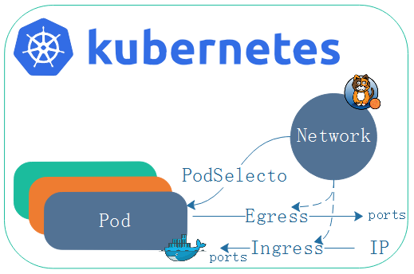

在前面的笔记中记载了flannel，flannel是做不了网络策略，但是flannel的vxlan隧道模式和directrouting，以及host-gw都非常简单好用。但是缺陷在某些场景也是不适应的，本篇笔记中简单介绍projectcalio，简称calico。

calico并且支持BGP协议的方式构建pod网络，通过[BGP](https://en.wikipedia.org/wiki/Border_Gateway_Protocol)的路由学习生成节点到节点直接pod路由表信息，并且在变动时候自动修改，并且支持IPIP隧道，基于ipip，与vxlan的网帧模式不一样。

此时如果使用flannel，并且仍需要网络策略功能。便可以在flannel提供网络基础之上额外使用calico提供网络策略。类似结合起来的有很多，如[tigera](https://www.tigera.io/)

calico的网段是192.168.0.0/16，与flannel的10.244.0.0/16不同。并且每个节点分配一个网段。在此使用calico仅仅用着与网络策略提供者的身份。如果你能打开[calico官方网站](https://docs.projectcalico.org/v2.0/getting-started/kubernetes/installation/)，将按照文档安装。

- 要求

```
Calico可以在符合以下标准的任何Kubernetes集群上运行。

必须将kubelet配置为使用CNI网络插件（例如--network-plugin=cni）。
必须以iptables代理模式启动kube-proxy 。这是Kubernetes v1.2.0的默认值。
必须在没有--masquerade-all标志的情况下启动kube-proxy ，这与Calico策略冲突。
Kubernetes NetworkPolicy API至少需要Kubernetes版本v1.3.0。
```

由于仅仅使用calico的网络策略，并且用于flannel，我们选择[安装用于flannel网络的Calico网络策略](https://docs.projectcalico.org/v3.1/getting-started/kubernetes/installation/flannel)即可

其中calico提供两种方式安装，分别是使用独立的etcd数据库存储安装和使用kuberntes api数据存储进行安装，官方推荐使用kuberntes api数据存储安装，  我们直接使用kuberntes api数据存储方式安装。倘若使用独立的ectd那就意味着你将会运维两位一个etcd存储。

## 安装

1,如果集群启用了RBAC，配置Calico所需的角色和绑定。如果没有启用RBAC则跳过进入第二步

```
[marksugar@linuxea ~]# kubectl apply -f \
> https://docs.projectcalico.org/v3.1/getting-started/kubernetes/installation/hosted/canal/rbac.yaml
clusterrole.rbac.authorization.k8s.io/calico created
clusterrole.rbac.authorization.k8s.io/flannel configured
clusterrolebinding.rbac.authorization.k8s.io/canal-flannel created
clusterrolebinding.rbac.authorization.k8s.io/canal-calico created
```

2,部署Calico，这其中有很多自定义的资源

```
[marksugar@linuxea ~]# kubectl apply -f \
> https://docs.projectcalico.org/v3.1/getting-started/kubernetes/installation/hosted/canal/canal.yaml
configmap/canal-config created
daemonset.extensions/canal created
customresourcedefinition.apiextensions.k8s.io/felixconfigurations.crd.projectcalico.org created
customresourcedefinition.apiextensions.k8s.io/bgpconfigurations.crd.projectcalico.org created
customresourcedefinition.apiextensions.k8s.io/ippools.crd.projectcalico.org created
customresourcedefinition.apiextensions.k8s.io/clusterinformations.crd.projectcalico.org created
customresourcedefinition.apiextensions.k8s.io/globalnetworkpolicies.crd.projectcalico.org created
customresourcedefinition.apiextensions.k8s.io/networkpolicies.crd.projectcalico.org created
customresourcedefinition.apiextensions.k8s.io/globalnetworksets.crd.projectcalico.org created
customresourcedefinition.apiextensions.k8s.io/hostendpoints.crd.projectcalico.org created
serviceaccount/canal created
```

而后在没个节点都会部署三个容器，这些容器经过下载后被启动

```
[marksugar@linuxea ~]# kubectl get pods -n kube-system -o wide
NAME                              READY     STATUS              RESTARTS   AGE
canal-kmzs8                       0/3       ContainerCreating   0          1m 
canal-n7pdz                       0/3       ContainerCreating   0          1m 
canal-npjfw                       0/3       ContainerCreating   0          1m 
canal-qqwgv                       0/3       ContainerCreating   0          1m 
canal-npjfw   3/3       Running   0         5m 
canal-qqwgv   2/3       Running   0         5m
canal-qqwgv   3/3       Running   0         5m 
canal-n7pdz   2/3       Running   0         7m 
canal-n7pdz   3/3       Running   0         7m 
```

## 测试

我们在不同的名称空间中创建两个不同的pod，使他们进行通讯，进而使他们不能通讯。甚至可以设置默认的策略拒绝。

network策略通过egress和ingress规则来控制不同的通讯需求
Egress：pod作为客户端向外访问，自己作为源地址，对方作为目标地址通讯
Igress:  自己是目标，远程范围是客户端
我们知道，客户端端口是随机的，服务端的端口是固定的，当Egress出战去请求对方端口，那么端口和地址是可知的，不然就无法请求。如果对方要访问自己，自己的端口和地址是可预测的，对方的端口和地址无法预测。那么，现在定义出站规则Egress，可以定义目标地址和端口。如果定义的是入站规则Igress，就可以定义对端的地址和自己的端口。这种限制到底针对哪一个pod，取决于网络策略的规则-podselecto(pod选择器)。

在podselecto中，可以做策略的控制，可做单方向的控制，出或者入站，其云种种与iptables有些类似！

podSelector中，一旦做了拒绝，不单单名称空间外的pod不能与名称空间内的pod通讯，名称空间内的pod与pod之间也无法通讯。podSelector选择完后并不在namespace级别控制，而是在pod级别控制。

## 1，配置网络策略

在配置中podselector决定了egress ingrees 应用在那个pod，policyTypes则能控制ingress或者egress是否生效，甚至控制单个生效都可以，只要定义的均会生效，没有定义的则生效默认规则。假如你只想让 


egress：
​    port定义目标地址和端口，可以是多个，而端口也可以是端口名称或者协议protocol。
to定义目标地址有三种方式：
​    ipblock： 目标地址块，目标地址内所有的端点，pod或者主机都可以，只要在目标地址块内都算作目标主机。
​    namespcaeSelector: 名称空间选择器，通过名称空间选择器控制来访问一组pod，或者说名称空间内的所有pod
​    podSelector: 目标地址可以是一组pod，源pod和目标pod通讯
ingress:
   port: pod自己的端口，控制自己的端口被别人访问


如上，我们创建两个namespace测试，并且在yaml文件中指定

```
[marksugar@linuxea networkpolicy]# cat ingress.yaml 
apiVersion: networking.k8s.io/v1
kind: NetworkPolicy
metadata:
  name: deny-ingress
  #namespace: dev-linuxea
spec:
  podSelector: {}
  policyTypes:
  - Ingress
```

- 注意

```
spec:
  podSelector: {} # 为空。则是整个名称空间的所有pod
```
在policyTypes中，如果定义了Ingress，且没有定义，则说明拒绝所有ingress。如果policyTypes中没有写入Egress，没有定义在policyTypes中的则默认允许的。
```
  policyTypes:
  - Ingress:
```

## 2，创建名称空间

此外创建两个名称空间：dev-linuxea，prod-linuxea，而后绑定网络策略到dev-linuxea，pord不进行绑定进行测试。

```
[marksugar@linuxea networkpolicy]# kubectl create  namespace dev-linuxea 
namespace/dev-linuxea created
[marksugar@linuxea networkpolicy]# kubectl create  namespace  prod-linuxea
namespace/prod-linuxea created
```

## 3，绑定网络策略

而后手动指定namespace，将ingress的yaml配置文件，也就是Ingress拒绝所有的入站流量，绑定到名称空间dev-linuxea上

```
[marksugar@linuxea networkpolicy]# kubectl apply -f ingress.yaml -n dev-linuxea
networkpolicy.networking.k8s.io/deny-ingress created
```

```
[marksugar@linuxea networkpolicy]#  kubectl get netpol -n dev-linuxea
NAME           POD-SELECTOR   AGE
deny-ingress   <none>         3s
```

### 1，pod应用到dev-linuxea

而后我们在这个创建的名称空间内创建一个pod，而后手动指定到上面创建的dev-linuxea的名称空间中

```
[marksugar@linuxea networkpolicy]# cat pod-linuxea.yaml 
apiVersion: v1
kind: Pod
metadata:
  name: pod-linuxea-1
spec:
  containers:
  - name: linuxeaapp
    image: marksugar/nginx:1.14.a
    imagePlull: 
    ports: 
    - name: http
      containerPort: 80
```

`-n dev-linuxea`指定名称空间apply

```
[marksugar@linuxea networkpolicy]# kubectl apply -f pod-linuxea.yaml -n dev-linuxea
pod/pod-linuxea-1 created
```
如果本地不存在会进行下载
```
[marksugar@linuxea networkpolicy]# kubectl get pods -n dev-linuxea
NAME            READY     STATUS              RESTARTS   AGE
pod-linuxea-1   0/1       ContainerCreating   0          6s
```
下载完成后就会被run起来，拿到的IP地址是172.16.4.8
```
[marksugar@linuxea networkpolicy]# kubectl get pods -n dev-linuxea -o wide -w
NAME            READY     STATUS              RESTARTS   AGE       IP        NODE                 NOMINATED NODE
pod-linuxea-1   0/1       ContainerCreating   0          13s       <none>    linuxea.node-2.com   <none>
pod-linuxea-1   1/1       Running   0         24s       172.16.4.8   linuxea.node-2.com   <none>
```

```
[marksugar@linuxea networkpolicy]# kubectl get pods -n dev-linuxea 
NAME            READY     STATUS    RESTARTS   AGE
pod-linuxea-1   1/1       Running   0          52s
```

我们试图进行在集群内访问，访问失败，说明被拒绝ingrees是成功的

```
[marksugar@linuxea networkpolicy]# curl 172.16.4.8
^C
[marksugar@linuxea networkpolicy]# 
```

### 2，pod应用到prod-linuxea

此后，我们将pod加入到prod-linuxea的名称空间内，prod-linuxea此前创建过，直接加入即可，但是prod-linuxea并没有应用到网络策略的拒绝流量的ingress规则当中，也就是上面的ingress.yaml中。prod-linuxea是没有定义任何规则的.

```
[marksugar@linuxea networkpolicy]# kubectl apply -f pod-linuxea.yaml -n prod-linuxea
pod/pod-linuxea-1 created
```
得到的ip地址是1 72.16.5.11
```
[marksugar@linuxea ~]# kubectl get pods -n prod-linuxea -o wide -w
NAME            READY     STATUS    RESTARTS   AGE       IP            NODE                 NOMINATED NODE
pod-linuxea-1   1/1       Running   0          12s       172.16.5.11   linuxea.node-3.com   <none>
```

试图在集群内再次访问，访问只是正常的

```
[marksugar@linuxea ~]# curl 172.16.5.11
linuxea-pod-linuxea-1.com-127.0.0.1/8 172.16.5.11/32
[marksugar@linuxea ~]# 
```

### 3，放行所有

假如此刻对阻止的，或者所有的放行，在ingrees.yaml中加一条`ingress:{}`即可，如下

```
apiVersion: networking.k8s.io/v1
kind: NetworkPolicy
metadata:
  name: deny-ingress
spec:
  podSelector: {}
  ingress:
  - {}
  policyTypes:
  - Ingress
```

- 在ingress中已经添加到规则中的，则读取规则。如果没有添加则默认拒绝

而后再次应用到dev-linuxea中,也就是那个172.16.4.8的pod之上

```
[marksugar@linuxea networkpolicy]# kubectl apply -f ingress.yaml -n dev-linuxea
networkpolicy.networking.k8s.io/deny-ingress configured
```

在集群内再去访问dev-linuxea名称空间中的pod

```
[marksugar@linuxea networkpolicy]#  curl 172.16.4.8
linuxea-pod-linuxea-1.com-127.0.0.1/8 172.16.4.8/32
```
已经被放行
我们在访问81端口试试，也能访问，只是报错

```
[marksugar@linuxea networkpolicy]# curl 172.16.4.8:81
curl: (7) Failed connect to 172.16.4.8:81; Connection refused
```
## 4， 放行入站特定流量
限制访问规则，具体到端口。我们先将此前的dev-linuxea名称空间下的pod打上`app=linuxea.com`标签便于测试，这个pod的ip是172.16.4.8
```
[marksugar@linuxea networkpolicy]# kubectl label pods pod-linuxea-1 app=linuxea.com -n dev-linuxea
pod/pod-linuxea-1 labeled
```
而后，编辑配置文件
- 定义podSelector。在matchLabels定义中，标签为app=linuxea.com的pod将会生效

```
  podSelector:
    matchLabels:
      app: linuxea.com
```
- ingress and  from
- 定义访问本地的pod规则。

在ingress中定义from，则允许那些ip来访问，如果不写from则允许所有。
使用ipBlock目标地址块下的cidr指定网段，允许`172.16.0.0/16`网段来访问本地的
并且，使用except来排除。限制`172.16.8.0/24`这个网段不能访问标签为`app=linuxea.com`的pod

```
  ingress:
  - from:
    - ipBlock:
        cidr: 172.16.0.0/16
        except:
        - 172.16.8.0/24
```
- ingress and ports

允许访问本地的那些80端口，如果不指定ports则全部允许
```
    ports:
    - protocol: tcp
      port: 80
```

那么最终的配置如下：

```
[marksugar@linuxea networkpolicy]# cat allow-pods.yaml 
apiVersion: networking.k8s.io/v1
kind: NetworkPolicy
metadata:
  name: allow-ingress
spec:
  podSelector:
    matchLabels:
      app: linuxea.com
  ingress:
  - from:
    - ipBlock:
        cidr: 172.16.0.0/16
        except:
        - 172.16.8.0/24
    ports:
    - protocol: TCP
      port: 80
```

- 也就是说。来自172.16.0.0/16网段的客户端访问本地拥有app标签为linuxea.com的一组本地pod，拒绝172.16.8.0/24ip段的访问。对于这组pod，可以访问80端口，其他端口则没有说明

apply启动

```
[marksugar@linuxea networkpolicy]# kubectl apply -f allow-pods.yaml -n dev-linuxea
networkpolicy.networking.k8s.io/allow-ingress unchanged
```

```
[marksugar@linuxea networkpolicy]# kubectl get netpol -n dev-linuxea
NAME            POD-SELECTOR      AGE
allow-ingress   app=linuxea.com   20s
deny-ingress    <none>            5h
```

接着访问172.16.4.8的80端口

```
[marksugar@linuxea networkpolicy]# curl 172.16.4.8
linuxea-pod-linuxea-1.com-127.0.0.1/8 172.16.4.8/32
```

如果访问其他的, 没有被放行的端口则会被阻塞

```
[marksugar@linuxea networkpolicy]# curl 172.16.4.8:81
^
```
倘若真的要放行81端口，则在配置文件中加上81端口即可

```
    ports:
    - protocol: TCP
      port: 81
```
如下
```
kind: NetworkPolicy
metadata:
  name: allow-ingress
spec:
  podSelector:
    matchLabels:
      app: linuxea.com
  ingress:
  - from:
    - ipBlock:
        cidr: 172.16.0.0/16
        except:
        - 172.16.8.0/24
    ports:
    - protocol: TCP
      port: 80
    - protocol: TCP
      port: 81
```
重新生效
```
[marksugar@linuxea networkpolicy]# kubectl apply -f allow-pods.yaml -n dev-linuxea
networkpolicy.networking.k8s.io/allow-ingress configured
```
80可访问
```
[marksugar@linuxea networkpolicy]# curl 172.16.4.8:80
linuxea-pod-linuxea-1.com-127.0.0.1/8 172.16.4.8/32
```
在访问81端口，响应链接失败，81端口事实上没有监听，因此访问可达。如果不可达则会阻塞
```
[marksugar@linuxea networkpolicy]# curl 172.16.4.8:81
curl: (7) Failed connect to 172.16.4.8:81; Connection refused
```

## 5，拒绝出战规则

拒绝所有出战规则，借用上面的配置文件，将ingress改成egress即可，如下

```
[marksugar@linuxea networkpolicy]# cat egress.yaml 
apiVersion: networking.k8s.io/v1
kind: NetworkPolicy
metadata:
  name: deny-egress
#  namespace: dev-linuxea
spec:
  podSelector: {}
  policyTypes:
  - Egress
```

生效到prod-linuxea名称空间

```
[marksugar@linuxea networkpolicy]# kubectl apply -f egress.yaml -n prod-linuxea
networkpolicy.networking.k8s.io/deny-egress created
```

此时，egress名称空间并没pod，仍然是之前定义的配置文件应用到prod-linuxea名称空间内即可。此前的文件中并没有定义namspace。如下：

```
[marksugar@linuxea networkpolicy]# cat pod-linuxea.yaml 
apiVersion: v1
kind: Pod
metadata:
  name: pod-linuxea-1
spec:
  containers:
  - name: linuxeaapp
    image: marksugar/nginx:1.14.a
    imagePlull: 
    ports: 
    - name: http
      containerPort: 80
```

而后应用即可

```
[marksugar@linuxea networkpolicy]# kubectl apply -f pod-linuxea.yaml -n prod-linuxea
pod/pod-linuxea-1 configured
```
这个pod此前创建过，在这个过程中多次被应用到pod-linuxea。这时，应用到prod-linuxea的名称空间中
```
[marksugar@linuxea networkpolicy]# kubectl get pods -n prod-linuxea
NAME            READY     STATUS    RESTARTS   AGE
pod-linuxea-1   1/1       Running   0          1d
```

而后进入到pod内部向外访问。

```
[marksugar@linuxea networkpolicy]# kubectl exec -it -n prod-linuxea pod-linuxea-1 sh
/ # ping 172.16.3.46
PING 172.16.3.46 (172.16.3.46): 56 data bytes

```

由于定义的是拒绝所有的Egress，这里就无法ping通另外一个pod的ip

## 6，放行出战规则

倘若要放行所有的出战规则，添加Egress:{}即可，如下

```
[marksugar@linuxea networkpolicy]# cat egress.yaml 
apiVersion: networking.k8s.io/v1
kind: NetworkPolicy
metadata:
  name: deny-egress
#  namespace: dev-linuxea
spec:
  podSelector: {}
  egress:
  - {}
  policyTypes:
  - Egress
```

而后，apply应用到prod-linuxea名称空间下的pod上

```
[marksugar@linuxea networkpolicy]# kubectl apply -f egress.yaml -n prod-linuxea
networkpolicy.networking.k8s.io/deny-egress configured
```

在到pod内向外ping

```
[marksugar@linuxea networkpolicy]# kubectl exec -it -n prod-linuxea pod-linuxea-1 sh
/ # ping 172.16.3.46
PING 172.16.3.46 (172.16.3.46): 56 data bytes
64 bytes from 172.16.3.46: seq=0 ttl=62 time=0.806 ms
64 bytes from 172.16.3.46: seq=1 ttl=62 time=0.494 ms
64 bytes from 172.16.3.46: seq=2 ttl=62 time=0.543 ms
64 bytes from 172.16.3.46: seq=3 ttl=62 time=0.553 ms
^C
--- 172.16.3.46 ping statistics ---
4 packets transmitted, 4 packets received, 0% packet loss
round-trip min/avg/max = 0.494/0.599/0.806 ms
/ # 
```

已经能够ping通，放行所有的出站流量是可以的。

一般来讲，入站规则限制来访问的ip和被访问的端口，出站作为客户端一般放行所有，不受限制。

- podSelector中，一旦做了拒绝，不单单名称空间外的pod不能与名称空间内的pod通讯，名称空间内的pod与pod之间也无法通讯。podSelector选择完后并不在namespace级别控制，而是在pod级别控制。如果在名称空间内的pod和名称空间内的能够通讯，就需要加一条规则放行所有出站目


