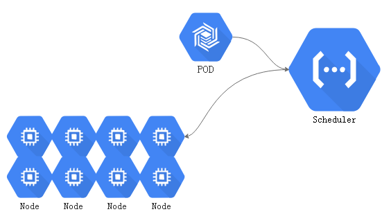
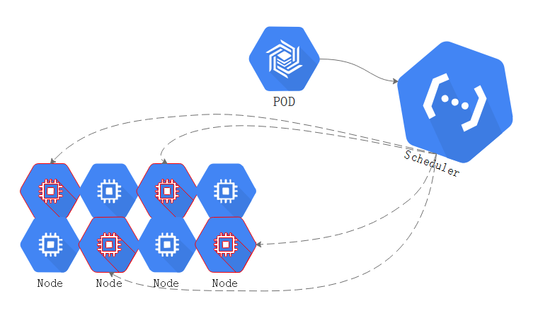

在kubernets中运行pod资源的节点中，master节点运行控制组件，主要控制组件如：

- apiserver
- controller-manager
- scheduler 

除此之外，master还依赖ETCD存储节点，或者是一个有冗余能力的存储集群。在使用kubeadm部署时候，这些组件会被运行成pod应用程序，并且是静态pod。简单的讲，就是运行在master本地的一个守护进程。从这个方面讲，master本身是不做任何工作负载的。如：运行一组nginx节点，是不会运行在master节点智商的。master是作为控制平面运行，而工作节点接收工作任务负载pod

当运行一个pod时，提交给master，并不需要关心对应的pod会运行在那个节点，这些工作节点被master组织成一个庞大的虚拟资源池，这个资源池中将cpu，存储卷这样的资源整合后的视角提供给客户端

这些pod究竟那些节点，或者那个节点之上。或者说这些pod更适合，更应该被布置在那些或者那个节点之上。

## scheduler调度器

当用户请求创建一个pod资源对象时，应该运行在那个节点上，是由控制平面中组件中的scheduler来做决策的，称为调度器。调度器是可以自定义的，没有自定义的就是默认的调度器方式default scheduler。

当用户请求向api server创建一个pod时，api server在检查用户权限通过的情况下，而后将请求交给scheduler， default scheduler从众多节点中选择一个匹配 default scheduler的节点用来运行此pod。

- scheduler作为一个守护进程，并且具有很多的调度算法，这个调度算法并且可以更换。默认default

 这个选择结果并不会直接反应到节点之上：将结果传递给api server，接着记录在etcd中，这个选择会在一段时间内是一个持久的状态，如果这个pod不发生故障，且这个pod不会被资源紧缺而被驱逐的话，这个pod资源将会一直在这个节点运行，就算被重启也仍然在这个节点运行。这个选择后的信息会存储在etcd中实现持久存储。

而api server与选定节点的kubelet进行互相通讯，kubelet始终watch api server当中，与kubelet所属的节点相关联的事件状态，如果scheduler调度结果被api server输出到某节点，那么这个节点的kubelet就可以watch到和自己相关资源的变动状态。

接下来这个节点就会去尝试获取api server 定义的pod配置清单，根据配置清单的定义创建pod，根据配置清单中的镜像策略，拉取镜像，而后如果有必要的话，还需要准备存储卷等一系列后续操作。这些操作都是由kuberntes提供。

pod都是有生命周期的，且分为自主式和控制器控制的。自主式的pod在故障时会重启pod，如果节点故障，将无法重启。最好的方式还是使用控制器控制。如：ReplicaSet，DaemonSet，Statefulset等。

## service组件

由于pod有生命周期，必要时，会在pod前加一个service以提供固定的访问端点

- service并不是一个真实的组件，仅仅是所有节点上iptables或者ipvs规则

当创建一个service时，请求仍然提交给api server，在权限认证检查，准入控制检查通过后，创建service，创建完成后存储在etcd中。

- 在每个节点上，kube-proxy监控service资源变动，创建iptables，或者ipvs规则，在service重要资源中,kube-proxy尤为重要。不管是kube-proxy还是kubelet都需要连接到api-server获取某些资源的定义。

- 对于api server来讲，kube-proxy以及kubelet都是客户端

## scheduler default

当用户创建pod时，scheduler应该有一组节点可以用

把这个pod在这组node list当中找到一个最佳的适合运行这个pod的节点，scheduler来评判最佳的节点。defalut scheduler作为调度器在默认情况下，实现调度决策是通过三个步骤来完成：

### 1，预选过程-Predicate

首先排除不能够被选中的节点

如上图，有很多节点，首先要做到就是排除不符合pod运行法则的节点。

一般来讲，在kubernetes中，pod可以定义两个维度资源限制：

- A .资源需求

每一个节点只有满足最低的资源需求，才能够被运行

- B .资源限额

每一个节点满足最高的资源额度

那么就是说一个pod最少要满足，起始资源的基本要求，如：最少需要2G内存才能够运行。和资源上限额度：最大只能使用4G内存，超出限额就不再分配任何内存，这种相当于硬限制。

就算pod最低要用2G内存，在一开始启动的时候，事实上并没有全部使用，这种状态便是 C “当前占用”。

在这众多节点当中，并不是每一个节点的剩余资源都能够满足pod的需求，如果不能满足就排除掉。

其他：

- 在定义一个pod的时候，倘若共享了宿主机的网络名称空间，并且监听了80端口之上，假如此刻一些节点的端口已经被占用。此时如果被调度到这类机器之上也会无法启动。因此，这类节点也要被排除

预选过程会把当前节点当中，完全不能符合对应pod运行的基本要求的节点，这个过程就是预选过程。

现在，排除了不能够被选中的节点，剩下了几个节点是符合预选的(如上图红色预选中的部分)，接下来就到了优选。

### 2，优选-Priority

基于算法和函数，根据每个节点的信息，计算每个节点的优先级并且进行逆序排序，取得分最高的那个node将会运行此Pod。假如有多个节点排序的分数相同，则随机。  

### 3，选定-Select

优选过后，将pod绑定到优选后的节点上即可。

### 4，调度选择

> 对于一些应用来讲，有一些偏好和倾向性。

在大规模使用的时候，对于不同的node节点可以做不同的标签进行分类，如：地理位置，硬件特性等。而后pod定义时，可以定义特有的倾向性。如此前的:

- nodename

对某个节点的节点名称进行特殊的绑定

- nodeSelector

对某些特殊类型的节点有倾向性， 使用nodeSelector匹配标签，且节点拥有这个标签，标签符合定义的选择标准，就被匹配。而这些pod的定义的属性都可能会影响到最后的预选，甚至优选步骤。

在kubernetes之上，使用的特殊的调度方式如下：

>   节点亲和性

这个pod对这个节点有一定的倾向性

某些时候希望某些pod运行在同一个节点，或者相邻的节点上，则表示他们有亲和性，而倾向于不要运行在同一个位置，则是反亲和性。
>  亲和性和反亲和性

在一些时候共享了网络名称空间，为了防止同样端口运行在同一个节点冲突，类似这样的问题，就需要反亲和性。或者，有一些节点运行了一些机密的pod，不希望被运行在和其他一样的节点之上，就需要隔离起来。

> 污点和污点容忍度

此前说的是pod如何来选择节点，而污点是反方向的。也就是给一些节点打上污点标识，pod是否能够运行在这些节点，取决于是否能够容忍这些污点，如果能够容忍就能调度到包含这些污点的节点上去。

如果节点不想这个pod使用这个节点，可以在打一个新的污点在上面驱离这个pod。为了驱离的跟平滑优雅，可以设置一个容忍期限，期限过后直接驱离。

基于调度行为和标识，都能影响到预选和优选结果，从而完成自定义的高级调度倾向机制。

如果没有倾向性也没有特殊特征，调度就根据调度算法，可能会均衡调度，如空闲率大，占用率大都可以进行调度，一般可能根据最大空闲资源率来进行调度。

## 调度器预选策略

在github上[查看这些预选策略](https://github.com/kubernetes/kubernetes/blob/master/pkg/scheduler/algorithm/predicates/predicates.go)，并且这些策略每个版本可能并不相同，代码当中定义了很多预选策略，但是并不是都被使用。常用策略如下：

CheckNodeCondition : 检查是否可以在节点报告，磁盘，网络不可用或者未准备好的前提下，能够把pod调度到上面去。

GeneralPred icates ： GeneralPred并不是一个单独的预选策略，GeneralPred本身包含好几个预选策略。如：
>	hostname

检查pod对象是否定义了pod.spec.hostname值。如果定义了就检查被调度节点主机名是否与它相匹配了。
>	PodfitsHostPorts

在之前，如果在pod中定义了Hostport就指定了绑定在节点的那个端口。如果pod定义了pods.spec.containers.ports.hostPort，且Hostport被占用了，就不符合条件了，否则就符合条件。
>	MatchNodeSelector:

检查pods.spec.nodeSelector是否定义了。如果定义了就查看节点当中的标签，是否能适配到这个pod的节点选择器。      如果一旦定义了pod的节点选择器，但对应的node没有适配的标签就无法运行。
>	PodFitsResources

对比检查pod资源需求是否能被节点所满足。检查这个节点是否有足够的资源支撑这个pod去运行。pod本身对资源是有需求，运行 pod时的最低限制。如：当前某个节点的可用量少于pod的需求量，那么这个节点就不符合需求的。可使用`kubectl describe nodes linuxea.node-2.com`查看
> NoDiskConfliict

检查pod依赖的存储卷是否能满足需求。检查pod对象所使用的存储卷在此节点上是否可用。能够满足这个存储卷使用需求就表示能够用使用，否则就不符合。

> PodToleratesNodeTaints

检查Pods上spec.tolerations可容忍的污点，是否完全包含节点的污点。如果是，就可以被预选，否则无法通过预选

> PodToleratesNodeExecuteTaints

如果Pod定义了spec.tolerations，就检查是否能够接纳节点之上Pod上定义Execute类型的污点

- NodeExecute属于污点中的一种特殊的污点。一个节点上的污点被接纳调度到节点上后，后来节点上的污点被修改成pod不能接纳的污点，默认pod是会继续在节点之上运行。NodeExecute意味着不能容忍，节点发现NodeExecute后且不能容忍，节点将会驱离Pod。默认是没有启用的，默认只检查是否允许污点。

>  CheckNodeLabelPresence

检查标签的存在性，标签是否存在取决于用户是否定义。通过修改节点标签对某些类别的pod在调度时候，是否接受被调度到节点。默认不启用

>  CheckServiceAffinity

根据当前对象所属的service和已有的其他pod对象 ，将pod调度至所属的service，且已经完成调度的其他pod所在的节点上。默认不启用

- 一个service下可能关联多个pod，多个pod分布在不同的节点，如果节点有很多，就会有一部分节点没有被分配到pod运行。CheckServiceAffinity可以将相同的 pod对象，尽可能的放在一起，这样以来亲和性更好，pod与pod内部之间访问距离更短。

>  CheckVolumeBinding

检查节点上已经绑定和尚未绑定的PVC，是否能够满足pod对象的存储卷需求。

> NoVolumeZoneConflict

当前区域内（逻辑范围划分），检查此节点上部署的pod对象是否与pod的需求存在的存储卷冲突 

>  CheckNodeMemoryPressure

检查节点内存资源是否存在压力过大的状态

> CheckNodePID

检查节点上PID资源是否压力过大

> CheckNodeDiskPressure

检查节点磁盘IO是否压力过大

> MatchInterPodAffity

检查节点是否满足pod亲和性或反亲和性条件

默认启动了很多预选策略，如果被其中任何一个策略所拒绝，节点就不在预选内。而节点在被预选之前会进行一 一评估是否满足预选策略，如果没有被上一个预选策略拒绝的话。

## 优选函数

[优选函数github](https://github.com/kubernetes/kubernetes/tree/master/pkg/scheduler/algorithm/priorities)地址你

[least_requested.go](https://github.com/kubernetes/kubernetes/blob/master/pkg/scheduler/algorithm/priorities/least_requested.go)  根据空闲比例进行评估。节点的空闲资源和节点最少容量做比较。

- CPU计算方式: (cpu(capacity-sum(requested))*10/capacity)

对cpu来讲， 总容量capacity 减去 已经被正在运行的pod占用的容量之和 乘以10(每一个优选函数的得分是10分) 在除以capacity

- 内存计算：

 (cpu((capacity-sum(requested))*10/capacity)+memory((capacity-sum(requested))*10/capacity)/2

但是这样以来得分的值可能会大于10，所以要除以2

[balanced_resource_allocation.go](https://github.com/kubernetes/kubernetes/blob/master/pkg/scheduler/algorithm/priorities/balanced_resource_allocation.go) 均衡资源分配

以CPU和内存资源的占用率的相近程度来评估标准。占用率相近的会胜出。

通常与least_requested.go结合使用。least_requested.go可以计算节点空闲量最大的节点，但是在面对众多空闲量大的节点，结合balanced_resource_allocation评估CPU与内存资源被占用率相近的，均衡的将会被选中胜出。

[image_locality.go](https://github.com/kubernetes/kubernetes/blob/master/pkg/scheduler/algorithm/priorities/image_locality.go) 本地存在就不需要下载，就意味着速度run的速度更快

[node_prefer_avoid_pods.go](https://github.com/kubernetes/kubernetes/blob/master/pkg/scheduler/algorithm/priorities/node_prefer_avoid_pods.go)  此优先函数算法比例非常高。如果此函数倾向与不允许此pod，则不会运行此pod。计算方法是将每一个函数的加起来，得分最高的胜出。

根据节点的注解信息判定“scheduler.alpha.kubernetes.io/preferAvoidPords”,如果没有这个注解信息则评分为10，权重1W，没有这个注解说明是可以运行此POD的。如果存在这个注解，pod可能无法运行在这个节点。

[taint_toleration.go](https://github.com/kubernetes/kubernetes/blob/master/pkg/scheduler/algorithm/priorities/taint_toleration.go)  有的节点的误点多，有的则少，虽然都是容忍，多个节点都能够容忍，那么那个节点最好呢？ taint_toleration基于pod资源对节点污染污点的容忍度的调度偏好，进行优先级评估的。 评估方式将pod对象的spec.tolerations所定义的能够容忍的污点列表，与节点的污点进行匹配度检查，能够匹配的条目越多表示越低。

[selector_spreading.go](https://github.com/kubernetes/kubernetes/blob/master/pkg/scheduler/algorithm/priorities/selector_spreading.go) 标签选择器的分散度。查找与当前pod对象匹配的service等，而标签选择器就被service等使用，从而使用标签选择器去选择pod资源，而后去检查与这些选择器匹配的现存pod对象及其所在的节点有那些个。已经运行此类pod节点越少的得分越高。

- 把同一个标签选择器匹配到的pod对象散开到各个节点上去。已经被标签选择匹配到的对象的节点，匹配的越多，得分越低。 当新调用一个pod时，会尽可能的将pod放在所属的service-标签选择器匹配的pod较少的节点上，这便是分散。

[interpod_affinity.go](https://github.com/kubernetes/kubernetes/blob/master/pkg/scheduler/algorithm/priorities/interpod_affinity.go)  遍历pod对象的亲和性条目，并将那些能够匹配到给定节点的条目的权重相加，相加后值越大的表示越高

- pod亲和性：以节点为例。一个节点上已经运行了很多pod，pod自己去评估每个节点能够在多大程度上来满足pod的亲和性。倘若第一个节点有2条满足，就得分是2，第二个节点有三条满足就得分是3，以此推论，匹配项越多的得分越高，被更有可能选中。

[node_affinity.go](https://github.com/kubernetes/kubernetes/blob/master/pkg/scheduler/algorithm/priorities/node_affinity.go) 节点亲和性，越亲和得分越高。基于节点亲和性评估，根据pod资源中的nodeSelector对节点进行检查，能成功匹配的数量越多，得分就越高。

[most_requested.go](https://github.com/kubernetes/kubernetes/blob/master/pkg/scheduler/algorithm/priorities/most_requested.go) 这与least_requested正好相反，least_requested计算得分越高，则空闲率越大，就胜出。而most_requested表示计算得分越低，空闲率越小，优先级越高，就胜出。most_requested会尽可能的把一个节点的资源全部使用，将pod集中，空闲出其他节点。一般而言most_requested与least_requested是不能同时使用的。

[node_label.go](https://github.com/kubernetes/kubernetes/blob/master/pkg/scheduler/algorithm/priorities/node_label.go) 定义节点拥有特定标签，来进行评分。单单关注标签本身。标签存在则得分，不存在就没有。

[image_locality.go](https://github.com/kubernetes/kubernetes/blob/master/pkg/scheduler/algorithm/priorities/image_locality.go) 一个pod对象是否对一个节点得分，得分的高低是根据节点上面是否拥有此pod的镜像，有镜像就得分，没有镜像就无。假如：pod内有三个镜像需要被节点拉取，而节点中三个镜像都有的节点得分最高，一个都没有的为0。

- 根据节点已有的镜像(**且能够满足pod运行的镜像**)的体积大小之和进行计算，如：第一个节点有一个镜像，第二个节点两个镜像，而第一个节点一个镜像的体积比第二个节点两个镜像的体积都大，那么还是第一个节点得分高。因为镜像体积大小意味着拉取的快慢，拉取有多块取决于带宽，体积大小在这之上。

