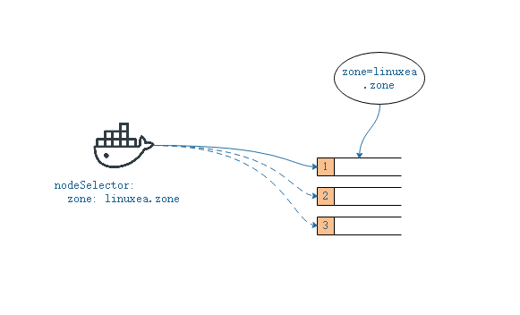
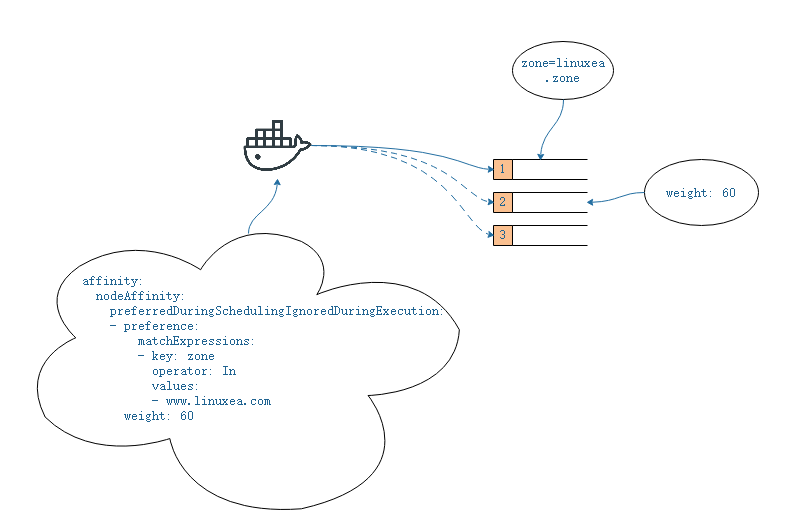
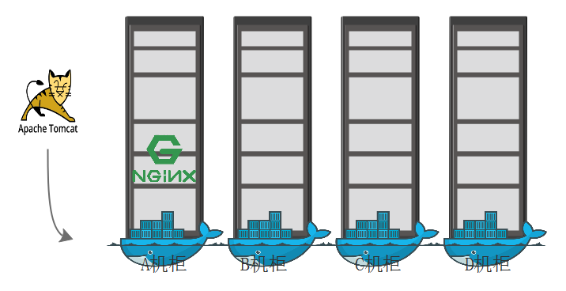
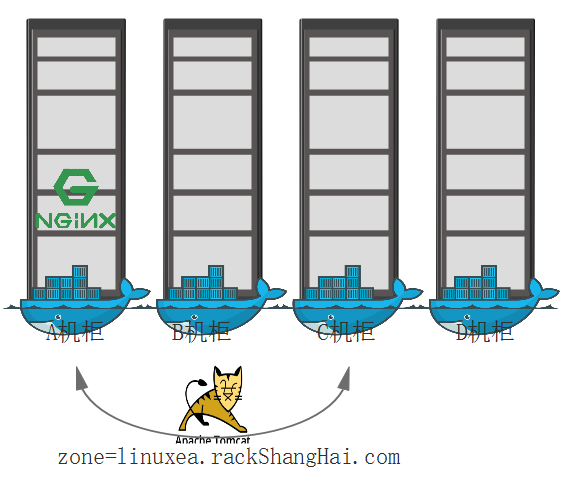
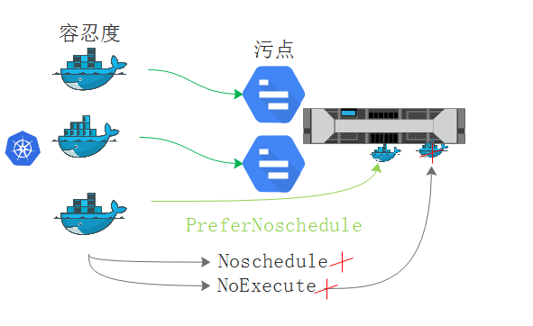

 之前的scheduler，默认的default scheduler分三部实现调度过程，首先是预选，从所有节点当中选择基本符合选择条件的节点，而后在众多基本符合选择条件的节点中通过优选函数，对这些节点加以比较。并且从最高得分当中随机选择一个作为运行pod的节点。这就是scheduler负责的功用。

## 高级调度机制

## 节点调度

在某些调度参加中，可通过自己的预设来影响预选，优选的过程，从而使得调度的操作符合期望。如，一个pod应该固定的被运行在某个节点，就可以使用预设的方式来影响调度来达到预期的目的。

此类的影响方式有4种，这4种都可成为高级调度设置机制

1，节点选择器，如nodeSelector,nodename

2，节点亲和性调度，nodeAffinity

对于nodename来讲，我们期望将pod调度到某一个特定的节点之上，就可以在nodename属性当中直接给定node的名称，而后对应的这个pod，一定只能会调度到这个node节点之上。

如果有一类节点都符合调用的属性条件，并且我们期望调度到这类节点上，就可以使用`nodeSelector`，可以给一部分节点打上特有的标签，在pod配置当中使用`nodeSelector`匹配这些标签，节点能适配这些标签的就是pod可运行的节点之一。而这种方式也会非常大的缩小预选范围

### 1，nodeSelector

我们测试下nodeSelector的效果，如下图



在`linuxea.node-3.com`节点之上，添加标签`zone=linuxea.zone`
```
[marksugar@linuxea schedule]#  kubectl label nodes linuxea.node-3.com zone=linuxea.zone
node/linuxea.node-3.com labeled
```

```
[marksugar@linuxea schedule]# kubectl get nodes --show-labels|grep zone
linuxea.node-3.com     Ready     <none>    39d       v1.11.2   beta.kubernetes.io/arch=amd64,beta.kubernetes.io/os=linux,kubernetes.io/hostname=linuxea.node-3.com,zone=linuxea.zone
```

而后绑定到linuxea.zone标签的节点之上

```
[marksugar@linuxea schedule]# cat pods.yaml 
apiVersion: v1
kind: Pod
metadata:
  name: linuxea-pods-1026
  namespace: default
  labels:
    app: linuxea.com
spec:
  containers:
  - name: pods-1026
    image: marksugar/nginx:1.14.a
    ports:
    - name: http
      containerPort: 80
  nodeSelector:
    zone: linuxea.zone
```

```
[marksugar@linuxea schedule]# kubectl apply -f pods.yaml 
pod/linuxea-pods-1026 created
```

```
[marksugar@linuxea schedule]# kubectl get pods  -o wide
NAME                 READY   STATUS    RESTARTS     AGE       IP    NODE    
linuxea-pods-1026   1/1      Running   0    2h   172.16.5.12    linuxea.node-3.com
```

此时linuxea-pods-1026名称的pod就运行在node3之上。因为只有node3才有` zone: linuxea.zone`标签

- 如果nodeSelector定义的标签在节点内不存在就会挂起。nodeSelector是签约束，如果不满足条件，在预选时候就会停止。

此刻将nodeSelector的标签修改成` zone: linuxea.zone.cn`。` zone: linuxea.zone.cn`是不存在的。

```
  nodeSelector:
    zone: linuxea.zone.cn
```

那么标签` zone: linuxea.zone.cn`不存在在节点上，这个pod就会Pending。因为pod中nodeSelector的标签不存在。

```
[marksugar@linuxea schedule]# kubectl apply -f pods.yaml 
pod/linuxea-pods-1026 created
```

```
[marksugar@linuxea schedule]# kubectl get pods
NAME                READY     STATUS    RESTARTS   AGE
linuxea-pods-1026   0/1       Pending   0          3s
```

将node1.linuxea.com打上zone: linuxea.zone.cn标签，就会将linuxea-pods-1026调度到node1上

```
[marksugar@linuxea schedule]# kubectl label nodes linuxea.node-1.com zone=linuxea.zone.cn
node/linuxea.node-1.com labeled
```

```
[marksugar@linuxea schedule]# kubectl get pods -o wide
NAME                READY  STATUS    RESTARTS   AGE  IP             NODE              
linuxea-pods-1026   1/1    Running   0          46s  172.16.3.2     linuxea.node-1.com
```

### 2，nodeAffinity

在`pod.spec.affinity`中就有`affinity`，在`affinity`中`nodeAffinity`(节点亲和性)，`podAffinity`(pod亲和性)，`podAntiAffinity`(pod反亲和性)

在`nodeAffinity`中有两项如下：

> `requiredDuringSchedulingIgnoredDuringExecution`

`requiredDuringSchedulingIgnoredDuringExecution`是硬亲和性，也就是说必须满足条件。与`nodeSelector`相似，如果不满足亲和定义的条件，就一定不会运行，那么就会pending状态

> `preferredDuringSchedulingIgnoredDuringExecution`

`preferredDuringSchedulingIgnoredDuringExecution`倾向性。优先运行满足节点亲和性高的节点上。尽量满足条件，如果不能够尽量的满足条件，那也可以找其他节点运行。当然，能够运行在亲和性高，满足条件多的节点是最好不过了。

在`preferredDuringSchedulingIgnoredDuringExecution`下嵌套：

- `preference` 倾向节点

- `weight ` 倾向权重

在`requiredDuringSchedulingIgnoredDuringExecution`下的`nodeSelectorTerms`定义对象列表，并且嵌套节点选择器Terms。在`nodeSelectorTerms`之下嵌套

`matchExpressions`：匹配表达式

`matchFields`：匹配字段

- 在`matchFields`下需要定义key，检查label key，操作符operator（等值或者不等值选择，以及集合的标签，如果使用exists，或者`doesnotexist`的时候values是不能有值的），values只需要给定值即可

- `matchExpressions`  定义表达式基于标签选择。

> 开始测试requiredDuringSchedulingIgnoredDuringExecution


其中定义`affinity.nodeAffinity.requiredDuringSchedulingIgnoredDuringExecution.nodeSelectorTerms.matchExpressions`，定义key是zone，operator操作符是In，values是www.linuxea.com，而后在添加weight ，如上图
yaml

```
  affinity:
    nodeAffinity:
      requiredDuringSchedulingIgnoredDuringExecution:
        nodeSelectorTerms:
        - matchExpressions:
          - key: zone
            operator: In
            values:
            - www.linuxea.com
```
如下：
```
[marksugar@linuxea schedule]# cat pods_nodeAffinity.yaml 
apiVersion: v1
kind: Pod
metadata:
  name: linuxea-nodeaffinity
  namespace: default
  labels:
    app: linuxea.com
spec:
  containers:
  - name: pods-1026
    image: marksugar/nginx:1.14.a
    ports:
    - name: http
      containerPort: 80
  affinity:
    nodeAffinity:
      requiredDuringSchedulingIgnoredDuringExecution:
        nodeSelectorTerms:
        - matchExpressions:
          - key: zone
            operator: In
            values:
            - www.linuxea.com
```

apply 

```
[marksugar@linuxea schedule]# kubectl apply -f pods_nodeAffinity.yaml 
pod/linuxea-nodeaffinity created
```

此刻状态是Pending，因为目前并没有zone标签，且值是等值的www.linuxea.com的node

```
[marksugar@linuxea schedule]# kubectl get pods -o wide
NAME                   READY     STATUS    RESTARTS   AGE       IP             NODE                 NOMINATED NODE
linuxea-nodeaffinity   0/1       Pending   0          9s        <none>         <none>               <none>
```

并且定义的是`requiredDuringSchedulingIgnoredDuringExecution`硬亲和性，在上述中，我们知道硬亲和性的话，如果不存在，就不会选中。所以被Pending

> preferredDuringSchedulingIgnoredDuringExecution

那么这样以来就无法绑定了，我们尝试使用倾向性绑定，这和硬绑定requiredDuringSchedulingIgnoredDuringExecution不同，配置preference和weight即可，如下：

```
  affinity:
    nodeAffinity:
      preferredDuringSchedulingIgnoredDuringExecution:
      - preference:
          matchExpressions:
          - key: zone
            operator: In
            values:
            - www.linuxea.com
        weight: 60
```

如下：

```
[marksugar@linuxea schedule]# cat pods_nodeAffinity-2.yaml 
apiVersion: v1
kind: Pod
metadata:
  name: linuxea-nodeaffinity
  namespace: default
  labels:
    app: linuxea.com
spec:
  containers:
  - name: pods-1026
    image: marksugar/nginx:1.14.a
    ports:
    - name: http
      containerPort: 80
  affinity:
    nodeAffinity:
      preferredDuringSchedulingIgnoredDuringExecution:
      - preference:
          matchExpressions:
          - key: zone
            operator: In
            values:
            - www.linuxea.com
        weight: 60
```

apply

```
[marksugar@linuxea schedule]# kubectl apply -f pods_nodeAffinity-2.yaml 
pod/linuxea-nodeaffinity created
```

而后调度到node2节点。

```
[marksugar@linuxea schedule]# kubectl get pods -o wide
NAME                   READY     STATUS    RESTARTS   AGE       IP             NODE                 NOMINATED NODE
linuxea-nodeaffinity   1/1       Running   0          6s        172.16.4.9     linuxea.node-2.com   <none>
```

```
[marksugar@linuxea schedule]# kubectl describe pods linuxea-nodeaffinity|tail -6
  Type    Reason     Age   From                         Message
  ----    ------     ----  ----                         -------
  Normal  Scheduled  6m    default-scheduler            Successfully assigned default/linuxea-nodeaffinity to linuxea.node-2.com
  Normal  Pulled     6m    kubelet, linuxea.node-2.com  Container image "marksugar/nginx:1.14.a" already present on machine
  Normal  Created    6m    kubelet, linuxea.node-2.com  Created container
  Normal  Started    6m    kubelet, linuxea.node-2.com  Started container
```

但是我们知道，node2肯定是不符合硬性条件的。但是仅仅尽量满足而已。如果此时在其他节点打上一个符合的标签，如果使用preferred仍然会调度到符合条件的节点上。如果使用required则只会调度到符合的节点，而不会尽量满足调用，而是硬性满足，没有则pending。这就是两种节点亲和，前者硬性亲和，后者软亲和。

## Pod亲和性调度

Pod自身的亲和性调度分为两种表示形式，第一种podinity(亲和性)，第二张podAffinity(反亲和性)

pod与pod更倾向运行在一起。一般出于高效通讯的需求把pod对象组织在相近的位置，同一个节点，同一个机架，同一个机房，甚至于同一个区域或者地区，便于pod通讯。但是有些时候在部署两套系统的时候，出于一些安全或者其他的考虑，不能够部署在一起的时候，就需要反亲和性。

pod的亲和性定义比较独特，一般而言，通过节点亲和性定义pod之间的亲和性。用户必须为pod指定可运行的节点标签，那此前的节点亲和性也可以定义pod亲和性。如：pod被定义在亲和性高的节点之上，随之pod之间的亲和性也就高了。

但是定义节点亲和性从而完成pod亲和性的调度并不是最优的方式。定义节点亲和性的条件是必须确保节点和pod双方需要完全匹配到，并且需要有针对性的，精心的布局节点，比如如何去打标签，打什么标签等。这种方式太过于复杂，`而较理想的方式就可以直接把第一个pod随机选择一个位置或者现存的多个pod，而后第二个pod根据第一个pod所在的位置或者现存pod位置，作为评判后续pod能否到第一个pod或者现存很多pod上亲和度的调度，有可能是在同一个节点，也有可能是在邻近的节点，而不是根据节点布局进行调度。`

但是，这样一来又怎么去判定那些位置是相同的，那些是不相同位置的？

假设有ABCD四个机柜上有4台节点。随后，但第一个Pod运行在第一个节点之后，如何确保第二个，第三个节点是否能运行与第一个pod亲和的POD。此刻运行NMT，如果Nginx运行在A节点上，M又应该如何运行？我们知道pod亲和性并不是一定要运行在一个节点之上，也可能是具有亲和性的节点，Tomcat运行在B，Mysql运行在C，只要满足这三个节点在同一个机柜内就认为这是满足亲和性条件的不就可以了？毕竟有着高效的通讯前提。如下：

所以，在定义pod亲和性时候，必须有一个判断前提：

- pod和pod在同一个位置，或者不在同一个位置衡量的标准是什么。

怎么是同一个位置，怎么又不在同一个位置？如果以节点名称来判断位置，相同的节点名称就作为一个位置，节点名称不相同的就不作为 一个位置。那么就有4个位置，每个节点做为一个独特的位置存在。如果以这种方式为标准，第一个pod运行在第一个A机柜上，那么第二个Pod就必须在节点1上了。只有在同一个位置才能满足亲和性。

那如果换种方式，在同一个位置的标准是：只要是在同一个标签下的节点来判断亲和性范围。

比如，ABC的标签上zone=linuxea.rackShangHai.com，以NMT为例，nginx调度到A节点上，在同一个标签内，Tomcat可以被调度在标签内的A，B，C任意一个节点。唯独不会调度到D节点


- 我们必要有一种方式去判定，那些机房内的机柜，机柜中的服务器节点，节点与节点之间，或者机柜与机柜之间，甚至机房与机房之间是在同一个位置。从而在调度时候才能够有根据的标准来度量是否满足亲和性。

##Pod软硬亲和

pod亲和性也分硬亲和性，在`pods.spec.affinity.podAffinity`下也也有`preferredDuringSchedulingIgnoredDuringExecution`和`requiredDuringSchedulingIgnoredDuringExecution`。这和nodeAffinity相似。

硬亲和表示必须要在同一个位置，软亲和表示尽量在同一个位置。

对podAffinity来讲：

required硬性亲和参数中：labelSelector，namespaces，topologyKey。

- topologyKey

指位置键(如上所述)，必须是一个key，必须判定亲和或者不亲和。
- labelSelector 

在判定pod亲和时，labelSelector用来选定一组资源，选择能够作为亲和对象的pod
- namespaces 

当标签选择器选择一组资源，指明标签选择器匹配的到的pod所在名称空间。当前pod必然属于某个名称空间，当没有手动指定namespaces ，就指labelSelector所匹配的pod只能是当前正在创建pod所属同一个名称空间中的那些pod。一般不需要跨名称空间引用pod，创建pod时候所在的名称空间当中其他目标pod可作为自己目标亲和的pod。

但需要手动指定的时候

### 硬亲和测试

此刻，需要运行两个pod，分别是linuxea-pods-1和linuxea-pods-2，我们知道，在硬亲和中，第二个pod必须满足亲和性，如果第一个pod运行在某个节点，且第二个pod通常也会运行在某个节点，这取决于第一个pod运行在那个节点，也取决于位置标准的标签定义方式。

#### 1，yaml定义

第一个pod标签为

```
  labels:
    app: linuxea.com
```

在第二个pod中，我们期望第一个pod在的位置就是第二个pod在的位置，由此，我们需要一个特定的标签来进行区分pod运行的范围，我们使用节点名称来作为位置判定的同一标准，节点名称是唯一的

```
[marksugar@linuxea networkpolicy]# kubectl get nodes --show-labels
NAME                   STATUS    ROLES     AGE       VERSION   LABELS
linuxea.master-1.com   Ready     master    42d       v1.11.2   beta.kubernetes.io/arch=amd64,beta.kubernetes.io/os=linux,kubernetes.io/hostname=linuxea.master-1.com,node-role.kubernetes.io/master=
linuxea.node-1.com     Ready     <none>    42d       v1.11.2   beta.kubernetes.io/arch=amd64,beta.kubernetes.io/os=linux,kubernetes.io/hostname=linuxea.node-1.com,zone=linuxea.zone.cn
linuxea.node-2.com     Ready     <none>    42d       v1.11.2   beta.kubernetes.io/arch=amd64,beta.kubernetes.io/os=linux,kubernetes.io/hostname=linuxea.node-2.com
linuxea.node-3.com     Ready     <none>    42d       v1.11.2   beta.kubernetes.io/arch=amd64,beta.kubernetes.io/os=linux,kubernetes.io/hostname=linuxea.node-3.com,zone=linuxea.zone
```

那么这样一来，因为硬限制，假如第一个pod调度到节点1，第二个pod就必须会运行在节点2，如果第一个在节点2，第二个pod就必须会运行在节点2

- affinity如下：

标签选择器中，选择的是pod的标签而不是node节点的标签。在这里意思是：当前的这个pod要和下面的这个标签所属的pod在一起

```
  labels:
    app: linuxea.com
```

如果要检查其他的标签，可以继续写

`topologyKey`指的是`kubernetes.io/hostname`.也就是说只要hostname是一样的，就认为是同一个位置，如果不一样就不是同一个位置。

```
  affinity:
    podAffinity:
      requiredDuringSchedulingIgnoredDuringExecution:
      - labelSelector:
          matchExpressions:
          - {key: app, operator: In, values: ["linuxea.com"]}
        topologyKey: kubernetes.io/hostname
```

如果不出意外，这两个pod都会运行在同一个位置上，也就是同一个hostname相同的节点之上。

#### 2，yaml文件

```
[marksugar@linuxea schedule]# cat pods-required-affinity.yaml 
apiVersion: v1
kind: Pod
metadata:
  name: linuxea-pods-1
  namespace: default
  labels:
    app: linuxea.com
spec:
  containers:
  - name: pods-1026
    image: marksugar/nginx:1.14.a
    ports:
    - name: http
      containerPort: 80
---
apiVersion: v1
kind: Pod
metadata:
  name: linuxea-pods-2
  namespace: default
  labels:
    app: linuxea.net
spec:
  containers:
  - name: busybox
    image: busybox:latest
    imagePullPolicy: IfNotPresent
    command: ["sh","-c","sleep 3600"]
  affinity:
    podAffinity:
      requiredDuringSchedulingIgnoredDuringExecution:
      - labelSelector:
          matchExpressions:
          - {key: app, operator: In, values: ["linuxea.com"]}
        topologyKey: kubernetes.io/hostname
```

apply

```
[marksugar@linuxea schedule]# kubectl apply -f pods-required-affinity.yaml 
pod/linuxea-pods-1 created
pod/linuxea-pods-2 createdku	
```

```
[marksugar@linuxea schedule]# kubectl get pods -o wide
NAME              READY     STATUS    RESTARTS   AGE       IP             NODE                 NOMINATED NODE
linuxea-pods-1    1/1       Running   0          27s       172.16.4.11    linuxea.node-2.com   <none>
linuxea-pods-2    1/1       Running   0          27s       172.16.4.10    linuxea.node-2.com   <none>
```

此刻使用硬亲和，`linuxea-pods-2`和`linuxea-pods-1`运行在`linuxea.node-2.com上`

- 那么我们应该知道，pod调度时候，如果有两个pod，默认是用了均衡法则，在优选策略中会尽可能那的进行均衡，cpu均衡，以及最少资源占用利用率节点会，在优选中，最少资源占用的节点一定会被调度到两个不同的节点之上去。但是现在使用podAffinity硬性亲和(required)，就必然会组在一个节点之上。如果使用preferred就当另说。

### podAntiAffinity

反亲和和亲和的唯一区别在于使用了topologyKey后，topologyKey的值一定不能是相同的。

仍然使用上面的yaml文件，将podAffinity改成podAntiAffinity。topologyKey此前我们知道，使用的是hostname标签名称作为区分位置标准，这样一来，两个pod必然会运行在不同的hostname节点上

#### 测试1

```
[marksugar@linuxea schedule]# cat pods-required-anti-affinity.yaml 
apiVersion: v1
kind: Pod
metadata:
  name: linuxea-pods-1
  namespace: default
  labels:
    app: linuxea.com
spec:
  containers:
  - name: pods-1026
    image: marksugar/nginx:1.14.a
    ports:
    - name: http
      containerPort: 80
---
apiVersion: v1
kind: Pod
metadata:
  name: linuxea-pods-2
  namespace: default
  labels:
    app: linuxea.net
spec:
  containers:
  - name: busybox
    image: busybox:latest
    imagePullPolicy: IfNotPresent
    command: ["sh","-c","sleep 3600"]
  affinity:
    podAntiAffinity:
      requiredDuringSchedulingIgnoredDuringExecution:
      - labelSelector:
          matchExpressions:
          - {key: app, operator: In, values: ["linuxea.com"]}
        topologyKey: kubernetes.io/hostname
```

```
[marksugar@linuxea schedule]# kubectl apply -f pods-required-anti-affinity.yaml 
pod/linuxea-pods-1 created
pod/linuxea-pods-2 created
```

```
[marksugar@linuxea schedule]# kubectl get pods -o wide
NAME              READY     STATUS    RESTARTS   AGE       IP             NODE                 NOMINATED NODE
linuxea-pods-1    1/1       Running   0          3s        172.16.4.12    linuxea.node-2.com   <none>
linuxea-pods-2    1/1       Running   0          3s        172.16.5.13    linuxea.node-3.com   <none
```

#### 测试2

测试1中，`topologyKey`是`kubernetes.io/hostname`，而`kubernetes.io/hostname`在每个节点之上都是唯一的，在反亲和中，不能运行在两个节点之上。

但是，我们知道，反亲和中，如果节点上的标签一样，而`topologyKey`正好也使用这个标签，也就意味着在同一个位置拓扑中，那么`linuxea-pods-2`反亲和条件不满足，`linuxea-pods-2`必然会本pending

将`linuxea.node-1.com`和`linuxea.node-2.com`，`linuxea.node-3.com`打上标签`www=linuxea.com`。值得注意的是，如果有一台节点没有打标签就会在标签范围外运行第二个pod。反亲和条件仍然满足，就不会pending.

- 我们使用`kubectl label nodes linuxea.node-1.com LABLE_NAME-`删除不用的`lables`

```
[marksugar@linuxea schedule]# kubectl label nodes linuxea.node-1.com wwwlabel=linuxealabel 
node/linuxea.node-1.com labeled
[marksugar@linuxea schedule]# kubectl label nodes linuxea.node-2.com wwwlabel=linuxealabel 
node/linuxea.node-2.com labeled
[marksugar@linuxea schedule]# kubectl label nodes linuxea.node-3.com wwwlabel=linuxealabel 
node/linuxea.node-2.com labeled
```

修改`topologyKey`等于`wwwlabel`

```
apiVersion: v1
kind: Pod
metadata:
  name: linuxea-pods-1
  namespace: default
  labels:
    app: linuxea.com
spec:
  containers:
  - name: pods-1026
    image: marksugar/nginx:1.14.a
    ports:
    - name: http
      containerPort: 80
---
apiVersion: v1
kind: Pod
metadata:
  name: linuxea-pods-2
  namespace: default
  labels:
    app: linuxea.net
spec:
  containers:
  - name: busybox
    image: busybox:latest
    imagePullPolicy: IfNotPresent
    command: ["sh","-c","sleep 3600"]
  affinity:
    podAntiAffinity:
      requiredDuringSchedulingIgnoredDuringExecution:
      - labelSelector:
          matchExpressions:
          - {key: app, operator: In, values: ["linuxea.com"]}
        topologyKey: wwwlabel
```

```
[marksugar@linuxea schedule]# kubectl apply -f pods-required-anti-affinity.yaml 
pod/linuxea-pods-1 created
pod/linuxea-pods-2 created
```

```
[marksugar@linuxea schedule]# kubectl get pods -o wide
NAME              READY     STATUS    RESTARTS   AGE       IP             NODE                 NOMINATED NODE
linuxea-pods-1    1/1       Running   0          7s        172.16.4.25    linuxea.node-2.com   <none>
linuxea-pods-2    0/1       Pending   0          7s        <none>         <none>               <none>
```

## 污点调度

在前面的两种方式中，都是由pod去选择的，节点被动选择运行。而污点调度方式就给了节点的选择权。让节点可以选择让那些pod运行在节点上。总的来说，污点就是定义在节点上的键值属性数据。

- 此前，我们知道，键值属性有三类，第一类叫标签，第二类叫注解，第三类便是污点。污点用在节点之上，而前两类所有资源对象都可以使用。
- pod亲和性和node亲和性都是pod的属性，而污点是节点的属性

污点也是一种键值属性，主要用来让节点拒绝那些不能容忍的pod，因此需要在pod对象上定义容忍度。而容忍度也是pod对象上的第三类键值数据，并且是一个列表。

kubernetes分别有一个预选策略PodToleratesNodeTaints和优选函数taint_toleration，分别完成基于所谓的污点和容忍度的调用逻辑，并且作为选择中标准的一种来进行定义。

污点定义在node.spec.taints：

- effect  

定义当pod不能容忍这个污点时， 采取的行为是什么。这种排斥的效果有三种，分别是：

Noschedule： 仅仅影响调度过程，对现存的pod对象不产生影响。如果不能容忍，就不进行调度。

NoExecute： 不仅影响调度，也影响现存pod对象； 如果不能容忍的pod将会被驱逐。

PreferNoschedule：不能容忍就不能调度，但是如果没有其他地方运行，那也可以。 

- key
- timeAdded
- value  可以为空

在pod对象上定义容忍度的时候，还支持两种操作，等值比较，存在性判断

>  等值比较

容忍度与污点必须在key,value和effect上完全匹配，

> 存在性判断

表示二者的key,timeAdded必须匹配，value 可以为空

另外一个节点可以配置多个污点，一个pod也可以有多个容忍度，只不过两者匹配的时候需要遵循以下逻辑：

>  1，检查每个有着容忍匹配容忍度的污点，不能匹配到的污点如果存在，如果有一个使用Noschedule标识，pod就无法调度

- 我们在pod上定义三个容忍度，在节点之上定义两个污点。如果容忍度中只包含了容忍了一个污点，那将只会匹配一个污点，这样的情况是存在的！所以我们要检查这种匹配度有多高！事实上这个pod不一定会运行在这个节点之上的。如下图：



逐一检查容忍度和对方的污点相匹配，节点上的每一个污点都需要被容忍，如果存在一个不被容忍，就需要看这个污点的条件。如果污点是effect.PreferNoschedule，那就可以运行的。如果是Noschedule就不能调度成功。如上图。

如果至少有一个污点不匹配，如果是NoExecute，且节点已经运行有此pod，此pod将被驱逐。

>  总结：如果一个节点定义了污点，一个pod能否调度上来。首先检查能够被匹配到的污点和容忍度，检查完能够被容忍的污点后，检查不能够被容忍度容忍的污点，检查不能够被容忍度容忍污点，就检查effect 排斥的三种行为，如果是PreferNoschedule就可以继续调度，如果是Noschedule，且pod尚未调度到节点，就不能被调度到节点，Noschedule调度之前已经运行在节点的的pod仍然能够运行。如果是NoExecute，且pod尚未调度到节点，就不能被调度到节点，而且此前调度过来的已经运行的pod，如果被修改了污点，就意味着运行的这个pod也会被驱逐。

在master节点上，就是有污点的.NoSchedule.如果pod不能够容忍这个污点，pod就不能够调度到master节点上

```
[marksugar@linuxea schedule]# kubectl describe node linuxea.master-1.com|grep Taints
Taints:             node-role.kubernetes.io/master:NoSchedule
```

并且master这个污点在启动的时候就被打上去。如果pod不能够容忍这个污点，就不会调度到master这个节点上，而一些其他的kubernetes组件肯定是容忍这个污点的。否则将调度不到master上，像api server就是NoExecute

```
[marksugar@linuxea schedule]# kubectl describe pods kube-apiserver-linuxea.master-1.com  -n kube-system|grep Tolerations
Tolerations:       :NoExecute
```

另外还有flannel,flannel就更清楚地标记容忍度，包含master 污点`node-role.kubernetes.io/master`，并且是NoSchedule。这些信息就影响这调度

```
[marksugar@linuxea schedule]# kubectl describe pods kube-flannel-ds-amd64-mnrwp -n kube-system
Node-Selectors:  beta.kubernetes.io/arch=amd64
Tolerations:     node-role.kubernetes.io/master:NoSchedule
                 node.kubernetes.io/disk-pressure:NoSchedule
                 node.kubernetes.io/memory-pressure:NoSchedule
                 node.kubernetes.io/not-ready:NoExecute
                 node.kubernetes.io/unreachable:NoExecute
Events:          <none>
```

### 管理节点污点

#### NoSchedule

此刻有三个节点，将node1标记为线上，容忍行为效果是NoSchedule。pod不运行在node1，node1只会运行生产pod
```
[marksugar@linuxea schedule]# kubectl taint node linuxea.node-1.com node_type=produce:NoSchedule
node/linuxea.node-1.com tainted
```
- 随意apply几个pod，不设置容忍度

```
apiVersion: apps/v1
kind: Deployment
metadata:
  name: dpment-linuxea
  namespace: default
spec:
  replicas: 3
  selector:
    matchLabels:
      app: linuxea_app
      version: v0.1.32
  template:
    metadata:
      labels:
        app: linuxea_app
        version: v0.1.32
    spec:
      containers:
      - name: nginx-a
        image: marksugar/nginx:1.14.b
        ports:
        - name: http
          containerPort: 80
```
apply
```
[marksugar@linuxea schedule]# kubectl apply -f demo.yaml 
deployment.apps/dpment-linuxea created
```
在查看，pod运行在node2和node3，跳过了node1
```
[marksugar@linuxea schedule]# kubectl get pods -o wide
NAME                              READY     STATUS    RESTARTS   AGE       IP            NODE                 NOMINATED NODE
dpment-linuxea-648d599b5f-j68cb   1/1       Running   0          5s        172.16.5.20   linuxea.node-3.com   <none>
dpment-linuxea-648d599b5f-sh2tn   1/1       Running   0          5s        172.16.4.26   linuxea.node-2.com   <none>
dpment-linuxea-648d599b5f-vrjtl   1/1       Running   0          5s        172.16.5.21   linuxea.node-3.com   <none>
```
甚至，我们可以删掉在apply一次
```
[marksugar@linuxea schedule]# kubectl delete -f demo.yaml 
deployment.apps "dpment-linuxea" deleted
```
这些pod没有设置node上的容忍度，仍然不会调度到node1，说明污点是有效的。
```
[marksugar@linuxea schedule]# kubectl get pods -o wide
NAME                              READY     STATUS    RESTARTS   AGE       IP            NODE                 NOMINATED NODE
dpment-linuxea-648d599b5f-hc9n6   1/1       Running   0          5s        172.16.4.27   linuxea.node-2.com   <none>
dpment-linuxea-648d599b5f-kjsgd   1/1       Running   0          5s        172.16.5.22   linuxea.node-3.com   <none>
dpment-linuxea-648d599b5f-wp4pz   1/1       Running   0          5s        172.16.4.28   linuxea.node-2.com   <none>
```

#### NoExecute

此刻，尝试NoExecute。现在node2节点上运行了一个pod，我们在node2上在打一个污点`node_type=dev:NoExecute`，并且是容忍的行为是NoExecute，也就是说，如果node2上的pod不是污点dev的，并且此前运行不是dev的pod，也会被驱逐

```
[marksugar@linuxea schedule]# kubectl taint node linuxea.node-2.com node_type=dev:NoExecute
node/linuxea.node-2.com tainted
```

node2上的pod没有容忍这个污点，被驱逐了，但是还有node3没有任何污点，所以运行在node3之上

```
[marksugar@linuxea schedule]# kubectl get pods -o wide -w
NAME                              READY     STATUS        RESTARTS   AGE       IP            NODE                 NOMINATED NODE
dpment-linuxea-648d599b5f-87jhp   1/1       Running       0          12s       172.16.5.23   linuxea.node-3.com   <none>
dpment-linuxea-648d599b5f-fgwhd   1/1       Running       0          12s       172.16.5.25   linuxea.node-3.com   <none>
dpment-linuxea-648d599b5f-hc9n6   1/1       Terminating   0          31m       172.16.4.27   linuxea.node-2.com   <none>
dpment-linuxea-648d599b5f-kjsgd   1/1       Running       0          31m       172.16.5.22   linuxea.node-3.com   <none>
dpment-linuxea-648d599b5f-wp4pz   1/1       Terminating   0          31m       172.16.4.28   linuxea.node-2.com   <none>
dpment-linuxea-648d599b5f-hc9n6   0/1       Terminating   0         31m       172.16.4.27   linuxea.node-2.com   <none>
dpment-linuxea-648d599b5f-hc9n6   0/1       Terminating   0         31m       172.16.4.27   linuxea.node-2.com   <none>
dpment-linuxea-648d599b5f-hc9n6   0/1       Terminating   0         31m       172.16.4.27   linuxea.node-2.com   <none>
dpment-linuxea-648d599b5f-hc9n6   0/1       Terminating   0         31m       172.16.4.27   linuxea.node-2.com   <none>
dpment-linuxea-648d599b5f-wp4pz   0/1       Terminating   0         31m       <none>    linuxea.node-2.com   <none>
dpment-linuxea-648d599b5f-wp4pz   0/1       Terminating   0         31m       <none>    linuxea.node-2.com   <none>
dpment-linuxea-648d599b5f-wp4pz   0/1       Terminating   0         31m       <none>    linuxea.node-2.com   <none>
```

而后都运行在node3之上，如果node3也有污点，且pod不能容忍，那就会pending.

```
[marksugar@linuxea schedule]# kubectl get pods -o wide 
NAME                              READY     STATUS    RESTARTS   AGE       IP            NODE                 NOMINATED NODE
dpment-linuxea-648d599b5f-87jhp   1/1       Running   0          1m        172.16.5.23   linuxea.node-3.com   <none>
dpment-linuxea-648d599b5f-fgwhd   1/1       Running   0          1m        172.16.5.25   linuxea.node-3.com   <none>
dpment-linuxea-648d599b5f-kjsgd   1/1       Running   0          32m       172.16.5.22   linuxea.node-3.com   <none>
```

### 管理Pod容忍度

在pods.spec.tolerations字段中

- tolerationSeconds 表示，如果被驱逐，驱逐前等待时间。默认0秒 ，立即被驱逐

- key 列表

- operator 操作符

   Exists ： 判断污点存在与否，存在就可以，且不管是什么值都匹配

   Equal： 容忍度必须能够精确容忍对方的污点值

在上述中，使用Exists ，只要是node_type在就容忍，如果是Equal，只要是node_type且要么容忍dev污点值，元要么produce的污点值，需要明确指定

- 我们先将linuxea.node-3.com添加污点`node_type=Pre-production:NoSchedule`，容忍行为NoSchedule

```
[marksugar@linuxea schedule]# kubectl taint node linuxea.node-3.com node_type=Pre-production:NoSchedule
node/linuxea.node-3.com tainted
```

此刻在apply 刚才没有容忍度的pod就会pending

```
[marksugar@linuxea schedule]# kubectl get pods
NAME                              READY     STATUS    RESTARTS   AGE
dpment-linuxea-648d599b5f-cxfv6   0/1       Pending   0          3s
dpment-linuxea-648d599b5f-ghphv   0/1       Pending   0          3s
dpment-linuxea-648d599b5f-rvpw2   0/1       Pending   0          3s
```

#### NoExecute

此刻使用NoExecute也会pending.因为污点和容忍度不完全等。如下：

- 首先操作符为Equal，精确容忍，而node1的污点node_type:produce的容忍行为是NoSchedule，而在文件中定义的是容忍行为是NoExecute，唯一的键值匹配produce也不符合NoExecute
- tolerationSeconds表示，一旦容忍将在30秒后进行驱逐

综上所述，pod没有容忍任何node的污点，所以pending

```
      tolerations: 
      - key: "node_type"
        operator: "Equal"
        value: "produce"
        effect: "NoExecute"
        tolerationSeconds: 30
```

完整yaml

```
apiVersion: apps/v1
kind: Deployment
metadata:
  name: dpment-linuxea
  namespace: default
spec:
  replicas: 3
  selector:
    matchLabels:
      app: linuxea_app
      version: v0.1.32
  template:
    metadata:
      labels:
        app: linuxea_app
        version: v0.1.32
    spec:
      containers:
      - name: nginx-a
        image: marksugar/nginx:1.14.b
        ports:
        - name: http
          containerPort: 80
      tolerations: 
      - key: "node_type"
        operator: "Equal"
        value: "produce"
        effect: "NoExecute"
        tolerationSeconds: 30          
```

#### NoSchedule

使用NoSchedule就不需要指定tolerationSeconds的驱逐时间，因为NoSchedule只会拒绝不能容忍的，对于在上一次已经运行的pod不驱逐
- 操作符精确匹配具有污点为node_type为produce的节点
- 而node_type为produce污点的节点是node1

精确满足容忍度的节点是node1，这三个pod将会调度到node1上。如下：
```
      tolerations: 
      - key: "node_type"
        operator: "Equal"
        value: "produce"
        effect: "NoSchedule"
#        tolerationSeconds: 10
```

yaml如下

```
[marksugar@linuxea schedule]# cat demo.yaml 
apiVersion: apps/v1
kind: Deployment
metadata:
  name: dpment-linuxea
  namespace: default
spec:
  replicas: 3
  selector:
    matchLabels:
      app: linuxea_app
      version: v0.1.32
  template:
    metadata:
      labels:
        app: linuxea_app
        version: v0.1.32
    spec:
      containers:
      - name: nginx-a
        image: marksugar/nginx:1.14.b
        ports:
        - name: http
          containerPort: 80
      tolerations: 
      - key: "node_type"
        operator: "Equal"
        value: "produce"
        effect: "NoSchedule"
#        tolerationSeconds: 10
```

apply

```
[marksugar@linuxea schedule]# kubectl apply -f demo.yaml 
deployment.apps/dpment-linuxea configured
```
而后就调度到具有kye是node_type:produce，行为是NoSchedule污点的node1之上，因为yaml文件中容忍了node1的污点
```
[marksugar@linuxea schedule]# kubectl get pods -o wide -w
NAME                             READY     STATUS    RESTARTS   AGE       IP           NODE                 NOMINATED NODE
dpment-linuxea-df4b6f749-5jlcb   1/1       Running   0          5s        172.16.3.4   linuxea.node-1.com   <none>
dpment-linuxea-df4b6f749-rzndk   1/1       Running   0          4s        172.16.3.5   linuxea.node-1.com   <none>
dpment-linuxea-df4b6f749-wwpck   1/1       Running   0          3s        172.16.3.6   linuxea.node-1.com   <none>
```

#### Exists 

我们在改改，修改成污点只要键是node_type的就容忍，也就是只要键是node_type的污点都调度到上面，将操作符改成Exists，我们知道Exists，只要是匹配到的就可以被容忍，如果没有其他的条件的话

上述中，node污点分别是:

- `linuxea.node-1.com node_type=produce:NoSchedule`
- `linuxea.node-2.com node_type=dev:NoExecute`
- `linuxea.node-3.com node_type=Pre-production:NoSchedule`

yaml修改后如下
```
      tolerations: 
      - key: "node_type"
        operator: "Exists"
        value: ""
        effect: "NoSchedule"
```

注意：尽管污点的键值在三个节点都是node_type。但是node1和node3的**行为效果**是NoSchedule，而node2行为效果是NoExecute，因为行为**效果不同**，所以也只会调度在node1和node3的污点节点上

yaml完整如下：

```
apiVersion: apps/v1
kind: Deployment
metadata:
  name: dpment-linuxea
  namespace: default
spec:
  replicas: 3
  selector:
    matchLabels:
      app: linuxea_app
      version: v0.1.32
  template:
    metadata:
      labels:
        app: linuxea_app
        version: v0.1.32
    spec:
      containers:
      - name: nginx-a
        image: marksugar/nginx:1.14.b
        ports:
        - name: http
          containerPort: 80
      tolerations: 
      - key: "node_type"
        operator: "Exists"
        value: ""
        effect: "NoSchedule"
```

apply

```
[marksugar@linuxea schedule]# kubectl  apply -f demo.yaml 
deployment.apps/dpment-linuxea configured
```

apply后会进行重新调度，调度后到了node1和node3之上

```
[marksugar@linuxea schedule]# kubectl get pods -o wide
NAME                              READY     STATUS        RESTARTS   AGE       IP            NODE                 NOMINATED NODE
dpment-linuxea-798ff6bc87-8kpw2   1/1       Running       0          12s       172.16.5.33   linuxea.node-3.com   <none>
dpment-linuxea-798ff6bc87-9fgn4   1/1       Running       0          14s       172.16.3.7    linuxea.node-1.com   <none>
dpment-linuxea-798ff6bc87-fgpcr   1/1       Running       0          15s       172.16.5.32   linuxea.node-3.com   <none>
dpment-linuxea-df4b6f749-5jlcb    1/1       Terminating   0          19m       172.16.3.4    linuxea.node-1.com   <none>
dpment-linuxea-df4b6f749-rzndk    1/1       Terminating   0          19m       172.16.3.5    linuxea.node-1.com   <none>
dpment-linuxea-df4b6f749-wwpck    1/1       Terminating   0          19m       172.16.3.6    linuxea.node-1.com   <none>
```

>  那如果要调度到node2的污点上，改成NoExecute即可

但是这样一来，就只有node2有污点的**行为效果**是NoExecute，而node1和node3没有，就只能调度到Node2了。

```
      tolerations: 
      - key: "node_type"
        operator: "Exists"
        value: ""
        effect: "NoExecute"
```

而后apply

```
[marksugar@linuxea schedule]# kubectl apply -f demo.yaml 
deployment.apps/dpment-linuxea configured
```

就都调度到node2上了。

```
[marksugar@linuxea schedule]# kubectl get pods -o wide -w
NAME                              READY     STATUS        RESTARTS   AGE       IP            NODE                 NOMINATED NODE
dpment-linuxea-798ff6bc87-8kpw2   1/1       Terminating   0          14m       172.16.5.33   linuxea.node-3.com   <none>
dpment-linuxea-798ff6bc87-9fgn4   1/1       Terminating   0          14m       172.16.3.7    linuxea.node-1.com   <none>
dpment-linuxea-798ff6bc87-fgpcr   1/1       Terminating   0          14m       172.16.5.32   linuxea.node-3.com   <none>
dpment-linuxea-7b54d565c7-2md6h   1/1       Running       0          2s        172.16.4.31   linuxea.node-2.com   <none>
dpment-linuxea-7b54d565c7-5pmth   1/1       Running       0          3s        172.16.4.30   linuxea.node-2.com   <none>
dpment-linuxea-7b54d565c7-v6bdq   1/1       Running       0          5s        172.16.4.29   linuxea.node-2.com   <none>
```

> 那如果我想在三个节点都想被容忍，我们在修改下，将effect制空，如下：

```
      tolerations: 
      - key: "node_type"
        operator: "Exists"
        value: ""
        effect: ""
```

这样一来，value值为空，effect的**容忍效果**也为空，那就只有键生效，相同为node_type的键有node1,node2,node3三个node都符合。就会调度到三个节点上

```
[marksugar@linuxea schedule]# kubectl apply -f demo.yaml 
deployment.apps/dpment-linuxea configured
```

```
[marksugar@linuxea schedule]# kubectl get pods -o wide -w
NAME                              READY     STATUS        RESTARTS   AGE       IP            NODE                 NOMINATED NODE
dpment-linuxea-7748786749-4s2qv   1/1       Running       0          5s        172.16.4.32   linuxea.node-2.com   <none>
dpment-linuxea-7748786749-6llcz   1/1       Running       0          6s        172.16.5.34   linuxea.node-3.com   <none>
dpment-linuxea-7748786749-dv4nf   1/1       Running       0          4s        172.16.3.8    linuxea.node-1.com   <none>
```

