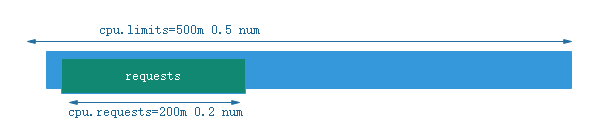
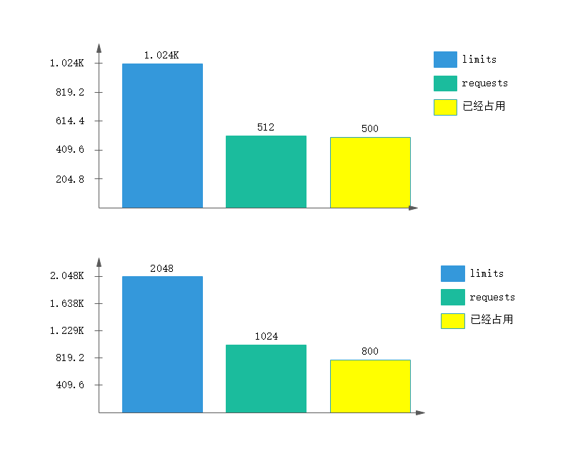
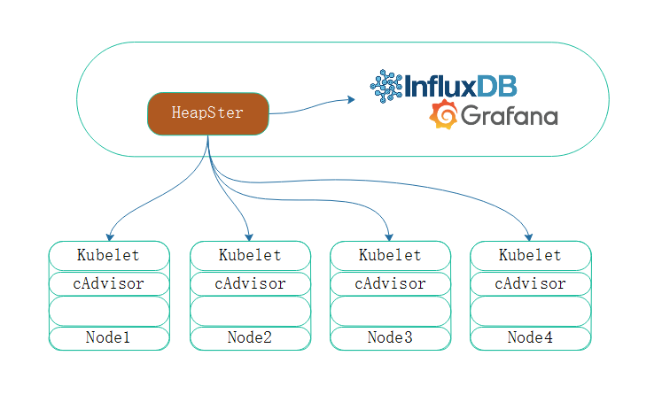
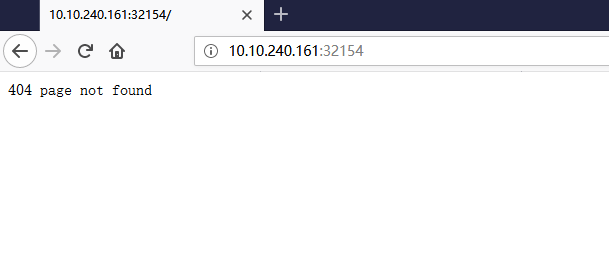
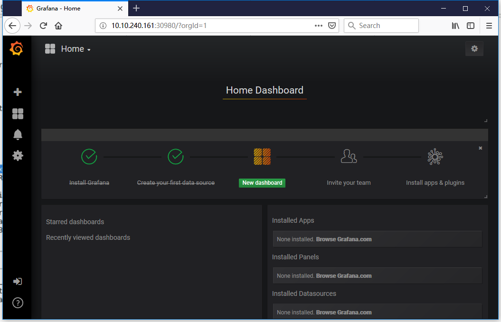

之前介绍的pod资源调度，此篇主要记录的是kubernetes上运行pod的对象的时，如何去监控系统级的一些资源指标，业务指标的获取，以及监控。

容器在启动的时候，可以根据资源需求，配置资源限额的，如CPU，内存。而CPU资源属于可压缩资源，一个容器在本应该获取指定的资源获取不到的时候，进行等待即可，而内存则不一样。内存属于非可压缩资源，如果内存资源因为指定的大小而不够的时候会因为内存资源耗尽而被Kill。
此前我们知道，在kubernetes中资源可定义为起始和终结值。

- requests

定义cpu和内存的使用率。至少需要用的资源需求。
- limits

限制，最高消耗区间。并且是硬限制
一般来讲limis应该大于等于requests，尽管这些限制是应用在容器之上的，但是我们称之pod资源需求，也是应用到pod上的。

> CPU

在kubernetes上一个单位的CPU相当于一颗虚拟CPU（虚拟CPU指一个核心或者一个超线程。一个两核双线程的CPU可以虚拟4颗逻辑CPU）。而且一个CPU并且能够被划分子单位，一核，相当于1000 millcores(微核)，那么500m就相当于0.5个CPU 

> 内存

内存的计量单位是E,P,T,G,M,K  Ei,Pi,Ti,Gi,Mi,Ki  

假设，我们限制每个pod的cpu只能使用0.5个核心，设置成cpu.limits=500m，这个cpu.limits=500m指的是硬上限，也就是说最多使用500m，不用就不用。如下图：



除此之外还有requests，requests是说，如果想要确保正常运行容器，至少要给0.2个核心。但是这个0.2个核心并不是说直接就是用到0.2个，而是说至s少要保证有0.2个能够被使用，并且调度的目标节点至少有0.2个空闲的cpu资源可用。

每一个节点已经有多少CPU资源被分配出去，就是计算这个节点上所运行的所有容器的CPU requests加起来的，这个加起来的值被总核心减掉，剩下的就是未被分配的。如：调度4个容器，每个容器至少需要0.5核心，那就意味着还剩下2核心空闲。如果此刻pod中至少有一个容器要使用三个CPU，那么这个节点就不被预选，无法满足Pod。

- 定义的资源需求，只是定义了资源的请求下限。如果我们明确说只要200m(requests)资源来运行，系统有4核心，而运行的pod因为bug的原因，是有可能将4核心全部占用的。因为只是定义了200m的资源需求。一般情况下，需求和上限都需要同时定义，否则就有可能推掉节点的所有资源

> requests需求确保在调度时候，对应节点上需已经拥有这么多的资源以便于满足这个pod运行的基本需求。而limits用于限制这个容器无论怎么运行绝对不能超过的资源阈值。

## 定义测试

资源需求是定义在容器级别的，在`pods.spec.containers.resources`:

- `pec.containers[].resources.limits.cpu`
- `spec.containers[].resources.limits.memory`
- `spec.containers[].resources.requests.cpu`
- `spec.containers[].resources.requests.memory`

参考[Pod和Container的资源请求和限制](https://kubernetes.io/docs/concepts/configuration/manage-compute-resources-container/#resource-requests-and-limits-of-pod-and-container),

定义资源限制需要在容器级别加resources，而后requests下定义两个维度的需求，分别是cpu和memory（可以同时定义也可以定义一个）。再者，为了屏蔽，定义limits限制上限多少，达到这个上限就不再分配资源。

-  并且也可只定义需求，而不定义限制。也可以只定义限制而不定义需求。需求和限制都可以只定义一个 ，一般来讲，都会定义完整。

很多情况下，requests和limits分别对应的是需求级别和上限级别，一般的话requests和limits定义相同是合适的

如下：

> 定义requests的CPU为300m，也就是0.3核心的CPU，内存为256M，而限制定义为最多用1核心的CPU，最多使用512的内存。

> 延续内容：如果这个pod一直使用300m。那么定义的限制上限资源就不起作用，剩下的200M只是存在于定义的列表中，并不是说还有200M在等待，200M仍然可别其他所使用。仅仅作为上限限制。

```
spec:
  containers:
  - name: linuxea-pod1-com
    image: "marksugar/nginx:1.14.a"   
   resources:
      requests:
        cpu: "300m"
        memory: "256Mi"
      limits:
        cpu: "1"
        memory: "512Mi"
```

我们借用别人的pod进行压测一下,yml如下

```
apiVersion: v1
kind: Pod
metadata: 
  name: pod-demo-linuxea
  namespace: default
  labels:
    www: linuxea-com
    tier: backend
spec:
  containers:
  - name: linuxea-pod1-com
    image: "ikubernetes/stress-ng"
    command: ["/usr/bin/stress-ng","-c 1","--metrics-brief"]
    ports:
      - containerPort: 88
    resources:
      requests:
        cpu: "300m"
        memory: "256Mi"
      limits:
        cpu: "1"
        memory: "512Mi"
```

```
[marksugar@linuxea metrics]# kubectl apply -f pod-demo.yaml 
pod/pod-demo-linuxea created
```

```
[marksugar@linuxea metrics]# kubectl get pods
NAME                              READY     STATUS    RESTARTS   AGE
dpment-linuxea-7748786749-4s2qv   1/1       Running   0          5d
dpment-linuxea-7748786749-6llcz   1/1       Running   0          5d
dpment-linuxea-7748786749-dv4nf   1/1       Running   0          5d
pod-demo-linuxea                  1/1       Running   0          38s
```

而后使用top命令查看压测结果

- 此刻CPU的占用率是%25 。我机器上4核CPU，在yaml的limits中最大用1核心，100的4分之一是25%

```
[marksugar@linuxea metrics]# kubectl exec pod-demo-linuxea top
Mem: 3191756K used, 4982256K free, 405912K shrd, 944K buff, 2204020K cached
CPU:  25% usr   0% sys   0% nic  75% idle   0% io   0% irq   0% sirq
Load average: 1.00 0.71 0.33 3/533 31
  PID  PPID USER     STAT   VSZ %VSZ CPU %CPU COMMAND
    7     1 root     R     6896   0%   2  25% {stress-ng-cpu} /usr/bin/stress-ng
    1     0 root     S     6256   0%   3   0% /usr/bin/stress-ng -c 1 --metrics-
    8     0 root     S     1516   0%   2   0% top
   14     0 root     S     1516   0%   2   0% top
   20     0 root     S     1516   0%   1   0% top
   26     0 root     R     1512   0%   0   0% top
```

resources定义能够被调度器作为基础衡量条件的调度指数使用的。对于每个节点来讲，会将所有容器的资源需求量加起来作为已分配出去的配额，limits上限是非常有效的

> ## 容器可见资源和可用资源

当使用resources限制了资源需求和限额后，使用free命令查看，显示的是节点上的所有内存，并不是容器的配额内存。这样是有问题的。

如：jvm在跑起来的时候，虚拟机启动时候就会创建堆，而后类，数组等都由此分配。堆的分配当然使用的是物理机的内存，或者多少。如果jvm跑在容器内，jvm拿到的内存是节点物理内存量，而不是容器limits的配额内存，那么计算的结果肯定是有问题的，吞掉容器所有内存都不够，甚至出现其他问题。

## Qos
qos是作为服务质量的一个简称
当限制了一些资源后，默认会自动属于某个Qos的类。
默认情况下，类别有三个：

- Guranteed：每个容器

每个相同资源，同时设置了**相同的resources，limits**，必须满足相同的条件：
 ```
	cpu.limits=cpu.requests
	memory.limits=memory.requests
 ```
大致如此：

```
    resources:
      requests:
        cpu: "1"
        memory: "512Mi"
      limits:
        cpu: "1"
        memory: "512Mi"
```

这样相同的配置就会自动归类的Guranteed，这类pod**拥有最高优先级。**
如： **资源不够的时候，优先运行这类资源**

- Burstable：至少有一个容器

至少有一个容器设置了cpu或者内存的limits属性，或者至少有一个容器设置了cpu或者内存的requests属性，这类的具有中等优先级。

此前，我们创建的pod，cpu内存的requests和limits不相同，便是Burstable类型

```
[marksugar@linuxea metrics]# kubectl describe pods pod-demo-linuxea |grep QoS
QoS Class:       Burstable
```

- BestEffort: 没有任何一个容器

没有任何一个容器设置了requests或者limits；最低优先级别。

当资源不够用的时候，属于BestEffort的容器将会被优先关闭。优先让属于其他两种pod类型的资源运行。

如果资源仍然不够，就会关闭Burstable类的pod容器。

如果此时Burstable的容器已经全部关闭，或者说只有Guranteed，但是在资源还是不够用。就会依据已占用量和需求量的比例大的优先被关闭。如下：



上面pod limits是1G，requests基本使用是512M，而占用了最低需求的500M。基本需求并不会启动就全部占用

下面pod limits是2G，requests基本使用是1G，而占用了基本需求的800M。

第一个pod的已经分配的量已经接近使用的量，requests是512M，已经使用了500M。而后面的pod已经占用量与基本要求的量差距较大，requests是1G，占用量是800M。因此资源紧缺的情况下，关闭第一个pod。这种方式给予已占用量与需求量的比例来做决策，比例大的优先被关闭。

- 此前节点有污点，为了方便使用，将污点untainted

```
[marksugar@linuxea metrics]# kubectl taint node linuxea.node-1.com node_type-
node/linuxea.node-1.com untainted
[marksugar@linuxea metrics]# kubectl taint node linuxea.node-2.com node_type-
node/linuxea.node-2.com untainted
[marksugar@linuxea metrics]# kubectl taint node linuxea.node-3.com node_type-
node/linuxea.node-3.com untainted
[marksugar@linuxea metrics]# 
```

## heapster

在docker中可以使用那个stats查看容器的资源使用，而在Kubernetes中可以使用top查看。但是一般都会报错，如下：

```
[marksugar@linuxea metrics]# kubectl top pod
Error from server (NotFound): the server could not find the requested resource (get services http:heapster:)
[marksugar@linuxea metrics]# 
```

top命令应用依赖于heapster实现这个功能，在kubenretes上需要一个运行在集群级别的，各个pod，甚至各个节点的资源用量的采集，已经存储工具。

top是根据这些采集和存储获取数据，而后显示的。如果没有heapster采集存储，top命令是无法运行的。此前的dashboard的一部分用量也是依赖于heapster的。

在节点上，使用top等命令是用来统计节点的资源使用情况，当kubernetes运行在众多节点上后， 每一个pod运行在哪里，如果事先不做一些处理，默认是无法确定的。如何使用一个统一的视图来查看，必须要在每个节点部署一个统一的一个资源指标收集和存储工具，至少要有一个收集工具。当需要查看的时候，可以连接到每一个节点之上，通过本地的agent获取节点上的进程，以及节点本身的资源用量。而后显示top中

单独的部署，heapster只是一个汇聚工具，每个节点需要采集节点自身的和节点之上pod的指标数据，但是这些数据只是在节点自身上，因此，需要一个集中统一来收集并且存储的工具。

- 架构

在每个节点上都运行一个重要的组件：kubelet。kubelet是可以获取由他创建的pod的资源数据的，在kubelet下真正完成采集pod的数据的是kubelet子组件cAdvisor（cAdvisor目前是内建的功能）。

cAdvisor专门用来收集当前节点上各pod上各个容器的资源用量，以及节点之上的资源用量和存储用量等等信息。早期收集完成后，是提供端口，可进行在节点上查看。现在是主动报告数据到heapster，而后heapster收集每个节点上运行的heapster采集到的数据

在集群之上托管heapster，各个cAdvisor主动向heapster发送采集到的数据。
如果没有存储，默认是存储在内存中，但是内存是有限的。这样一来就不能够查看到历史数据。
查看历史数据就需要InfluxDB，heapster收集到数据后整合到InfluxDB，这样就能完成持久存储的目的。
并且使用Grafana来查看数据源为InfluxDB中的数据。完成展示数据。如下图



另外还需要设置RBAC的资源控制权限

pod资源监控资源分为三类指标：kuberntes系统指标，容器指标，业务指标

### influxDB

influxDB是一个时序数据库系统，InfluxDB被heapster依赖，所以先部署influxDB

一般在生产环境中，这里的influxDB最好使用有持久功能的存储卷来做数据存储，在[github的heapster](https://github.com/kubernetes/heapster/blob/master/deploy/kube-config/influxdb/influxdb.yaml)中,使用的是

```
     volumes:
      - name: influxdb-storage
        emptyDir: {}
```

下载github之上的这个yaml文件

```
[marksugar@linuxea metrics]# curl -Lk https://raw.githubusercontent.com/kubernetes/heapster/master/deploy/kube-config/influxdb/influxdb.yaml -o $PWD/influxdb.yaml 
  % Total    % Received % Xferd  Average Speed   Time    Time     Time  Current
                                 Dload  Upload   Total   Spent    Left  Speed
100   960  100   960    0     0   1199      0 --:--:-- --:--:-- --:--:--  1200
```

下载之后，可以直接启动，也可以apiVersion：apps/v1,如果要修改，需要添加selector

```
spec:
  replicas: 1
  selector:
    matchLabels:
      task: monitoring
      k8s-app: influxdb
```

apply

```
[marksugar@linuxea metrics]# kubectl apply -f influxdb.yaml 
deployment.apps/monitoring-influxdb created
service/monitoring-influxdb created
```

```
[marksugar@linuxea metrics]# kubectl get pods -n kube-system
NAME                                           READY     STATUS    RESTARTS   AGE
monitoring-influxdb-848b9b66f6-4wtfb           1/1       Running   0          8s
```

```
[marksugar@linuxea metrics]# kubectl get svc -n kube-system
NAME                   TYPE        CLUSTER-IP       EXTERNAL-IP   PORT(S)         AGE
kube-dns               ClusterIP   10.96.0.10       <none>        53/UDP,53/TCP   49d
kubernetes-dashboard   NodePort    10.101.194.113   <none>        443:31780/TCP   28d
monitoring-influxdb    ClusterIP   10.99.135.180    <none>        8086/TCP        55s
```

也可以通过查看日志来了解启动是否ok `kubectl  logs -n kube-system monitoring-influxdb-848b9b66f6-4wtfb`

```
[marksugar@linuxea metrics]# kubectl  logs -n kube-system monitoring-influxdb-848b9b66f6-4wtfb
ts=2018-11-04T11:47:18.945900Z lvl=info msg="InfluxDB starting" log_id=0BZdcP8G000 version=unknown branch=unknown commit=unknown
ts=2018-11-04T11:47:18.945924Z lvl=info msg="Go runtime" log_id=0BZdcP8G000 version=go1.10.3 maxprocs=4
ts=2018-11-04T11:47:58.951399Z lvl=info msg="Using data dir" log_id=0BZdcP8G000 service=store path=/data/data
ts=2018-11-04T11:47:58.951575Z lvl=info msg="Open store (start)" log_id=0BZdcP8G000 service=store trace_id=0BZdeqPl000 op_name=tsdb_open op_event=start
ts=2018-11-04T11:47:58.951672Z lvl=info msg="Open store (end)" log_id=0BZdcP8G000 service=store trace_id=0BZdeqPl000 op_name=tsdb_open op_event=end op_elapsed=0.100ms
ts=2018-11-04T11:47:58.951762Z lvl=info msg="Opened service" log_id=0BZdcP8G000 service=subscriber
ts=2018-11-04T11:47:58.951776Z lvl=info msg="Starting monitor service" log_id=0BZdcP8G000 service=monitor
ts=2018-11-04T11:47:58.951781Z lvl=info msg="Registered diagnostics client" log_id=0BZdcP8G000 service=monitor name=build
ts=2018-11-04T11:47:58.951785Z lvl=info msg="Registered diagnostics client" log_id=0BZdcP8G000 service=monitor name=runtime
ts=2018-11-04T11:47:58.951824Z lvl=info msg="Registered diagnostics client" log_id=0BZdcP8G000 service=monitor name=network
ts=2018-11-04T11:47:58.951831Z lvl=info msg="Registered diagnostics client" log_id=0BZdcP8G000 service=monitor name=system
ts=2018-11-04T11:47:58.951897Z lvl=info msg="Starting precreation service" log_id=0BZdcP8G000 service=shard-precreation check_interval=10m advance_period=30m
ts=2018-11-04T11:47:58.952047Z lvl=info msg="Starting snapshot service" log_id=0BZdcP8G000 service=snapshot
ts=2018-11-04T11:47:58.952060Z lvl=info msg="Starting continuous query service" log_id=0BZdcP8G000 service=continuous_querier
ts=2018-11-04T11:47:58.951957Z lvl=info msg="Storing statistics" log_id=0BZdcP8G000 service=monitor db_instance=_internal db_rp=monitor interval=10s
ts=2018-11-04T11:47:58.952114Z lvl=info msg="Starting HTTP service" log_id=0BZdcP8G000 service=httpd authentication=false
ts=2018-11-04T11:47:58.952155Z lvl=info msg="opened HTTP access log" log_id=0BZdcP8G000 service=httpd path=stderr
ts=2018-11-04T11:47:58.952232Z lvl=info msg="Listening on HTTP" log_id=0BZdcP8G000 service=httpd addr=[::]:8086 https=false
ts=2018-11-04T11:47:58.952253Z lvl=info msg="Starting retention policy enforcement service" log_id=0BZdcP8G000 service=retention check_interval=30m
ts=2018-11-04T11:47:58.952449Z lvl=info msg="Listening for signals" log_id=0BZdcP8G000
```

### rbac

下载[github的rbac](https://raw.githubusercontent.com/kubernetes/heapster/master/deploy/kube-config/rbac/heapster-rbac.yaml)

```
[marksugar@linuxea metrics]# curl -Lk https://raw.githubusercontent.com/kubernetes/heapster/master/deploy/kube-config/rbac/heapster-rbac.yaml -o $PWD/heapster-rbac.yaml
```

```
[marksugar@linuxea metrics]# kubectl apply -f heapster-rbac.yaml 
clusterrolebinding.rbac.authorization.k8s.io/heapster created
```

### heapster


其中heapster用户名是被绑定在ClusterRole上运行的，可查看rbac的yaml文件。

```
[marksugar@linuxea metrics]# curl -Lk https://raw.githubusercontent.com/kubernetes/heapster/master/deploy/kube-config/influxdb/heapster.yaml -o $PWD/heapster.yaml
```

其中`- --sink=influxdb:http://monitoring-influxdb.kube-system.svc:8086`指定influxDB的pod名称，这个名称可被解析

为了方便访问，我们加上NodePort

```
spec:
  ports:
  - port: 80
    targetPort: 8082
  type: NodePort
```

apply

```
[marksugar@linuxea metrics]# kubectl apply -f heapster.yaml 
serviceaccount/heapster created
deployment.apps/heapster created
service/heapster created
[marksugar@linuxea metrics]# kubectl get svc -n kube-system
NAME                   TYPE        CLUSTER-IP       EXTERNAL-IP   PORT(S)         AGE
heapster               NodePort    10.109.4.29      <none>        80:32154/TCP    11s
```

```
[marksugar@linuxea metrics]# kubectl get  pods -n kube-system
NAME                                           READY     STATUS    RESTARTS   AGE
heapster-84c9bc48c4-lwlk7                      1/1       Running   0          1m
```

并且可以通过日志查看是否准备妥当

```
[marksugar@linuxea metrics]# kubectl logs -f heapster-84c9bc48c4-lwlk7   -n kube-system
I1104 12:03:48.305225       1 heapster.go:78] /heapster --source=kubernetes:https://kubernetes.default --sink=influxdb:http://monitoring-influxdb.kube-system.svc:8086
I1104 12:03:48.305268       1 heapster.go:79] Heapster version v1.5.4
I1104 12:03:48.305424       1 configs.go:61] Using Kubernetes client with master "https://kubernetes.default" and version v1
I1104 12:03:48.305466       1 configs.go:62] Using kubelet port 10255
E1104 12:05:57.947315       1 influxdb.go:297] issues while creating an InfluxDB sink: failed to ping InfluxDB server at "monitoring-influxdb.kube-system.svc:8086" - Get http://monitoring-influxdb.kube-system.svc:8086/ping: dial tcp 10.99.135.180:8086: getsockopt: connection timed out, will retry on use
I1104 12:05:57.947337       1 influxdb.go:312] created influxdb sink with options: host:monitoring-influxdb.kube-system.svc:8086 user:root db:k8s
I1104 12:05:57.947358       1 heapster.go:202] Starting with InfluxDB Sink
I1104 12:05:57.947363       1 heapster.go:202] Starting with Metric Sink
I1104 12:05:57.954628       1 heapster.go:112] Starting heapster on port 8082
```
此后，通过浏览器访问试试


### grafana

在grafana的yml文件中挂载了两个存储卷，一个是存放数据，一个是https证书，存放位置/etc/ssl/certs，如要使用自己的则需要存放在/etc/ssl/certs之下

并且传递了INFLUXDB_HOST和GF_SERVER_HTTP_PORT的变量参数

```
[marksugar@linuxea metrics]# curl -Lk https://raw.githubusercontent.com/kubernetes/heapster/master/deploy/kube-config/influxdb/grafana.yaml -o $PWD/grafana.yaml
```

我们通过集群外部访问，添加NodePort，并且设置端口为30980

```
  ports:
  - name: http
    port: 80
    targetPort: 3000
    nodePort: 30980
    protocol: TCP
  type: NodePort
  selector:
    k8s-app: grafan
```

apply 

```
[marksugar@linuxea metrics]# kubectl apply -f grafana.yaml 
deployment.apps/monitoring-grafana created
service/monitoring-grafana unchanged
```

```
[marksugar@linuxea metrics]# kubectl get svc -n kube-system
NAME                   TYPE        CLUSTER-IP       EXTERNAL-IP   PORT(S)         AGE
heapster               NodePort    10.109.4.29      <none>        80:32154/TCP    26m
kube-dns               ClusterIP   10.96.0.10       <none>        53/UDP,53/TCP   49d
kubernetes-dashboard   NodePort    10.101.194.113   <none>        443:31780/TCP   28d
monitoring-grafana     NodePort    10.103.116.252   <none>        80:30980/TCP    4s
```

```
[marksugar@linuxea metrics]# kubectl get pods -n kube-system
NAME                                           READY     STATUS    RESTARTS   AGE
heapster-84c9bc48c4-lwlk7                      1/1       Running   0          18m
kubernetes-dashboard-767dc7d4d-q6ls7           1/1       Running   0          6d
monitoring-grafana-555545f477-hpz85            1/1       Running   0          1m
monitoring-influxdb-848b9b66f6-4wtfb           1/1       Running   0          34m
```

在集群外通过30980访问集群内的任何一台ip:30980即可:3rd_place_medal:



heapster在1.13彻底弃用。可参考：[Grafana和Heapster](`https://kublr.com/blog/how-to-utilize-the-heapster-influxdb-grafana-stack-in-kubernetes-for-monitoring-pods/`)，可以试试其他[模板](http://meftp.linuxea.com/heapster-influxdb/)下载使用。