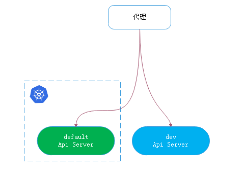
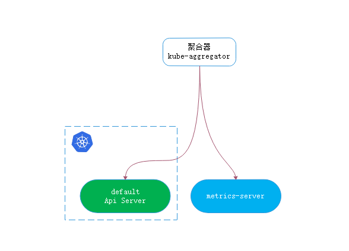
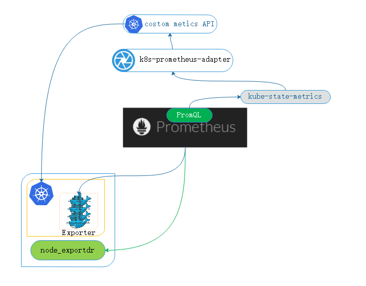
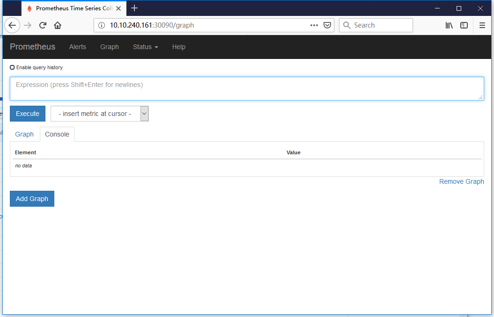
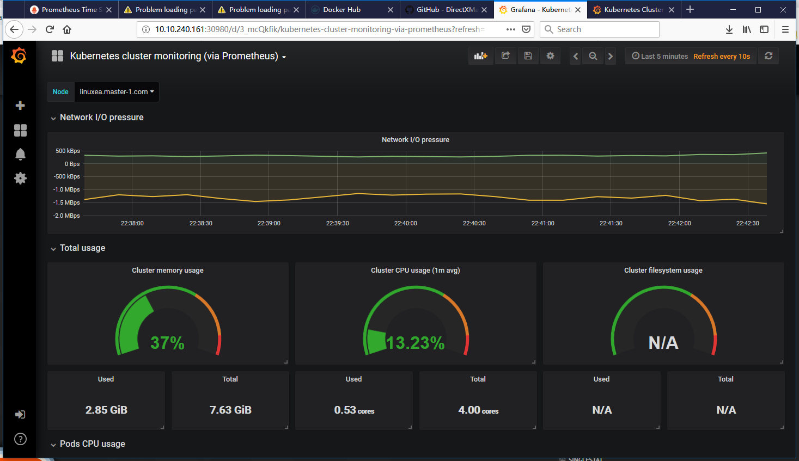

我们在之前知道heapster在1.113后将完全启用。

在资源指标中分为资源指标和自定义指标，先前的heapster就提供了资源收集存储和监控基本的功能，并且支持多个存储接收器，如：InflxDB等。这些组件均由第三方提供，由于某些不稳定的因素，heapster整合了十多个后端存储适配器，匹配这些适配器同时也增加了代码量，并且尚未得到改善，由此可见，这种架构下，heapster并不是很适用于后期的稳定发展。

heapster是一个原始的时间序列存储数据库，每个接收器都作为核心代码的一部分，使得整个监控结构定义越来越麻烦。我们知道kuberntes是非常灵活可扩展的，替换heapster，并不困难。

现有的版本中，支持开发人员定义API服务器扩展核心API服务，一些特殊应用程序可以进行扩展到kuerntes支持的资源类型中，一般情况，有三种方式：CRD：自定义资源指标，自定义API server，修改源码定义

在kubernetes中，有一种方式可以使开发人员轻松使用自己的API服务器，来扩展附加到已有的kubernetes之上，聚合进更多新的功能

在kubernetes集群中，api server支持那些组件，都是kubernetes事先定义好的，如果我们想要的组件，这里面没有的话，就可以自己开发api server，并且可以单独运行，也可以托管到kubernetes上运行，然后在kubernetes服务器和开发的api server前段添加代理服务，而后所有对api server的请求，既能获取已有的api，也能获取自己开发定义的api server。像这种就成为聚合器。如下：



在1.8中引入了资源指标API，资源内容当作接口数据获取，和早先的heapster本身自己提供不同，传统的heapster和API是不同的，在1.8之前是没有引入API的，在之后引入了APi资源指标，整合到一起。在1.6引入了自定义指标。有一些组件是依赖这些指标的，如kubectl top命令，如果没有一个收集资源指标的供给，是无法正常运行的。

另外像HPA(水平pod自动伸缩器)，这些还是需要根据获取当前pod的资源情况定义。比如CPU占用量已经达到百分之80，负载较高就添加pod，如果CPU 占用率低于百分之五，就删减几个pod。

- 我们知道无论pod运行与否，只要pod定义了requests，只要被调度，就会调度到某个节点上，节点上的资源就会预留给pod使用，如果这个pod空闲，那就会浪费资源。可以将这个pod移出，从而腾出更多的空间以供应其他的pod使用。

这些组件都是依赖资源指标才能工作的，早期都是依赖heapster才能实现。比如早期在kubernetes之上必须部署heapster才能使用top命令，另外才能使用hpa，对deployment之下的pod做水平自动伸缩。

此前这些指标只能让heapster提供，并且都是很有限度的，伸缩数据能力只能根据CPUY用量来伸缩，并不能根据io，内存，网卡等，heapster是做不到的。我们期望使用越来越多的指标来做，比如：cpu利用率都很低。而pod并发访问量很大，可能这时候已经需要添加pod了，但是这时候并不能根据并发指标来做。所以，仅仅根据cpu不足以反馈应用伸缩的场景，这时候就需要引入更多的其他的指标。

这时候就出现了新的资源指标模型，以及更多的自定义指标模型。新的资源指标获取的主要方式，是通过metrics-server来实现的。

## prometheus

k8s中也允许开始的自定义指标的有一些监控系统，如prometheus，prometheus已经被收入到cncf([云原生计算基金会构建可持续生态系统 Cloud Native Computing Foundation](https://www.cncf.io/))下的項目，第一個是kubernetes，第二个则是prometheus。

prometheus能收集各种维度的指标，如：CPu，内存，io，流量等等，这些数据被整合到kubernetes中，让kubernetes能够拿来作为判断是否来伸缩pod规模的基本标准。

后来，自定义指标通过prometheus来使用，即作为监控系统，有作为特殊资源指标提供，这些指标可自定义指标。

新的架构中有核心指标和监控：

- 核心指标包括主要指kubelet，metrics-server以及由api server提供的api组件组成。其中CPU累计使用率(累计使用时长占整个CPU使用总执行时间)，内存实时使用率，pod资源占用率，容器磁盘占用率。

除了这些之外，可能还要去评估网络质量，链接数量，带宽等等，这些就需要第三方工具使用。而核心指标是不能委托给第三方的，核心指标会被一些核心组件使用，如：kubectl top，dashboard都会用到，所以这些称为核心指标。

- 监控指标： 用于系统收集各种指标数据并提供终端用户，并不限于内存，pod资源占用磁盘使用，存储系统以及HPA等等。

hpa不单单可以使用核心指标有也可以使用监控自定义的扩展指标。监控指标就成为非核心指标，也包含一些核心指标，除此之外还能包含很多其他的指标。

这些非核心指标本身是无法被kubernetes解析的。prometheus是可以理解的，而kunernetes是无法理解的，这也就是为什么需要一个k8s-prometheus-adapter的原因。我们需要将prometheus采集的数据转换成kubernetes理解的格式。

k8s本身不提供这样的组件，如果用户不打算使用prometheus，就可以不用部署，但是核心的核心指标组件是必须要部署的。核心指标组件早期是heapster提供的，1.12彻底废弃，核心指标就交给metrics-server聚合提供。

## metrics-server

metrics-server是用户开放的一个api server，这个api server用于服务资源指标服务器，并不是服务kubernetes api，更不是服务pod api，仅仅用于服务cpu利用率，内存使用率等等对象。

metrics-server并不是kubernetes组成部分，只是托管在kubernetes之上的一个pod，为了能让用户使用metrics-server之上的api，在kubernetes上可以无缝使用metrics-server，可以在新的结构中这样的组织，如下：



kubernetes依然正常运行，除此之外额外运行一个metrics-server，metrics-server也能提供另外一组api，这两组api合并到一起当一个使用，就需要在之前加一层代理，这个代理叫做聚合器(kube-aggregator)。这个聚合器不单单能聚合metrics-server，其他的第三方也可以聚合。

这个聚合器提供的资源指标是：/apis/metrics.k8s.io/v1beta1，kubernetes默认不提供这个接口，通过metrics-server提供/apis/metrics.k8s.io/v1beta1，而kubernetes提供原生的api 群组，这两个api server通过kube-aggregator聚合器的方式整合到一起，用户访问时通过kube-aggregator，既能访问原生的api 群组，也能通过kube-aggregator访问metrics-server提供的额外群组。

事实上也可以扩展其他的api，加到kube-aggregator下即可。heapster废弃后，metrics将会成kubernetes多个核心组件的先决条件，如：kubectl,top等等，如果没有metrics，这些则用不了。为了给这些组件提供数据，就要部署metrics。

## 部署

我们可以克隆kubernetes源码树中的metrics-server，也可以克隆metrics-server下的，这两个git地址不同，内容也是不同的。

1，kubernetes-incubato

克隆github上metrics-server的代码，而后使用1.8+版本部署

```
[marksugar@linuxea ~]# git clone https://github.com/kubernetes-incubator/metrics-server.git
```
使用`kubectl apply -f ./`将`/root/metrics-server/deploy/1.8+`下的所有yaml文件部署起来
```
[marksugar@linuxea ~]# cd /root/metrics-server/deploy/1.8+
[marksugar@linuxea 1.8+]# kubectl apply -f ./
```

- 确保metrics-server服务成功启动

```
[marksugar@linuxea 1.8+]# kubectl get svc -n kube-system
NAME                   TYPE        CLUSTER-IP       EXTERNAL-IP   PORT(S)         AGE
kube-dns               ClusterIP   10.96.0.10       <none>        53/UDP,53/TCP   53d
kubernetes-dashboard   NodePort    10.101.194.113   <none>        443:31780/TCP   32d
metrics-server         ClusterIP   10.99.129.34     <none>        443/TCP         1m
```

- 确保`metrics-server-85cc795fbf-7srw`pod启动

```
[marksugar@linuxea 1.8+]# kubectl get pods -n kube-system
NAME                                           READY     STATUS    RESTARTS   AGE
metrics-server-85cc795fbf-7srw2                1/1       Running   0          1m
```

2，kubernetes 的cluster/addons/metrics-server中的metrics-server

克隆kubernetes源码树中的metrics-server

> 请注意，我这里使用的是kubernetes v1.11.1版本，期间重装几次，docker使用docker://18.05.0-ce
>
> metrics-server和metrics-server-nanny版本如下：
>
> 提示：如果你不是这个版本，如果是更新的版本请阅读github使用文档，或者查看源码和yaml文件
>
>       - name: metrics-server
>         image: k8s.gcr.io/metrics-server-amd64:v0.3.1
> ```
>  - name: metrics-server-nanny
>         image: k8s.gcr.io/addon-resizer:1.8.3
> ```

单独下载这几个文件

```
auth-delegator.yaml
auth-reader.yaml
metrics-apiservice.yaml
metrics-server-deployment.yaml
metrics-server-service.yaml
resource-reader.yaml
```

```
[marksugar@linuxea metrics-server]# for i in auth-delegator.yaml auth-reader.yaml metrics-apiservice.yaml  metrics-server-deployment.yaml metrics-server-service.yaml resource-reader.yaml;do wget https://raw.githubusercontent.com/kubernetes/kubernetes/master/cluster/addons/metrics-server/$i;done
```
如果有以下报错，可参考如下：
>```
>403 Forbidden", response: "Forbidden (user=system:anonymous, verb=get, resource=nodes, subresource=stats)
>```
>
>```
>E0903  1 manager.go:102] unable to fully collect metrics: [unable to fully scrape metrics from source kubelet_summary:<hostname>: unable to fetch metrics from Kubelet <hostname> (<hostname>): Get https://<hostname>:10250/stats/summary/: dial tcp: lookup <hostname> on 10.96.0.10:53: no such host
>```
>
>```
>no response from https://10.101.248.96:443: Get https://10.101.248.96:443: Proxy Error ( Connection refused )
>```
>
>```
>E1109 09:54:49.509521       1 manager.go:102] unable to fully collect metrics: [unable to fully scrape metrics from source kubelet_summary:linuxea.node-2.com: unable to fetch metrics from Kubelet linuxea.node-2.com (10.10.240.203): Get https://10.10.240.203:10255/stats/summary/: dial tcp 10.10.240.203:10255: connect: connection refused, unable to fully scrape metrics from source kubelet_summary:linuxea.node-3.com: unable to fetch metrics from Kubelet linuxea.node-3.com (10.10.240.143): Get https://10.10.240.143:10255/stats/summary/: dial tcp 10.10.240.143:10255: connect: connection refused, unable to fully scrape metrics from source kubelet_summary:linuxea.node-4.com: unable to fetch metrics from Kubelet linuxea.node-4.com (10.10.240.142): Get https://10.10.240.142:10255/stats/summary/: dial tcp 10.10.240.142:10255: connect: connection refused, unable to fully scrape metrics from source kubelet_summary:linuxea.master-1.com: unable to fetch metrics from Kubelet linuxea.master-1.com (10.10.240.161): Get https://10.10.240.161:10255/stats/summary/: dial tcp 10.10.240.161:10255: connect: connection refused, unable to fully scrape metrics from source kubelet_summary:linuxea.node-1.com: unable to fetch metrics from Kubelet linuxea.node-1.com (10.10.240.202): Get https://10.10.240.202:10255/stats/summary/: dial tcp 10.10.240.202:10255: connect: connection refused]
>```

我们修改一些参数进行配置

修改`metrics-server-deployment.yaml`中`command`参数，配置cpu内存大小

```
        command:
          - /pod_nanny
          - --config-dir=/etc/config
          - --cpu=100m
          - --extra-cpu=0.5m
          - --memory=100Mi
          - --extra-memory=50Mi
          - --threshold=5
          - --deployment=metrics-server-v0.3.1
          - --container=metrics-server
          - --poll-period=300000
          - --estimator=exponential
          # Specifies the smallest cluster (defined in number of nodes)
          # resources will be scaled to.
          - --minClusterSize=10
```

并且修改metrics-server-amd64:v0.3.1的配置段，添加如下：

```
 - --kubelet-insecure-tls
 - --kubelet-preferred-address-types=InternalIP,Hostname,InternalDNS,ExternalDNS,ExternalIP
```

最终如下：

```
    spec:
      priorityClassName: system-cluster-critical
      serviceAccountName: metrics-server
      containers:
      - name: metrics-server
        image: k8s.gcr.io/metrics-server-amd64:v0.3.1
        command:
        - /metrics-server
        - --metric-resolution=30s
        - --kubelet-insecure-tls
        - --kubelet-preferred-address-types=InternalIP,Hostname,InternalDNS,ExternalDNS,ExternalIP
        # These are needed for GKE, which doesn't support secure communication yet.
        # Remove these lines for non-GKE clusters, and when GKE supports token-based auth.
		#- --kubelet-port=10255
		#- --deprecated-kubelet-completely-insecure=true
```

`- --kubelet-insecure-tls`这种方式是禁用tls验证，一般不建议在生产环境中使用。并且由于DNS是无法解析到这些主机名，使用`- --kubelet-preferred-address-types=InternalIP,Hostname,InternalDNS,ExternalDNS,ExternalIP`进行规避。还有另外一种方法，修改coredns，不过，我并不建议这样做。

参考这篇：https://github.com/kubernetes-incubator/metrics-server/issues/131

另外在 `resource-reader.yaml` 中添加 ` - nodes/stats`，如下：

```
[marksugar@linuxea metrics-server]# cat resource-reader.yaml 
apiVersion: rbac.authorization.k8s.io/v1
kind: ClusterRole
metadata:
  name: system:metrics-server
  labels:
    kubernetes.io/cluster-service: "true"
    addonmanager.kubernetes.io/mode: Reconcile
rules:
- apiGroups:
  - ""
  resources:
  - pods
  - nodes
  - nodes/stats
  - namespaces
```

参考：https://github.com/kubernetes-incubator/metrics-server/issues/95

apply

```
[marksugar@linuxea metrics-server]# pwd
/root/metrics-server
[marksugar@linuxea metrics-server]# kubectl apply -f .
```

```
[marksugar@linuxea metrics-server]# kubectl get pods,svc -n kube-system 
NAME                                               READY   STATUS    RESTARTS   AGE
pod/coredns-576cbf47c7-65ndt                       1/1     Running   0          2m18s
pod/coredns-576cbf47c7-rrk4f                       1/1     Running   0          2m18s
pod/etcd-linuxea.master-1.com                      1/1     Running   0          89s
pod/kube-apiserver-linuxea.master-1.com            1/1     Running   0          97s
pod/kube-controller-manager-linuxea.master-1.com   1/1     Running   0          84s
pod/kube-flannel-ds-amd64-4dtgp                    1/1     Running   0          115s
pod/kube-flannel-ds-amd64-6g2sm                    1/1     Running   0          48s
pod/kube-flannel-ds-amd64-7txhx                    1/1     Running   0          50s
pod/kube-flannel-ds-amd64-fs4lw                    1/1     Running   0          57s
pod/kube-flannel-ds-amd64-v2qvv                    1/1     Running   0          48s
pod/kube-proxy-bmhfh                               1/1     Running   0          2m18s
pod/kube-proxy-c9wkz                               1/1     Running   0          50s
pod/kube-proxy-d8vlj                               1/1     Running   0          57s
pod/kube-proxy-rpst5                               1/1     Running   0          48s
pod/kube-proxy-t5pzg                               1/1     Running   0          48s
pod/kube-scheduler-linuxea.master-1.com            1/1     Running   0          97s
pod/metrics-server-v0.3.1-69788f46f9-82w76         2/2     Running   0          15s

NAME                     TYPE        CLUSTER-IP       EXTERNAL-IP   PORT(S)         AGE
service/kube-dns         ClusterIP   10.96.0.10       <none>        53/UDP,53/TCP   2m32s
service/metrics-server   ClusterIP   10.103.131.149   <none>        443/TCP         19s
```

```
[marksugar@linuxea metrics-server]# kubectl get svc -n kube-system
NAME                   TYPE        CLUSTER-IP       EXTERNAL-IP   PORT(S)         AGE
metrics-server         ClusterIP   10.98.186.115    <none>        443/TCP         42s
```
此刻，`metrics-server`提供的`metrics.k8s.io/v1beta1`就能显示值啊`api-versions`中
```
[marksugar@linuxea metrics-server]# kubectl api-versions|grep metrics
metrics.k8s.io/v1beta1
```

这些已经准备完成，我们可以试试查看收集的数据
```
[marksugar@linuxea metrics-server]# kubectl top pods
NAME                           CPU(cores)   MEMORY(bytes)   
linuxea-hpa-68ffdc8b94-jjfw7   1m           103Mi           
linuxea-hpa-68ffdc8b94-mbgc8   1m           99Mi            
linuxea-hpa-68ffdc8b94-trtkm   1m           101Mi           
linuxea-hpa-68ffdc8b94-twcxx   1m           100Mi           
linuxea-hpa-68ffdc8b94-w9d7j   1m           100Mi      
```
```
[marksugar@linuxea metrics-server]# kubectl top nodes
NAME                   CPU(cores)   CPU%      MEMORY(bytes)   MEMORY%   
linuxea.master-1.com   197m         4%        3213Mi          41%       
linuxea.node-1.com     60m          1%        939Mi           24%       
linuxea.node-2.com     58m          1%        1066Mi          27%       
linuxea.node-3.com     127m         3%        673Mi           17%       
linuxea.node-4.com     47m          1%        664Mi           17% 
```
## prometheus

metrics-server可以对核心指标进行监控。 除开节点，podCPU内存之外的其他指标是无法获取的，就要借助prometheus。

prometheus提供的资源指标是不能够被k8s解析的，要想能在k8s上使用prometheus， 就需要额外加一个prometheus的资源转换，转成k8s api能够兼容的格式，才能被当作指标数据使用。

架构形式如下：

prometheus本身就是一个监控系统，有一个代理插件，如zabbix和zabbix-agent。

我们先假设prometheus是server端。prometheus要从一个被监控主机节点来获取数据，如果这个节点不是一个pod,而是一个虚拟机，物理机，就部署一个专门的软件 -> node_exoorter，而node_exoorter就相当于客户端。node_exoorter能够让prometheus来采集指标数据的组件，但是这个组件只是用来去暴露，输出，采集当前节点的节点级别的数据。如果要采集其他的，比如haproxy，就需要haproxy的exoorter。如果要去采集pod，pod也有专门的exoorter接口。

而且，容器的日志也在节点之上的`/var/log/containers/`中，这些日志从接口被输出来。事实上只需要获取到节点上的这些日志，就能够很容易的获取节点上pod容器中的日志。

简单的说prometheus就是通过metrics rul到各个pod获取数据，这些数据被采集后通过一个PromQL查询语句进行查询，PromQL支持restfull风格接口的查询条件表达式。通过这种restfull接口方式可以监控到采集到各种指标数据，但是这些指标不能够被k8s的api server所解释，因为这两种是不互相兼容的。

如果期望通过k8s的api server像在api中请求获取数据一样获取指标数据，并且是prometheus采集的指标数据，就必须把PromQL的数据转换成k8s中自定义定义的的查询接口格式（costom metics API），就需要在k8s的(costom metics AP)接口下嵌套一个组件，这个组件称为k8s-promethues-adpater，是有第三方提供。而kube-state-metrics 负责转换数据，k8s-promethues-adpater负责接收转换的数据。如下：



PromQL语句完成从Prometheus查询到语句，并转为k8s api上的指标格式数据，并支持通过api获取。前提是将custom Metrics API聚合到api server，就能正常从api-versions看到这个api。

promethues是有状态应用，并且自身就是一个时间序列数据库

```
prometheus-configmap.yaml   统计pod数据和定义运行环境的
kube-state-metrics-deployment.yaml  部署k8s-prometheus-adpater,使自定义的指标数据被系统使用
alertmanager-pvc.yaml  警报器管理器，使用到pvc
prometheus-statefulset.yaml 配置需求
kube-state-metrics-deployment.yaml	 这些是将prometheus数据转换
kube-state-metrics-rbac.yaml
kube-state-metrics-service.yaml
要聚合成api server中的功能 ，就需要在部署一个组件，k8s-prometheus-adpater
```

promethues是有状态应用，因此，使用statefulset控制。如果一个pod server不够就需要多个，这也就是使用statefulset的原因。

使用`https://github.com/iKubernetes/k8s-prom`路径下的文件进行，完成部署实验

- 创建一个prom的名称空间，运行prometheus

```
k8s-prometheus-adapter 完成自定义数据应用
kube-state-metrics  # kube-state部署相关
namespace.yaml  创建prom名称空间
node_exporter  收集节点指标
prometheus     使用deploy部署prometheus
```

克隆

```
[marksugar@linuxea opt]# git clone https://github.com/iKubernetes/k8s-prom.git
Cloning into 'k8s-prom'...
remote: Enumerating objects: 46, done.
remote: Total 46 (delta 0), reused 0 (delta 0), pack-reused 46
Unpacking objects: 100% (46/46), done.
[marksugar@linuxea opt]# tree k8s-prom/
-bash: tree: command not found
[marksugar@linuxea opt]# cd k8s-prom/
```

### 创建名称空间

```
[marksugar@linuxea k8s-prom]# kubectl apply -f namespace.yaml 
namespace/prom created
```

### 部署node_exporter
apply  node_exporter
```
[marksugar@linuxea k8s-prom]# kubectl apply -f node_exporter/
daemonset.apps/prometheus-node-exporter created
service/prometheus-node-exporter created
```

而后在prom中的名称空间下的pod已经运行起来，这些pod的kind是`DaemonSet`，每个节点会运行一个pod，收集Node主机资源。包括主节点

这里面的`node-exporter pod`版本用的是`prom/node-exporter:v0.16.0`

```
[marksugar@linuxea k8s-prom]# kubectl get pods,svc -n prom
NAME                             READY   STATUS    RESTARTS   AGE   IP            
prometheus-node-exporter-b7f2s   1/1     Running   0          2m4s	10.10.240.161 
prometheus-node-exporter-cqnwh   1/1     Running   0          2m4s	10.10.240.142 
prometheus-node-exporter-k2q7f   1/1     Running   0          2m4s	10.10.240.203 
prometheus-node-exporter-x86b4   1/1     Running   0          2m4s	10.10.240.202 
prometheus-node-exporter-znhb8   1/1     Running   0          2m4s	10.10.240.143 

NAME                               TYPE        CLUSTER-IP   EXTERNAL-IP   PORT(S)    AGE
service/prometheus-node-exporter   ClusterIP   None         <none>        9100/TCP   2m31s
```

### 部署prometheus

创建`prometheus`

```
[marksugar@linuxea k8s-prom]# kubectl apply -f prometheus/
configmap/prometheus-config created
deployment.apps/prometheus-server created
clusterrole.rbac.authorization.k8s.io/prometheus created
serviceaccount/prometheus created
clusterrolebinding.rbac.authorization.k8s.io/prometheus created
service/prometheus created
```
prometheus是以30090端口暴露出来的
```
[marksugar@linuxea k8s-prom]# kubectl get pods,svc -n prom
NAME                                    READY   STATUS    RESTARTS   AGE
pod/prometheus-node-exporter-4xq5h      1/1     Running   0          37m
pod/prometheus-node-exporter-8qh82      1/1     Running   0          37m
pod/prometheus-node-exporter-b5kwx      1/1     Running   0          37m
pod/prometheus-node-exporter-dgvfv      1/1     Running   0          37m
pod/prometheus-node-exporter-gm9pv      1/1     Running   0          37m
pod/prometheus-server-5f8cd4755-ns5l7   1/1     Running   0          11m

NAME                               TYPE        CLUSTER-IP       EXTERNAL-IP   PORT(S)          AGE
service/prometheus                 NodePort    10.105.244.208   <none>        9090:30090/TCP   11m
service/prometheus-node-exporter   ClusterIP   None             <none>        9100/TCP         37m
```

而后使用30090访问



### 部署kube-state-metrics

部署使用`kube-state-metrics`

```
[marksugar@linuxea k8s-prom]# kubectl  apply -f kube-state-metrics/
deployment.apps/kube-state-metrics created
serviceaccount/kube-state-metrics created
clusterrole.rbac.authorization.k8s.io/kube-state-metrics created
clusterrolebinding.rbac.authorization.k8s.io/kube-state-metrics created
service/kube-state-metrics created
```

kube-state-metrics输出的service监听在8080端口之上，向外提供服务的。

```
[marksugar@linuxea k8s-prom]# kubectl get all -n prom
NAME                                      READY   STATUS    RESTARTS   AGE
pod/kube-state-metrics-68d7c699c6-gstgg   1/1     Running   0          9m34s
pod/prometheus-node-exporter-4xq5h        1/1     Running   0          84m
pod/prometheus-node-exporter-8qh82        1/1     Running   0          84m
pod/prometheus-node-exporter-b5kwx        1/1     Running   0          84m
pod/prometheus-node-exporter-dgvfv        1/1     Running   0          84m
pod/prometheus-node-exporter-gm9pv        1/1     Running   0          84m
pod/prometheus-server-5f8cd4755-ns5l7     1/1     Running   0          59m

NAME                               TYPE        CLUSTER-IP       EXTERNAL-IP   PORT(S)          AGE
service/kube-state-metrics         ClusterIP   10.98.44.126     <none>        8080/TCP         9m35s
service/prometheus                 NodePort    10.105.244.208   <none>        9090:30090/TCP   59m
service/prometheus-node-exporter   ClusterIP   None             <none>        9100/TCP         84m

NAME                                      DESIRED   CURRENT   READY   UP-TO-DATE   AVAILABLE   NODE SELECTOR   AGE
daemonset.apps/prometheus-node-exporter   5         5         5       5            5           <none>          84m

NAME                                 DESIRED   CURRENT   UP-TO-DATE   AVAILABLE   AGE
deployment.apps/kube-state-metrics   1         1         1            1           9m35s
deployment.apps/prometheus-server    1         1         1            1           59m

NAME                                            DESIRED   CURRENT   READY   AGE
replicaset.apps/kube-state-metrics-68d7c699c6   1         1         1       9m35s
replicaset.apps/prometheus-server-5f8cd4755     1         1         1       59m
```

### 部署prometheus-adapter

k8s-prometheus-adapter需要给予https提供服务，而默认情况下k8s-prometheus-adapter是http协议的。需要提供一个证书，使其运行成https，并且需要被此k8s服务器认可的ca签署才可以。我们自制一个即可。

而后创建secret，名称和`custom-metrics-apiserver-deployment.yaml `中一样

```
        secret:
          secretName: cm-adapter-serving-certs
```

#### 自制证书

```
[marksugar@linuxea ~]# cd /etc/kubernetes/pki
```

生成私钥

```
[marksugar@linuxea pki]# (umask 077;openssl genrsa -out serving.key 2048)
Generating RSA private key, 2048 bit long modulus
..............+++
...............................+++
e is 65537 (0x10001)
```

生成签署请求

```
[marksugar@linuxea pki]# openssl req -new -key serving.key -out serving.csr -subj "/CN=serving"
[marksugar@linuxea pki]# ll serving.*
-rw-r--r--. 1 root root  887 Nov 10 09:38 serving.csr
-rw-------. 1 root root 1675 Nov 10 09:36 serving.key
```

签证

```
[marksugar@linuxea pki]# openssl x509 -req -in serving.csr -CA ./ca.crt -CAkey ./ca.key -CAcreateserial -out serving.crt -days 3650
Signature ok
subject=/CN=serving
Getting CA Private Key
[marksugar@linuxea pki]# ll serving.*
-rw-r--r--. 1 root root  977 Nov 10 09:39 serving.crt
-rw-r--r--. 1 root root  887 Nov 10 09:38 serving.csr
-rw-------. 1 root root 1675 Nov 10 09:36 serving.key
```

#### 创建secret

在prom名称空间中创建secret

```
[marksugar@linuxea pki]# kubectl create secret generic cm-adapter-serving-certs --from-file=serving.crt=./serving.crt --from-file=serving.key=./serving.key -n prom
secret/cm-adapter-serving-certs created
```

```
[marksugar@linuxea pki]# kubectl get secret -n prom
NAME                             TYPE                                  DATA   AGE
cm-adapter-serving-certs         Opaque                                2      4s
default-token-x8t89              kubernetes.io/service-account-token   3      144m
kube-state-metrics-token-6n8rj   kubernetes.io/service-account-token   3      26m
prometheus-token-8lqgk           kubernetes.io/service-account-token   3      76m
```

#### prometheus-adapter

在应用之前，我们修改几个参数

先替换到`custom-metrics-apiserver-deployment.yaml`文件

```
[marksugar@linuxea k8s-prom]# mv /opt/k8s-prom/k8s-prometheus-adapter/custom-metrics-apiserver-deployment.yaml /opt/
```

下载[k8s-prometheus-adapter](https://github.com/DirectXMan12/k8s-prometheus-adapter)

```
[marksugar@linuxea k8s-prom]# curl -Lks https://raw.githubusercontent.com/DirectXMan12/k8s-prometheus-adapter/master/deploy/manifests/custom-metrics-apiserver-deployment.yaml  -o /opt/k8s-prom/k8s-prometheus-adapter/custom-metrics-apiserver-deployment.yaml
```

替换namespace为prom

而后apply

```
[marksugar@linuxea k8s-prom]# kubectl apply -f k8s-prometheus-adapter/
clusterrolebinding.rbac.authorization.k8s.io/custom-metrics:system:auth-delegator created
rolebinding.rbac.authorization.k8s.io/custom-metrics-auth-reader created
deployment.apps/custom-metrics-apiserver created
clusterrolebinding.rbac.authorization.k8s.io/custom-metrics-resource-reader created
serviceaccount/custom-metrics-apiserver created
service/custom-metrics-apiserver created
apiservice.apiregistration.k8s.io/v1beta1.custom.metrics.k8s.io created
clusterrole.rbac.authorization.k8s.io/custom-metrics-server-resources created
clusterrole.rbac.authorization.k8s.io/custom-metrics-resource-reader created
clusterrolebinding.rbac.authorization.k8s.io/hpa-controller-custom-metrics created
```

确保在api-versions中出现`custom.metrics.k8s.io/v1beta1`

```
[marksugar@linuxea k8s-prom]# kubectl api-versions|grep custom.metrics.k8s.io/v1beta1
custom.metrics.k8s.io/v1beta1
```

打开 一个代理进行curl这个api，通过这个端口curl获取指标数据

```
[marksugar@linuxea ~]# kubectl proxy --port=1808
Starting to serve on 127.0.0.1:1808
```

```
[marksugar@linuxea k8s-prometheus-adapter]# curl localhost:1808/apis/custom.metrics.k8s.io/v1beta1
```

## grafana

仍然修改namespace为prom，并且网络类型中添加type: NodePort

如果influxdb，可以注释掉

```
[marksugar@linuxea metrics]# kubectl apply -f grafana.yaml 
deployment.apps/monitoring-grafana created
service/monitoring-grafana created
```

查看下端口是否能够进行访问

```
[marksugar@linuxea metrics]# kubectl get pods,svc -n prom 
NAME                                           READY     STATUS    RESTARTS   AGE
pod/custom-metrics-apiserver-65f545496-pj89v   1/1       Running   0          18m
pod/kube-state-metrics-58dffdf67d-7sv77        1/1       Running   0          20m
pod/monitoring-grafana-ffb4d59bd-hjtc4         1/1       Running   0          30s
pod/prometheus-node-exporter-m74w9             1/1       Running   0          21m
pod/prometheus-node-exporter-xgpqs             1/1       Running   0          21m
pod/prometheus-server-65f5d59585-nx5b2         1/1       Running   0          21m

NAME                               TYPE        CLUSTER-IP      EXTERNAL-IP   PORT(S)          AGE
service/custom-metrics-apiserver   ClusterIP   10.97.212.117   <none>        443/TCP          18m
service/kube-state-metrics         ClusterIP   10.100.137.12   <none>        8080/TCP         21m
service/monitoring-grafana         NodePort    10.98.244.37    <none>        80:30980/TCP     30s
service/prometheus                 NodePort    10.109.127.27   <none>        9090:30090/TCP   21m
service/prometheus-node-exporter   ClusterIP   None            <none>        9100/TCP         21m
```

URL位置使用的是service名称路径，那端口就是prometheus的9090端口.`http://prometheus.prom.svc:9090`


下载一个cluster的[模板1](https://grafana.com/dashboards/3119),[pod模板2](https://grafana.com/dashboards/6663)，[node模板3](https://grafana.com/dashboards/315)



## hpa
hpa有着非常强大的功能，支持应用规模的自动伸缩。如果某一个pod，资源利用率达到一个临界值后，会自动的修改Deployment的replicas值，这种方式也有自动计算结果得到的。比如说，我有5个pod，我期望每个负债率是90% 就开始扩展。而后少于在缩减。

hpa是有两个版本，v1使用核心指标定义，而核心指标中只有cpu和内存，而内存不可压缩资源，也不支持弹性压缩，那就只能使用cpu指标进行伸缩

```
[marksugar@linuxea linuxea]# kubectl api-versions
autoscaling/v1
autoscaling/v2beta1
```

在`explain hpa.spec`中：
`maxReplicas`：最大副本数
`minReplicas`：最少副本数
`targetCPUUtilizationPercentage`：cpu评估，cpu利用率到多少就开始伸缩

在`hpa.spec.scaleTargetRef`： 基于资源伸缩标准

### 资源自动伸缩

我们创建一个pod，并且做资源限制.yaml如下：

```
[marksugar@linuxea linuxea]# cat deploy-hpa.yaml 
apiVersion: apps/v1
kind: Deployment
metadata: 
  name: linuxea-hpa
  namespace: default
  labels:
    www: linuxea-com
    tier: backend
spec:
  replicas: 1
  selector:
    matchLabels:
      version: v0.1.32
  template:
    metadata:
      labels:
        version: v0.1.32  
    spec:               
      containers:
      - name: nginx-hpa
        image: marksugar/nginx:1.14.b
        ports:
        - name: http
          containerPort: 80
        resources:
          requests:
            cpu: "300m"
            memory: "256Mi"
          limits:
            cpu: "1"
            memory: "512Mi"
```
```
[marksugar@linuxea linuxea]# kubectl apply -f deploy-hpa.yaml 
deployment.apps/linuxea-hpa created
```
```
[marksugar@linuxea linuxea]# kubectl get pods
NAME                           READY     STATUS    RESTARTS   AGE
linuxea-hpa-6f7b8ddb67-cfcdw   1/1       Running   0          5s
```

  而后配置service

```
[marksugar@linuxea linuxea]# cat deploy-hpa-svc.yaml 
kind: Service
apiVersion: v1
metadata:
  name: linuxea-hpa
spec:
  type: NodePort
  ports:
  - port: 80
    targetPort: 80
    nodePort: 30080
  selector:
    version: v0.1.32
```

```
[marksugar@linuxea linuxea]# kubectl apply -f deploy-hpa-svc.yaml 
service/linuxea-hpa created
[marksugar@linuxea linuxea]# kubectl get svc
NAME          TYPE        CLUSTER-IP      EXTERNAL-IP   PORT(S)        AGE
kubernetes    ClusterIP   10.96.0.1       <none>        443/TCP        17h
linuxea-hpa   NodePort    10.105.186.30   <none>        80:30080/TCP   6s
```

这样一来就可以通过30080访问

###  autoscale

- autoscale

我们定义自动伸缩，创建一个autoscale的控制器。`kubectl autoscale --help`

指明最多有几个，最少有几个，cpu利用率最多不能超过多少

```
  # Auto scale a deployment "foo", with the number of pods between 2 and 10, no target CPU utilization specified so a
default autoscaling policy will be used:
  kubectl autoscale deployment foo --min=2 --max=10
  
  # Auto scale a replication controller "foo", with the number of pods between 1 and 5, target CPU utilization at 80%:
  kubectl autoscale rc foo --max=5 --cpu-percent=80
```

使用autoscale定义，最少一个，最多八个，cpu利用率最多不能使用超过60

```
[marksugar@linuxea linuxea]# kubectl autoscale deployment linuxea-hpa --min=1 --max=8 --cpu-percent=60
horizontalpodautoscaler.autoscaling/linuxea-hpa autoscaled
```

像这样

```
[marksugar@linuxea linuxea]# kubectl get hpa
NAME        REFERENCE                TARGETS         MINPODS   MAXPODS   REPLICAS   AGE
linuxea-hpa Deployment/linuxea-hpa   <unknown>/60%   1         8         0          4s
```

```
[marksugar@linuxea linuxea]# kubectl get hpa
NAME          REFERENCE                TARGETS   MINPODS   MAXPODS   REPLICAS   AGE
linuxea-hpa   Deployment/linuxea-hpa   0%/60%    1         8         1          7s
```

我们做一些压力测试，如果CPU到60%就会创建新的pod

压力测试

```
[marksugar@linuxea linuxea]#  ab -c 1000 -n 150099 http://10.10.240.161:30080/linuxea.html
```

```
[marksugar@linuxea linuxea]# kubectl describe hpa
Name:                                                  linuxea-hpa
Namespace:                                             default
Labels:                                                <none>
Annotations:                                           <none>
CreationTimestamp:                                     Sun, 11 Nov 2018 07:29:54 +0000
Reference:                                             Deployment/linuxea-hpa
Metrics:                                               ( current / target )
  resource cpu on pods  (as a percentage of request):  105% (316m) / 60%
Min replicas:                                          1
Max replicas:                                          8
Deployment pods:                                       1 current / 2 desired
Conditions:
  Type            Status  Reason              Message
  ----            ------  ------              -------
  AbleToScale     True    SucceededRescale    the HPA controller was able to update the target scale to 2
  ScalingActive   True    ValidMetricFound    the HPA was able to successfully calculate a replica count from cpu resource utilization (percentage of request)
  ScalingLimited  False   DesiredWithinRange  the desired count is within the acceptable range
Events:
  Type    Reason             Age   From                       Message
  ----    ------             ----  ----                       -------
  Normal  SuccessfulRescale  6s    horizontal-pod-autoscaler  New size: 2; reason: cpu resource utilization (percentage of request) above target

```

随着负载的上涨，pod也会创建

```
[marksugar@linuxea linuxea]# kubectl get pods
NAME                           READY     STATUS    RESTARTS   AGE
linuxea-hpa-6f7b8ddb67-hrb64   1/1       Running   0          10m
linuxea-hpa-6f7b8ddb67-mgnkc   1/1       Running   0          18s
```

那么现在已经运行了两个

```
[marksugar@linuxea linuxea]# kubectl get hpa
NAME          REFERENCE                TARGETS   MINPODS   MAXPODS   REPLICAS   AGE
linuxea-hpa   Deployment/linuxea-hpa   0%/60%    1         8         2          11m
```

一旦负载超过阈值就会创建预设的最大值和最小值

```
[marksugar@linuxea linuxea]# kubectl get hpa -w
NAME          REFERENCE                TARGETS   MINPODS   MAXPODS   REPLICAS   AGE
linuxea-hpa   Deployment/linuxea-hpa   0%/60%    1         8         2          12m
linuxea-hpa   Deployment/linuxea-hpa   23%/60%   1         8         2         12m
linuxea-hpa   Deployment/linuxea-hpa   0%/60%    1         8         2         13m
linuxea-hpa   Deployment/linuxea-hpa   0%/60%    1         8         2         13m
linuxea-hpa   Deployment/linuxea-hpa   122%/60%   1         8         2         14m
linuxea-hpa   Deployment/linuxea-hpa   144%/60%   1         8         4         14m
```

```
[marksugar@linuxea linuxea]# kubectl get pods -w
NAME                           READY     STATUS    RESTARTS   AGE
linuxea-hpa-6f7b8ddb67-hrb64   1/1       Running   0          11m
linuxea-hpa-6f7b8ddb67-mgnkc   1/1       Running   0          1m

linuxea-hpa-6f7b8ddb67-7bn99   0/1       Pending   0         0s
linuxea-hpa-6f7b8ddb67-7fl4c   0/1       Pending   0         0s
linuxea-hpa-6f7b8ddb67-7bn99   0/1       Pending   0         0s
linuxea-hpa-6f7b8ddb67-7fl4c   0/1       Pending   0         0s
linuxea-hpa-6f7b8ddb67-7bn99   0/1       ContainerCreating   0         0s
linuxea-hpa-6f7b8ddb67-7fl4c   0/1       ContainerCreating   0         0s
linuxea-hpa-6f7b8ddb67-7bn99   1/1       Running   0         1s
linuxea-hpa-6f7b8ddb67-7fl4c   1/1       Running   0         1s
```

```
[marksugar@linuxea ~]# kubectl describe hpa
Name:                                                  linuxea-hpa
Namespace:                                             default
Labels:                                                <none>
Annotations:                                           <none>
CreationTimestamp:                                     Sun, 11 Nov 2018 07:29:54 +0000
Reference:                                             Deployment/linuxea-hpa
Metrics:                                               ( current / target )
  resource cpu on pods  (as a percentage of request):  144% (433m) / 60%
Min replicas:                                          1
Max replicas:                                          8
Deployment pods:                                       4 current / 4 desired
Conditions:
  Type            Status  Reason              Message
  ----            ------  ------              -------
  AbleToScale     False   BackoffBoth         the time since the previous scale is still within both the downscale and upscale forbidden windows
  ScalingActive   True    ValidMetricFound    the HPA was able to successfully calculate a replica count from cpu resource utilization (percentage of request)
  ScalingLimited  False   DesiredWithinRange  the desired count is within the acceptable range
Events:
  Type    Reason             Age   From                       Message
  ----    ------             ----  ----                       -------
  Normal  SuccessfulRescale  4m    horizontal-pod-autoscaler  New size: 2; reason: cpu resource utilization (percentage of request) above target
  Normal  SuccessfulRescale  37s   horizontal-pod-autoscaler  New size: 4; reason: cpu resource utilization (percentage of request) above target
```

默认使用的autocale的v1控制器

### autoscaling/v2beta1

使用autoscaling/v2beta1，kind为HorizontalPodAutoscaler。对linuxea-hpa进行扩展，如下

```
spec:
  scaleTargetRef:
    apiVersion: extensions/v1beta1
    kind: Deployment
    name: linuxea-hpa
```

对这个资源minReplicas最少一个，maxReplicas最大5个，metrics对cpu资源进行评估，当cpu使用30%就进行自动扩展，内存超过50M（targetAverageValue只能是值）

```
  minReplicas: 1
  maxReplicas: 5
  metrics:
  - type: Resource
    resource:
      name: cpu
      targetAverageUtilization: 30
  - type: Resource
    resource:
      name: memory
      targetAverageValue: 50Mi
```

如下：

```
[marksugar@linuxea ~]# cat autoscale-hpa.yaml 
apiVersion: autoscaling/v2beta1
kind: HorizontalPodAutoscaler
metadata:
  name: linuxea-hpa-2
spec:
  scaleTargetRef:
    apiVersion: extensions/v1beta1
    kind: Deployment
    name: linuxea-hpa
  minReplicas: 1
  maxReplicas: 10
  metrics:
  - type: Resource
    resource:
      name: cpu
      targetAverageUtilization: 30
  - type: Resource
    resource:
      name: memory
      targetAverageValue: 50Mi
```

删掉v1版本的，而后apply v2beta1

```
[marksugar@linuxea ~]# kubectl delete hpa linuxea-hpa
horizontalpodautoscaler.autoscaling "linuxea-hpa" deleted
```

```
[marksugar@linuxea ~]# kubectl apply -f autoscale-hpa.yaml
horizontalpodautoscaler.autoscaling/linuxea-hpa-2 configured
```

此时就可以对CPU和内存资源做评估

```
[marksugar@linuxea ~]# kubectl get hpa
NAME            REFERENCE              TARGETS                         MINPODS   MAXPODS   REPLICAS   AGE
linuxea-hpa-2   Deployment/linuxea-hpa <unknown>/50Mi, <unknown>/30%   1   10 5   3s
```

如果压力满足就扩展，否则就缩减

压测

```
[marksugar@linuxea linuxea]# ab -c 1000 -n 150099 http://10.10.240.161:30080/linuxea.html
```

```
[marksugar@linuxea ~]# kubectl get hpa
NAME            REFERENCE                TARGETS                      MINPODS   MAXPODS   REPLICAS   AGE
linuxea-hpa-2   Deployment/linuxea-hpa   107837030400m/50Mi, 0%/30%   1  10  5   6m
```

当检测到压测,进行扩展

```
[marksugar@linuxea linuxea]# kubectl get pods -w
NAME                           READY     STATUS    RESTARTS   AGE
linuxea-hpa-6f7b8ddb67-7bn99   1/1       Running   0          3m
linuxea-hpa-6f7b8ddb67-7fl4c   1/1       Running   0          3m
linuxea-hpa-6f7b8ddb67-c8ssz   1/1       Running   0          39s
linuxea-hpa-6f7b8ddb67-hrb64   1/1       Running   0          18m
linuxea-hpa-6f7b8ddb67-mgnkc   1/1       Running   0          7m
linuxea-hpa-6f7b8ddb67-l89sk   0/1       Pending   0         0s
linuxea-hpa-6f7b8ddb67-vfkqj   0/1       Pending   0         0s
linuxea-hpa-6f7b8ddb67-l89sk   0/1       Pending   0         0s
linuxea-hpa-6f7b8ddb67-f96n5   0/1       Pending   0         0s
linuxea-hpa-6f7b8ddb67-vfkqj   0/1       Pending   0         0s
linuxea-hpa-6f7b8ddb67-gpxkt   0/1       Pending   0         0s
linuxea-hpa-6f7b8ddb67-f96n5   0/1       Pending   0         0s
linuxea-hpa-6f7b8ddb67-5kwtl   0/1       Pending   0         0s
linuxea-hpa-6f7b8ddb67-gpxkt   0/1       Pending   0         0s
linuxea-hpa-6f7b8ddb67-5kwtl   0/1       Pending   0         0s
linuxea-hpa-6f7b8ddb67-vfkqj   0/1       ContainerCreating   0         0s
linuxea-hpa-6f7b8ddb67-l89sk   0/1       ContainerCreating   0         0s
linuxea-hpa-6f7b8ddb67-f96n5   0/1       ContainerCreating   0         0s
linuxea-hpa-6f7b8ddb67-5kwtl   0/1       ContainerCreating   0         0s
linuxea-hpa-6f7b8ddb67-gpxkt   0/1       ContainerCreating   0         0s
linuxea-hpa-6f7b8ddb67-l89sk   1/1       Running   0         1s
linuxea-hpa-6f7b8ddb67-gpxkt   1/1       Running   0         1s
linuxea-hpa-6f7b8ddb67-5kwtl   1/1       Running   0         2s
linuxea-hpa-6f7b8ddb67-f96n5   1/1       Running   0         2s
linuxea-hpa-6f7b8ddb67-vfkqj   1/1       Running   0         2s
```

可使用`kubectl describe hpa `查看

```
[marksugar@linuxea ~]# kubectl describe hpa 
Name:                                                  linuxea-hpa-2
Namespace:                                             default
Labels:                                                <none>
Annotations:                                           kubectl.kubernetes.io/last-applied-configuration={"apiVersion":"autoscaling/v2beta1","kind":"HorizontalPodAutoscaler","metadata":{"annotations":{},"name":"linuxea-hpa-2","namespace":"default"},"spec":...
CreationTimestamp:                                     Sun, 11 Nov 2018 07:46:29 +0000
Reference:                                             Deployment/linuxea-hpa
Metrics:                                               ( current / target )
  resource memory on pods:                             107750195200m / 50Mi
  resource cpu on pods  (as a percentage of request):  73% (221m) / 30%
Min replicas:                                          1
Max replicas:                                          5
Deployment pods:                                       5 current / 5 desired
Conditions:
  Type            Status  Reason            Message
  ----            ------  ------            -------
  AbleToScale     False   BackoffBoth       the time since the previous scale is still within both the downscale and upscale forbidden windows
  ScalingActive   True    ValidMetricFound  the HPA was able to successfully calculate a replica count from cpu resource utilization (percentage of request)
  ScalingLimited  True    TooManyReplicas   the desired replica count is more than the maximum replica count
Events:
  Type    Reason             Age   From                       Message
  ----    ------             ----  ----                       -------
  Normal  SuccessfulRescale  2m    horizontal-pod-autoscaler  New size: 5; reason: memory resource above target
```

缩减的速度非常的慢，需要等待。

如果能够通过prometheus导出指标，就可以根据指标来做伸缩。每个pod上做的资源指标可以用否，取决于prometheus能够从 pod内的应用获取到什么指标的。在开发这些应用的时候就应该输出指标数据，当前能够承载的最大访问数，可以基于此类的方式，特定的指标做扩展。不过，这些需要进行自己去定义，并且支持。

### 自定义指标

type为pods，说明使用pods中的名称为http_requests的指标，达到300个就扩展

```
  metrics:
  - type: Pods
      name: 
        metricsName: http_requests
        targetAverageValue: 300m
```

其他[参考](https://banzaicloud.com/blog/k8s-horizontal-pod-autoscaler/)

