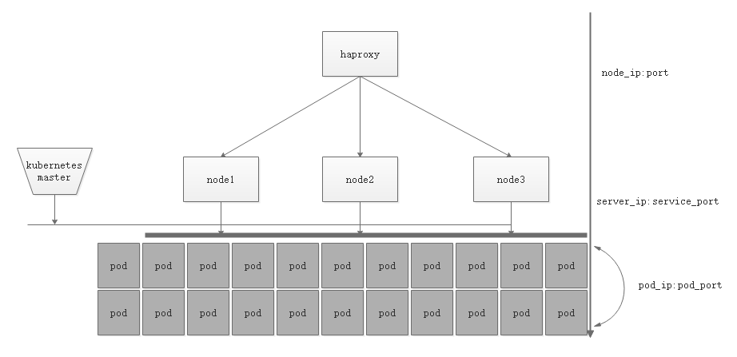

在之前的一章中简单的介绍了Yum[安装kubernetes](https://www.linuxea.com/1934.html)的方式，这次的笔记记录kubernetes的一些基础入门的一些操作，更多的是关乎于kubectl的一些使用，如：创建pod，scv，动态的增删，回滚，以及简单的网络等
### kubectl
kubectl其实就是kubernetes的一个客户端程序，他通过连接master节点上的api-server，而在api-server上，kubectl就是唯一的一个api-server管理工具，他能够连接到api-server，实现对象资源的增删改查等基本操作
kubectl的基本命令:

- 基础命令：create,expose,run,set
- 中级命令：explain,get,edit,delete
- 部署命令，rollout,scale,autoscale
- 集群管理：certificate,cluster-info,top,cordon,uncordon,drain,taint
- 系统：describe,logs,attach,exec,port-forward,porxy等
- 高级命令：apply,patch,replace,wait,convert
- 设置命令：label,annotate,completion
- 其他：alpha,api-resources,api-versions,config,plugin,version

### run pod
```
[marksugar@linuxea ~]# kubectl run nginx-linuxea --image=marksugar/nginx:1.14.a --port=8787 --replicas=1 --dry-run=true
deployment.apps/nginx-linuxea created (dry run)
```
--image：镜象，--port:暴露端口，--replicas：启动的pod，--dry-run=true：干跑测试，-- /bin/sh 则是只运行shell，需要加上-it
创建干跑测试
```
[marksugar@linuxea-k8s-master-1 ~]# kubectl run nginx-linuxea --image=nginx:1.15-alpine --port=8787 --replicas=1 --dry-run=true
deployment.apps/nginx-linuxea created (dry run)
```
没有问题后在运行
```
[marksugar@linuxea ~]# kubectl run nginx-linuxea --image=marksugar/nginx:1.14.a --port=8787 --replicas=1
deployment.apps/nginx-linuxea created
```
创建之后可以使用kubectl get pods或者-o wide命令查看
其中READY为数量(就绪了多少容器和有多少容器)，STATUS状态信息，RESTARTS是否重启，AGE启动时间，PODip地址，NODEnode机器名称。这里的ContainerCreating应该是在Pull镜像
```
[marksugar@linuxea ~]# kubectl get pod
NAME                             READY     STATUS              RESTARTS   AGE
nginx-linuxea-5786698598-4sdnt   0/1       ContainerCreating   0          6s
[marksugar@linuxea ~]# kubectl get pod
NAME                             READY     STATUS              RESTARTS   AGE
nginx-linuxea-5786698598-4sdnt   0/1       ContainerCreating   0          8s

[marksugar@linuxea ~]# kubectl get pod
NAME                             READY     STATUS    RESTARTS   AGE
nginx-linuxea-5786698598-4sdnt   1/1       Running   0          5m
[marksugar@linuxea ~]# kubectl get pod -o wide
NAME                             READY     STATUS    RESTARTS   AGE       IP             NODE                 NOMINATED NODE
nginx-linuxea-5786698598-4sdnt   1/1       Running   0          6m        172.16.2.251   linuxea.node-2.com   <none>
[marksugar@linuxea ~]# 
```
也可使用 kubectl get deployment查看
其中NAME为指定名称，DESIRED期望的副本个数，CURRENT当前启动的个数，UP-TO-DATE最新状态个数，AVAILABLE就绪的个数，AGE启动时间
```
[marksugar@linuxea ~]#  kubectl get deployment
NAME            DESIRED   CURRENT   UP-TO-DATE   AVAILABLE   AGE
nginx-linuxea   1         1         1            1           7m
[marksugar@linuxea ~]# 
```
回到l linuxea.node-2.com，它的cni0的ip段则为pod的ip段，且各机器ip段可能并不一样(在pod中的ip一般和node的ip段在一个段)
```
[marksugar@linuxea-vm-Node203 ~]# ip a|grep cni0
260: cni0: <BROADCAST,MULTICAST,UP,LOWER_UP> mtu 1450 qdisc noqueue state UP qlen 1000
    inet 172.16.2.1/24 scope global cni0
270: veth3cbd5bb9@if3: <BROADCAST,MULTICAST,UP,LOWER_UP> mtu 1450 qdisc noqueue master cni0 state UP 
```
当然，我们可以在kebernetes内进行访问这个pod,当然，在kubernetes之外是不能访问的
```
[marksugar@linuxea ~]# curl 172.16.2.251
linuxea-nginx-linuxea-5786698598-4sdnt.com-127.0.0.1/8 172.16.2.251/24
[marksugar@linuxea ~]# curl 172.16.2.251/linuxea.html
linuxea-nginx-linuxea-5786698598-4sdnt.com ▍ 95e6756979b83 ▍version number 1.0
```
那如果要从kubernetes外进行访问，就需要其他组件，这样一来就不能用ip地址来访问量，因为我们知道这个Ip地址是随时可以发生改变的
但控制器管理pod时，当pod发生改变不足够时，就会启动一个pod来替补,简单测试下
get pod
```
[marksugar@linuxea ~]# kubectl get pod
NAME                             READY     STATUS    RESTARTS   AGE
nginx-linuxea-5786698598-4sdnt   1/1       Running   0          30m
```
删除掉
```
[marksugar@linuxea ~]# kubectl delete pods nginx-linuxea-5786698598-4sdnt
pod "nginx-linuxea-5786698598-4sdnt" deleted
```
删除的同时就会run一个新的pod
```
[marksugar@linuxea ~]# kubectl get pod
NAME                             READY     STATUS    RESTARTS   AGE
nginx-linuxea-5786698598-48xjg   1/1       Running   0          42s
```
* 注意

假如需要删除就需要删除deployment，它可能大概这样kubectl delete deployment nginx-linuxea
```
[marksugar@linuxea ~]#  kubectl get deployment
NAME                DESIRED   CURRENT   UP-TO-DATE   AVAILABLE   AGE
nginx-linuxea       1         1         1            1           22h
[marksugar@linuxea ~]# kubectl delete deployment nginx-linuxea
deployment.extensions "nginx-linuxea" deleted
```
使用-o wide时就能看见ip地址则发生改变，那么使用ip地址是不能够的，由此就需要一个固定端点来提供
```
[marksugar@linuxea ~]# kubectl get pod -o wide
NAME                             READY     STATUS    RESTARTS   AGE       IP            NODE                 NOMINATED NODE
nginx-linuxea-5786698598-48xjg   1/1       Running   0          2m        172.16.3.12   linuxea.node-3.com   <none>
```
在curl
```
[marksugar@linuxea ~]# curl 172.16.3.12
linuxea-nginx-linuxea-5786698598-48xjg.com-127.0.0.1/8 172.16.3.12/24
```
#### expose
使用kubectl expose创建，其中指明 deployment nginx-linuxea， deployment nginx-linuxea是deployment中定义过的，而后指明名称，server端口，pod端口，以及协议
```
[marksugar@linuxea ~]# kubectl expose deployment nginx-linuxea --name=www --port=8580 --target-port=80 --protocol=TCP
service/www exposed
```
get services可以看到www服务名称，默认的type ClusterIP信息，10.105.49.157是动态生成的ip，也是10.96.0.1/12位掩码中的地址，,以及8580映射的暴露端口，此刻仍然可以通过10.105.49.157ip在集群内来访问，也就是kebernetes集群内被pod客户端来访问
```
[marksugar@linuxea ~]# kubectl get services
NAME         TYPE        CLUSTER-IP      EXTERNAL-IP   PORT(S)    AGE
kubernetes   ClusterIP   10.96.0.1       <none>        443/TCP    22h
www          ClusterIP   10.105.49.157   <none>        8580/TCP   2s
```
##### kube-dns
* 但是，kubernetes集群要在pod中访问，也不是用ip来访问，在此处可能用www服务名称进行访问的，如果要用www访问就需要使用集群的coredns,当然，也不能直接使用coredns服务的ip地址
```
[marksugar@linuxea ~]#  kubectl get pods -n kube-system -o wide|grep coredns
coredns-78fcdf6894-gc64f                       1/1       Running   0          22h       172.16.0.3      linuxea.master-1.com   <none>
coredns-78fcdf6894-l67zq                       1/1       Running   0          22h       172.16.0.2      linuxea.master-1.com   <none>
```
一般使用kube-dns的ip地址10.96.0.10 即可
```
[marksugar@linuxea ~]# kubectl get service -n kube-system
NAME       TYPE        CLUSTER-IP   EXTERNAL-IP   PORT(S)         AGE
kube-dns   ClusterIP   10.96.0.10   <none>        53/UDP,53/TCP   22h
```
为了验证这一点，我们创建一个pod进行测试
client-linuxea为pod的名称，images为alpine:3.9 ，replicas1个，-it进入交互式，restart=Never不重启
```
[marksugar@linuxea ~]# kubectl run client-linuxea --image=busybox --replicas=1 -it --restart=Never
```
此刻如果镜象没有被下载，会进行下载因此卡住，从而它的状态是ContainerCreating
```
[marksugar@linuxea ~]#  kubectl get pod
NAME                            READY     STATUS              RESTARTS   AGE
client-linuxea                  0/1       ContainerCreating   0          3s
nginx-linuxea-5786698598-48xjg  1/1       Running             0          32m
```
但下载完成，进入后可以看见他的nameserver已经在10.96.0.10
```
If you don't see a command prompt, try pressing enter.
/ # cat /etc/resolv.conf 
nameserver 10.96.0.10
search default.svc.cluster.local svc.cluster.local cluster.local
options ndots:5
```
而后使用wget www:8580即可访问的
```
/ # wget www:8580
Connecting to www:8580 (10.105.49.157:8580)
index.html           100% |************************************************************************************************************************|    70  0:00:00 ETA
/ # 
```
或者这样  
```
/ # wget -O - -q http://www:8580/
linuxea-nginx-linuxea-5786698598-48xjg.com-127.0.0.1/8 172.16.3.12/24
```
回到pod外可使用dig加上pod内/etc/resolv.conf 提供的地址进行解析测试search default.svc.cluster.local svc.cluster.local cluster.local
```
[marksugar@linuxea ~]# dig -t A www.default.svc.cluster.local @10.96.0.10

; <<>> DiG 9.9.4-RedHat-9.9.4-61.el7 <<>> -t A www.default.svc.cluster.local @10.96.0.10
;; global options: +cmd
;; Got answer:
;; ->>HEADER<<- opcode: QUERY, status: NOERROR, id: 64367
;; flags: qr aa rd ra; QUERY: 1, ANSWER: 1, AUTHORITY: 0, ADDITIONAL: 1

;; OPT PSEUDOSECTION:
; EDNS: version: 0, flags:; udp: 4096
;; QUESTION SECTION:
;www.default.svc.cluster.local.	IN	A

;; ANSWER SECTION:
www.default.svc.cluster.local. 5 IN	A	10.105.49.157

;; Query time: 1 msec
;; SERVER: 10.96.0.10#53(10.96.0.10)
;; WHEN: Thu Aug 23 15:48:47 BST 2018
;; MSG SIZE  rcvd: 103
```
这里得到的地址是10.105.49.157，10.105.49.157就是www的service的ip
那么现在我们访问的是位于www下的nginx-linuxea pod的nginx信息，如果此刻删除nginx pod，同时在进行访问
```
[marksugar@linuxea ~]# kubectl get pod -o wide
NAME                             READY     STATUS    RESTARTS   AGE       IP             NODE                 NOMINATED NODE
client-linuxea                   1/1       Running   0          8m        172.16.2.252   linuxea.node-2.com   <none>
nginx-linuxea-5786698598-48xjg   1/1       Running   0          12m       172.16.3.12    linuxea.node-3.com   <none>
```
```
[marksugar@linuxea ~]# kubectl delete pod nginx-linuxea-5786698598-48xjg
pod "nginx-linuxea-5786698598-48xjg" deleted
```
```
[marksugar@linuxea ~]# kubectl get pod -o wide
NAME                             READY     STATUS    RESTARTS   AGE       IP             NODE                 NOMINATED NODE
client-linuxea                   1/1       Running   0          9m        172.16.2.252   linuxea.node-2.com   <none>
nginx-linuxea-5786698598-n89tw   1/1       Running   0          36s       172.16.3.13    linuxea.node-3.com   <none>
[marksugar@linuxea ~]# 
```
通过关联选择器来进行关联访问
```
/ # wget -O - -q http://www:8580/
linuxea-nginx-linuxea-5786698598-48xjg.com-127.0.0.1/8 172.16.3.12/24
/ # wget -O - -q http://www:8580/
linuxea-nginx-linuxea-5786698598-n89tw.com-127.0.0.1/8 172.16.3.13/24
/ # wget -O - -q http://www:8580/
```
由此可见，server可以为pod提供端点访问的效果
而server在其中要么是iptables规则，要么就是ipvs规则
使用 kubectl describe service www可以看到Labels标签中run标签的所有nginx-linuxea的pod资源
其中Endpoints: 的ip如果删除会随之改变
并且在使用kubectl edit svc www修改后会更新地址解析等信息，因为这些信息会动态反应到coredns中并更新
```
[marksugar@linuxea ~]# kubectl describe service www
Name:              www
Namespace:         default
Labels:            run=nginx-linuxea
Annotations:       <none>
Selector:          run=nginx-linuxea
Type:              ClusterIP
IP:                10.105.49.157
Port:              <unset>  8580/TCP
TargetPort:        80/TCP
Endpoints:         172.16.3.13:80
Session Affinity:  None
Events:            <none>
```
如下:
nginx-linuxea-5786698598-n89tw后的labels是有run=nginx-linuxea标签的
```
[marksugar@linuxea ~]# kubectl get pod -o wide --show-labels
NAME                             READY     STATUS    RESTARTS   AGE       IP             NODE                 NOMINATED NODE   LABELS
client-linuxea                   1/1       Running   0          10m       172.16.2.252   linuxea.node-2.com   <none>           run=client-linuxea
nginx-linuxea-5786698598-n89tw   1/1       Running   0          1m        172.16.3.13    linuxea.node-3.com   <none>           pod-template-hash=1342254154,run=nginx-linuxea
```
#### 动态扩展Pod
scale --replicas=10,扩展数量为10个，扩展到deployment是nginx-linuxea
```
[marksugar@linuxea ~]# kubectl scale --replicas=10 deployment nginx-linuxea
deployment.extensions/nginx-linuxea scaled
```
get pods查看
```
[marksugar@linuxea ~]# kubectl get pods
NAME                             READY     STATUS    RESTARTS   AGE
client-linuxea                   1/1       Running   0          15m
nginx-linuxea-5786698598-9qttt   1/1       Running   0          39s
nginx-linuxea-5786698598-cl4zb   1/1       Running   0          39s
nginx-linuxea-5786698598-hb57b   1/1       Running   0          39s
nginx-linuxea-5786698598-n89tw   1/1       Running   0          6m
nginx-linuxea-5786698598-rr9d5   1/1       Running   0          39s
nginx-linuxea-5786698598-sx7vl   1/1       Running   0          39s
nginx-linuxea-5786698598-tgdq2   1/1       Running   0          39s
nginx-linuxea-5786698598-x2zwp   1/1       Running   0          39s
nginx-linuxea-5786698598-x9xxv   1/1       Running   0          39s
nginx-linuxea-5786698598-z78l2   1/1       Running   0          39s
```
之前的busybox中循环观察这个结果
```
/ # while true;do wget -O - -q www:8580;sleep 1 ;done
linuxea-nginx-linuxea-5786698598-n89tw.com-127.0.0.1/8 172.16.3.13/24
wget: can't connect to remote host (10.105.49.157): Connection refused
linuxea-nginx-linuxea-5786698598-sx7vl.com-127.0.0.1/8 172.16.2.253/24
linuxea-nginx-linuxea-5786698598-hb57b.com-127.0.0.1/8 172.16.3.15/24
linuxea-nginx-linuxea-5786698598-rr9d5.com-127.0.0.1/8 172.16.2.254/24
linuxea-nginx-linuxea-5786698598-tgdq2.com-127.0.0.1/8 172.16.2.2/24
linuxea-nginx-linuxea-5786698598-rr9d5.com-127.0.0.1/8 172.16.2.254/24
linuxea-nginx-linuxea-5786698598-x2zwp.com-127.0.0.1/8 172.16.2.3/24
linuxea-nginx-linuxea-5786698598-9qttt.com-127.0.0.1/8 172.16.3.14/24
linuxea-nginx-linuxea-5786698598-rr9d5.com-127.0.0.1/8 172.16.2.254/24
linuxea-nginx-linuxea-5786698598-tgdq2.com-127.0.0.1/8 172.16.2.2/24
linuxea-nginx-linuxea-5786698598-x2zwp.com-127.0.0.1/8 172.16.2.3/24
linuxea-nginx-linuxea-5786698598-rr9d5.com-127.0.0.1/8 172.16.2.254/24
linuxea-nginx-linuxea-5786698598-rr9d5.com-127.0.0.1/8 172.16.2.254/24
linuxea-nginx-linuxea-5786698598-tgdq2.com-127.0.0.1/8 172.16.2.2/24
linuxea-nginx-linuxea-5786698598-rr9d5.com-127.0.0.1/8 172.16.2.254/24
linuxea-nginx-linuxea-5786698598-rr9d5.com-127.0.0.1/8 172.16.2.254/24
linuxea-nginx-linuxea-5786698598-hb57b.com-127.0.0.1/8 172.16.3.15/24
linuxea-nginx-linuxea-5786698598-x2zwp.com-127.0.0.1/8 172.16.2.3/24
```
由此可见，但动态扩展是有一定的效果，每次访问都飘到各个节点
#### 动态缩减
```
[marksugar@linuxea ~]# kubectl scale --replicas=3 deployment nginx-linuxea
deployment.extensions/nginx-linuxea scaled
```
已经处于Terminating状态
```
[marksugar@linuxea ~]# kubectl get pods
NAME                             READY     STATUS        RESTARTS   AGE
client-linuxea                   1/1       Running       0          18m
nginx-linuxea-5786698598-9qttt   1/1       Running       0          3m
nginx-linuxea-5786698598-cl4zb   0/1       Terminating   0          3m
nginx-linuxea-5786698598-hb57b   1/1       Running       0          3m
nginx-linuxea-5786698598-n89tw   1/1       Running       0          9m
nginx-linuxea-5786698598-rr9d5   0/1       Terminating   0          3m
nginx-linuxea-5786698598-sx7vl   0/1       Terminating   0          3m
nginx-linuxea-5786698598-tgdq2   0/1       Terminating   0          3m
nginx-linuxea-5786698598-x2zwp   0/1       Terminating   0          3m
```
而后
```
[marksugar@linuxea ~]# kubectl get pods -o wide
NAME                             READY     STATUS    RESTARTS   AGE       IP             NODE                 NOMINATED NODE
client-linuxea                   1/1       Running   0          18m       172.16.2.252   linuxea.node-2.com   <none>
nginx-linuxea-5786698598-9qttt   1/1       Running   0          4m        172.16.3.14    linuxea.node-3.com   <none>
nginx-linuxea-5786698598-hb57b   1/1       Running   0          4m        172.16.3.15    linuxea.node-3.com   <none>
nginx-linuxea-5786698598-n89tw   1/1       Running   0          9m        172.16.3.13    linuxea.node-3.com   <none>
[marksugar@linuxea ~]# 
```
在观察busybox已经回到172.16.3.13，172.16.3.15，172.16.3.14上进行调度
```
linuxea-nginx-linuxea-5786698598-n89tw.com-127.0.0.1/8 172.16.3.13/24
linuxea-nginx-linuxea-5786698598-n89tw.com-127.0.0.1/8 172.16.3.13/24
linuxea-nginx-linuxea-5786698598-9qttt.com-127.0.0.1/8 172.16.3.14/24
linuxea-nginx-linuxea-5786698598-9qttt.com-127.0.0.1/8 172.16.3.14/24
linuxea-nginx-linuxea-5786698598-hb57b.com-127.0.0.1/8 172.16.3.15/24
linuxea-nginx-linuxea-5786698598-n89tw.com-127.0.0.1/8 172.16.3.13/24
linuxea-nginx-linuxea-5786698598-hb57b.com-127.0.0.1/8 172.16.3.15/24
linuxea-nginx-linuxea-5786698598-9qttt.com-127.0.0.1/8 172.16.3.14/24
linuxea-nginx-linuxea-5786698598-hb57b.com-127.0.0.1/8 172.16.3.15/24
linuxea-nginx-linuxea-5786698598-n89tw.com-127.0.0.1/8 172.16.3.13/24
linuxea-nginx-linuxea-5786698598-9qttt.com-127.0.0.1/8 172.16.3.14/24
linuxea-nginx-linuxea-5786698598-9qttt.com-127.0.0.1/8 172.16.3.14/24
linuxea-nginx-linuxea-5786698598-9qttt.com-127.0.0.1/8 172.16.3.14/24
linuxea-nginx-linuxea-5786698598-9qttt.com-127.0.0.1/8 172.16.3.14/24
linuxea-nginx-linuxea-5786698598-9qttt.com-127.0.0.1/8 172.16.3.14/24
linuxea-nginx-linuxea-5786698598-9qttt.com-127.0.0.1/8 172.16.3.14/24
```
#### 动态升级
这里指的是容器，并不是pod,也就是pod中的容器
试图改变镜像的版本，换成新的镜像
查看image的版本
关注
```
Containers:
  nginx-linuxea:
```
和
```
    Image:       marksugar/nginx:1.14.a
```
如下：
```
[marksugar@linuxea ~]# kubectl get pods
NAME                             READY     STATUS    RESTARTS   AGE
client-linuxea                   1/1       Running   0          19m
nginx-linuxea-5786698598-9qttt   1/1       Running   0          5m
nginx-linuxea-5786698598-hb57b   1/1       Running   0          5m
nginx-linuxea-5786698598-n89tw   1/1       Running   0          10m
[marksugar@linuxea ~]# kubectl describe pods nginx-linuxea-5786698598-9qttt
Name:               nginx-linuxea-5786698598-9qttt
Namespace:          default
Priority:           0
PriorityClassName:  <none>
Node:               linuxea.node-3.com/10.10.240.146
Start Time:         Thu, 23 Aug 2018 16:01:40 +0100
Labels:             pod-template-hash=1342254154
                    run=nginx-linuxea
Annotations:        <none>
Status:             Running
IP:                 172.16.3.14
Controlled By:      ReplicaSet/nginx-linuxea-5786698598
Containers:
  nginx-linuxea:
    Container ID:   docker://f70bf85a100d5fa901e49ecc321467e06c76dcfa7fa35840b316b66033922fa3
    Image:          marksugar/nginx:1.14.a
    Image ID:       docker-pullable://marksugar/nginx@sha256:103dd97b01c3283b56a587e7d95135f8fc410be1df36477d2d477a41f00daa59
    Port:           8787/TCP
    Host Port:      0/TCP
    State:          Running
      Started:      Thu, 23 Aug 2018 16:01:41 +0100
    Ready:          True
    Restart Count:  0
    Environment:    <none>
    Mounts:
      /var/run/secrets/kubernetes.io/serviceaccount from default-token-l2x78 (ro)
Conditions:
  Type              Status
  Initialized       True 
  Ready             True 
  ContainersReady   True 
  PodScheduled      True 
Volumes:
  default-token-l2x78:
    Type:        Secret (a volume populated by a Secret)
    SecretName:  default-token-l2x78
    Optional:    false
QoS Class:       BestEffort
Node-Selectors:  <none>
Tolerations:     node.kubernetes.io/not-ready:NoExecute for 300s
                 node.kubernetes.io/unreachable:NoExecute for 300s
Events:
  Type    Reason     Age   From                         Message
  ----    ------     ----  ----                         -------
  Normal  Scheduled  6m    default-scheduler            Successfully assigned default/nginx-linuxea-5786698598-9qttt to linuxea.node-3.com
  Normal  Pulled     6m    kubelet, linuxea.node-3.com  Container image "marksugar/nginx:1.14.a" already present on machine
  Normal  Created    6m    kubelet, linuxea.node-3.com  Created container
  Normal  Started    6m    kubelet, linuxea.node-3.com  Started container
```
在升级前，为了以便于区别，打开一个html，www:8580/linuxea.html的version number 是 1.0
```
/ # while true;do wget -O - -q www:8580/linuxea.html;sleep 1 ;done
linuxea-nginx-linuxea-5786698598-hb57b.com ▍ fd4dee2e257d3 ▍version number 1.0
linuxea-nginx-linuxea-5786698598-n89tw.com ▍ 7044e9119475c ▍version number 1.0
linuxea-nginx-linuxea-5786698598-9qttt.com ▍ ea7f85d42da44 ▍version number 1.0
linuxea-nginx-linuxea-5786698598-n89tw.com ▍ 7044e9119475c ▍version number 1.0
linuxea-nginx-linuxea-5786698598-9qttt.com ▍ ea7f85d42da44 ▍version number 1.0
```
升级到marksugar/nginx:1.14.b
```
[marksugar@linuxea ~]# kubectl set image deployment nginx-linuxea nginx-linuxea=marksugar/nginx:1.14.b
deployment.extensions/nginx-linuxea image updated
```
而后kubectl rollout status deployment  nginx-linuxea查看升级状态，这个过程快慢取决于镜像的大小，因为本地没有的话，是要去下载
```
[marksugar@linuxea ~]# kubectl rollout status deployment  nginx-linuxea
Waiting for deployment "nginx-linuxea" rollout to finish: 1 out of 3 new replicas have been updated...
Waiting for deployment "nginx-linuxea" rollout to finish: 1 out of 3 new replicas have been updated...
Waiting for deployment "nginx-linuxea" rollout to finish: 1 out of 3 new replicas have been updated...
Waiting for deployment "nginx-linuxea" rollout to finish: 2 out of 3 new replicas have been updated...
Waiting for deployment "nginx-linuxea" rollout to finish: 2 out of 3 new replicas have been updated...
Waiting for deployment "nginx-linuxea" rollout to finish: 1 old replicas are pending termination...
Waiting for deployment "nginx-linuxea" rollout to finish: 1 old replicas are pending termination...
Waiting for deployment "nginx-linuxea" rollout to finish: 1 old replicas are pending termination...
deployment "nginx-linuxea" successfully rolled out
```
在get pods
```
[marksugar@linuxea ~]# kubectl get pods
NAME                            READY     STATUS    RESTARTS   AGE
client-linuxea                  1/1       Running   0          28m
nginx-linuxea-795745985-fxvx2   1/1       Running   0          1m
nginx-linuxea-795745985-tzj25   1/1       Running   0          1m
nginx-linuxea-795745985-vp4nl   1/1       Running   0          1m
```
验证更新的版本
```
[marksugar@linuxea ~]#  kubectl describe pods nginx-linuxea-795745985-fxvx2|grep image
  Normal  Pulled     2m    kubelet, linuxea.node-2.com  Container image "marksugar/nginx:1.14.b" already present on machine
```
此外，这里仍然可以观察，这个过程并没有就绪检测，会随意调度到旧的镜像和新的镜像，但新的升级完成，才会全部调度至升级好的镜像，在这里表现为version number 2.0
```
/ # while true;do wget -O - -q www:8580/linuxea.html;sleep 1 ;done
linuxea-nginx-linuxea-5786698598-7kxf9.com ▍ 043a36f15a1ce ▍version number 1.0
linuxea-nginx-linuxea-5786698598-89kg9.com ▍ 86c44dfe63414 ▍version number 1.0
linuxea-nginx-linuxea-5786698598-96z6z.com ▍ 31d6e347eeb91 ▍version number 1.0
linuxea-nginx-linuxea-5786698598-7kxf9.com ▍ 043a36f15a1ce ▍version number 1.0
linuxea-nginx-linuxea-5786698598-7kxf9.com ▍ 043a36f15a1ce ▍version number 1.0
linuxea-nginx-linuxea-5786698598-89kg9.com ▍ 86c44dfe63414 ▍version number 1.0
linuxea-nginx-linuxea-5786698598-96z6z.com ▍ 31d6e347eeb91 ▍version number 1.0
linuxea-nginx-linuxea-5786698598-89kg9.com ▍ 86c44dfe63414 ▍version number 1.0
linuxea-nginx-linuxea-5786698598-96z6z.com ▍ 31d6e347eeb91 ▍version number 1.0
linuxea-nginx-linuxea-5786698598-89kg9.com ▍ 86c44dfe63414 ▍version number 1.0
linuxea-nginx-linuxea-5786698598-7kxf9.com ▍ 043a36f15a1ce ▍version number 1.0
linuxea-nginx-linuxea-795745985-fxvx2.com ▍ d1d0bb1b7f381 ▍version number 2.0
linuxea-nginx-linuxea-795745985-fxvx2.com ▍ d1d0bb1b7f381 ▍version number 2.0
linuxea-nginx-linuxea-795745985-fxvx2.com ▍ d1d0bb1b7f381 ▍version number 2.0
linuxea-nginx-linuxea-5786698598-89kg9.com ▍ 86c44dfe63414 ▍version number 1.0
linuxea-nginx-linuxea-5786698598-89kg9.com ▍ 86c44dfe63414 ▍version number 1.0
linuxea-nginx-linuxea-795745985-vp4nl.com ▍ c7d7ff91d4178 ▍version number 2.0
linuxea-nginx-linuxea-795745985-fxvx2.com ▍ d1d0bb1b7f381 ▍version number 2.0
linuxea-nginx-linuxea-5786698598-89kg9.com ▍ 86c44dfe63414 ▍version number 1.0
linuxea-nginx-linuxea-5786698598-89kg9.com ▍ 86c44dfe63414 ▍version number 1.0
linuxea-nginx-linuxea-5786698598-89kg9.com ▍ 86c44dfe63414 ▍version number 1.0
linuxea-nginx-linuxea-795745985-vp4nl.com ▍ c7d7ff91d4178 ▍version number 2.0
linuxea-nginx-linuxea-795745985-vp4nl.com ▍ c7d7ff91d4178 ▍version number 2.0
linuxea-nginx-linuxea-795745985-vp4nl.com ▍ c7d7ff91d4178 ▍version number 2.0
linuxea-nginx-linuxea-795745985-fxvx2.com ▍ d1d0bb1b7f381 ▍version number 2.0
linuxea-nginx-linuxea-795745985-fxvx2.com ▍ d1d0bb1b7f381 ▍version number 2.0
linuxea-nginx-linuxea-795745985-fxvx2.com ▍ d1d0bb1b7f381 ▍version number 2.0
linuxea-nginx-linuxea-795745985-fxvx2.com ▍ d1d0bb1b7f381 ▍version number 2.0
linuxea-nginx-linuxea-5786698598-89kg9.com ▍ 86c44dfe63414 ▍version number 1.0
linuxea-nginx-linuxea-5786698598-89kg9.com ▍ 86c44dfe63414 ▍version number 1.0
linuxea-nginx-linuxea-795745985-fxvx2.com ▍ d1d0bb1b7f381 ▍version number 2.0
linuxea-nginx-linuxea-795745985-fxvx2.com ▍ d1d0bb1b7f381 ▍version number 2.0
linuxea-nginx-linuxea-795745985-tzj25.com ▍ 129ec7e0fde65 ▍version number 2.0
linuxea-nginx-linuxea-795745985-tzj25.com ▍ 129ec7e0fde65 ▍version number 2.0
linuxea-nginx-linuxea-795745985-vp4nl.com ▍ c7d7ff91d4178 ▍version number 2.0
linuxea-nginx-linuxea-795745985-fxvx2.com ▍ d1d0bb1b7f381 ▍version number 2.0
linuxea-nginx-linuxea-795745985-tzj25.com ▍ 129ec7e0fde65 ▍version number 2.0
```
已经更新完成
#### 动态回滚
回滚到上一个版本。
当然，此刻仍然可以就更新的版本进行重新升级到旧的版本，也可以使用rollout undo deployment。加入不指定版本，就回滚到上一个版本
kubectl rollout undo deployment nginx-linuxea
```
[marksugar@linuxea ~]# kubectl rollout undo deployment nginx-linuxea
deployment.extensions/nginx-linuxea
```
可以观察到ContainerCreating和Terminating状态
```
[marksugar@linuxea ~]# kubectl get pods
NAME                             READY     STATUS              RESTARTS   AGE
client-linuxea                   1/1       Running             0          35m
nginx-linuxea-5786698598-8qt5n   0/1       ContainerCreating   0          1s
nginx-linuxea-5786698598-9w5z7   1/1       Running             0          2s
nginx-linuxea-5786698598-xl9xp   1/1       Running             0          3s
nginx-linuxea-795745985-fxvx2    1/1       Running             0          7m
nginx-linuxea-795745985-tzj25    1/1       Terminating         0          7m
nginx-linuxea-795745985-vp4nl    1/1       Terminating         0          7m
```
状态切换
```
[marksugar@linuxea ~]# kubectl get pods
NAME                             READY     STATUS        RESTARTS   AGE
client-linuxea                   1/1       Running       0          35m
nginx-linuxea-5786698598-8qt5n   1/1       Running       0          6s
nginx-linuxea-5786698598-9w5z7   1/1       Running       0          7s
nginx-linuxea-5786698598-xl9xp   1/1       Running       0          8s
nginx-linuxea-795745985-fxvx2    1/1       Terminating   0          7m
nginx-linuxea-795745985-tzj25    1/1       Terminating   0          7m
nginx-linuxea-795745985-vp4nl    1/1       Terminating   0          7m
```
一旦完成就 恢复running状态
```
[marksugar@linuxea ~]# kubectl get pods
NAME                             READY     STATUS    RESTARTS   AGE
client-linuxea                   1/1       Running   0          36m
nginx-linuxea-5786698598-8qt5n   1/1       Running   0          1m
nginx-linuxea-5786698598-9w5z7   1/1       Running   0          1m
nginx-linuxea-5786698598-xl9xp   1/1       Running   0          1m
```
在busybox中已经可以看到完成了回滚
```
/ # while true;do wget -O - -q www:8580/linuxea.html;sleep 1 ;done
linuxea-nginx-linuxea-5786698598-8qt5n.com ▍ 06a064230a427 ▍version number 1.0
linuxea-nginx-linuxea-5786698598-8qt5n.com ▍ 06a064230a427 ▍version number 1.0
linuxea-nginx-linuxea-5786698598-8qt5n.com ▍ 06a064230a427 ▍version number 1.0
linuxea-nginx-linuxea-5786698598-9w5z7.com ▍ c68eabeb23dfd ▍version number 1.0
linuxea-nginx-linuxea-5786698598-8qt5n.com ▍ 06a064230a427 ▍version number 1.0
linuxea-nginx-linuxea-5786698598-8qt5n.com ▍ 06a064230a427 ▍version number 1.0
```
那么这些kubernetes的网络上在iptbales或者ipvs中做的规则，kubernetes外是不能访问的。
可以使用iptables -vnL -t nat可以进行查看这些iptables的规则
#### 集群外访问
修改 type: ClusterIP为NodePort
```
apiVersion: v1
kind: Service
metadata:
  creationTimestamp: 2018-08-23T00:57:53Z
  labels:
    run: nginx-linuxea
  name: www
  namespace: default
  resourceVersion: "43877"
  selfLink: /api/v1/namespaces/default/services/www
  uid: 90b89d89-a66f-11e8-9c95-88882fbd1028
spec:
  clusterIP: 10.102.11.107
  ports:
  - port: 8580
    protocol: TCP
    targetPort: 80
  selector:
    run: nginx-linuxea
  sessionAffinity: None
  type: ClusterIP
status:
  loadBalancer: {}
```
修改完成
```
[marksugar@linuxea ~]# kubectl edit svc www
service/www edited
```
修改完成后在进行get svc（svc是service的简写）
可见8580的集群内的pod访问的server端口被暴露在31886端口
```
[marksugar@linuxea ~]#  kubectl get svc
NAME         TYPE        CLUSTER-IP      EXTERNAL-IP   PORT(S)          AGE
kubernetes   ClusterIP   10.96.0.1       <none>        443/TCP          23h
www          NodePort    10.105.49.157   <none>        8580:31886/TCP   49m
[marksugar@linuxea ~]# 
```
```
[marksugar@linuxea ~]#  kubectl get pod -o wide
NAME                             READY     STATUS    RESTARTS   AGE       IP             NODE                 NOMINATED NODE
client-linuxea                   1/1       Running   0          51m       172.16.2.252   linuxea.node-2.com   <none>
nginx-linuxea-5786698598-8qt5n   1/1       Running   0          16m       172.16.1.14    linuxea.node-1.com   <none>
nginx-linuxea-5786698598-9w5z7   1/1       Running   0          16m       172.16.2.6     linuxea.node-2.com   <none>
nginx-linuxea-5786698598-xl9xp   1/1       Running   0          16m       172.16.3.19    linuxea.node-3.com   <none>
```
在expose中是动态的绑定的，这就以为这，可以在集群外部访问通过IP:31886访问node的每个节点，并且还自带负载均衡效果
访问10.10.240.202
```
[ot@linuxea-vm-Node_10_0_1_61 ~/nginx]# while true;do curl 10.10.240.202:31886;sleep 1 ;done
linuxea-nginx-linuxea-5786698598-8qt5n.com-127.0.0.1/8 172.16.1.14/24
linuxea-nginx-linuxea-5786698598-8qt5n.com-127.0.0.1/8 172.16.1.14/24
linuxea-nginx-linuxea-5786698598-xl9xp.com-127.0.0.1/8 172.16.3.19/24
linuxea-nginx-linuxea-5786698598-xl9xp.com-127.0.0.1/8 172.16.3.19/24
linuxea-nginx-linuxea-5786698598-8qt5n.com-127.0.0.1/8 172.16.1.14/24
linuxea-nginx-linuxea-5786698598-9w5z7.com-127.0.0.1/8 172.16.2.6/24
```
```
[marksugar@linuxea-vm-Node_10_0_1_61 ~/nginx]# while true;do curl 10.10.240.202:31886/linuxea.html;sleep 1 ;done
linuxea-nginx-linuxea-5786698598-xl9xp.com ▍ ee508d36114eb ▍version number 1.0
linuxea-nginx-linuxea-5786698598-9w5z7.com ▍ c68eabeb23dfd ▍version number 1.0
linuxea-nginx-linuxea-5786698598-8qt5n.com ▍ 06a064230a427 ▍version number 1.0
```
访问10.10.240.203
```
[marksugar@linuxea-vm-Node_10_0_1_61 ~/nginx]# while true;do curl 10.10.240.203:31886;sleep 1 ;done
linuxea-nginx-linuxea-5786698598-xl9xp.com-127.0.0.1/8 172.16.3.19/24
linuxea-nginx-linuxea-5786698598-xl9xp.com-127.0.0.1/8 172.16.3.19/24
linuxea-nginx-linuxea-5786698598-9w5z7.com-127.0.0.1/8 172.16.2.6/24
linuxea-nginx-linuxea-5786698598-8qt5n.com-127.0.0.1/8 172.16.1.14/24
linuxea-nginx-linuxea-5786698598-8qt5n.com-127.0.0.1/8 172.16.1.14/24
linuxea-nginx-linuxea-5786698598-8qt5n.com-127.0.0.1/8 172.16.1.14/24
linuxea-nginx-linuxea-5786698598-8qt5n.com-127.0.0.1/8 172.16.1.14/24
```
```
[marksugar@linuxea-vm-Node_10_0_1_61 ~/nginx]# while true;do curl 10.10.240.203:31886/linuxea.html;sleep 1 ;done
linuxea-nginx-linuxea-5786698598-xl9xp.com ▍ ee508d36114eb ▍version number 1.0
linuxea-nginx-linuxea-5786698598-8qt5n.com ▍ 06a064230a427 ▍version number 1.0
linuxea-nginx-linuxea-5786698598-xl9xp.com ▍ ee508d36114eb ▍version number 1.0
linuxea-nginx-linuxea-5786698598-9w5z7.com ▍ c68eabeb23dfd ▍version number 1.0
linuxea-nginx-linuxea-5786698598-8qt5n.com ▍ 06a064230a427 ▍version number 1.0
linuxea-nginx-linuxea-5786698598-8qt5n.com ▍ 06a064230a427 ▍version number 1.0
linuxea-nginx-linuxea-5786698598-xl9xp.com ▍ ee508d36114eb ▍version number 1.0
```
那么现在，如果在前面加上负载均衡，它的样子大概是这样
