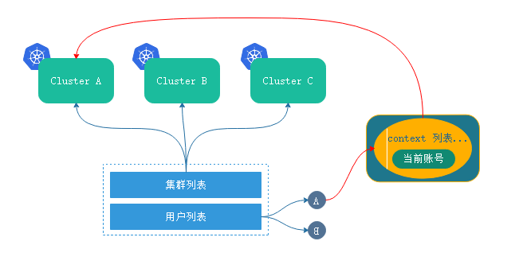

## 定义客户端签署证书

RBAC是基于角色的访问控制。Api server的客户端在认证时，如果要基于配置文件来保存配置信息，而并不是使用serviceAccount使用token认证，就应该配置为一个配置文件。

事实上，kubenetes中大大多数组件要连接api server都需要认证，这些都可以算作客户端。这些组件能够链接入正确的集群，就需要提供正确的证书，私钥等信息，这些信息保存在配置文件，这个配置文件有个专用的称呼叫做：kubeconfig，这个配置文件就是api server的客户端，连接api server时候的认证格式的配置文件。

可以通过`kubectl config view`查看字段

`·clusters`集群列表，如果有读个则显示多少

`contexts`列表中指明对应的访问权限，指明那个用户访问那个集群，当前用户访问集群的用户则是`current-context`

```
[marksugar@linuxea sa]# kubectl config view
apiVersion: v1
clusters: # 集群列表
- cluster:
    certificate-authority-data: REDACTED # 服务器发来认证集群的认证方式，REDACTED加密
    server: https://10.10.240.161:6443  # 服务器api server路径
  name: kubernetes # 集群名称
contexts: # 上下文列表
- context: # 指定是那个用户访问那个集群
    cluster: kubernetes # 访问的集群名称
    user: kubernetes-admin  # 范围集群的账号
  name: kubernetes-admin@kubernetes  # context名称，通常也是用户名
current-context: kubernetes-admin@kubernetes # 当前访问集群的用户 ，当前上下文
kind: Config
preferences: {}
users: # 用户列表
- name: kubernetes-admin # 用户名，集群管理员
  user: #用户被api server认证的证书
    client-certificate-data: REDACTED   # 客户端证书
    client-key-data: REDACTED # key # 客户端私钥
```

> 上下文：

这个配置文件不单单是说就只能访问一个集群。假如此刻有多个集群，我需要在集群间互相切换，使用一个帐号就可以完成。

为了使一个kubectl账号控制多个集群。那它可能需要这样，如：此刻有三个集群，分别是a,b,c。这a,b,c三个集群可能都有各自的账号，所以就提供了配置文件：集群列表，用户列表。

对每个集群可能都有不同的账号，也可能一样。我们事先定义好账号(也就是用户列表，用户可能有多个，和集群数目无直接关系，权限也不一样)，这些账号列表中某个账号去访问那个集群就取决于contexts定义。这样以来可能有多个contexts，但是当前使用那个账号访问那个集群就取决于current-context(当前帐号)。其中当创建一个config的时候，他的认证信息较为复杂。如下：



## 定义配置文件

定义配置文件需要一些参数，通过kubectl config --help获取：

```
  set-cluster     设定集群
  set-context     设定上下文
  set-credentials 设定用户账号
  unset           Unsets an individual value in a kubeconfig file
  use-context     设定谁说是当前上下文
  view            Display merged kubeconfig settings or a specified kubeconfig file
```

配置中，可以在当前一个配置中新增用户账号，也可以另建立配置文件提供账号。这样的好事就能让一个配置文件浮现负载很多用户账号。所以，是可以在这里添加账号的。

不过，在添加账号的时候，需要自带账号专门用于到服务端认证信息的。

我们在使用kubeadm初始化的时候，会为当前集群创建一个私有的CA，位于/etc/kubernetes/pki。这些ca被api server所信任，都可以认证连入集群。如果有需要，可以使用这里ca和key签署自定义是证书和私钥进行认证。这些信息尤为重要。

我们使用这里的证书和私钥做一个账号，来进行认证到api server

在使用kubeadm创建集群时候，会在`/etc/kubernetes/pki`创建私有CA

```
[marksugar@linuxea sa]# ll /etc/kubernetes/pki/
total 56
-rw-r--r--. 1 root root 1241 Sep 16 06:55 apiserver.crt
-rw-r--r--. 1 root root 1094 Sep 16 06:55 apiserver-etcd-client.crt
-rw-------. 1 root root 1675 Sep 16 06:55 apiserver-etcd-client.key
-rw-------. 1 root root 1679 Sep 16 06:55 apiserver.key
-rw-r--r--. 1 root root 1099 Sep 16 06:55 apiserver-kubelet-client.crt
-rw-------. 1 root root 1679 Sep 16 06:55 apiserver-kubelet-client.key
-rw-r--r--. 1 root root 1025 Sep 16 06:55 ca.crt
-rw-------. 1 root root 1675 Sep 16 06:55 ca.key
drwxr-xr-x. 2 root root  162 Sep 16 06:55 etcd
-rw-r--r--. 1 root root 1025 Sep 16 06:55 front-proxy-ca.crt
-rw-------. 1 root root 1675 Sep 16 06:55 front-proxy-ca.key
-rw-r--r--. 1 root root 1050 Sep 16 06:55 front-proxy-client.crt
-rw-------. 1 root root 1679 Sep 16 06:55 front-proxy-client.key
-rw-------. 1 root root 1679 Sep 16 06:55 sa.key
-rw-------. 1 root root  451 Sep 16 06:55 sa.pub
```

这里可是使用ca.key签署自定义的证书和私钥，也可以直接使用创建好的证书和私钥，这些文件非常重要。只要api server信任的私钥都可以链接到集群。

可以使用这里的证书制作另外一个账号进行认证到api server上。

### 生成私钥

生产一个专属证书，证书的持有者和用户名必须保持一致，证书的持有者名称就是账号名

```
[marksugar@linuxea sa]# (umask 077; openssl genrsa -out linuxea.key 2048)
Generating RSA private key, 2048 bit long modulus
............+++
..................................................................................................+++
e is 65537 (0x10001)
[marksugar@linuxea sa]# ll linuxea.key 
-rw-------. 1 root root 1679 Oct  3 15:01 linuxea.key
```

基于这个私钥生成一个证书，使用/etc/kubernetes/pki下的ca.crt签署

### 签署证书

```
[marksugar@linuxea pki]# openssl req -new -key linuxea.key -out linuxea.csr -subj "/CN=linuxea"
```

```
[marksugar@linuxea pki]# pwd
/etc/kubernetes/pki
```

```
[marksugar@linuxea pki]# openssl x509 -req -in linuxea.csr -CA ./ca.crt -CAkey ./ca.key -CAcreateserial -out linuxea.crt -days 36500
Signature ok
subject=/CN=linuxea
Getting CA Private Key
```

也可查看证书的信息

```
[marksugar@linuxea pki]# openssl x509 -in linuxea.crt -text -noout
Certificate:
    Data:
        Version: 1 (0x0)
        Serial Number:
            89:e9:b5:e3:21:06:0b:b9
    Signature Algorithm: sha256WithRSAEncryption
        Issuer: CN=kubernetes
        Validity
            Not Before: Oct  3 14:12:02 2018 GMT
            Not After : Sep  9 14:12:02 2118 GMT
        Subject: CN=linuxea
        Subject Public Key Info:
            Public Key Algorithm: rsaEncryption
                Public-Key: (2048 bit)
                Modulus:
	................                
```

### 应用证书

这个证书是由kubernetes同一个ca授权创建

可以指明认证方式，token,cert

指明刚创建的密钥，添加一个名称为linuxea的用户。--embed-certs=true： 隐藏起key和crt显示

```
[marksugar@linuxea pki]# kubectl config set-credentials linuxea --client-certificate=./linuxea.crt --client-key=./linuxea.key --embed-certs=true
User "linuxea" set.
```

在看`kubectl config view`的users字段就多出一个`- name: linuxea`

```
[marksugar@linuxea pki]# kubectl config view
apiVersion: v1
clusters:
- cluster:
    certificate-authority-data: REDACTED
    server: https://10.10.240.161:6443
  name: kubernetes
contexts:
- context:
    cluster: kubernetes
    user: kubernetes-admin
  name: kubernetes-admin@kubernetes
current-context: kubernetes-admin@kubernetes
kind: Config
preferences: {}
users:
- name: kubernetes-admin
  user:
    client-certificate-data: REDACTED
    client-key-data: REDACTED
- name: linuxea
  user:
    client-certificate-data: REDACTED
    client-key-data: REDACTED
```

而后设置上下文,使linuxea也能访问kubernetes集群，指定linuxea用户访问kubernetes集群。`linuxea@kubernetes`

```
[marksugar@linuxea pki]# kubectl config  set-context linuxea@kubernetes --cluster=kubernetes --user=linuxea
Context "linuxea@kubernetes" created.
```

此刻，context这里就多一条创建的linuxea用户

```
- context:
    cluster: kubernetes
    user: linuxea
  name: linuxea@kubernetes
```

如下：

```
[marksugar@linuxea pki]# kubectl config view
apiVersion: v1
clusters:
- cluster:
    certificate-authority-data: REDACTED
    server: https://10.10.240.161:6443
  name: kubernetes
contexts:
- context:
    cluster: kubernetes
    user: kubernetes-admin
  name: kubernetes-admin@kubernetes
- context:
    cluster: kubernetes
    user: linuxea
  name: linuxea@kubernetes
current-context: kubernetes-admin@kubernetes
kind: Config
preferences: {}
users:
- name: kubernetes-admin
  user:
    client-certificate-data: REDACTED
    client-key-data: REDACTED
- name: linuxea
  user:
    client-certificate-data: REDACTED
    client-key-data: REDACTED

```

切换到创建的linuxea用户

```
[marksugar@linuxea pki]# kubectl config use-context linuxea@kubernetes
Switched to context "linuxea@kubernetes".

```

`current-context:`当前账户`linuxea@kubernetes`

```
current-context: linuxea@kubernetes

```

如下：

```
[marksugar@linuxea pki]# kubectl config view
apiVersion: v1
clusters:
- cluster:
    certificate-authority-data: REDACTED
    server: https://10.10.240.161:6443
  name: kubernetes
contexts:
- context:
    cluster: kubernetes
    user: kubernetes-admin
  name: kubernetes-admin@kubernetes
- context:
    cluster: kubernetes
    user: linuxea
  name: linuxea@kubernetes
current-context: linuxea@kubernetes

```

使用创建的用户访问svc

但是，这个linuxea用户并没有管理员权限，这里报No resources found. Forbidden

```
[marksugar@linuxea pki]# kubectl get svc
No resources found.
Error from server (Forbidden): services is forbidden: User "linuxea" cannot list services in the namespace "default"
```

## 设置集群

如果是一个新集群定义，可以设置如下：

创建cluster集群配置文件，在创建之前需要切换到kubernetes-admin管理员账号

```
[marksugar@linuxea pki]# kubectl config use-context kubernetes-admin@kubernetes
Switched to context "kubernetes-admin@kubernetes".
```

kubectl默认加载当前用户在家目录下的.kube，当然，也可以在创建集群时可指定名称，指明配置文件位置，指明服务位置，并指明server，指明ca证书

- 指明集群的ca证书，因为ca证书要验证集群api server发过来的证书。

```
[marksugar@linuxea ~]# kubectl config set-cluster linuxeacluster --kubeconfig=/data/linuxea.conf --server="https://10.10.240.161:6443" --certificate-authority=/etc/kubernetes/pki/ca.crt --embed-certs=true 
Cluster "linuxeacluster" set.
```
而后就可以看到定义的集群，名称linuxeacluster，其他等信息。
```
[marksugar@linuxea ~]# kubectl config view --kubeconfig=/data/linuxea.conf 
apiVersion: v1
clusters:
- cluster:
    certificate-authority-data: REDACTED
    server: https://10.10.240.161:6443
  name: linuxeacluster
contexts: []
current-context: ""
kind: Config
preferences: {}
users: []
```

