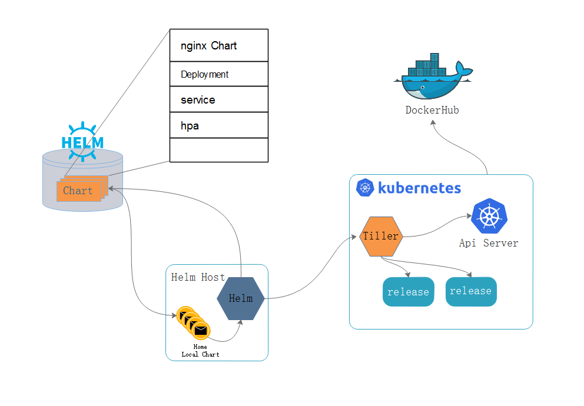
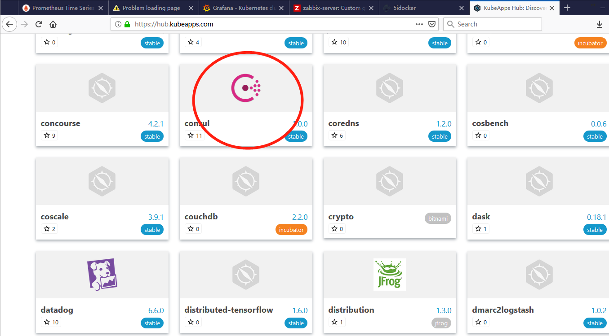
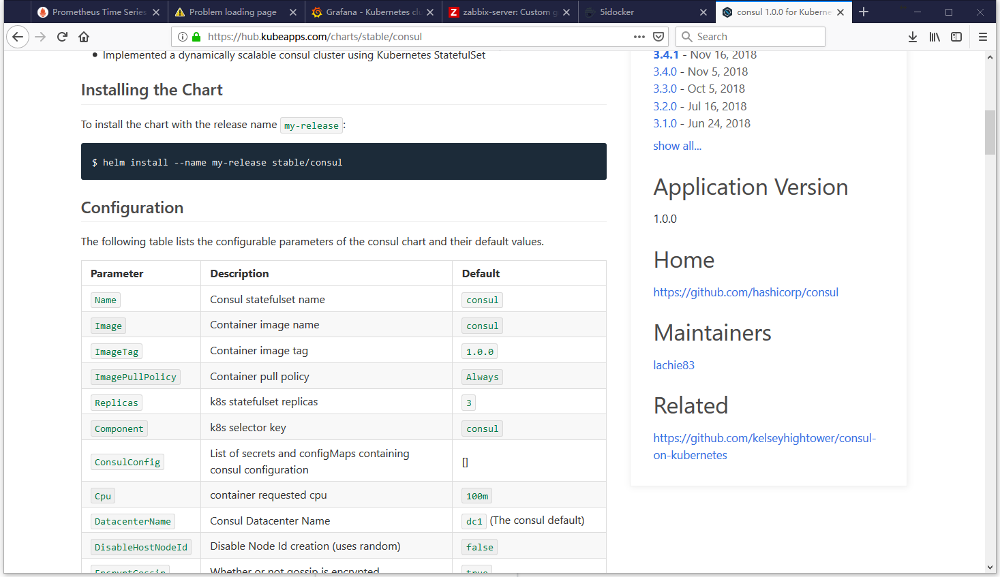

此前，不管是无状态还是有状态的应用在部署在系统之上，如果是无状态的，使用Deployment控制器进行应用伸缩是很容易。有状态的应用也可以做一些限制不进行规模的伸缩，并且也可以完成持久存储能力的。

但是一旦将有状态的应用扩展成多个副本，就会面临问题，不同的应用程序在扩展的时候，扩展的方式是各自都不相同的。如：redis主从，以及cluster都是不同的方式，etcd也是如此，这样的有状态应用部署在集群之上是一件不容易的事情。

kubernetes在配置一个应用程序的时候，是很麻烦的。首先，需要写一个很长的配置清单，从而去安装应用程序。在此前的管理方式里面，有直接使用命令创建，也有命令式配置文件和声明式配置文件。声明式配置文件借助本地的配置文件，也能够在很大程度上减轻前期的开发使用。

我们知道在linux系统之上，最初的时候也面临过这样的问题，程序包的维护代价非常大，安装一个应用程序的是时候就需要编译，而编译本身就比较复杂，且难以适配。如：版本问题等。后来就开发了包管理器RPM，但是RPM包单单解决了编译的问题，依赖包仍然匹配仍然让人头疼。后来又开发了如yum,apt这类解决依赖关系的工具。有了yum之后，对于安装程序来讲，基本上一键安装。同样，kubernetes在应用安装上，使用Helm也是可以的。

## helm

helm是kubernentes的另外一个项目，专为kubernetes上的应用程序而开发。

heml的工作方式和yum和相似，首先是有一台仓库服务器，其中定义了配置，部署k8s的应用程序的清单文件。这一点和yum不一样的，yum本身不但解决依赖关系，也要提供应用程序包。但是在k8s中heml是不提供程序包的，而单单提供清单。而镜像由镜像仓库或者dockerhub和私有仓库等。

如一个应用在部署的时候所需要的所有清单文件。这个程序包只提供清单，不包含镜像。

如：nginx部署，对于nginx部署来将，首先需要nginx镜像，Deployment，还有service，如果有必要还有hpa的定义。将这三个文件打包在一起，就叫做一个应用程序包，在heml中称这个应用程序包为Chart。

不同的用户在部署Chart时也不尽相同，配置文件，证书都不尽相同。通常以模板的形式通过配置环境变量传递一些自定义的设定，也就意味着并不能够简单的一条命令安装完成，尤其是在做一些定制化配置时。

模板本身是不能进行修改，可通过赋值的方式修改，因此就会有一个值文件，用于模板引用给属性赋值，从而使得让用户能自定义安装。很多属性都是有默认值的，不赋值任何信息也可以基本的运行起来。

类似于这样的Chart有很多个，这样的Chart仓库在互联网上可以使用helm提供的官网仓库。当然，也允许用户自定义上传chart，和github，dockerhub类似。



要想成功部署chart应用，就需要k8s集群，而在k8s中，最终将期望请求操作落地的是api server，提交给api server是需要验证部署请求操作的。而helm是工作在k8s集群之外的，类似与Kubectl 客户端的形式。

但是helm不直接于api server交互。我们假设有一台笔记本用于kubernetes通讯，便于管理操作kubernetes，在这台机器上安装一个Helm，helm也是一个命令行客户端工具。当需要通过helm在k8s集群上部署应用程序时候，不直接操作api server，而是由一个中间件Tiller操作，并且tiller是一个服务端，而helm host是客户端。

Tiller是一个守护进程，监听在某个端口上，接收Helm的请求，Tiller可以运行在helm主机之上。但更好的方式是将Tiller运行在kubernetes集群之上(服务类的应用托管在k8s集群之上较为妥当)。tiller是于Helm之间完成的交互。

helm host是tiller的客户端，每一次部署应用发起请求的时候，helm提交请求给tiller,tiller再去链接api server，再由api server完成创建。这样一来，对于api server来讲，客户端程序不是helm ，而是tiller。

在helm之上，和docker的管理方式很相似，每一个chart在使用的时候一般都要从Helm仓库中下载到本地的helm主机上的运行helm用户的家目录下存放这个chart。当安装一个的应用的时候就会去helm下载存储在本地一个。也可以在本地开发，本地使用。这和很多场景下的情况相似，在helm仓库下载之前会在本地查看，如果本地有就使用，本地有和远程是否有是没有关系的。如果本地没有才会去远程下载存放本地。

而当试图去部署应用程序的时候，helm先联系Tiller，由Tiller联系api server来完成部署和应用。

helm可以将一个chart在kubernetes cluster上部署多份副本，对应名称或者名称空间各不相同。而部署到kubernetes 之后就不在叫做Chart了，Chart仅当作定义，我们需要把给定的值赋值到模板中以后，生成很多信息就有了的实例，通常我们称为对象。由此，Chart更像是某一种部署的类型的。这种类被赋值后就成为一个对象，不过他在kubernetes中不称为对象，而称为release。一旦被部署就不在叫做Chart，而是release。而同一个Chart给赋予不同的属性值后，完全可以部署出多个release来的。这便是helm的工作逻辑和架构形式。

helm从仓库拉下来赋值之后提交给Tiller,由Tiller认证到api server完成在本地对应资源的管理，每一个资源管理的对象叫做release。

helm将kuernetes资源打包到一个Chart当中，制作并测试完成各个Chart和Chart本身的依赖关系，并利用Chart参考对外实现分发，而helm可以通过vlues文件完成可配置的发布，同时支持配置程序的版本管理，而且还能简化kubernetes部署的版本控制，打包，发布，删除，更新操作。也就是说，如果Chart版本更新了，helm自动支持滚动更新机制，并且可以一键回滚。

## 核心组件与程序架构

> 核心组件

- Chart

一个helm程序包，包含了k8s上部署应用程序的清单的定义(并不包含镜像，镜像是由镜像仓库来提供)，镜像的引用，依赖关系，资源定义等等。必要时，包含其他的定义，如：Service.

- Repository

而Chart是有多个，放置到Repository，也可以说是一个Chart。同时也是一个http/https服务器。

- Release

Chart实例化后部署在kubernetes  cluster之上的Chart实例，就叫做Release。之所以称作为Release，是因为将Chart拿来提供了配置信息。

在chart中，会提供一些配置信息，也就是值文件，这些文件最终用来给模板赋值，而后将Chart模板当中的属性使用config或者值文件赋值后生成Release。而config就是值文件，也是应用程序实例化安装运行时候使用的配置信息。

> 程序架构

而helm程序由两部分组成，helm客户端和tiller服务端。服务端可以运行在kubernetes之上，也可以运行在kubernetes集群之外，如果运行在kubernetes集群外配置起来是非常麻烦的，多数情况下tiller都会运行在kubernetes集群之上。而helm只是作为本地的客户端，helm基于go语言编写，基于GRPC协议与tiller server进行交互，能够实现管理本地的chart仓库，也可以管理chart，也要与tiller交互，用于发送chart，实现实例安装，查询，卸载等操作。 

tiller作为服务端，监听来自helm的请求，而后将helm发来的chart和config合并在一起(将config赋值到chart当中)，完成部署应用程序，生成release。

## helm安装

helm是工作在本地的客户端，不必要是k8s集群内的主机来进行安装部署。

```
[marksugar@linuxea ~]# wget https://storage.googleapis.com/kubernetes-helm/helm-v2.11.0-linux-amd64.tar.gz
```

```
[marksugar@linuxea ~]# tar xf helm-v2.11.0-linux-amd64.tar.gz -C /usr/local/
[marksugar@linuxea ~]# ln -s /usr/local/linux-amd64/helm /usr/local/bin/helm
```

```
[marksugar@linuxea ~]# helm version
Client: &version.Version{SemVer:"v2.11.0", GitCommit:"2e55dbe1fdb5fdb96b75ff144a339489417b146b", GitTreeState:"clean"}
Error: could not find tiller
[marksugar@linuxea ~]# 
```

## tiller生成

tiller使用init本身就可以自动生成。helm本身第一次init的时候会联系到api server,api server只会着部署tiller的pod，这也就意味着helm需要链接api server，且需要认认证，并还要管理员权限。helm会获取当前系统的上的kuberctl的权限，在`~/.kube/`下的config文件是可以被helm获取到。helm会扮演成kubectl客户端，进行初始化和部署安装。

```
[marksugar@linuxea ~]# ls ~/.kube/
cache  config  http-cache
```

tiller部署在K8s集群的时候，tiller需要获取集群的管理权限，以便于完成安装，卸载等的管理权限。.

> RBAC权限

部署完成helm之后在进行部署tiller的时候，需要在k8s有RBAC集群上，设置RBAC的配置，依赖的用户名(service accout)就是叫做tiller。这个tiller如果要很大的权限的话，就需要绑定到clusterrobingd之上。如下：

- 此前部署k8s集群的时候是强制启用RBAC的，那就需要配置RBAC

```
[marksugar@linuxea manifests]# cat ~/linuxea/manifests/tiller-rbac.yaml 
apiVersion: v1
kind: ServiceAccount
metadata:
  name: tiller
  namespace: kube-system
---
apiVersion: rbac.authorization.k8s.io/v1
kind: ClusterRoleBinding
metadata:
  name: tiller
roleRef:
  apiGroup: rbac.authorization.k8s.io
  kind: ClusterRole
  name: cluster-admin
subjects:
  - kind: ServiceAccount
    name: tiller
    namespace: kube-system
```

如果是名称空间就需要其他的配置。其他配置参考：https://github.com/helm/helm/blob/master/docs/rbac.md#example-service-account-with-cluster-admin-role

apply

```
[marksugar@linuxea manifests]# kubectl apply -f ~/linuxea/manifests/tiller-rbac.yaml
serviceaccount/tiller created
clusterrolebinding.rbac.authorization.k8s.io/tiller created
```

```
[marksugar@linuxea manifests]# kubectl get sa -n kube-system|grep tiller
tiller                               1         28s
```

>  生成

在第一次生成的时候会在家目录下生成一个/root/.helm 的目录，其中包含很多本地参考的文件。最后在`kubernetes-charts.storage.googleapis.com`获取一个stable repo

```
[marksugar@linuxea manifests]# helm init --service-account tiller
Creating /root/.helm 
Creating /root/.helm/repository 
Creating /root/.helm/repository/cache 
Creating /root/.helm/repository/local 
Creating /root/.helm/plugins 
Creating /root/.helm/starters 
Creating /root/.helm/cache/archive 
Creating /root/.helm/repository/repositories.yaml 
Adding stable repo with URL: https://kubernetes-charts.storage.googleapis.com 
Adding local repo with URL: http://127.0.0.1:8879/charts 
$HELM_HOME has been configured at /root/.helm.

Tiller (the Helm server-side component) has been installed into your Kubernetes Cluster.

Please note: by default, Tiller is deployed with an insecure 'allow unauthenticated users' policy.
To prevent this, run `helm init` with the --tiller-tls-verify flag.
For more information on securing your installation see: https://docs.helm.sh/using_helm/#securing-your-helm-installation
Happy Helming!
[marksugar@linuxea 
```

```
[marksugar@linuxea manifests]# kubectl get pods -n kube-system
NAME                                           READY     STATUS    RESTARTS   AGE
coredns-78fcdf6894-9q7cp                       1/1       Running   0          2d
coredns-78fcdf6894-t8vjc                       1/1       Running   0          2d
etcd-linuxea.master-1.com                      1/1       Running   0          2d
kube-apiserver-linuxea.master-1.com            1/1       Running   0          2d
kube-controller-manager-linuxea.master-1.com   1/1       Running   0          2d
kube-flannel-ds-amd64-j54qv                    1/1       Running   0          2d
kube-flannel-ds-amd64-kq995                    1/1       Running   0          2d
kube-flannel-ds-amd64-m2m6t                    1/1       Running   0          2d
kube-flannel-ds-amd64-sx5cz                    1/1       Running   0          2d
kube-flannel-ds-amd64-xfvst                    1/1       Running   0          2d
kube-proxy-8tvxw                               1/1       Running   0          2d
kube-proxy-9vr46                               1/1       Running   0          2d
kube-proxy-fmlfq                               1/1       Running   0          2d
kube-proxy-gt6sk                               1/1       Running   0          2d
kube-proxy-vtzm2                               1/1       Running   0          2d
kube-scheduler-linuxea.master-1.com            1/1       Running   0          2d
metrics-server-v0.3.1-57ddf848d8-wdx6l         2/2       Running   0          2d
tiller-deploy-57f988f854-g8hw6                 1/1       Running   0          27s
```

现在已经安装完成Client和Server端版本都是v2.11.0

```
[marksugar@linuxea ~]# helm version
Client: &version.Version{SemVer:"v2.11.0", GitCommit:"2e55dbe1fdb5fdb96b75ff144a339489417b146b", GitTreeState:"clean"}
Server: &version.Version{SemVer:"v2.11.0", GitCommit:"2e55dbe1fdb5fdb96b75ff144a339489417b146b", GitTreeState:"clean"}
```

此刻可以安装一些应用程序，只需要install即可。

由于tiller是由deploy控制器控制，如果要卸载 tiller服务端，只需要删除deploy控制器即可。

## 使用helm

远程更新仓库，helm repo update。这条命令会跳过本地而链接远程仓库。

```
[marksugar@linuxea ~]# helm repo update
Hang tight while we grab the latest from your chart repositories...
...Skip local chart repository
...Successfully got an update from the "stable" chart repository
Update Complete. ⎈ Happy Helming!⎈ 
[marksugar@linuxea ~]# 
```

我们可以通过`https://hub.kubeapps.com/`查找一些helm资源。

对一些资源选中就可以查看到详情页





并且，也可以使用helm使用search搜索，这和docker类似。helm search --help查看帮助。如果没有填写关键词就会列出所有，helm search nginx搜索当前内所有的nginx可以用。如下：

```
[marksugar@linuxea ~]# helm search nginx
NAME                       	CHART VERSION	APP VERSION	DESCRIPTION                                                 
stable/nginx-ingress       	0.31.0       	0.20.0     	An nginx Ingress controller that uses ConfigMap to store ...
stable/nginx-ldapauth-proxy	0.1.2        	1.13.5     	nginx proxy with ldapauth                                   
stable/nginx-lego          	0.3.1        	           	Chart for nginx-ingress-controller and kube-lego            
stable/gcloud-endpoints    	0.1.2        	1          	DEPRECATED Develop, deploy, protect and monitor your APIs...
[marksugar@linuxea ~]# 
```

并且可以探索内部的详细信息。这些信息和网页上说差不多

```
[marksugar@linuxea ~]# helm inspect stable/nginx-ingress
```

其次，在repo list中可以看到有稳定版路径和本地路径，如果需要添加incubator，就需要将路径添加

```
[marksugar@linuxea ~]# helm repo list
NAME  	URL                                             
stable	https://kubernetes-charts.storage.googleapis.com
local 	http://127.0.0.1:8879/charts  
```

repo add 添加如下，参考：https://github.com/helm/charts

```
[marksugar@linuxea ~]# helm repo add incubator https://kubernetes-charts-incubator.storage.googleapis.com/
"incubator" has been added to your repositories
```

###  示例

如果我们要安装一个应用，可以在搜索到后进行安装，并且配合values文件进行赋值。一般来讲，不赋值也会有默认参数。

安装一个memcached为例

```
[marksugar@linuxea ~]# helm search memcached
NAME            	CHART VERSION	APP VERSION	DESCRIPTION                                                 
stable/memcached	2.3.1        	1.5.6      	Free & open source, high-performance, distributed memory ...
stable/mcrouter 	0.1.1        	0.36.0     	Mcrouter is a memcached protocol router for scaling memca...
```

```
[marksugar@linuxea ~]# helm inspect stable/memcached
```

安装 helm install --name linuxea-men stable/memcached

```
[marksugar@linuxea ~]# helm install --name linuxea-men stable/memcached
NAME:   linuxea-men  名称
LAST DEPLOYED: Fri Nov 16 13:44:46 2018   部署时间
NAMESPACE: default  部署的名称空间
STATUS: DEPLOYED 当前状态

RESOURCES:
==> v1/Service  
NAME                   AGE
linuxea-men-memcached  1s

==> v1beta1/StatefulSet
linuxea-men-memcached  1s

==> v1beta1/PodDisruptionBudget pod回收机制
linuxea-men-memcached  1s

==> v1/Pod(related)

NAME                     READY  STATUS   RESTARTS  AGE
linuxea-men-memcached-0  0/1    Pending  0         1s


NOTES:
Memcached can be accessed via port 11211 on the following DNS name from within your cluster:
linuxea-men-memcached.default.svc.cluster.local

If you'd like to test your instance, forward the port locally:

  export POD_NAME=$(kubectl get pods --namespace default -l "app=linuxea-men-memcached" -o jsonpath="{.items[0].metadata.name}")
  kubectl port-forward $POD_NAME 11211

In another tab, attempt to set a key:

  $ echo -e 'set mykey 0 60 5\r\nhello\r' | nc localhost 11211

You should see:

  STORED

```

并且可以使用` export POD_NAME=$(kubectl get pods --namespace default -l "app=linuxea-men-memcached" -o jsonpath="{.items[0].metadata.name}")`验证

删除使用`[marksugar@linuxea ~]# helm  delete linuxea-men`

helm常用命令：

```
 delete   删除       
 history   历史命令  
 install   安装    
 list     查看   
 rollback  回滚 
 search    查找 
 upgrade  修改  
 history 查看部署历史
 status  获取状态信息
```

chary管理命令

```
create    创建
delete    删除
fetch     获取，从仓库下载到本地，并且展开
get       获取，仅仅下载    
inspect   查看chart详细信息，包括使用，接收值，传递参数等等。      
package   将本地开发的包打包
verify    校验
```

### 示例2

我们试图创建一个redis

```
[marksugar@linuxea ~]# helm search redis
NAME                            	CHART VERSION	APP VERSION	DESCRIPTION                                                 
stable/prometheus-redis-exporter	0.3.4        	0.21.2     	Prometheus exporter for Redis metrics                       
stable/redis                    	4.2.10       	4.0.11     	Open source, advanced key-value store. It is often referr...
stable/redis-ha                 	3.0.1        	4.0.11     	Highly available Kubernetes implementation of Redis         
stable/sensu                    	0.2.3        	0.28       	Sensu monitoring framework backed by the Redis transport  
```
安装
```
[marksugar@linuxea ~]# helm install --name redis1 stable/redis
```
创建完成可以使用helm list进行查看

```
[marksugar@linuxea ~]# helm list
NAME       	REVISION	UPDATED                 	STATUS  	CHART               	APP VERSION	NAMESPACE
redis1     	1       	Sat Nov 17 06:30:50 2018	DEPLOYED	redis-4.2.10        	4.0.11     	default  
right-molly	1       	Fri Nov 16 13:50:01 2018	DEPLOYED	nginx-ingress-0.31.0	0.20.0     	default  
```

所有安装的应用都会被get到本地来进行 应用，存放`/root/.helm/cache/archive`路径下

```
[marksugar@linuxea archive]# cd /root/.helm/cache/archive
[marksugar@linuxea archive]# ls
memcached-2.3.1.tgz  nginx-ingress-0.31.0.tgz  redis-4.2.10.tgz
```

 这些taz包可以拆开

```
[marksugar@linuxea archive]# tar xf redis-4.2.10.tgz 
tar: redis/Chart.yaml: implausibly old time stamp 1970-01-01 01:00:00
tar: redis/values.yaml: implausibly old time stamp 1970-01-01 01:00:00
tar: redis/templates/NOTES.txt: implausibly old time stamp 1970-01-01 01:00:00
tar: redis/templates/_helpers.tpl: implausibly old time stamp 1970-01-01 01:00:00
...
```
其中这些Yaml文件与我们之前所写的大不一样
```
[marksugar@linuxea archive]# tree redis
redis
├── Chart.yaml 描述信息
├── README.md 叙述文件
├── templates 模板文件
│   ├── configmap.yaml
│   ├── health-configmap.yaml
│   ├── _helpers.tpl
│   ├── metrics-deployment.yaml
│   ├── metrics-svc.yaml
│   ├── networkpolicy.yaml
│   ├── NOTES.txt
│   ├── redis-master-statefulset.yaml
│   ├── redis-master-svc.yaml
│   ├── redis-rolebinding.yaml
│   ├── redis-role.yaml
│   ├── redis-serviceaccount.yaml
│   ├── redis-slave-deployment.yaml
│   ├── redis-slave-svc.yaml
│   └── secret.yaml
├── values-production.yaml
└── values.yaml

1 directory, 19 files
[marksugar@linuxea archive]# 
```

这些yaml文件大多调用go模板语法进行赋不同的值传递参数来完成不同的部署，而之前所说的config就是为模板中的属性提供值的配置信息，也可以定义在values.yaml中，并且在install 的时候进行加载即可。其中双##号上注释，单#号表示可以启用的选项

### 示例values

我们修改values的一些配置信息，使得redis正常启动

```
[marksugar@linuxea archive]# cp redis/values.yaml ~/linuxea/manifests/helm/
[marksugar@linuxea archive]# cd ~/linuxea/manifests/helm/
```

我们修改下参数，使得使用本地目录存储

```
  persistence:
    enabled: false
```

删掉此前的创建的redis，在进行部署一次

```
[marksugar@linuxea templates]# helm delete right-molly redis1 
release "right-molly" deleted
release "redis1" deleted
```

重新部署一次

```
[marksugar@linuxea helm]# helm install --name linuxea-redis -f values.yaml stable/redis
```

```
[marksugar@linuxea helm]# kubectl get pods -o wide
NAME                                   READY     STATUS    RESTARTS   AGE       IP            NODE
linuxea-redis-master-0                 1/1       Running   0          1m        172.16.4.64   linuxea.node-3.com
linuxea-redis-slave-77f4768cd8-rf4l2   1/1       Running   1          1m        172.16.3.78   linuxea.node-2.com
```

使用helm  status linuxea-redis可以查看历史中的创建状态信息

```
[marksugar@linuxea helm]# helm  status linuxea-redis
LAST DEPLOYED: Sun Nov 18 05:16:38 2018
NAMESPACE: default
STATUS: DEPLOYED

RESOURCES:
==> v1beta2/StatefulSet
NAME                  AGE
linuxea-redis-master  2m

==> v1/Pod(related)

NAME                                  READY  STATUS   RESTARTS  AGE
linuxea-redis-slave-77f4768cd8-rf4l2  1/1    Running  1         2m
linuxea-redis-master-0                1/1    Running  0         2m

==> v1/Secret

NAME           AGE
linuxea-redis  2m

==> v1/ConfigMap
linuxea-redis-health  2m

==> v1/Service
linuxea-redis-master  2m
linuxea-redis-slave   2m

==> v1beta1/Deployment
linuxea-redis-slave  2m


NOTES:
** Please be patient while the chart is being deployed **
Redis can be accessed via port 6379 on the following DNS names from within your cluster:

linuxea-redis-master.default.svc.cluster.local for read/write operations
linuxea-redis-slave.default.svc.cluster.local for read-only operations


To get your password run:

    export REDIS_PASSWORD=$(kubectl get secret --namespace default linuxea-redis -o jsonpath="{.data.redis-password}" | base64 --decode)

To connect to your Redis server:

1. Run a Redis pod that you can use as a client:

   kubectl run --namespace default linuxea-redis-client --rm --tty -i \
    --env REDIS_PASSWORD=$REDIS_PASSWORD \
   --image docker.io/bitnami/redis:4.0.11 -- bash

2. Connect using the Redis CLI:
   redis-cli -h linuxea-redis-master -a $REDIS_PASSWORD
   redis-cli -h linuxea-redis-slave -a $REDIS_PASSWORD

To connect to your database from outside the cluster execute the following commands:

    kubectl port-forward --namespace default svc/linuxea-redis 6379:6379 &
    redis-cli -h 127.0.0.1 -p 6379 -a $REDIS_PASSWORD
```

我们run一个client试图登录

```
[marksugar@linuxea helm]# kubectl run --namespace default linuxea-redis-client --rm --tty -i \
>     --env REDIS_PASSWORD=$REDIS_PASSWORD \
>    --image docker.io/bitnami/redis:4.0.11 -- bash

If you don't see a command prompt, try pressing enter.
I have no name!@linuxea-redis-client-79859b8d88-2zczc:/$ 
```
而后直接登录redis
```
I have no name!@linuxea-redis-client-79859b8d88-2zczc:/$  redis-cli -h linuxea-redis-master -a $REDIS_PASSWORD
Warning: Using a password with '-a' option on the command line interface may not be safe.
```
可info查看
```
linuxea-redis-master:6379> info
# Server
redis_version:4.0.11
redis_git_sha1:00000000
redis_git_dirty:0
redis_build_id:a3b8846cf74959a5
redis_mode:standalone
os:Linux 4.9.12-1.el7.centos.x86_64 x86_64
arch_bits:64
multiplexing_api:epoll
atomicvar_api:atomic-builtin
gcc_version:6.3.0
process_id:1
run_id:d4288c1f28433ba066538fb02d33bcb0038a9f97
tcp_port:6379
uptime_in_seconds:246
uptime_in_days:0
hz:10
lru_clock:15791815
executable:/opt/bitnami/redis/bin/redis-server
config_file:/opt/bitnami/redis/etc/redis.conf

# Clients
connected_clients:1
client_longest_output_list:0
client_biggest_input_buf:0
blocked_clients:0

# Memory
used_memory:1917896
used_memory_human:1.83M
used_memory_rss:11833344
used_memory_rss_human:11.29M
```
查看主从状态
```
# Replication
role:master
connected_slaves:1
slave0:ip=172.16.3.78,port=6379,state=online,offset=322,lag=1
master_replid:6f6a4fe934510bc0187e62c519fc28ee53cf0d8d
master_replid2:0000000000000000000000000000000000000000
master_repl_offset:322
second_repl_offset:-1
repl_backlog_active:1
repl_backlog_size:1048576
repl_backlog_first_byte_offset:1
repl_backlog_histlen:322

# CPU
used_cpu_sys:0.11
used_cpu_user:0.12
used_cpu_sys_children:0.04
used_cpu_user_children:0.02

# Cluster
cluster_enabled:0

# Keyspace
linuxea-redis-master:6379> 
```


