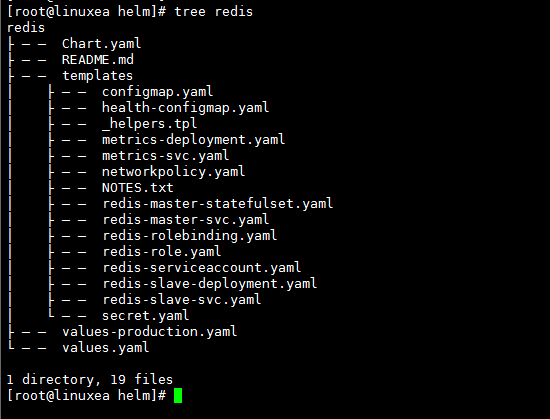
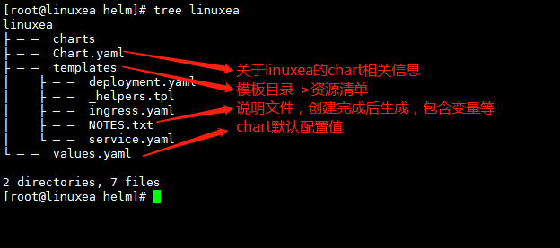
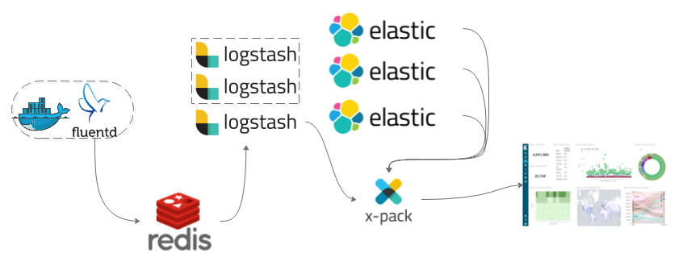
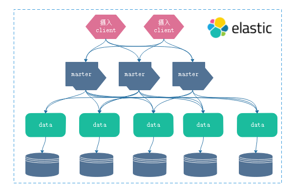
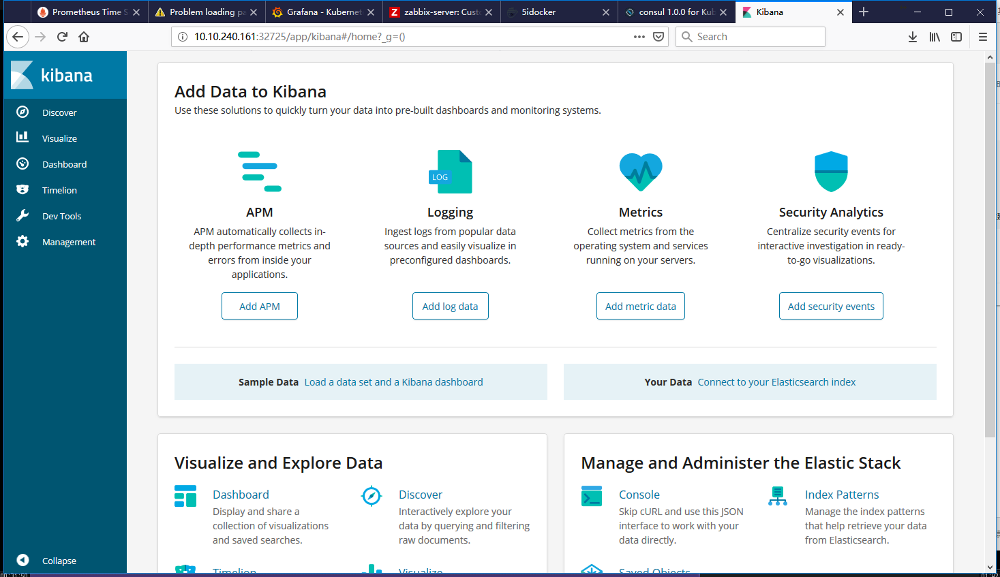
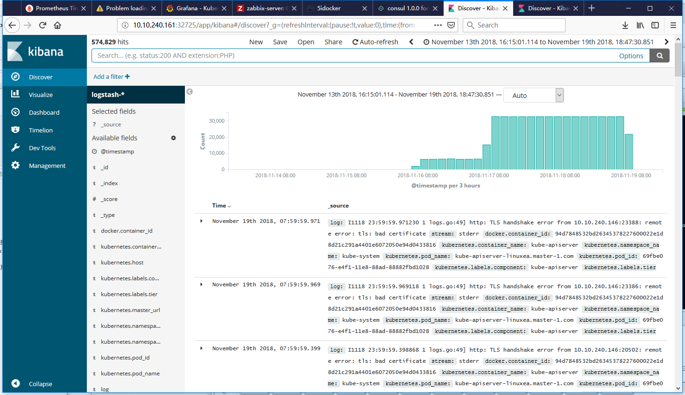

在helm的体系中，有helm，tiller server，以及chart。tiller作为服务端一般运行在k8s集群之上，helm能够通过tiller server在k8s之上部署应用程序，这些应用程序来在helm能够访问到的仓库当中的chart。此前我们自定义了一些简单的值文件，实现实例化chart可安装的，可运行的release。也可以通过chart生成release，其中配置文件config来自chart中的values.yaml文件。

对于chart来讲，事实上内部没有太复杂的地方，只是将此前我们所使用的编写的配置清单，改写为可复用的格式。

此前我们的配置清单的都是为了完成某一个特定的功能而开发，一旦编辑完成，如果需要配置变更就需要重新修改配置清单文件，或者重新更新配置文件。而helm chart引用了一种机制，能够把此前配置清单中特定的内容，尤其是属性值，配置为模板内容。这类似于ansibel当中的playbook模板。只不过其中调用的变量值来自于不同的位置，或是helm内建的，或者是来自部署的release，也有一些属性值是由用户通过值文件(config)提供。

## chart组成

我们先获取一个chart

```
[marksugar@linuxea helm]# helm fetch stable/redis
[marksugar@linuxea helm]# ls
redis-4.2.10.tgz  values.yaml
```

这些文件在打包的时候将时间改为unix元年的时间

```
[marksugar@linuxea helm]# tar xf redis-4.2.10.tgz 
tar: redis/Chart.yaml: implausibly old time stamp 1970-01-01 01:00:00
tar: redis/values.yaml: implausibly old time stamp 1970-01-01 01:00:00
tar: redis/templates/NOTES.txt: implausibly old time stamp 1970-01-01 01:00:00
tar: redis/templates/_helpers.tpl: implausibly old time stamp 1970-01-01 01:00:00
tar: redis/templates/configmap.yaml: implausibly old time stamp 1970-01-01 01:00:00
```

一个chart组成部分：https://docs.helm.sh/developing_charts/#the-chart-file-structure，翻译如下

```
wordpress/
Chart.yaml          #YAML文件，包含有关chart的信息,名称，版本等等信息
LICENSE             #OPTIONAL：包含chart许可证的纯文本文件
README.md           #OPTIONAL：一个人类可读的README文件
requirements.yaml   #OPTIONAL：列出chart依赖关系的YAML文件。如，lnmp的依赖关系。自动处理依赖
values.yaml         ＃此chart的默认配置值。对模板中自定义变量的引用设定的默认值。
charts/             ＃包含此chart所依赖的任何chart的目录。charts于requirements类似。目录下存放每一个被当前charts所依赖的其他的charts的打包tgz格式文件。一旦tgz存放在此处，就会被依赖。不管requirements是否存在。手动依赖关系
templates/          ＃模板目录，当与值组合时。这取决于模板的语法，比如清单中定义的service,pvc等，这些便于复用的属性或者字段就会改造成能够通过模板编程语言，基于模板编程结果生成的信息并且自动替换到代码所在处。这需要对go模板语法理解。
                    ＃将生成有效的Kubernetes清单文件。
templates/NOTES.txt #OcTIONAL：包含简短使用说明的纯文本文件
```

redis文件树如下：



## yaml定义

### chart
```
apiVersion：chartAPI版本，始终为“v1”（必填）
name：chart的名称（必填），与目录名称保持一致
Version：SemVer 2版本（必填），版本格式
kubeVersion：SemVer系列兼容的Kubernetes版本（可选）
description：该项目的单句描述（可选）
keywords：
   - 关于此项目的关键字列表（可选）
home：该项目主页的URL（可选）
sources：
   - 此项目源代码的URL列表（可选）
maintainers：＃（可选）
   - name：维护者的名字（每个维护者都需要）
     email：维护者的电子邮件（每个维护者可选）
     url：维护者的URL（每个维护者可选）
engine：gotpl＃模板引擎的名称（可选，默认为gotpl）
icon：要用作图标的SVG或PNG图像的URL（可选）。
appVersion：包含的应用程序版本（可选）。这不一定是SemVer。
deprecated：是否弃用此chart（可选，布尔值）
tillerVersion：此chart所需的Tiller版本。这应该表示为SemVer范围：“> 2.0.0”（可选）
```

### requirements

```
dependencies:
  - name: apache
    version: 1.2.3
    repository: http://example.com/charts
  - name: mysql
    version: 3.2.1
    repository: http://another.example.com/charts
```

在dependencies中会引用一个列表，每一个列表是一个对象，每一个对象就定义一个被依赖的chart

- 该`name`字段是您想要的chart的名称。
- 该`version`字段是您想要的chart的版本。
- 该`repository`字段是chart存储库的完整URL。请注意，您还必须使用`helm repo add`在本地添加该repo。

打包一个当前的chart，就会分析requirements文件语法格式，将每一个依赖的chart从指定的仓库中下载至本地完成打包。

运行`helm dependency update CHARTS_NAME` ，将使用的requirements文件将所有指定的依赖项下载到`charts/`目录中。这样在执行一个应用的时候，打包内的依赖都被自动安装完成。

当然，如果我此前已知依赖关系，只需要将依赖的包下载到charts目录下，也是可以的。

- alias

也有一些依赖是通过特殊的名称进行依赖，这时候就可以用alias别名来定义依赖关系即可

```
dependencies:
  - name: subchart
    repository: http://localhost:10191
    version: 0.1.0
    alias: new-subchart-1
```

### templates

模板文件遵循编写Go模板的标准约定，详情参阅:https://golang.org/pkg/text/template/

- 变量

模板文件中`{{.Values.imageRegistry}}`变量，这里的.values就是指明来在values.yaml文件。而`imageRegistry`和`dockerTag`才是第一个字段

```
image: {{.Values.imageRegistry}}/postgres:{{.Values.dockerTag}}
```

而在values中的值，分别如下：

```
imageRegistry: "quay.io/deis"
dockerTag: "latest"
```

也可以设置默认值预设值，如果.Values.storage存在就是用存在values值文件的值，如果不存在就是用默认default "minio"，如下：

```
value: {{default "minio" .Values.storage}}
```

而以往使用的定义的配置清单，都可以引用模板语法格式，对一些可变动的属性值，可以做成变量引用，一些复杂的场景可以使用条件判断等，如：设置为ture或者false来启用或者关闭一段配置。

此后，在安装的时候使用--values=VALUES.yaml即可

### 预定义的值

可以从模板中的对象访问通过`values.yaml`文件（或通过`--set`标志）提供的值`.Values`。也可以在模板中访问其他预定义的数据。

以下值是预定义的，可用于每个模板，并且无法覆盖。与所有值一样，名称*区分大小写*。

- `Release.Name`：发布的名称（不是chart）
- `Release.Time`：chart发布上次更新的时间。这将匹配`Last Released`Release对象上的时间。
- `Release.Namespace`：chart发布到的名称空间。
- `Release.Service`：进行发布的服务。通常这是`Tiller`。
- `Release.IsUpgrade`：如果当前操作是升级或回滚，则设置为true。
- `Release.IsInstall`：如果当前操作是安装，则设置为true。
- `Release.Revision`：修订号。它从1开始，每个都递增`helm upgrade`。
- `Chart`：内容`Chart.yaml`。因此，chart版本可以`Chart.Version`和维护者一起获得`Chart.Maintainers`。
- `Files`：类似于地图的对象，包含chart中的所有非特殊文件。这不会授予您访问模板的权限，但可以访问存在的其他文件（除非使用它们除外`.helmignore`）。可以使用`{{index .Files "file.name"}}`或使用`{{.Files.Get name}}`或 `{{.Files.GetString name}}`函数访问文件。您也可以访问该文件的内容，`[]byte`使用`{{.Files.GetBytes}}`
- `Capabilities`：类似于地图的对象，包含有关Kubernetes（`{{.Capabilities.KubeVersion}}`，Tiller（`{{.Capabilities.TillerVersion}}`和支持的Kubernetes API）版本（`{{.Capabilities.APIVersions.Has "batch/v1"`）的版本的信息

**注意：**将删除任何未知的Chart.yaml字段。它们将无法在`Chart`对象内部访问。因此，Chart.yaml不能用于将任意结构化数据传递到模板中。但是，值文件可以用于此目的。

如果要修改一个值就可以使用set修改。

## 创建chart

helm create创建一个linuxea.com的chart

### Chart.yaml

```
[marksugar@linuxea helm]#  helm create linuxea
Creating linuxea
```
而后生成如下清单



而后修改一下Chart文件
```
[marksugar@linuxea linuxea]# cat Chart.yaml
apiVersion: v1
appVersion: "1.0"
description: A Helm chart for linuxea
name: linuxea
version: 0.1.0
maintainer:
- name: mark
  email: linuxea@gmail.com
```

依赖文件requirements，先不定义

### NOTES.txt

这个文件是在安装生成chart之后，提示给用户的使用信息，也在helm status命令中显示

### _helpers.tpl

tpl模板语法用法

### yml

```
deployment.yaml
ingress.yaml
service.yaml
```

在deployment.yaml中语法格式，有1级字段和二级字段，如下：

```
[marksugar@linuxea templates]# grep Values *.yaml
deployment.yaml:  replicas: {{ .Values.replicaCount }}
deployment.yaml:          image: "{{ .Values.image.repository }}:{{ .Values.image.tag }}"
```

并且还有一些复杂语法模式

```
{{ toYaml .Values.resources | indent 12 }}
    {{- with .Values.nodeSelector }}
      nodeSelector:
{{ toYaml . | indent 8 }}
    {{- end }}
    {{- with .Values.affinity }}
      affinity:
{{ toYaml . | indent 8 }}
    {{- end }}
    {{- with .Values.tolerations }}
      tolerations:
{{ toYaml . | indent 8 }}
    {{- end }}
```

在service.yaml中可以赋值大多数的可变变量

```
[marksugar@linuxea templates]# cat service.yaml 
apiVersion: v1
kind: Service
metadata:
  name: {{ include "linuxea.com.fullname" . }}
  labels:
    app.kubernetes.io/name: {{ include "linuxea.name" . }}
    helm.sh/chart: {{ include "linuxea.chart" . }}
    app.kubernetes.io/instance: {{ .Release.Name }}
    app.kubernetes.io/managed-by: {{ .Release.Service }}
spec:
  type: {{ .Values.service.type }}
  ports:
    - port: {{ .Values.service.port }}
      targetPort: http
      protocol: TCP
      name: http
  selector:
    app.kubernetes.io/name: {{ include "linuxea.name" . }}
    app.kubernetes.io/instance: {{ .Release.Name }}
```

以及ingress.yaml 

```
[marksugar@linuxea templates]# cat ingress.yaml 
{{- if .Values.ingress.enabled -}}
{{- $fullName := include "linuxea.fullname" . -}}
{{- $ingressPath := .Values.ingress.path -}}
apiVersion: extensions/v1beta1
kind: Ingress
metadata:
  name: {{ $fullName }}
  labels:
    app.kubernetes.io/name: {{ include "linuxea.name" . }}
    helm.sh/chart: {{ include "linuxea.chart" . }}
    app.kubernetes.io/instance: {{ .Release.Name }}
    app.kubernetes.io/managed-by: {{ .Release.Service }}
{{- with .Values.ingress.annotations }}
  annotations:
{{ toYaml . | indent 4 }}
{{- end }}
spec:
{{- if .Values.ingress.tls }}
  tls:
  {{- range .Values.ingress.tls }}
    - hosts:
      {{- range .hosts }}
        - {{ . | quote }}
      {{- end }}
      secretName: {{ .secretName }}
  {{- end }}
{{- end }}
  rules:
  {{- range .Values.ingress.hosts }}
    - host: {{ . | quote }}
      http:
        paths:
          - path: {{ $ingressPath }}
            backend:
              serviceName: {{ $fullName }}
              servicePort: http
  {{- end }}
{{- end }}
```

- 修改values参数

简单修改几项

```
replicaCount: 2
```

打开resources，这里需要将{}删掉，如果启用了的话

```
resources:
  limits:
    cpu: 100m
    memory: 128Mi
  requests:
    cpu: 100m
    memory: 128Mi
```

- 检查语法

而后检查语法是否错误，在父级目录检查

```
[marksugar@linuxea helm]# helm lint linuxea
==> Linting linuxea
[INFO] Chart.yaml: icon is recommended

1 chart(s) linted, no failures
```

- 打包

如果没有错误，就可以进行打包，如果有必要，也可以上传到仓库中

```
[marksugar@linuxea helm]# helm package linuxea/
Successfully packaged chart and saved it to: /root/linuxea/manifests/helm/linuxea-0.1.0.tgz
```

```
[marksugar@linuxea helm]# ll
total 40
drwxr-xr-x. 4 root root    93 Nov 18 12:08 linuxea
-rw-r--r--. 1 root root  2614 Nov 18 12:09 linuxea-0.1.0.tgz
```

## 本地仓库

我们打开本地的仓库，本地仓库需要运行才能正常使用

```
[marksugar@linuxea linuxea]# helm repo list
NAME  	URL                                             
stable	https://kubernetes-charts.storage.googleapis.com
local 	http://127.0.0.1:8879/charts  
```

打开一个临时简单的仓库服务，也可以用nginx当作仓库服务使用

```
[marksugar@linuxea prometheus]# helm serve
Regenerating index. This may take a moment.
Now serving you on 127.0.0.1:8879
```

```
[marksugar@linuxea linuxea]# ss -tlnp|grep 8879
LISTEN     0      128    127.0.0.1:8879                     *:*                   users:(("helm",pid=3816,fd=3))
```

但是，helm仓库不允许使用命令行上传，但是当创建之后就会被记录下来，可通过helm search查看

```
[marksugar@linuxea helm]# helm search linuxea
NAME             	CHART VERSION	APP VERSION	DESCRIPTION                 
local/linuxea    	0.1.0        	1.0        	A Helm chart for linuxea.com
```

- 尤为注意的是`NOTES.txt` 文件需要真正反映安装相关配置参数，需要进行定义成具体相关的内容

## 安装chart

- 安装

```
[marksugar@linuxea ~]# helm install --name linuxe local/linuxea
NAME:   linuxe
LAST DEPLOYED: Sun Nov 18 12:10:27 2018
NAMESPACE: default
STATUS: DEPLOYED

RESOURCES:
==> v1/Service
NAME            AGE
linuxe-linuxea  1s

==> v1beta2/Deployment
linuxe-linuxea  1s

==> v1/Pod(related)

NAME                             READY  STATUS   RESTARTS  AGE
linuxe-linuxea-666bf7dc5b-476gm  0/1    Pending  0         1s
linuxe-linuxea-666bf7dc5b-xgs8h  0/1    Pending  0         1s


NOTES:
1. Get the application URL by running these commands:
  export POD_NAME=$(kubectl get pods --namespace default -l "app.kubernetes.io/name=linuxea,app.kubernetes.io/instance=linuxe" -o jsonpath="{.items[0].metadata.name}")
  echo "Visit http://127.0.0.1:8080 to use your application"
  kubectl port-forward $POD_NAME 8080:80
```

```
[marksugar@linuxea ~]# kubectl get pods
NAME                                   READY     STATUS    RESTARTS   AGE
linuxe-linuxea-666bf7dc5b-476gm        1/1       Running   0          1m
linuxe-linuxea-666bf7dc5b-xgs8h        1/1       Running   0          1m
linuxea-redis-master-0                 1/1       Running   0          6h
linuxea-redis-slave-77f4768cd8-rf4l2   1/1       Running   1          6h
```

这里安装的信息是存储在`NOTES.txt `，可以在此获取

```
[marksugar@linuxea helm]# helm status linuxe
LAST DEPLOYED: Sun Nov 18 12:10:27 2018
NAMESPACE: default
STATUS: DEPLOYED

RESOURCES:
==> v1/Pod(related)
NAME                             READY  STATUS   RESTARTS  AGE
linuxe-linuxea-666bf7dc5b-476gm  1/1    Running  0         3m
linuxe-linuxea-666bf7dc5b-xgs8h  1/1    Running  0         3m

==> v1/Service

NAME            AGE
linuxe-linuxea  3m

==> v1beta2/Deployment
linuxe-linuxea  3m


NOTES:
1. Get the application URL by running these commands:
  export POD_NAME=$(kubectl get pods --namespace default -l "app.kubernetes.io/name=linuxea,app.kubernetes.io/instance=linuxe" -o jsonpath="{.items[0].metadata.name}")
  echo "Visit http://127.0.0.1:8080 to use your application"
  kubectl port-forward $POD_NAME 8080:80
```

## 卸载chart

--purge移除

```
[marksugar@linuxea helm]# helm del --purge linuxe2 
release "linuxe2" deleted
[marksugar@linuxea helm]# helm del --purge linuxe21
Error: release: "linuxe21" not found
[marksugar@linuxea helm]# helm del --purge linuxe1
release "linuxe1" deleted
[marksugar@linuxea helm]# helm del --purge linuxe
release "linuxe" deleted
```

## 添加仓库
添加incubator，incubator是不稳定的版本
```
[marksugar@linuxea helm]# helm repo add incubator https://kubernetes-charts-incubator.storage.googleapis.com/
"incubator" has been added to your repositories
[marksugar@linuxea helm]# helm repo list
NAME     	URL                                                        
stable   	https://kubernetes-charts.storage.googleapis.com           
local    	http://127.0.0.1:8879/charts                               
incubator	https://kubernetes-charts-incubator.storage.googleapis.com/
```

## efk

ElasticSearch 是一个搜索引擎，由java编写，Logstash用于生成日志，收集日志，转换日志，而后输入到ElasticSearch 。

Logstash扮演agent用来收集日志，因此使用DaemonSet，日志收集完成发送到Logstash server端，Logstash统一整理之后注入到ElasticSearch 当中。ElasticSearch 一般情况下会是一个集群。Logstash也可能不是一个节点，如果两者直接速度不协调，可以使用消息队列，比如：redis组件。一般使用的情况如下图:



其中Logstash扮演的角色也包括将所有节点的日志格式化(统一的格式转换)等额外操作，而后注入到ElasticSearch  cluster。

但是Logstash作为agent来讲，会显得重量级。因此，使用Filebeat来替代。但是，我们并不使用Filebeat。在节点上工作并收集日志的工具不单单有Logstash，Filebeat，还有Fluentd，还有其他的等。

在k8s集群上，每个节点运行了很多pod，每个pod内也有很多容器，这些容器的日志信息，就需要统一平台进行管理。

> 尽管我们可以使用kuberctl logs进行查看日志内容，但是在k8s中，pod是 以群体存在的，这种方式并不适用。其次，如果一个pod中的容器崩溃，那么崩溃前的日志内容很可能就无法收集，这是无法解决的。

当一个pod容器宕掉，想要查看日志，就需要提前实时进行收集，在云环境平台，尤其需要日志统一平台进行收集日志。

在一个完整的k8s平台中,有4个重要附件：coredns,ingress,metrics-server+prometheus,dashboard，而EFK也作为一个基础附件，不过，EFK在k8s集群中大多情况下是必须要提供的。

## ElasticSearch

而在helm中efk的部署方式，特别是ElasticSearch的部署方式和常规的elk方式是有所不同的。为了能让ElasticSearch运行在k8s环境下，ElasticSearch官方制作了类型的相关镜象，在其镜象中打包了相关组件，直接能够运行在k8s之上，一般而言可以运行三种格式：

ElasticSearch拆分为两部分，由master和data组成，master节点负责轻量化的查询请求，data节点负责重量级的索引构建等请求。ElasticSearch能够完成既能查询也能构建索引功能，分为两层实现。master作为接入到ElasticSearch的唯一入口，而master和data都可作为分布式，data层可随量横向扩展，master也做多台冗余。在data层是需要持久数据存储，也就是存储卷。这样一来就意味着有两个集群，分别是master和data集群。如下图：



除此之外，还有client集群。摄入节点（如上图），收入任何的日志收集工具，如Fluentd发来的日志，由摄入节点统一生成特定格式以后发给master节点，由此，我们可以当作它为Logstash节点。在ELK中Logstash也就是作为清洗日志，而后转交给ElasticSearch。而摄入节点也就是有此功能。这也是x-pack的方式。

- master 和 data都是有状态的，意味着需要存储卷，持久存储卷。


## k8s日志收集方式

收集日志可以分为两种方式：pod内部和外部

内部：每个pod单独发送自己的日志给日志存储的，这样一来就需要在pod内部署几个容器来进行收集日志，随着pod增多，那就需要部署很多。也可以在docker中部署日志收集器，但是这种方式并不被推荐。

外部：一般而言， 会在节点上部署一个统一的插件，节点上所有容器，以及节点自身。统一收集发往日志平台，而这套日志收集系统，可以部署在集群内，也可以部署在集群之外。

我们暂且不管ElasticSearch部署在哪里。

假如使用Fluentd收集，Fluentd本身是部署在集群外和集群内是需要考量的。如果在集群内，只需要挂载存储卷并且将主机日志目录关联到pod中，运行DaemonSet即可。而运行主机上，如果Fluentd出现问题就不再集群控制范围内。

- Fluentd本身是通过本地/var/log来获取日志，而节点上每一个容器的日志是输出到/var/log/containers/下

## 部署elasticsearch

```
[marksugar@linuxea helm]# helm fetch stable/elasticsearch --version 1.13.3
```

```
[marksugar@linuxea helm]# tar xf  elasticsearch-1.13.3.tgz 
tar: elasticsearch/Chart.yaml: implausibly old time stamp 1970-01-01 01:00:00
tar: elasticsearch/values.yaml: implausibly old time stamp 1970-01-01 01:00:00
tar: elasticsearch/templates/NOTES.txt: implausibly old time stamp 1970-01-01 01:00:00
tar: elasticsearch/templates/_helpers.tpl: implausibly old time stamp 1970-01-01 01:00:00
tar: elasticsearch/templates/client-deployment.yaml: implausibly old time stamp 1970-01-01 01:00:
```

创建一个名称空间

```
[marksugar@linuxea elasticsearch]# kubectl create namespace efk
namespace/efk created
```

```
[marksugar@linuxea elasticsearch]# kubectl get ns -n efk
NAME          STATUS    AGE
default       Active    8d
efk           Active    13s
```

而后install stable/elasticsearch，并且指定名称空间，-f指定/values.yaml文件

- values文件部分要将持久存储关闭

```
  podDisruptionBudget:
    enabled: false
```

```
  persistence:
    enabled: false
```

安装

```
[marksugar@linuxea elasticsearch]# helm install --name els-1 --namespace=efk -f ./values.yaml stable/elasticsearch
NAME:   els-1
LAST DEPLOYED: Mon Nov 19 06:45:40 2018
NAMESPACE: efk
STATUS: DEPLOYED

RESOURCES:
==> v1/ConfigMap
NAME                 AGE
els-1-elasticsearch  1s

==> v1/ServiceAccount
els-1-elasticsearch-client  1s
els-1-elasticsearch-data    1s
els-1-elasticsearch-master  1s

==> v1/Service
els-1-elasticsearch-client     1s
els-1-elasticsearch-discovery  1s

==> v1beta1/Deployment
els-1-elasticsearch-client  1s

==> v1beta1/StatefulSet
els-1-elasticsearch-data    1s
els-1-elasticsearch-master  1s

==> v1/Pod(related)
```
初始化状态
```
NAME                                         READY  STATUS    RESTARTS  AGE
els-1-elasticsearch-client-779495bbdc-5d22f  0/1    Init:0/1  0         1s
els-1-elasticsearch-client-779495bbdc-tzbps  0/1    Init:0/1  0         1s
els-1-elasticsearch-data-0                   0/1    Init:0/2  0         1s
els-1-elasticsearch-master-0                 0/1    Init:0/2  0         1s
```
NOTES信息，这些信息可通过stats复现
```
NOTES:
The elasticsearch cluster has been installed.

Elasticsearch can be accessed:

  * Within your cluster, at the following DNS name at port 9200:

    els-1-elasticsearch-client.efk.svc

  * From outside the cluster, run these commands in the same shell:

    export POD_NAME=$(kubectl get pods --namespace efk -l "app=elasticsearch,component=client,release=els-1" -o jsonpath="{.items[0].metadata.name}")
    echo "Visit http://127.0.0.1:9200 to use Elasticsearch"
    kubectl port-forward --namespace efk $POD_NAME 9200:9200
```

当镜象拉取完成，都准备好就会启动

```
[marksugar@linuxea ~]# kubectl get pods -n efk 
NAME                                          READY     STATUS    RESTARTS   AGE
els-1-elasticsearch-client-779495bbdc-5d22f   0/1       Running   0          32s
els-1-elasticsearch-client-779495bbdc-tzbps   0/1       Running   0          32s
els-1-elasticsearch-data-0                    0/1       Running   0          32s
els-1-elasticsearch-master-0                  0/1       Running   0          32s
```

稍等后全是Running状态，READY满载，也就是client，client，master都运行了2个

```
[marksugar@linuxea ~]# kubectl get pods -n efk
NAME                                          READY     STATUS    RESTARTS   AGE
els-1-elasticsearch-client-779495bbdc-5d22f   1/1       Running   0          1m
els-1-elasticsearch-client-779495bbdc-tzbps   1/1       Running   0          1m
els-1-elasticsearch-data-0                    1/1       Running   0          1m
els-1-elasticsearch-data-1                    1/1       Running   0          47s
els-1-elasticsearch-master-0                  1/1       Running   0          1m
els-1-elasticsearch-master-1                  1/1       Running   0          53s
```

验证
我们下载一个cirror镜象，验证elasticsearch是否正常运行
```
[marksugar@linuxea elasticsearch]# kubectl run cirror-$RANDOM --rm -it --image=cirros -- /bin/sh
If you don't see a command prompt, try pressing enter.
/#
```
查看是否能够被解析
```
/ # nslookup els-1-elasticsearch-client.efk.svc
Server:    10.96.0.10
Address 1: 10.96.0.10 kube-dns.kube-system.svc.cluster.local

Name:      els-1-elasticsearch-client.efk.svc
Address 1: 10.104.57.197 els-1-elasticsearch-client.efk.svc.cluster.local
```
是否能够访问9200端口
```
/ # curl els-1-elasticsearch-client.efk.svc.cluster.local:9200
{
  "name" : "els-1-elasticsearch-client-779495bbdc-tzbps",
  "cluster_name" : "elasticsearch",
  "cluster_uuid" : "ROD_0h1vRiW_5POVBwz3Nw",
  "version" : {
    "number" : "6.4.3",
    "build_flavor" : "oss",
    "build_type" : "tar",
    "build_hash" : "fe40335",
    "build_date" : "2018-10-30T23:17:19.084789Z",
    "build_snapshot" : false,
    "lucene_version" : "7.4.0",
    "minimum_wire_compatibility_version" : "5.6.0",
    "minimum_index_compatibility_version" : "5.0.0"
  },
  "tagline" : "You Know, for Search"
}
```
_cat
```
/ # curl els-1-elasticsearch-client.efk.svc.cluster.local:9200/_cat/
=^.^=
/_cat/allocation
/_cat/shards
/_cat/shards/{index}
/_cat/master
/_cat/nodes
/_cat/tasks
/_cat/indices
/_cat/indices/{index}
/_cat/segments
/_cat/segments/{index}
/_cat/count
/_cat/count/{index}
/_cat/recovery
/_cat/recovery/{index}
/_cat/health
/_cat/pending_tasks
/_cat/aliases
/_cat/aliases/{alias}
/_cat/thread_pool
/_cat/thread_pool/{thread_pools}
/_cat/plugins
/_cat/fielddata
/_cat/fielddata/{fields}
/_cat/nodeattrs
/_cat/repositories
/_cat/snapshots/{repository}
/_cat/templates
```
以及节点
```
/ # curl els-1-elasticsearch-client.efk.svc.cluster.local:9200/_cat/nodes
172.16.4.92  21 85 2 0.32 0.27 0.16 i  - els-1-elasticsearch-client-779495bbdc-tzbps
172.16.5.55  19 76 2 0.08 0.11 0.12 mi * els-1-elasticsearch-master-1
172.16.3.109 21 40 5 0.15 0.13 0.10 di - els-1-elasticsearch-data-0
172.16.4.91  21 85 2 0.32 0.27 0.16 mi - els-1-elasticsearch-master-0
172.16.5.54  21 76 2 0.08 0.11 0.12 i  - els-1-elasticsearch-client-779495bbdc-5d22f
172.16.4.93  21 85 1 0.32 0.27 0.16 di - els-1-elasticsearch-data-1
```
或者索引
```
/ # curl els-1-elasticsearch-client.efk.svc.cluster.local:9200/_cat/indices
```

## 部署fluenetd

```
[marksugar@linuxea helm]# helm fetch stable/fluentd-elasticsearch
```

```
[marksugar@linuxea helm]# tar xf fluentd-elasticsearch-1.1.0.tgz 
tar: fluentd-elasticsearch/Chart.yaml: implausibly old time stamp 1970-01-01 01:00:00
tar: fluentd-elasticsearch/values.yaml: implausibly old time stamp 1970-01-01 01:00:00
tar: fluentd-elasticsearch/templates/NOTES.txt: implausibly old time stamp 1970-01-01 01:00:00
tar: fluentd-elasticsearch/templates/_helpers.tpl: implausibly old time stamp 1970-01-01 01:00:00
tar: fluentd-elasticsearch/templates/clusterrole.yaml: implausibly old time stamp 1970-01-01 01:00:00
```

修改

```
elasticsearch:
  host: 'elasticsearch-client'
  port: 9200
  buffer_chunk_limit: 2M
  buffer_queue_limit: 8  
```

为

```
elasticsearch:
  host: 'els-1-elasticsearch-client.efk.svc.cluster.local'
  port: 9200
  buffer_chunk_limit: 2M
  buffer_queue_limit: 8
```

这个els-1-elasticsearch-client.efk.svc.cluster.local地址是集群内部的地址，并不是pod地址。

prometheus启用

```
annotations:
  prometheus.io/scrape: "true"
  prometheus.io/port: "24231"
-------------
service:
  type: ClusterIP
  ports:
    - name: "monitor-agent"
      port: 24231
```
污点容忍度
```
tolerations: 
  - key: node-role.kubernetes.io/master
    operator: Exists
    effect: NoSchedule
```

而后install

```
[marksugar@linuxea helm]# helm install --name fluentd1 --namespace=efk -f fluentd-elasticsearch/values.yaml stable/fluentd-elasticsearch
```

观察pod running

```
[marksugar@linuxea ~]# kubectl get pods -n efk  -w
NAME                                          READY     STATUS              RESTARTS   AGE
els-1-elasticsearch-client-779495bbdc-5d22f   1/1       Running             0          1h
els-1-elasticsearch-client-779495bbdc-tzbps   1/1       Running             0          1h
els-1-elasticsearch-data-0                    1/1       Running             0          1h
els-1-elasticsearch-data-1                    1/1       Running             0          1h
els-1-elasticsearch-master-0                  1/1       Running             0          1h
els-1-elasticsearch-master-1                  1/1       Running             0          1h
fluentd1-fluentd-elasticsearch-28wnb          0/1       ContainerCreating   0          16s
fluentd1-fluentd-elasticsearch-77qmr          0/1       ContainerCreating   0          16s
fluentd1-fluentd-elasticsearch-885fc          0/1       ContainerCreating   0          16s
fluentd1-fluentd-elasticsearch-9kzfm          0/1       ContainerCreating   0          16s
fluentd1-fluentd-elasticsearch-lnbvg          0/1       ContainerCreating   0          16s
fluentd1-fluentd-elasticsearch-9kzfm   1/1       Running   0         2m
fluentd1-fluentd-elasticsearch-77qmr   1/1       Running   0         2m
fluentd1-fluentd-elasticsearch-28wnb   1/1       Running   0         2m
fluentd1-fluentd-elasticsearch-885fc   1/1       Running   0         2m
fluentd1-fluentd-elasticsearch-lnbvg   1/1       Running   0         3m
```

### 验证

验证索引

```
/ # curl els-1-elasticsearch-client.efk.svc.cluster.local:9200/_cat/indices
green open logstash-2018.11.15 trf07L62QHaAIG5oym73kw 5 1  12796 0   5.9mb    3mb
green open logstash-2018.11.16 thookgxbS86mNmbLPCeOQA 5 1   9964 0   4.8mb  2.4mb
green open logstash-2018.11.18 Y0pbmu7RSQizbvoH7V6Cig 5 1   9597 0   5.3mb  2.7mb
green open logstash-2018.11.17 pIhgyn-7TaeYOzLbH-dSJA 5 1  13302 0   9.8mb  4.8mb
green open logstash-2018.11.14 JirkQqsUSmqUnn0bRPVJLA 5 1  12402 0   5.8mb  2.8mb
green open logstash-2018.11.10 4zOpjsVFSMmF0hpY13jryg 5 1 179246 0 128.8mb 65.8mb
green open logstash-2018.11.11 ZF6V9DETQlCBsJPSMdc6ww 5 1  34778 0  15.7mb  7.8mb
green open logstash-2018.11.13 0qZgntkHTRiuK2_S3Rtvnw 5 1  12679 0   6.3mb  3.1mb
green open logstash-2018.11.09 8lSv0UvxQHWTPBZVx9EMVg 5 1   7229 0   7.3mb    4mb
green open logstash-2018.11.12 rJiKEdFdTzqE3ovKecn4kw 5 1  11983 0   5.3mb  2.6mb
green open logstash-2018.11.19 MhasgEdtS3KWR-KpS30E7A 5 1  38671 0  73.3mb   40mb
```

## 部署kibana

kibana版本要和es一致

```
[marksugar@linuxea helm]# helm fetch stable/kibana --version 0.18.0
```

```
[marksugar@linuxea helm]# tar xf kibana-0.18.0.tgz 
tar: kibana/Chart.yaml: implausibly old time stamp 1970-01-01 01:00:00
tar: kibana/values.yaml: implausibly old time stamp 1970-01-01 01:00:00
tar: kibana/templates/NOTES.txt: implausibly old time stamp 1970-01-01 01:00:00
tar: kibana/templates/_helpers.tpl: implausibly old time stamp 1970-01-01 01:00:00
```

修改values的elasticsearch.url地址，这个地址可使用helm list查看，并且使用helm status HELMNAME查看

```
files:
  kibana.yml:
    ## Default Kibana configuration from kibana-docker.
    server.name: kibana
    server.host: "0"
#    elasticsearch.url: http://elasticsearch:9200
    elasticsearch.url: http://els-1-elasticsearch-client.efk.svc:9200
```
使用NodePort。便于集群外访问
```
service:
  type: NodePort
  externalPort: 443
  internalPort: 5601
```

另外，如果有必要，这里的image版本必须和ElasticSearch一样

```
image:
  repository: "docker.elastic.co/kibana/kibana-oss"
  tag: "6.4.3"
  pullPolicy: "IfNotPresent"
```

安装

```
[marksugar@linuxea helm]# helm install --name kibana1 --namespace=efk -f kibana/values.yaml stable/kibana --version 0.18.0
NAME:   kibana1
LAST DEPLOYED: Mon Nov 19 08:13:34 2018
NAMESPACE: efk
STATUS: DEPLOYED

RESOURCES:
==> v1/ConfigMap
NAME     AGE
kibana1  1s

==> v1/Service
kibana1  1s

==> v1beta1/Deployment
kibana1  1s

==> v1/Pod(related)

NAME                      READY  STATUS             RESTARTS  AGE
kibana1-578f8d68c7-dvq2z  0/1    ContainerCreating  0         1s


NOTES:
To verify that kibana1 has started, run:

  kubectl --namespace=efk get pods -l "app=kibana"

Kibana can be accessed:

  * From outside the cluster, run these commands in the same shell:

    export NODE_PORT=$(kubectl get --namespace efk -o jsonpath="{.spec.ports[0].nodePort}" services kibana1)
    export NODE_IP=$(kubectl get nodes --namespace efk -o jsonpath="{.items[0].status.addresses[0].address}")
    echo http://$NODE_IP:$NODE_PORT
```

经过漫长的等待kibana1已经running，不过由于资源不足，fluentd有被驱逐Evicted的现象

```
[marksugar@linuxea helm]# kubectl get pods -n efk -o wide -w
NAME                                          READY     STATUS              RESTARTS   AGE       IP             NODE
els-1-elasticsearch-client-779495bbdc-9rg4x   1/1       Running             0          7m        172.16.3.124   linuxea.node-2.com
els-1-elasticsearch-client-779495bbdc-bhq2f   1/1       Running             0          7m        172.16.2.28    linuxea.node-1.com
els-1-elasticsearch-data-0                    1/1       Running             0          7m        172.16.5.65    linuxea.node-4.com
els-1-elasticsearch-data-1                    1/1       Running             0          6m        172.16.2.29    linuxea.node-1.com
els-1-elasticsearch-master-0                  1/1       Running             0          7m        172.16.3.125   linuxea.node-2.com
els-1-elasticsearch-master-1                  1/1       Running             0          6m        172.16.5.66    linuxea.node-4.com
els-1-elasticsearch-master-2                  1/1       Running             0          5m        172.16.4.97    linuxea.node-3.com
fluentd1-fluentd-elasticsearch-2bllt          1/1       Running             0          3m        172.16.4.98    linuxea.node-3.com
fluentd1-fluentd-elasticsearch-7pkvl          1/1       Running             0          3m        172.16.2.30    linuxea.node-1.com
fluentd1-fluentd-elasticsearch-cnhk6          1/1       Running             0          3m        172.16.0.26    linuxea.master-1.com
fluentd1-fluentd-elasticsearch-mk9m2          1/1       Running             0          3m        172.16.5.67    linuxea.node-4.com
fluentd1-fluentd-elasticsearch-wm2kw          1/1       Running             0          3m        172.16.3.126   linuxea.node-2.com
kibana1-bfbbf89f6-4tkzb                       0/1       ContainerCreating   0          45s       <none>         linuxea.node-2.com
kibana1-bfbbf89f6-4tkzb   1/1       Running   0         1m        172.16.3.127   linuxea.node-2.com
```

通过NodePort端口进行访问

```
[marksugar@linuxea helm]# kubectl get svc -n efk
NAME                             TYPE        CLUSTER-IP       EXTERNAL-IP   PORT(S)         AGE
fluentd1-fluentd-elasticsearch   ClusterIP   10.106.221.12    <none>        24231/TCP       4m
kibana1                          NodePort    10.98.70.188     <none>        443:32725/TCP   2m
```






