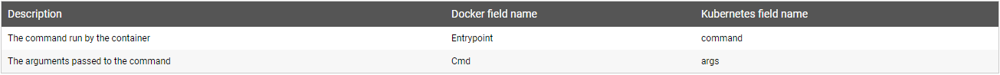
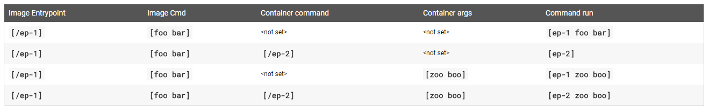
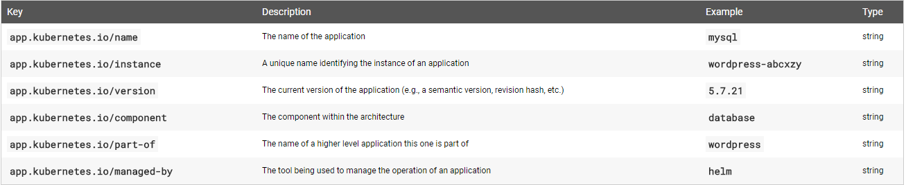
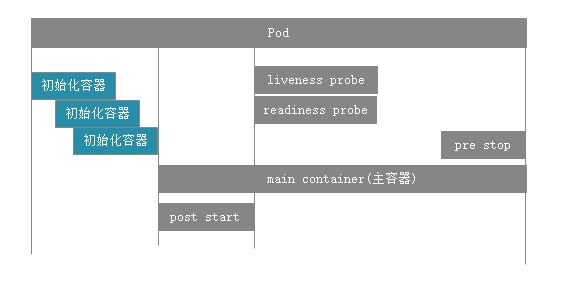
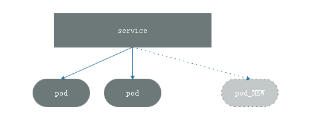

在之前的资源清单中，其中需要遵循几个字段：apiversion(group/version)，kind，metadata(name,namespace,labels,annotations,.....)，spec，status。在上一篇的[资源清单](https://www.linuxea.com/1937.html)中有提到过

在pod资源中，spec.containers中，必须要存在这几项
### 镜象和获取策略
```
- name: 容器名称
  image: 镜像,镜像默认来自dockerhub,也可也是一个顶级仓库，也可也是私有仓库
```
```
  imagePullPolicy 镜像获取的策略
    Always 总是重试
    Never 本地存在则用，没有也不会下载，需要手动下载镜像
    IfNotPresent 如果本地存在就使用，如果不存在则下载
	其中。如果镜像标签为latest则会默认使用Always。如果标签不是latest，则默认参数IfNotPresent。
	注意：IfNotPresent一旦在清单中指定，则不能动态修改。
```
### 暴露端口
```
  ports：
  - name: http
    containerPort： 80
  - name: https
    containerPort： 443
定义容器内要暴露的端口，可以定义暴露多个端口，而且每一个端口可以有多个属性来定义，端口号，协议，以及暴露的地址
但是，这里的暴露仅仅提供了额外的信息，并不是代表系统真正的会暴露出去。这与docker网络中的方式不一样
并且，无论是否手动指定了端口，只要pod中容器暴露的端口，就一定会暴露出来的，但是这种暴露与docke中的-p是不一样的，docker是绑定在节点的动态端口的方式，而pod仅限于跨节点之间的访问
name: 名称
containerPort： 暴露端口
加入有多个，可以多调用
并且，这里的配置在后续的调用中也可以使用
protocol 协议,如果没指定，默认tcp
```
### args和command
```
args ： 向entrypoint传递给程序的参数
如果指定了args子段，那么镜象中的cmd字段将不在传递，而是传递args定义的内容
如果引用了变量，$(VAR_NAME)这种方式进行变量引用
如果不想被替换，而是使用命令引用的方式，使用$$(VAR_NAME)来做逃逸
```
```
command ： 要运行的程序
这里运行的command是不会运行在shlle中的，如果要运行在shell中，则需要指定，如下：
    command: 
    - "/bin/sh"
    - "-c"
    - "tail -f /etc/passwd" 
如果你什么都不提供，就直接运行镜象环境中的命令，也就是你不指定/bin/sh，直接使用tail，则使用镜象中的默认环境

* 这类似于Dockerfile中的CMD和ENTRYPOINT，如果只存在CMD，则运行CMD，如果既有ENTRYPOINT又有CMD，那么CMD中的代码作为参数传递给ENTRYPOINT
```

```
对应关系
在dockerfile中的 Entrypoint 对应 Kubernetes中的 command
在dockerfile中的 Cmd 对应 Kubernetes中的 args

* 如果没有定义command也没有定义rgs，则会运行Dockerfile中的ENTRYPOINT或者CMD命令，假如Dockerfile中有ENTRYPOINT或者CMD命令的话
* 如果定义了command没有定义args，那么只运行command。镜象中的ENTRYPOINT或者CMD命令都被忽略
* 如果定义了args没有定义command，那么只使用镜象中ENTRYPOINT当命令，将定义的参数传递给镜象中的ENTRYPOINT。随之，镜象中的CMD则失效
* 如果定义了command又定义args，那便使用定义的，镜象内的忽略
```
并且官网提供了一系列的图示[参考官网](https://kubernetes.io/docs/tasks/inject-data-application/define-command-argument-container/#notes),与和或关系图


args和command都是列表格式，除了使用-定义，还可以使用{}括起来使用

```
    command: {"/bin/sh","-c","tail -f /etc/passwd"}
```
### labels标签管理 

一个资源可以拥有多个标签，同一个标签可以被添加到多个对象，标签可以在创建资源时指定，并且可以在之后进行添加和删除，以及修改

```
  labels:
    www: linuxea-com
```
如上所示，类型key=value，其中键和值的长度最多使用63个字符
* key

其中key只能使用字母，数字，下划线(_)，减号(-)，点(.)，并且只能使用字母开头
在使用键时，可以使用键前缀，前缀总长度不能超过253个字符。
* value

其中value长度也不能超过253个字符，但是可以为空。也就是说可以有key，value可以为空。并且只能以字母或数字开头以及结尾，中间可以使用字母，数字，下划线(_)，减号(-)，点(.)
这当中，标签至少满足一点，见名知意

为了充分利用这些标签，每个标签见名知意，以应用程序名称，标识应用程序实例的唯一名称，版本，组件等。如下示例:


#### 标签查看
此前使用`kubectl get pods --show-labels`可观察到所有pod的标签
```
[marksugar@linuxea linuxea]# kubectl get pods --show-labels
NAME                             READY     STATUS    RESTARTS   AGE       LABELS
client-linuxea                   1/1       Running   0          2d        run=client-linuxea
nginx-linuxea-5786698598-dx2jr   1/1       Running   0          33s       pod-template-hash=1342254154,run=nginx-linuxea
nginx-linuxea-5786698598-stttv   1/1       Running   0          33s       pod-template-hash=1342254154,run=nginx-linuxea
nginx-linuxea-5786698598-t6lpx   1/1       Running   0          33s       pod-template-hash=1342254154,run=nginx-linuxea
pod-demo-linuxea                 3/3       Running   0          21m       tier=backend,www=linuxea-com
```
列出www的标签的标签值的pods: `-L`选项
```
[marksugar@linuxea linuxea]# kubectl get pods -L=www
NAME                             READY     STATUS    RESTARTS   AGE       WWW
client-linuxea                   1/1       Running   0          2d        
nginx-linuxea-5786698598-dx2jr   1/1       Running   0          20s       
nginx-linuxea-5786698598-stttv   1/1       Running   0          20s       
nginx-linuxea-5786698598-t6lpx   1/1       Running   0          20s       
pod-demo-linuxea                 3/3       Running   0          21m       linuxea-com
```
并且可以显示多个标签值,如：显示包含www标签和run状态的pods
```
[marksugar@linuxea linuxea]# kubectl get pods -L=www,run
NAME                             READY     STATUS    RESTARTS   AGE       WWW           RUN
client-linuxea                   1/1       Running   0          2d                      client-linuxea
nginx-linuxea-5786698598-dx2jr   1/1       Running   0          3s                      nginx-linuxea
nginx-linuxea-5786698598-stttv   1/1       Running   0          3s                      nginx-linuxea
nginx-linuxea-5786698598-t6lpx   1/1       Running   0          3s                      nginx-linuxea
pod-demo-linuxea                 3/3       Running   0          20m       linuxea-com   
```
那么如果只想显示www标签的pods，使用小l：` -l`，并且可以接上`--show-labels`
```
[marksugar@linuxea linuxea]# kubectl get pods -l=www
NAME               READY     STATUS    RESTARTS   AGE
pod-demo-linuxea   3/3       Running   0          16m
```
```
[marksugar@linuxea linuxea]# kubectl get pods -l=www --show-labels
NAME               READY     STATUS    RESTARTS   AGE       LABELS
pod-demo-linuxea   3/3       Running   0          15m       tier=backend,www=linuxea-com
```
#### 标签打包
事先创建了`pod-demo-linuxea`，此刻添加一个标签`version=20180808`
```
[marksugar@linuxea linuxea]# kubectl label pods pod-demo-linuxea version=20180808
pod/pod-demo-linuxea labeled
```
```
[marksugar@linuxea linuxea]# kubectl get pods -l=www --show-labels
NAME               READY     STATUS    RESTARTS   AGE       LABELS
pod-demo-linuxea   3/3       Running   0          22m       tier=backend,version=20180808,www=linuxea-com
```
此刻标签已经打上，可是现在要进行更改，如果要 更改就要使用`--overwrite`覆盖
将version=20180808改成version=20180809，方式覆盖 
```
[marksugar@linuxea linuxea]# kubectl label pods pod-demo-linuxea version=20180809 --overwrite
pod/pod-demo-linuxea labeled
```
```
[marksugar@linuxea linuxea]# kubectl get pods -l=www --show-labels
NAME               READY     STATUS    RESTARTS   AGE       LABELS
pod-demo-linuxea   3/3       Running   0          13h       tier=backend,version=20180809,www=linuxea-com
```
#### 标签的选择器
等值关系标签选择器：=(等于)，==(等于)，!=(不等于)
集合关系标签选择器：  Key in (VALUE1,VALUE2,...)
​					Key notin (VALUE1,VALUE2,...)
​					Key 存在次键
​					!Key 不存在次键
其中，在标签选择器中可以指定多个选择条件，在多个条件中隐含了逻辑域
如果使用空的标签，则都符合选择
- 等值关系示例：

等于
```
[marksugar@linuxea linuxea]# kubectl get pods -l version=20180809 --show-labels
NAME               READY     STATUS    RESTARTS   AGE       LABELS
pod-demo-linuxea   3/3       Running   0          14h       tier=backend,version=20180809,www=linuxea-com
```
不等于
```
[marksugar@linuxea linuxea]# kubectl get pods -l version!=20180809 --show-labels
NAME                             READY     STATUS    RESTARTS   AGE       LABELS
client-linuxea                   1/1       Running   0          2d        run=client-linuxea
nginx-linuxea-5786698598-dx2jr   1/1       Running   0          14h       pod-template-hash=1342254154,run=nginx-linuxea
nginx-linuxea-5786698598-stttv   1/1       Running   0          14h       pod-template-hash=1342254154,run=nginx-linuxea
nginx-linuxea-5786698598-t6lpx   1/1       Running   0          14h       pod-template-hash=1342254154,run=nginx-linuxea
[marksugar@linuxea linuxea]# 
```
- 集合关系示例：

查找version的值是20180809，以及20180810
```
[marksugar@linuxea linuxea]# kubectl get pods -l "version in (20180809，20180910)" --show-labels
NAME               READY     STATUS    RESTARTS   AGE       LABELS
pod-demo-linuxea   3/3       Running   0          15h       tier=backend,version=20180809,www=linuxea-com
[marksugar@linuxea linuxea]# 
```
查找version的值是20180809和20180810以外的
```
[marksugar@linuxea linuxea]# kubectl get pods -l "version notin (20180809，20180810)" --show-labels
NAME                             READY     STATUS    RESTARTS   AGE       LABELS
client-linuxea                   1/1       Running   0          2d        run=client-linuxea
nginx-linuxea-5786698598-dx2jr   1/1       Running   0          14h       pod-template-hash=1342254154,run=nginx-linuxea
nginx-linuxea-5786698598-stttv   1/1       Running   0          14h       pod-template-hash=1342254154,run=nginx-linuxea
nginx-linuxea-5786698598-t6lpx   1/1       Running   0          14h       pod-template-hash=1342254154,run=nginx-linuxea
pod-demo-linuxea                 3/3       Running   0          15h       tier=backend,version=20180809,www=linuxea-com
```
#### 标签关联
通常，在pod和service中会做一些标签关联，会使用另外两个字段来.
许多资源支持内嵌字段，其使用的标签选择器如下：
- matchLabels: 直接给定键值
- matchExpressions: 基于给定的表达式来定义使用标签选择器，{key:"KEY",operator:"OPERATOR",values:[VAL1,VAL2,.....]} 
  操作符 
  ​	In，NotIn: values字段必须为非空列表
  ​	Exists,NotExists： values字段必须为空列表
#### node标签
nodeSelector：节点标签选择器，
简单的打标：wwwtype=www.linuxea.com
```
[marksugar@linuxea linuxea]# kubectl label nodes linuxea.node-3.com wwwtype=www.linuxea.com
node/linuxea.node-3.com labeled
```
查看`wwwtype=www.linuxea.com`，是对应到linuxea.node-3.com的nodes上
```
[marksugar@linuxea linuxea]# kubectl get nodes --show-labels
NAME                   STATUS    ROLES     AGE       VERSION   LABELS
linuxea.master-1.com   Ready     master    3d        v1.11.2   beta.kubernetes.io/arch=amd64,beta.kubernetes.io/os=linux,kubernetes.io/hostname=linuxea.master-1.com,node-role.kubernetes.io/master=
linuxea.node-1.com     Ready     <none>    3d        v1.11.2   beta.kubernetes.io/arch=amd64,beta.kubernetes.io/os=linux,kubernetes.io/hostname=linuxea.node-1.com
linuxea.node-2.com     Ready     <none>    3d        v1.11.2   beta.kubernetes.io/arch=amd64,beta.kubernetes.io/os=linux,kubernetes.io/hostname=linuxea.node-2.com
linuxea.node-3.com     Ready     <none>    3d        v1.11.2   beta.kubernetes.io/arch=amd64,beta.kubernetes.io/os=linux,kubernetes.io/hostname=linuxea.node-3.com,men=8G,wwwtype=www.linuxea.com
```
而后在yaml文件中指定
```
  nodeSelector:
    wwwtype: www.linuxea.com
```
与spec下的containers同级，示例如下：
```
apiVersion: v1
kind: Pod
metadata: 
  name: pod-demo-linuxea
  namespace: default
  labels:
    www: linuxea-com
    tier: backend
spec:
  containers:
  - name: linuxea-pod1-com
    image: "marksugar/nginx:1.14.a"
    ports:
      - containerPort: 88
  - name: linuxea-pod2-com
    image: "marksugar/nginx:1.14.b"
    ports:
      - containerPort: 88
  - name: alpine
    image: "alpine:3.8"
    command: 
    - "/bin/sh"
    - "-c"
    - "tail -f /etc/passwd"
  nodeSelector:
    wwwtype: www.linuxea.com
```
而后`kubectl create -f pod-demo.yaml`
```
[marksugar@linuxea linuxea]# kubectl create -f pod-demo.yaml 
pod/pod-demo-linuxea created
```
在次观察，`pod-demo.yaml `已经添加到`linuxea.node-3.com`
```
[marksugar@linuxea linuxea]# kubectl get pods -o wide --show-labels
NAME                             READY     STATUS    RESTARTS   AGE       IP             NODE                 NOMINATED NODE   LABELS
client-linuxea                   1/1       Running   0          2d        172.16.2.252   linuxea.node-2.com   <none>           run=client-linuxea
nginx-linuxea-5786698598-dx2jr   1/1       Running   0          15h       172.16.2.11    linuxea.node-2.com   <none>           pod-template-hash=1342254154,run=nginx-linuxea
nginx-linuxea-5786698598-stttv   1/1       Running   0          15h       172.16.1.15    linuxea.node-1.com   <none>           pod-template-hash=1342254154,run=nginx-linuxea
nginx-linuxea-5786698598-t6lpx   1/1       Running   0          15h       172.16.3.25    linuxea.node-3.com   <none>           pod-template-hash=1342254154,run=nginx-linuxea
pod-demo-linuxea                 3/3       Running   0          2s        172.16.3.26    linuxea.node-3.com   <none>           tier=backend,www=linuxea-com
```
而后`kubectl describe pods pod-demo-linuxea |tail -15`查看倒数15行的信息
```
[marksugar@linuxea linuxea]# kubectl describe pods pod-demo-linuxea |tail -15
Tolerations:     node.kubernetes.io/not-ready:NoExecute for 300s
                 node.kubernetes.io/unreachable:NoExecute for 300s
Events:
  Type    Reason     Age   From                         Message
  ----    ------     ----  ----                         -------
  Normal  Scheduled  50s   default-scheduler            Successfully assigned default/pod-demo-linuxea to linuxea.node-3.com
  Normal  Pulled     49s   kubelet, linuxea.node-3.com  Container image "marksugar/nginx:1.14.a" already present on machine
  Normal  Created    49s   kubelet, linuxea.node-3.com  Created container
  Normal  Started    49s   kubelet, linuxea.node-3.com  Started container
  Normal  Pulled     49s   kubelet, linuxea.node-3.com  Container image "marksugar/nginx:1.14.b" already present on machine
  Normal  Created    49s   kubelet, linuxea.node-3.com  Created container
  Normal  Started    48s   kubelet, linuxea.node-3.com  Started container
  Normal  Pulled     48s   kubelet, linuxea.node-3.com  Container image "alpine:3.8" already present on machine
  Normal  Created    48s   kubelet, linuxea.node-3.com  Created container
  Normal  Started    48s   kubelet, linuxea.node-3.com  Started container
```
#### 资源注解
annotations : annotations与label的区别在于 : 它不能用于标签的选择器，仅用于为对象提供"元数据"。这些数据有些时候会被某些程序用到，键值不受长度限制。在声明时会被用上
```
[marksugar@linuxea linuxea]# kubectl describe pods pod-demo-linuxea |grep Annotations
Annotations:        <none>
[marksugar@linuxea linuxea]# 
```
可见现在没有配置。删除后添加
```
[marksugar@linuxea linuxea]# kubectl delete -f pod-demo.yaml 
pod "pod-demo-linuxea" deleted
```
编辑资源清单添加
```
  annotations:
    www.linuxea.com/ops-by: "linuxea admin"
```
完整如下
```
apiVersion: v1
kind: Pod
metadata: 
  name: pod-demo-linuxea
  namespace: default
  labels:
    www: linuxea-com
    tier: backend
  annotations:
    www.linuxea.com/ops-by: "linuxea admin"
spec:
  containers:
  - name: linuxea-pod1-com
    image: "marksugar/nginx:1.14.a"
    ports:
      - containerPort: 88
  - name: linuxea-pod2-com
    image: "marksugar/nginx:1.14.b"
    ports:
      - containerPort: 88
  - name: alpine
    image: "alpine:3.8"
    command: 
    - "/bin/sh"
    - "-c"
    - "tail -f /etc/passwd"
  nodeSelector:
    wwwtype: www.linuxea.com
```
开始create
```
[marksugar@linuxea linuxea]# kubectl create -f pod-demo.yaml 
pod/pod-demo-linuxea created
```

```
[marksugar@linuxea linuxea]# kubectl describe pods pod-demo-linuxea |grep Annotations
Annotations:        www.linuxea.com/ops-by=linuxea admin
```
### pod生命周期
对于一个Pod而言，从开始到结束,要经过很多点
初始化则在其中，而初始化也需要一定的时间，如：Dockerfile中的ENTRYPOINT脚本，此脚本也需要运行时间，所谓的秒级启动，可能不包含这些，简述pod什么周期，如下图

其中，在容器内通常运行一个进程，而在pod中通常运行一个容器。在pod中的主容器运行之前是需要做一些环境设定，比如[init-containers](https://kubernetes.io/docs/concepts/workloads/pods/init-containers/),在主容器启动之前，会运行一个环境初始化的容器，运行完成后就退出，并且初始化容器不单单只会是一个，多个初始化容器之间是串行执行的，当最后一个初始化容器执行完成并且退出后则主容器启动。
在主容器启动时，也会进行环境初始化，如一些文件展开，启动服务等。
在主容器刚刚启动后，用户可以手动嵌入做一些操作Post start,执行完成则退出。
在主容器结束前，也可以做一些操作pre stop,这种做一些钩子来实现启动前的预设和结束后的清理。

在主容器执行的过程中，还可以做一些操作，在post start 完成后。如，健康状态监测。
liveness probe ： 存活状态监测。
readiness probe：就绪性状态检测。
- 存活探测

在kubernetes中是有两种探测，而Docker中则没有存活探测，因为如果docker不存活则结束，而在kubernetes中则不是，一个pod中存在多个容器，一个容器结束了，而pod则不存在问题的。为了探测某一个特定容器，特别是主容器是否运行正常，则需要存活性探测
- probe

无论哪一种probe都支持三种探测行为。
第一种则是自定义操作
第二种向指定的套接字发请求
第三种向指定的http发请求，如：get响应码

然而，pod从创建到结束之前，一定处于某种状态之中。
状态如下：
​	状态：Pending，调度尚未完成的挂起
​	running：运行状态
​	Failed：失败.
​	Succeeded：成功
​	Unknown：未知状态。pod的状态是API server与运行pod节点的kubelet通信来获取节点信息的，	如果kubelet本身故障，就得不到信息，Unknown
- 创建pod过程

创建pod时候，请求会提交给apiserver,apiserver将请求的目标状态保存在etcd中，而后apiserver请求`scheduler`(scheduler负责挑选节点运行pod),调度成功则保存在etcd中，调度信息会更新到etcd的pod资源中的状态资源中。一旦信息存储在etcd中更新后，被调度节点（挑选的NODE）kubelet通过apiserver中的状态变化得知任务下发详情，此刻kubelet通过apiserver会拿到此前用户提交的资源创建清单，根据清单在当前节点上运行或者创建启动这个pod,如果运行或者创建成功或者失败， 它的当前节点状态会发回apiserver,apiserver随后存储在etcd当中

现在，我们知道在pod的什么周期中的几种重要行为: 初始化容器，容器探测（liveness,readiness ），但是如果容器挂了又是如何处理的
#### restartPolicy
一旦pod中的容器挂了，则会有如下状态
Always:：重启，延迟重启
- 一旦某个pod被调度到某个节点后，只要这个节点在，此pod便不会被重新调度，只会进行重启

其中，每隔一段时间，就会向`liveness probe` ，`readiness probe`发送探测 ，一旦故障，故障之后的操作取决于`restartPolicy`的状态
`Onfailure`：只有状态为错误才重启
`Never`： 不重启
`Default`：
#### 终止容器
在删除一个pod时候，并不会直接Kill掉。
其中，当提交一个`termination`时，会向pod内的每一个容器，发送一个终止信号。而后pod内的容器会进行正常终止，但是这个正常终止并非无限期，他有一个时间宽限段，默认30秒（可另行指定），一旦在这个宽限的时间内没有终止，将会发送终止信号，强行终止

### 存活状态liveness probe
探针类型有三种,`ExecAction`,`TCPSocketAction`,`HTTPGetAction `
`ExecAction`: 容器探测
`failureThreshold`：探测几次，默认3次探测失败，则失败
`periodSeconds`：间隔时间，10秒
`timeoutSeconds`：探测超时时间，1秒
`initialDelayseconds` :   初始化探测延迟时间(在容器启动的时候，并不能立即做探测，因为在容器启动时候，有启动前初始化操作，也就是说，这个时间，容器并未准备好，因此，应该等待一段时间，确保初始化成功后在进行探测。也就是说，容器启动，并不意味着容器内的进程就运行起来的)。如果未定义，容器启动就探测,就会出现问题(默认情况下，kubernetes在容器内进程启动后立即可是发送流量，如果尚未准备好，则会出错(默认情况下，kubernetes认为一切正常就可以向“尚未准备完成，且已经up的pod发送请求”)，正确的方式应该等待容器准备完成，完全启动，然后才允许服务将流量发送到该pod)。 [参考官网1](https://kubernetes.io/docs/concepts/workloads/pods/pod-lifecycle/#container-probes),[参考官网2](https://kubernetes.io/docs/tasks/configure-pod-container/configure-liveness-readiness-probes/)

- `ExecAc`

- `ExecAction`

`ExecAction`内嵌command，其命令必须在容器内存在，如果返回成功，则存活，否则失败

#### command探测

编辑yaml文件
其中，imagePullPolicy使用IfNotPresent，如果本地存在镜象，就不拉取，不存在在拉取
command命令中，创建一个linuxea的文件，暂停10秒，而后又删除，删除完成后暂停3600秒

在liveness Probe(存活状态监测中)，test /linuxea
初始化探针延迟(initialDelaySeconds)1秒
间隔三秒探测一次(periodSeconds)
```
[marksugar@linuxea linuxea]# cat liveness-exec-linuxea.yaml 
apiVersion: v1
kind: Pod
metadata: 
  name: linuxea.com
  namespace: default
spec:
  containers:
  - name: liveness-exec-linuxea
    image: busybox:latest
    imagePullPolicy: IfNotPresent
    command: ["/bin/sh","-c","touch /linuxea; sleep 10; rm -f /linuxea;sleep 3600"]
    livenessProbe:
      exec:
        command: ["test","-e","/linuxea"]
      initialDelaySeconds: 1
      periodSeconds: 3
#  restartPolicy: Onfailure
```
启动
```
[marksugar@linuxea linuxea]# kubectl create -f liveness-exec-linuxea.yaml 
pod/linuxea.com created
```
启动后开始ContainerCreating，这个动作中如果node没有镜象就会去下载
```
[marksugar@linuxea linuxea]# kubectl get pods
NAME                             READY     STATUS              RESTARTS   AGE
client-linuxea                   1/1       Running             0          3d
linuxea.com                      0/1       ContainerCreating   0          7s
```
而后使用`kubectl get pods -w`查看状态信息
```
[marksugar@linuxea linuxea]# kubectl get pods -w
NAME                             READY     STATUS    RESTARTS   AGE
client-linuxea                   1/1       Running   0          3d
linuxea.com                      1/1       Running   0          36s
nginx-linuxea-5786698598-dx2jr   1/1       Running   0          1d
nginx-linuxea-5786698598-stttv   1/1       Running   0          1d
nginx-linuxea-5786698598-t6lpx   1/1       Running   0          1d
pod-demo-linuxea                 3/3       Running   0          22h
linuxea.com   1/1       Running   1         58s
linuxea.com   1/1       Running   2         1m
linuxea.com   1/1       Running   3         2m
linuxea.com   1/1       Running   4         3m
linuxea.com   1/1       Running   5         4m
```
此前RESTARTS为5，也就是说检测了五次/linuxea文件，由于被删除，所以失败了五次，restartPolicy默认重启，所以目前也重启了五次
```
[marksugar@linuxea linuxea]# kubectl get pods -o wide
NAME                             READY     STATUS    RESTARTS   AGE       IP             NODE                 NOMINATED NODE
client-linuxea                   1/1       Running   0          3d        172.16.2.252   linuxea.node-2.com   <none>
linuxea.com                      1/1       Running   5          4m        172.16.3.28    linuxea.node-3.com   <none>
nginx-linuxea-5786698598-dx2jr   1/1       Running   0          1d        172.16.2.11    linuxea.node-2.com   <none>
```
#### tcp探测

指明主机和端口进行探测

tcp和httpget是非常相似的，在容器启动5秒后，发送就绪tcpSocket，尝试链接pod内容器的8080端口，如果成功链接，就转换为就绪状态。kubelet将会每(periodSeconds)10秒检查一次

```
    ports:
    - containerPort: 8080
    readinessProbe:
      tcpSocket:
        port: 8080
      initialDelaySeconds: 5
      periodSeconds: 10
```

#### httpGet探测

```
apiVersion: v1
kind: Pod
metadata: 
  name: linuxea.com-httpget
  namespace: default
spec:
  containers:
  - name: liveness-httpd-linuxea
    image: marksugar/nginx:1.14.a
    imagePullPolicy: IfNotPresent
    ports:
    - name: http
      containerPort: 80
    livenessProbe:
      httpGet:
        port: http
        path: /index.html
      initialDelaySeconds: 1
      periodSeconds: 3
#  restartPolicy: Onfailure
```

创建

```
[marksugar@linuxea linuxea]# kubectl create -f liveness-httpget.yaml 
pod/linuxea.com-httpget created
```

```
[marksugar@linuxea linuxea]# kubectl get pods -o wide
NAME                             READY     STATUS    RESTARTS   AGE       IP             NODE                 NOMINATED NODE
client-linuxea                   1/1       Running   0          3d        172.16.2.252   linuxea.node-2.com   <none>
linuxea.com                      1/1       Running   37         1h        172.16.3.28    linuxea.node-3.com   <none>
linuxea.com-httpget              1/1       Running   0          15s       172.16.2.12    linuxea.node-2.com   <none>
nginx-linuxea-5786698598-dx2jr   1/1       Running   0          1d        172.16.2.11    linuxea.node-2.com   <none>
nginx-linuxea-5786698598-stttv   1/1       Running   0          1d        172.16.1.15    linuxea.node-1.com   <none>
nginx-linuxea-5786698598-t6lpx   1/1       Running   0          1d        172.16.3.25    linuxea.node-3.com   <none>
pod-demo-linuxea                 3/3       Running   0          1d        172.16.3.27    linuxea.node-3.com   <none>
[marksugar@linuxea linuxea]# curl 172.16.2.12
linuxea-linuxea.com-httpget.com-127.0.0.1/8 172.16.2.12/24
```

```
[marksugar@linuxea linuxea]# kubectl describe pods linuxea.com-httpget|egrep "Restart|Liveness"
    Restart Count:  0
    Liveness:       http-get http://:http/index.html delay=1s timeout=1s period=3s #success=1 #failure=3
```

模拟故障` kubectl exec -it linuxea.com-httpget  -- /bin/sh`，删掉index.html

```
[marksugar@linuxea linuxea]# kubectl exec -it linuxea.com-httpget  -- /bin/sh
/ # ls /data/wwwroot/index.html 
/data/wwwroot/index.html
/ # \rm -rf /data/wwwroot/index.html 
/ # command terminated with exit code 137
```

开始报404,使用`kubectl describe pods linuxea.com-httpget|egrep "Restart|Liveness"`查看

```
[marksugar@linuxea linuxea]# kubectl describe pods linuxea.com-httpget|egrep "Restart|Liveness"
    Restart Count:  0
    Liveness:       http-get http://:http/index.html delay=1s timeout=1s period=3s #success=1 #failure=3
  Warning  Unhealthy  7s (x3 over 13s)  kubelet, linuxea.node-2.com  Liveness probe failed: Get 404.html: stopped after 10 redirects
```

而后重启。一旦重启就会重置，容器内的文件将会恢复

```
[marksugar@linuxea linuxea]# kubectl describe pods linuxea.com-httpget|egrep "Last|Restart|Liveness"
    Last State:     Terminated
    Restart Count:  1
    Liveness:       http-get http://:http/index.html delay=1s timeout=1s period=3s #success=1 #failure=3
  Warning  Unhealthy  39s (x3 over 45s)  kubelet, linuxea.node-2.com  Liveness probe failed: Get 404.html: stopped after 10 redirects
```

### 就绪检测readiness probe
就绪探测

当使用`kubectl get pods`，在READY中的1/1,右边的1是POD内容器数量，而左边的1是就绪的个数。倘若不定义，那么在启动时候，就会立刻就绪
```
[marksugar@linuxea linuxea]# kubectl get pods
NAME                             READY     STATUS    RESTARTS   AGE
client-linuxea                   1/1       Running   0          3d
linuxea.com-httpget              1/1       Running   1          3h
nginx-linuxea-5786698598-dx2jr   1/1       Running   0          1d
nginx-linuxea-5786698598-stttv   1/1       Running   0          1d
nginx-linuxea-5786698598-t6lpx   1/1       Running   0          1d
pod-demo-linuxea                 3/3       Running   0          1d
```
但是，这样启动就会存在问题。在就绪探测中，倘若一个pod在启动时立刻就绪，那么可能会出现问题，在容器内的程序就绪之前有很多过程可能尚未准备完成。如：展开文件，启动程序

如上图所示，service通过标签选择器关联各个pod。此刻，pod_NEW符合选择器的选择条件，pod_NEW将会立刻成为service标签选择器都后端pod之一。此刻，pod_NEW并未就绪，自我初始化尚未完成。那么此刻调度时，service倘若请求到pod_NEW上就会出错。

当然，期望是在调度时，pod_NEW的应用程序已经就绪,也就说以及初始化完成
为此，使用readiness probe来做就绪探测。
做一个测试 
```
[marksugar@linuxea linuxea]# cat readiness-httpget.yaml 
apiVersion: v1
kind: Pod
metadata: 
  name: linuxea.com-httpget-readiness
  namespace: default
spec:
  containers:
  - name: readiness-httpd-linuxea
    image: marksugar/nginx:1.14.a
    imagePullPolicy: IfNotPresent
    ports:
    - name: http
      containerPort: 80
    livenessProbe:
      httpGet:
        port: http
        path: /index.html
      initialDelaySeconds: 1
      periodSeconds: 3
    readinessProbe:
      httpGet:
        port: http
        path: /linuxea.html
      initialDelaySeconds: 1
      periodSeconds: 3
```
开始创建
```
[marksugar@linuxea linuxea]# kubectl create -f readiness-httpget.yaml 
pod/linuxea.com-httpget-readiness created
```
已经创建成功
```
[marksugar@linuxea linuxea]# kubectl get pods -o wide
NAME                             READY     STATUS    RESTARTS   AGE 
client-linuxea                   1/1       Running   0          3d  
linuxea.com-httpget              1/1       Running   2          4h  
linuxea.com-httpget-readiness    1/1       Running   0          5s  
```
而后删除掉/data/wwwroot/linuxea.html 
```
[marksugar@linuxea linuxea]# kubectl exec -it linuxea.com-httpget-readiness  -- /bin/sh
/ # ls /data/wwwroot/
index.html    linuxea.html
/ # \rm -rf /data/wwwroot/linuxea.html 
/ # 
```
紧接着就绪检测失败，不在就绪状态
```
[marksugar@linuxea linuxea]# kubectl get pods -o wide
NAME                             READY     STATUS    RESTARTS   AGE 
client-linuxea                   1/1       Running   0          3d  
linuxea.com-httpget              1/1       Running   2          4h  
linuxea.com-httpget-readiness    0/1       Running   0          52s 
```
此刻，可以使用`kubectl describe pods linuxea.com-httpget-readiness`查看
- 恢复

在将文件补齐``echo `date`-linuxea >> /data/wwwroot/linuxea.html``
```
[marksugar@linuxea linuxea]# kubectl exec -it linuxea.com-httpget-readiness  -- /bin/sh
/ # ls /data/wwwroot/
index.html    linuxea.html
/ # \rm -rf /data/wwwroot/linuxea.html 
/ # echo `date`-linuxea >> /data/wwwroot/linuxea.html
```
READY又恢复就绪状态
```
[marksugar@linuxea linuxea]# kubectl get pods 
NAME                             READY     STATUS    RESTARTS   AGE
client-linuxea                   1/1       Running   0          3d
linuxea.com-httpget              1/1       Running   2          4h
linuxea.com-httpget-readiness    1/1       Running   0          6m
```
curl
```
[marksugar@linuxea linuxea]# curl 172.16.3.30/linuxea.html
Mon Aug 27 13:21:06 UTC 2018-linuxea
[marksugar@linuxea linuxea]# 
```
### 钩子
PostStart ：创建容器后，立即执行的操作，如果执行失败，容器终止，并且重启。重启与否取决于重启策略
prestop：容器终止前执行命令，执行完成后终止
都有三种行为：exec,httpget,tcpSocket
exec：commamd命令
httpget: get请求
tcpsocket: socket请求

#### PostStart 

```
[marksugar@linuxea linuxea]# cat poststart-linuxea.yaml 
apiVersion: v1
kind: Pod
metadata: 
  name: linuxea.com.poststart
  namespace: default
spec:
  containers:
  - name: poststart-linuxea-com
    image: marksugar/nginx:1.14.a
    imagePullPolicy: IfNotPresent
    ports:
    - name: http
      containerPort: 80
    lifecycle:
      postStart:
        exec:
          command:
            - "/bin/sh"
            - "-c"
            - >
              if [ ! -d /data/wwwroot/linuxea.com/ ]; then
              mkdir -p /data/wwwroot/linuxea.com;
              echo `date`-linuxea.com >>/data/wwwroot/linuxea.com/index.html;
              sed -i 's#/data/wwwroot#/data/wwwroot/linuxea.com#g' /etc/nginx/nginx.conf;
              fi;
              if [ -s /data/wwwroot/linuxea.com/index.html ]; then
              chown -R www.www /data/wwwroot;
              fi;
```

create

```
[marksugar@linuxea linuxea]# kubectl create -f poststart-linuxea.yaml 
pod/linuxea.com.poststart created

```

```
[marksugar@linuxea linuxea]# kubectl get pods
NAME                             READY     STATUS    RESTARTS   AGE
client-linuxea                   1/1       Running   0          4d
linuxea.com-httpget              1/1       Running   2          21h
linuxea.com-httpget-readiness    1/1       Running   0          17h
linuxea.com.poststart            1/1       Running   0          3s
```

```
[marksugar@linuxea linuxea]# kubectl get pods -o wide
NAME                             READY     STATUS    RESTARTS   AGE       IP             NODE                 NOMINATED NODE
client-linuxea                   1/1       Running   0          4d        172.16.2.252   linuxea.node-2.com   <none>
linuxea.com-httpget              1/1       Running   2          21h       172.16.2.12    linuxea.node-2.com   <none>
linuxea.com-httpget-readiness    1/1       Running   0          17h       172.16.3.30    linuxea.node-3.com   <none>
linuxea.com.poststart            1/1       Running   0          10s       172.16.1.32    linuxea.node-1.com   <none>
```

```
[marksugar@linuxea linuxea]# curl 172.16.1.32
Tue Aug 28 06:17:41 UTC 2018-linuxea.com
```

通过sh登陆到pod容器内

```
[marksugar@linuxea linuxea]# kubectl exec -it linuxea.com.poststart  -- /bin/sh
/ # cat /data/wwwroot/linuxea.com/index.html 
Tue Aug 28 06:17:41 UTC 2018-linuxea.com
```

```
/ # cat /etc/nginx/nginx.conf|grep root
        root   /data/wwwroot/linuxea.com;
       root /data/wwwroot/linuxea.com;
```