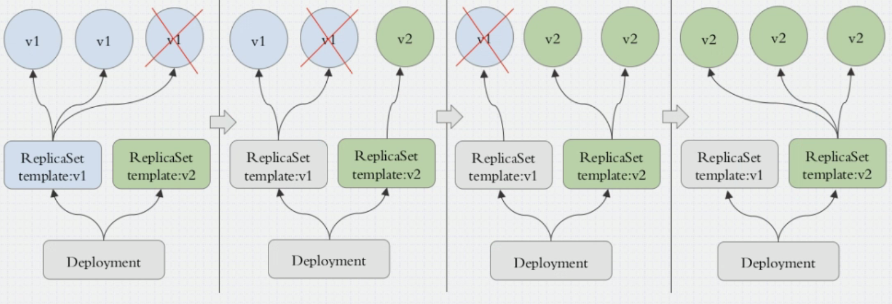
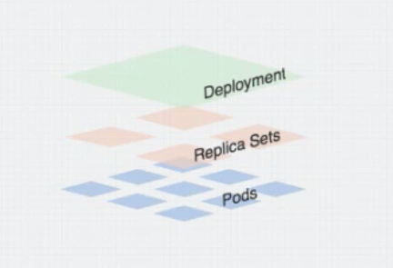
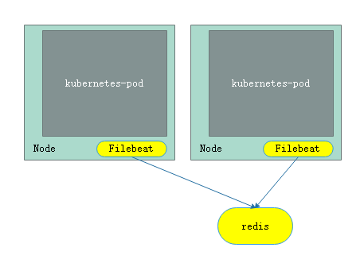
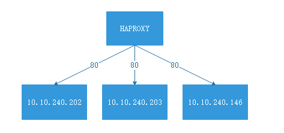
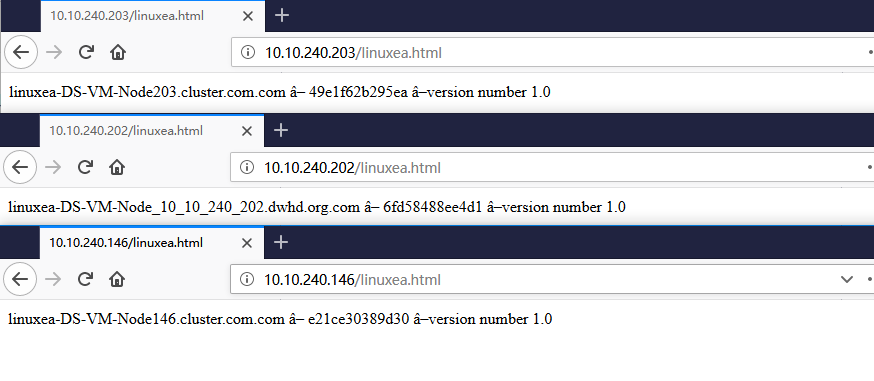

## pod控制器
在之前，使用kubectl run的pod中，当pod被删除后会自动创建。而在kubectl create使用-f指定yaml文件时候，在删除则不会被创建。
在kubectl run的pod是被控制器管理的，pod控制会严格管控pod资源符合用户期望的目标状态，如：定义了3个pod资源，一旦缺少必然会重建补全，多余也会杀死终止，一旦故障尝试重启或者编排。倘若希望减少是可以用命令定义缩减。
然而使用create -f NAME.yaml的方式清晰简单，可定义想要的方式

其中
### ReplicaSet
replicaset：代用户创建指定的pod副本，并确保pod副本一直满足与用户期望的状态，并且支持扩展和缩容。
replicaset由三个部分组成，分别是"用户期望副本数"，"标签选择器"(选择和管理副本)，"pod资源模板"。当用户创建副本后，标签选择根据信息创建pod副本，一旦pod副本缺少或者超出，则使用第三个组成部分"pod资源模板"，根据pod资源模板进行扩展或者缩容
create一个模板

```
[root@linuxea linuxea]# cat replicaset.yaml 
apiVersion: apps/v1
kind: ReplicaSet
metadata:
  name: linuxea.com
  namespace: default
spec:
  replicas: 2
  selector:
    matchLabels:
      app: linuxea.com
      release: v1
  template:
    metadata:
      name: linuxea.com-pod
      labels:
        app: linuxea.com
        release: v1
    spec:
      containers:
      - name: linuxea-container
        image: marksugar/nginx:1.14.b
        imagePlull: 
        ports: 
        - name: http
          containerPort: 80
```
这里使用逻辑域，加上matchLabels字段。selector必须匹配有app标签，name必须是linuxea.com，有release表情，那么值必须是v1
template的labels字段最好和selector中一样
```
[root@linuxea linuxea]# kubectl describe pods linuxea.com-8fkl2
Name:               linuxea.com-8fkl2
Namespace:          default
Priority:           0
PriorityClassName:  <none>
Node:               linuxea.node-2.com/10.10.240.203
Start Time:         Thu, 30 Aug 2018 13:41:01 +0100
Labels:             app=linuxea.com
                    release=v1
Annotations:        <none>
Status:             Running
IP:                 172.16.2.28
Controlled By:      ReplicaSet/linuxea.com
```


```
[root@linuxea linuxea]# curl 172.16.2.28
linuxea-linuxea.com-8fkl2.com-127.0.0.1/8 172.16.2.28/24
[root@linuxea linuxea]# curl 172.16.2.28/linuxea.html
linuxea-linuxea.com-8fkl2.com ▍ b9415aba0478a ▍version number 2.0
```
倘若此刻删除则会补全这个pod
```
[root@linuxea linuxea]# kubectl delete pods linuxea.com-v4l9h
pod "linuxea.com-v4l9h" deleted
```
```
[root@linuxea linuxea]# kubectl get pods -o wide --show-labels
NAME                             READY     STATUS    RESTARTS   AGE       IP             NODE                 NOMINATED NODE   LABELS
client-linuxea                   1/1       Running   0          6d        172.16.2.252   linuxea.node-2.com   <none>           run=client-linuxea
linuxea.com-8fkl2                1/1       Running   0          9m        172.16.2.28    linuxea.node-2.com   <none>           app=linuxea.com,release=v1
linuxea.com-bbzf2                1/1       Running   0          3m        172.16.3.32    linuxea.node-3.com   <none>           app=linuxea.com,release=v1
```

此刻若要扩展编辑yaml文件即可

```
[root@linuxea linuxea]# kubectl get rs
NAME                       DESIRED   CURRENT   READY     AGE
linuxea.com                2         2         2         27m
nginx-linuxea-5786698598   3         3         3         4d
```

使用 kubectl edit rs linuxea.com编辑，修改replicas数量即可

```
spec:
  replicas: 5
```

如下，此刻已经被扩展

```
[root@linuxea linuxea]# kubectl edit rs linuxea.com
replicaset.extensions/linuxea.com edited
[root@linuxea linuxea]# kubectl get pods -o wide
NAME                             READY     STATUS    RESTARTS   AGE       IP             NODE                 NOMINATED NODE
client-linuxea                   1/1       Running   0          6d        172.16.2.252   linuxea.node-2.com   <none>
linuxea.com-8fkl2                1/1       Running   0          27m       172.16.2.28    linuxea.node-2.com   <none>
linuxea.com-bbzf2                1/1       Running   0          22m       172.16.3.32    linuxea.node-3.com   <none>
linuxea.com-httpget              1/1       Running   2          3d        172.16.2.12    linuxea.node-2.com   <none>
linuxea.com-httpget-readiness    1/1       Running   0          2d        172.16.3.30    linuxea.node-3.com   <none>
linuxea.com-l9vwg                1/1       Running   0          9s        172.16.2.29    linuxea.node-2.com   <none>
linuxea.com-mml4h                1/1       Running   0          9s        172.16.3.33    linuxea.node-3.com   <none>
linuxea.com-vsn5l                1/1       Running   0          9s        172.16.1.33    linuxea.node-1.com   <none>
```

倘若需要修改image的版本，也可以如此

```
    spec:
      containers:
      - image: marksugar/nginx:1.14.a
```

```
[root@linuxea linuxea]# kubectl get rs -o wide
NAME                       DESIRED   CURRENT   READY     AGE       CONTAINERS          IMAGES                   SELECTOR
linuxea.com                5         5         5         38m       linuxea-container   marksugar/nginx:1.14.a   app=linuxea.com,release=v1
```

不过，这里修改的v1，只有重新创建才会生效，并不会立刻生效

此刻删除一个则会生效

```
[root@linuxea linuxea]# kubectl delete pods linuxea.com-l9vwg
pod "linuxea.com-l9vwg" deleted
[root@linuxea linuxea]# kubectl get pods -o wide
NAME                             READY     STATUS    RESTARTS   AGE       IP             NODE                 NOMINATED NODE
client-linuxea                   1/1       Running   0          6d        172.16.2.252   linuxea.node-2.com   <none>
linuxea.com-8f7b8                1/1       Running   0          45s       172.16.2.30    linuxea.node-2.com   <none>
```

在去curl已经完成修改

```
[root@linuxea linuxea]# curl  172.16.2.30/linuxea.html
linuxea-linuxea.com-8f7b8.com ▍ e58a6cb7d33c3 ▍version number 1.0
```

这就类似与灰度更新，倘若使用标签选择器进行修改和多次i修改即可变成蓝绿发布类型，但是其中必然涉及到太多的设计与参与，那么Deployment就可以

### Deployment

而在其中replicaset并不是直接被控制，在replicaset之上是由Deployment来控制，Deployment通过控制replicaset来控制pod。
Deployment支持扩缩容，滚动更新，回滚等，并且提供声明式配置功能，可随时声明，声明后可改变apiserver上期望的目标状态。只需要支持动态资源修改！
Deployment善于管控无状态应用（关注群体，不关注个体）

在Deployment中，Deployment控制两个(replicaset)rs，刚开始在v1 rs删除一个，并在v2 rs新建一个，紧接着在v1 在删除一个，在v2在创建一个，直到将v1全部迁移到v2上。如果想滚回v1，也可。如下图：



不但如此，Deployment可以控制更新节奏和更新逻辑来实现更新场景。如：灰度，蓝绿，金丝雀

如上图所示，倘若3个pod正好符合当前业务场景负载，此刻删除则会影响，那么就需要临时加一个pod，而后在删除一个。以最多多少个，最少多少个进行控制。

#### explain
strategy : 定义更新策略
​	Recreate： 重建更新（删掉就重建，依次重复）
​	rollingUpdate：滚动更新
如果type等于RollingUpdate,则可以使用RollingUpdate来进行定义
如果type等于Recreate，则RollingUpdate失效
查看详情
```
[root@linuxea linuxea]# kubectl describe deploy dpment-linuxea
Name:                   dpment-linuxea
Namespace:              default
CreationTimestamp:      Fri, 31 Aug 2018 14:23:33 +0100
Labels:                 <none>
Annotations:            deployment.kubernetes.io/revision=1
                        kubectl.kubernetes.io/last-applied-configuration={"apiVersion":"apps/v1","kind":"Deployment","metadata":{"annotations":{},"name":"dpment-linuxea","namespace":"default"},"spec":{"replicas":3,"selector"...
Selector:               app=linuxea_app,version=v0.1.32
Replicas:               3 desired | 3 updated | 3 total | 3 available | 0 unavailable
StrategyType:           RollingUpdate
MinReadySeconds:        0
RollingUpdateStrategy:  25% max unavailable, 25% max surge
```

RollingUpdate可控制更新粒度
​	maxSurge: 对应的更新过程当中，最多能超出指定目标数
​	取值方式：数量和百分比（如：原本5个，20%就是1个，40%就是2个）
maxUnavilable：最多有几个不可用(如：原本5个，最多有1个不可用，那就意味着，最少有4个可用)
revisionHistoryLimit：在滚动更新后，保存多少个历史版本，默认10个，设置为0不保存 
paused : 暂停，不更新
其中，replica sets上下共有三级结构，如下：


#### apply声明创建

```
[root@linuxea linuxea]# cat deploy-demt.yaml 
apiVersion: apps/v1
kind: Deployment
metadata:
  name: dpment-linuxea
  namespace: default
spec:
  replicas: 3
  selector:
    matchLabels:
      app: linuxea_app
      version: v0.1.32
  template:
    metadata:
      labels:
        app: linuxea_app
        version: v0.1.32
    spec:
      containers:
      - name: nginx-a
        image: marksugar/nginx:1.14.b
        ports:
        - name: http
          containerPort: 80
```

创建

```
[root@linuxea linuxea]# kubectl apply -f deploy-demt.yaml 
deployment.apps/dpment-linuxea created
```
```
[root@linuxea linuxea]# kubectl get deploy
NAME             DESIRED   CURRENT   UP-TO-DATE   AVAILABLE   AGE
dpment-linuxea   2         2         2            2           31s
```
```
[root@linuxea linuxea]# kubectl get rs
NAME                        DESIRED   CURRENT   READY     AGE
dpment-linuxea-65b8d94cc6   2         2         2         45s
```
在dpment-linuxea-65b8d94cc6中的65b8d94cc6是模板的哈希值(且每一个模板的哈希值都不一样)，dpment-linuxea是name

而在pod中的name段dpment-linuxea-65b8d94cc6-q7hw8，dpment-linuxea-65b8d94cc6-已经作为前缀
```
[root@linuxea linuxea]# kubectl get pods
NAME                              READY     STATUS    RESTARTS   AGE
client-linuxea                    1/1       Running   0          7d
dpment-linuxea-65b8d94cc6-q7hw8   1/1       Running   0          3m
dpment-linuxea-65b8d94cc6-tvn2d   1/1       Running   0          3m
```
倘若现在想扩展，直接修改yaml文件（直接vim打开，为了清楚的记录我修改的值，直接sed）
```
[root@linuxea linuxea]# sed -i 's/replicas: 2/replicas: 3/g' deploy-demt.yaml
```
apply是可以执行多次的。每次的变化会同步到etcd，apiserver发现与etcd不同，更新状态现有状态到预期状态。
```
[root@linuxea linuxea]# kubectl apply -f deploy-demt.yaml 
deployment.apps/dpment-linuxea configured
```

```
[root@linuxea linuxea]# kubectl get rs
NAME                        DESIRED   CURRENT   READY     AGE
dpment-linuxea-65b8d94cc6   3         3         3         10m
linuxea.com                 5         5         5         1d
nginx-linuxea-5786698598    3         3         3         5d
```
```
[root@linuxea linuxea]# kubectl get deploy
NAME             DESIRED   CURRENT   UP-TO-DATE   AVAILABLE   AGE
dpment-linuxea   3         3         3            3           10m
nginx-linuxea    3         3         3            3           5d
```
```
[root@linuxea linuxea]# kubectl get pods
NAME                              READY     STATUS    RESTARTS   AGE
client-linuxea                    1/1       Running   0          7d
dpment-linuxea-65b8d94cc6-kcckt   1/1       Running   0          23s
dpment-linuxea-65b8d94cc6-q7hw8   1/1       Running   0          11m
dpment-linuxea-65b8d94cc6-tvn2d   1/1       Running   0          11m
```
查看详情`kubectl describe deploy dpment-linuxea`,其中
`StrategyType`默认为`RollingUpdate`
```
[root@linuxea linuxea]# kubectl describe deploy dpment-linuxea
Name:                   dpment-linuxea
Namespace:              default
CreationTimestamp:      Fri, 31 Aug 2018 14:23:33 +0100
Labels:                 <none>
Annotations:            deployment.kubernetes.io/revision=1
                        kubectl.kubernetes.io/last-applied-configuration={"apiVersion":"apps/v1","kind":"Deployment","metadata":{"annotations":{},"name":"dpment-linuxea","namespace":"default"},"spec":{"replicas":3,"selector"...
Selector:               app=linuxea_app,version=v0.1.32
Replicas:               3 desired | 3 updated | 3 total | 3 available | 0 unavailable
StrategyType:           RollingUpdate
MinReadySeconds:        0
RollingUpdateStrategy:  25% max unavailable, 25% max surge
```
如上，RollingUpdateStrategy:  25% max unavailable, 25% max surge
可以使用` kubectl get pods -l app=linuxea_app -w`关注到整个过程
为了看到效果，在修改一次image
```
[root@linuxea linuxea]# sed -i 's/nginx:1.14.a/nginx:1.14.b/'g deploy-demt.yaml
```
```
[root@linuxea linuxea]# kubectl apply -f deploy-demt.yaml 
deployment.apps/dpment-linuxea configured
```
`kubectl get pods -l app=linuxea_app -w`观察自动滚动更新的过程
```
[root@linuxea linuxea]# kubectl get pods -l app=linuxea_app -w
NAME                              READY     STATUS    RESTARTS   AGE
dpment-linuxea-65b8d94cc6-kcckt   1/1       Running   0          16m
dpment-linuxea-65b8d94cc6-q7hw8   1/1       Running   0          27m
dpment-linuxea-65b8d94cc6-tvn2d   1/1       Running   0          27m
dpment-linuxea-648d599b5f-xh7xp   0/1       Pending   0         0s
dpment-linuxea-648d599b5f-xh7xp   0/1       Pending   0         0s
dpment-linuxea-648d599b5f-xh7xp   0/1       ContainerCreating   0         0s
dpment-linuxea-648d599b5f-xh7xp   1/1       Running   0         1s
dpment-linuxea-65b8d94cc6-kcckt   1/1       Terminating   0         18m
dpment-linuxea-648d599b5f-94pd2   0/1       Pending   0         0s
dpment-linuxea-648d599b5f-94pd2   0/1       Pending   0         0s
dpment-linuxea-648d599b5f-94pd2   0/1       ContainerCreating   0         0s
dpment-linuxea-648d599b5f-94pd2   1/1       Running   0         1s
dpment-linuxea-65b8d94cc6-tvn2d   1/1       Terminating   0         29m
dpment-linuxea-648d599b5f-blrzr   0/1       Pending   0         0s
dpment-linuxea-648d599b5f-blrzr   0/1       Pending   0         0s
dpment-linuxea-648d599b5f-blrzr   0/1       ContainerCreating   0         0s
dpment-linuxea-648d599b5f-blrzr   1/1       Running   0         2s
dpment-linuxea-65b8d94cc6-q7hw8   1/1       Terminating   0         29m
dpment-linuxea-65b8d94cc6-kcckt   0/1       Terminating   0         19m
dpment-linuxea-65b8d94cc6-kcckt   0/1       Terminating   0         19m
dpment-linuxea-65b8d94cc6-kcckt   0/1       Terminating   0         19m
dpment-linuxea-65b8d94cc6-tvn2d   0/1       Terminating   0         30m
dpment-linuxea-65b8d94cc6-q7hw8   0/1       Terminating   0         30m
dpment-linuxea-65b8d94cc6-tvn2d   0/1       Terminating   0         30m
dpment-linuxea-65b8d94cc6-tvn2d   0/1       Terminating   0         30m
dpment-linuxea-65b8d94cc6-q7hw8   0/1       Terminating   0         30m
dpment-linuxea-65b8d94cc6-q7hw8   0/1       Terminating   0         30m
```
Pending表示尚未调度完成，完成则会创建，依次重复更新完成结束
- 历史版本信息

当，使用`kubectl get rs -o wide`会发现，此前创建的`dpment-linuxea-65b8d94cc6 `依然存在。DESIRED却为0
```
[root@linuxea linuxea]# kubectl get rs -o wide
NAME                        DESIRED   CURRENT   READY     AGE       CONTAINERS          IMAGES                   SELECTOR
dpment-linuxea-648d599b5f   3         3         3         3m        nginx-a             marksugar/nginx:1.14.b   app=linuxea_app,pod-template-hash=2048155619,version=v0.1.32
dpment-linuxea-65b8d94cc6   0         0         0         33m       nginx-a             marksugar/nginx:1.14.a   app=linuxea_app,pod-template-hash=2164850772,version=v0.1.32
```
也可查看历史
```
[root@linuxea linuxea]# kubectl rollout history deployment dpment-linuxea
deployments "dpment-linuxea"
REVISION  CHANGE-CAUSE
1         <none>
2         <none>

[root@linuxea linuxea]# 
```
#### patch补丁

打补丁的临时方式修改，并不会修改原文件
假如修改`replicas`个数
```
[root@linuxea linuxea]# kubectl patch deployment dpment-linuxea -p '{"spec":{"replicas":5}}'
deployment.extensions/dpment-linuxea patched
```
其中，` kubectl patch `后跟name，使用-p花括号的方式，大致这样：`'{"spec":{"replicas":5}}'`，修改完成使用`kubectl get rs`查看
```
[root@linuxea linuxea]# kubectl get rs
NAME                        DESIRED   CURRENT   READY     AGE
dpment-linuxea-648d599b5f   5         5         5         1d
dpment-linuxea-65b8d94cc6   0         0         0         1d
linuxea.com                 5         5         5         2d
nginx-linuxea-5786698598    3         3         3         6d
```
查看pods，已经打补丁修改完成
```
[root@linuxea linuxea]# kubectl get pods
NAME                              READY     STATUS    RESTARTS   AGE
client-linuxea                    1/1       Running   0          9d
dpment-linuxea-648d599b5f-8shps   1/1       Running   0          26s
dpment-linuxea-648d599b5f-94pd2   1/1       Running   0          1d
dpment-linuxea-648d599b5f-blrzr   1/1       Running   0          1d
dpment-linuxea-648d599b5f-ccj9c   1/1       Running   0          26s
```
#### patch2

当前五个pod,最多不可用0个，最大在线可用数量为6个，并且更新第一个就暂停下来

- 修改策略

打补丁进行修改上述策略

```
[root@linuxea linuxea]# kubectl patch deployment dpment-linuxea -p '{"spec":{"strategy":{"rollingUpdate":{"maxSurge":1,"maxUnavailable":0}}}}'
deployment.extensions/dpment-linuxea patched
```

```
[root@linuxea linuxea]# kubectl describe deployment dpment-linuxea|grep RollingUpdateStrategy
RollingUpdateStrategy:  0 max unavailable, 1 max surge
```

上述`RollingUpdateStrategy:  0 max unavailable, 1 max surge`已经从25%修改

- 更新

##### set image

`set image deployment dpment-linuxea`，其中nginx-a是yaml文件中name值，而后使用pause 停止`kubectl rollout pause deployment dpment-linuxea`

使用`set image `修改成`nginx:1.14.c`（这个镜像内容和`nginx:1.14.b`一样）

- pause: 暂停更新
- resume: 继续此前的更新

```
[root@linuxea linuxea]# kubectl set image deployment dpment-linuxea nginx-a=marksugar/nginx:1.14.c &&kubectl rollout pause deployment dpment-linuxea
deployment.extensions/dpment-linuxea image updated
deployment.extensions/dpment-linuxea paused
```

更新完成第一个就会停止,`kubectl get pods -l version=v0.1.32 --show-labels -w`监视,或者不看标签

```
[root@linuxea linuxea]# kubectl get pods -l version=v0.1.32 -w
NAME                              READY     STATUS    RESTARTS   AGE
dpment-linuxea-65b8d94cc6-dlmjw   1/1       Running   0          3m
dpment-linuxea-65b8d94cc6-fxg9h   1/1       Running   0          3m
dpment-linuxea-65b8d94cc6-nlnjd   1/1       Running   0          3m
dpment-linuxea-65b8d94cc6-w4grl   1/1       Running   0          11m
dpment-linuxea-65b8d94cc6-x79t2   1/1       Running   0          3m
dpment-linuxea-745fd95894-ln886   0/1       Pending   0         0s
dpment-linuxea-745fd95894-ln886   0/1       Pending   0         0s
dpment-linuxea-745fd95894-ln886   0/1       ContainerCreating   0         0s
dpment-linuxea-745fd95894-ln886   1/1       Running   0         5s
```

或者使用` kubectl rollout status deployment dpment-linuxea`查看

```
[root@linuxea ~]# kubectl rollout status deployment dpment-linuxea
Waiting for deployment "dpment-linuxea" rollout to finish: 1 out of 5 new replicas have been updated...
```

- rollout

但被更新的这台是想要的结果，而后在更新其他

```
[root@linuxea ~]# kubectl rollout resume deployment dpment-linuxea
deployment.extensions/dpment-linuxea resumed
```

在观察` kubectl rollout status deployment dpment-linuxea`结果

```
[root@linuxea ~]# kubectl rollout status deployment dpment-linuxea
Waiting for deployment "dpment-linuxea" rollout to finish: 1 out of 5 new replicas have been updated...
Waiting for deployment spec update to be observed...
Waiting for deployment spec update to be observed...
Waiting for deployment "dpment-linuxea" rollout to finish: 1 out of 5 new replicas have been updated...
Waiting for deployment "dpment-linuxea" rollout to finish: 1 out of 5 new replicas have been updated...
Waiting for deployment "dpment-linuxea" rollout to finish: 2 out of 5 new replicas have been updated...
Waiting for deployment "dpment-linuxea" rollout to finish: 2 out of 5 new replicas have been updated...
Waiting for deployment "dpment-linuxea" rollout to finish: 3 out of 5 new replicas have been updated...
Waiting for deployment "dpment-linuxea" rollout to finish: 3 out of 5 new replicas have been updated...
Waiting for deployment "dpment-linuxea" rollout to finish: 3 out of 5 new replicas have been updated...
Waiting for deployment "dpment-linuxea" rollout to finish: 3 out of 5 new replicas have been updated...
Waiting for deployment "dpment-linuxea" rollout to finish: 4 out of 5 new replicas have been updated...
Waiting for deployment "dpment-linuxea" rollout to finish: 4 out of 5 new replicas have been updated...
Waiting for deployment "dpment-linuxea" rollout to finish: 2 old replicas are pending termination...
Waiting for deployment "dpment-linuxea" rollout to finish: 1 old replicas are pending termination...
Waiting for deployment "dpment-linuxea" rollout to finish: 1 old replicas are pending termination...
deployment "dpment-linuxea" successfully rolled out
```

在观察更新过程

```
[root@linuxea linuxea]# kubectl get pods -l version=v0.1.32 -w
NAME                              READY     STATUS    RESTARTS   AGE
dpment-linuxea-65b8d94cc6-dlmjw   1/1       Running   0          3m
dpment-linuxea-65b8d94cc6-fxg9h   1/1       Running   0          3m
dpment-linuxea-65b8d94cc6-nlnjd   1/1       Running   0          3m
dpment-linuxea-65b8d94cc6-w4grl   1/1       Running   0          11m
dpment-linuxea-65b8d94cc6-x79t2   1/1       Running   0          3m
dpment-linuxea-745fd95894-ln886   0/1       Pending   0         0s
dpment-linuxea-745fd95894-ln886   0/1       Pending   0         0s
dpment-linuxea-745fd95894-ln886   0/1       ContainerCreating   0         0s
dpment-linuxea-745fd95894-ln886   1/1       Running   0         5s
dpment-linuxea-65b8d94cc6-dlmjw   1/1       Terminating   0         5m
dpment-linuxea-745fd95894-f58tj   0/1       Pending   0         0s
dpment-linuxea-745fd95894-f58tj   0/1       Pending   0         0s
dpment-linuxea-745fd95894-f58tj   0/1       ContainerCreating   0         0s
dpment-linuxea-745fd95894-f58tj   1/1       Running   0         5s
dpment-linuxea-65b8d94cc6-nlnjd   1/1       Terminating   0         5m
dpment-linuxea-745fd95894-4c2nr   0/1       Pending   0         0s
dpment-linuxea-745fd95894-4c2nr   0/1       Pending   0         0s
dpment-linuxea-745fd95894-4c2nr   0/1       ContainerCreating   0         0s
dpment-linuxea-745fd95894-4c2nr   1/1       Running   0         4s
dpment-linuxea-65b8d94cc6-fxg9h   1/1       Terminating   0         6m
dpment-linuxea-745fd95894-2xwcp   0/1       Pending   0         0s
dpment-linuxea-745fd95894-2xwcp   0/1       Pending   0         0s
dpment-linuxea-745fd95894-2xwcp   0/1       ContainerCreating   0         0s
dpment-linuxea-745fd95894-2xwcp   1/1       Running   0         1s
dpment-linuxea-65b8d94cc6-x79t2   1/1       Terminating   0         6m
dpment-linuxea-745fd95894-5rpdc   0/1       Pending   0         0s
dpment-linuxea-745fd95894-5rpdc   0/1       Pending   0         0s
dpment-linuxea-745fd95894-5rpdc   0/1       ContainerCreating   0         0s
dpment-linuxea-745fd95894-5rpdc   1/1       Running   0         1ss
```

在查看rs，此刻历史版本有`marksugar/nginx:1.14.a`,`marksugar/nginx:1.14.b`,`marksugar/nginx:1.14.c`三个镜像

```
[root@linuxea linuxea]# kubectl get rs -o wide -l app=linuxea_app
NAME                        DESIRED   CURRENT   READY     AGE       CONTAINERS   IMAGES                   SELECTOR
dpment-linuxea-648d599b5f   0         0         0         1d        nginx-a      marksugar/nginx:1.14.b   app=linuxea_app,pod-template-hash=2048155619,version=v0.1.32
dpment-linuxea-65b8d94cc6   0         0         0         1d        nginx-a      marksugar/nginx:1.14.a   app=linuxea_app,pod-template-hash=2164850772,version=v0.1.32
dpment-linuxea-745fd95894   5         5         5         3m        nginx-a      marksugar/nginx:1.14.c   app=linuxea_app,pod-template-hash=3019851450,version=v0.1.32
```

- 回滚

此刻，发现c镜像有问题，即可进行回滚，`undo`（如果不指定，默认回滚上一个）

首先，需要知道当前版本号`REVISION`,使用`kubectl rollout history deployment dpment-linuxea `获取

```
[root@linuxea linuxea]# kubectl rollout history deployment dpment-linuxea 
deployments "dpment-linuxea"
REVISION  CHANGE-CAUSE
2         <none>
3         <none>
4         <none>
```

而后进行回滚。`--to-revision`制定版本号`REVISION`

 ```
[root@linuxea linuxea]# kubectl rollout undo deployment dpment-linuxea --to-revision=2
deployment.extensions/dpment-linuxea
 ```

按照之前的rs顺序，结合`rollout history`,指定版本2的镜像应该是`marksugar/nginx:1.14.b`(此前回滚一次，1被滚动成4)

```
[root@linuxea linuxea]# kubectl get rs -o wide
NAME                        DESIRED   CURRENT   READY     AGE       CONTAINERS          IMAGES                   SELECTOR
dpment-linuxea-648d599b5f   5         5         5         1d        nginx-a             marksugar/nginx:1.14.b   app=linuxea_app,pod-template-hash=2048155619,version=v0.1.32
dpment-linuxea-65b8d94cc6   0         0         0         1d        nginx-a             marksugar/nginx:1.14.a   app=linuxea_app,pod-template-hash=2164850772,version=v0.1.32
dpment-linuxea-745fd95894   0         0         0         12m       nginx-a             marksugar/nginx:1.14.c   app=linuxea_app,pod-template-hash=3019851450,version=v0.1.32
```

在看历史版本

```
[root@linuxea linuxea]# kubectl rollout history deployment dpment-linuxea 
deployments "dpment-linuxea"
REVISION  CHANGE-CAUSE
3         <none>
4         <none>
5         <none>
```

其中第二版已经被滚动到`REVISION`5

### DaemonSet

集群节点中的每一个节点，或者选择器节点，运行某个指定的POD副本，通常用来实现系统级的管理功能，或者后台任务，可以将节点上的某个目录作为存储卷关联至POD中，让pod实现某些管理功能。并且在新加入的node节点自动添加此类的pod副本，其中也需要标签选择器的使用。并且daemonSet也支持滚动更新！
这类服务通常无状态，以守护进程运行

updateStrategy: 更新策略(默认滚动更新)
​	RollingUpdate：如果type是RollingUpdate，只能定义maxUnavailable，每台就运行1个
​		maxUnavailable: 只能定义为maxUnavailable，node节点删除后进行更新
​	OnDelete: 在删除时候更新
每个node节点最多只能运行一个pod，当删除node上的pod，才会进行滚动更新，这里的数量参数指node节点个数，并不是pod个数。并且在`kubectl describe ds ds-filebeat-linuxea`时也不会显示更新策略。

ENV：对象列表 ，每一个对象都有一个变量名和一个传递的变量值
- 场景

这类程序通常运行在node节点级别，在节点工作，因此这类应用部署在节点上，并且通过节点发送到节点之外的存储中，如filebaet，这类应用多少取决于节点规模


#### filebeat配置
yaml文件如下
其中redis部分，kind是Deployment，其中name等于redis，在filebeat中会被ENV调用`value: redis.default.svc.cluster.local`,这很关键，因为这各pod之间利用service的主机名进行调用。

```
[root@linuxea linuxea]# cat ds-demo.yaml 
apiVersion: apps/v1
kind: Deployment
metadata:
  name: redis
  namespace: default
spec:
  replicas: 1
  selector:
    matchLabels:
      app: redis
      role: Logstorage
  template:
    metadata:
      labels:
        app: redis
        role: Logstorage
    spec:
      containers:
      - name: redis
        image: redis:4.0-alpine
        ports:
        - name: redis
          containerPort: 6379
---
apiVersion: apps/v1
kind: DaemonSet
metadata:
  name: ds-filebeat-linuxea
  namespace: default
spec:
  selector:
    matchLabels:
      app: filebeat
      release: stable
  template:
    metadata:
      labels:
        app: filebeat
        release: stable
    spec:
      containers:
      - name: filebeat
        image: ikubernetes/filebeat:5.6.5-alpine
        env:
        - name: REDIS_HOST
          value: redis.default.svc.cluster.local
        - name: REDIS_LOG_LEVEL
          value: info
```
apply声明启动
```
[root@linuxea linuxea]# kubectl apply -f ds-demo.yaml 
deployment.apps/redis created
daemonset.apps/ds-filebeat-linuxea created
```
顺利的被run起来
```
[root@linuxea linuxea]# kubectl get pods
NAME                              READY     STATUS    RESTARTS   AGE
ds-filebeat-linuxea-2p6hc         1/1       Running   0          6s
ds-filebeat-linuxea-c722n         1/1       Running   0          6s
ds-filebeat-linuxea-nqxll         1/1       Running   0          6s
redis-66ccc9b5df-kcx4q            1/1       Running   0          6s
```
每台机器会运行一个`ds-filebeat-linuxea`
```
[root@linuxea linuxea]# kubectl get pods -o wide
NAME                              READY     STATUS    RESTARTS   AGE       IP             NODE
ds-filebeat-linuxea-2p6hc         1/1       Running   0          43s       172.16.3.43    linuxea.node-3.com   <none>
ds-filebeat-linuxea-c722n         1/1       Running   0          43s       172.16.1.39    linuxea.node-1.com   <none>
ds-filebeat-linuxea-nqxll         1/1       Running   0          43s       172.16.2.42    linuxea.node-2.com   <none>
```
`kubectl get pods -l app=filebeat -o wide`过滤标签查看
```
[root@linuxea linuxea]# kubectl get pods -l app=filebeat -o wide
NAME                        READY     STATUS    RESTARTS   AGE       IP            NODE                 NOMINATED NODE
ds-filebeat-linuxea-2p6hc   1/1       Running   0          33m       172.16.3.43   linuxea.node-3.com   <none>
ds-filebeat-linuxea-c722n   1/1       Running   0          33m       172.16.1.39   linuxea.node-1.com   <none>
ds-filebeat-linuxea-nqxll   1/1       Running   2          33m       172.16.2.42   linuxea.node-2.com   <none>
```
可查看日志，使用`kubectl  logs ds-filebeat-linuxea-2p6hc`
```
[root@linuxea linuxea]# kubectl  logs ds-filebeat-linuxea-2p6hc
2018/09/02 06:59:33.111320 beat.go:297: INFO Home path: [/usr/local/bin] Config path: [/usr/local/bin] Data path: [/usr/local/bin/data] Logs path: [/usr/local/bin/logs]
2018/09/02 06:59:33.111357 beat.go:192: INFO Setup Beat: filebeat; Version: 5.6.5
2018/09/02 06:59:33.111488 redis.go:140: INFO Max Retries set to: 3
2018/09/02 06:59:33.111516 outputs.go:108: INFO Activated redis as output plugin.
2018/09/02 06:59:33.111586 publish.go:300: INFO Publisher name: ds-filebeat-linuxea-2p6hc
2018/09/02 06:59:33.111750 async.go:63: INFO Flush Interval set to: 1s
2018/09/02 06:59:33.111766 async.go:64: INFO Max Bulk Size set to: 2048
2018/09/02 06:59:33.111867 modules.go:95: ERR Not loading modules. Module directory not found: /usr/local/bin/module
2018/09/02 06:59:33.112317 beat.go:233: INFO filebeat start running.
2018/09/02 06:59:33.112795 registrar.go:68: INFO No registry file found under: /var/log/containers/filebeat_registry. Creating a new registry file.
2018/09/02 06:59:33.114126 registrar.go:106: INFO Loading registrar data from /var/log/containers/filebeat_registry
2018/09/02 06:59:33.114215 registrar.go:123: INFO States Loaded from registrar: 0
2018/09/02 06:59:33.114272 crawler.go:38: INFO Loading Prospectors: 1
2018/09/02 06:59:33.114424 prospector_log.go:65: INFO Prospector with previous states loaded: 0
2018/09/02 06:59:33.114814 metrics.go:23: INFO Metrics logging every 30s
2018/09/02 06:59:33.114909 registrar.go:236: INFO Starting Registrar
2018/09/02 06:59:33.114902 sync.go:41: INFO Start sending events to output
2018/09/02 06:59:33.114984 config.go:95: WARN DEPRECATED: document_type is deprecated. Use fields instead.
2018/09/02 06:59:33.115113 prospector.go:124: INFO Starting prospector of type: log; id: 11998382299604891537 
2018/09/02 06:59:33.115154 crawler.go:58: INFO Loading and starting Prospectors completed. Enabled prospectors: 1
2018/09/02 06:59:33.115002 spooler.go:63: INFO Starting spooler: spool_size: 2048; idle_timeout: 5s
2018/09/02 07:00:03.115273 metrics.go:39: INFO Non-zero metrics in the last 30s: registrar.writes=1
```
- 暴露端口

`expose`暴露端口
```
[root@linuxea linuxea]# kubectl expose deployment redis --port=6379
service/redis exposed
```
此刻redis已经被暴露。同时，这很重要，这意味着redis被解析在CoreDNS中。pod内的访问的ip地址是10.106.219.113
```
[root@linuxea linuxea]# kubectl get svc
NAME         TYPE        CLUSTER-IP       EXTERNAL-IP   PORT(S)          AGE
kubernetes   ClusterIP   10.96.0.1        <none>        443/TCP          10d
redis        ClusterIP   10.106.219.113   <none>        6379/TCP         7s
```
进入redis pod查看,端口已经启动
```
[root@linuxea linuxea]# kubectl exec -it redis-66ccc9b5df-kcx4q -- /bin/sh
/data # ls
/data # netstat -tnl
Active Internet connections (only servers)
Proto Recv-Q Send-Q Local Address           Foreign Address         State       
tcp        0      0 0.0.0.0:6379            0.0.0.0:*               LISTEN      
tcp        0      0 :::6379                 :::*                    LISTEN      
```
查看解析,此解析在变量中被传递，nslookup可以成功解析出地址
```
/data # nslookup redis
nslookup: can't resolve '(null)': Name does not resolve

Name:      redis
Address 1: 10.106.219.113 redis.default.svc.cluster.local
```
- filebeat 

在filebeat pod中,查看配置文件，在其中`output.redis:{hosts:${REDIS_HOST}}`这个变量会被传递到配置文件中，如下
```
[root@linuxea linuxea]# kubectl exec -it ds-filebeat-linuxea-nqxll -- /bin/sh
/ # ps aux
PID   USER     TIME   COMMAND
    1 root       0:00 /usr/local/bin/filebeat -e -c /etc/filebeat/filebeat.yml
   13 root       0:00 /bin/sh
   19 root       0:00 ps aux
```
查看配置文件的output的redis字段
```
/ # tail -3 /etc/filebeat/filebeat.yml
output.redis:
  hosts: ${REDIS_HOST:?No Redis host configured. Use env var REDIS_HOST to set host.}
  key: "filebeat"
```
在查看环境变量，redis地址已经被传递到`${REDIS_HOST}`中
```
/ # printenv|grep REDIS_HOST
REDIS_HOST=redis.default.svc.cluster.local
```
并且能够解析成功
```
/ # nslookup redis.default.svc.cluster.local
nslookup: can't resolve '(null)': Name does not resolve

Name:      redis.default.svc.cluster.local
Address 1: 10.106.219.113 redis.default.svc.cluster.local
```
而后在运行一次filebeat的进程，让日志瞬间写入到redis测试下
人为的准备点日志^_^
```
/var/log/containers # touch 1.log
/var/log/containers # echo linuxea.ds.com > 1.log 
```
启动
```
/ # /usr/local/bin/filebeat -e -c /etc/filebeat/filebeat.yml
2018/09/02 07:19:10.108151 beat.go:297: INFO Home path: [/usr/local/bin] Config path: [/usr/local/bin] Data path: [/usr/local/bin/data] Logs path: [/usr/local/bin/logs]
2018/09/02 07:19:10.108199 beat.go:192: INFO Setup Beat: filebeat; Version: 5.6.5
2018/09/02 07:19:10.108395 metrics.go:23: INFO Metrics logging every 30s
2018/09/02 07:19:10.108507 redis.go:140: INFO Max Retries set to: 3
2018/09/02 07:19:10.108539 outputs.go:108: INFO Activated redis as output plugin.
2018/09/02 07:19:10.108762 publish.go:300: INFO Publisher name: ds-filebeat-linuxea-nqxll
2018/09/02 07:19:10.108966 async.go:63: INFO Flush Interval set to: 1s
2018/09/02 07:19:10.108992 async.go:64: INFO Max Bulk Size set to: 2048
2018/09/02 07:19:10.109313 modules.go:95: ERR Not loading modules. Module directory not found: /usr/local/bin/module
2018/09/02 07:19:10.109497 beat.go:233: INFO filebeat start running.
2018/09/02 07:19:10.109580 registrar.go:85: INFO Registry file set to: /var/log/containers/filebeat_registry
2018/09/02 07:19:10.109657 registrar.go:106: INFO Loading registrar data from /var/log/containers/filebeat_registry
2018/09/02 07:19:10.109741 registrar.go:123: INFO States Loaded from registrar: 0
2018/09/02 07:19:10.109820 crawler.go:38: INFO Loading Prospectors: 1
2018/09/02 07:19:10.109958 registrar.go:236: INFO Starting Registrar
2018/09/02 07:19:10.109983 sync.go:41: INFO Start sending events to output
2018/09/02 07:19:10.110154 prospector_log.go:65: INFO Prospector with previous states loaded: 0
2018/09/02 07:19:10.110216 spooler.go:63: INFO Starting spooler: spool_size: 2048; idle_timeout: 5s
2018/09/02 07:19:10.110531 config.go:95: WARN DEPRECATED: document_type is deprecated. Use fields instead.
2018/09/02 07:19:10.110555 prospector.go:124: INFO Starting prospector of type: log; id: 11998382299604891537 
2018/09/02 07:19:10.110603 crawler.go:58: INFO Loading and starting Prospectors completed. Enabled prospectors: 1
2018/09/02 07:19:40.108752 metrics.go:34: INFO No non-zero metrics in the last 30s
2018/09/02 07:20:10.108693 metrics.go:34: INFO No non-zero metrics in the last 30s
```

- redis

回到redis查看
```
redis.default.svc.cluster.local:6379> keys *
1) "filebeat"
redis.default.svc.cluster.local:6379> type filebeat
list
redis.default.svc.cluster.local:6379> lrange filebeat 0 -1
1) "{\"@timestamp\":\"2018-09-02T07:18:05.554Z\",\"beat\":{\"hostname\":\"ds-filebeat-linuxea-nqxll\",\"name\":\"ds-filebeat-linuxea-nqxll\",\"version\":\"5.6.5\"},\"input_type\":\"log\",\"json_error\":\"Error decoding JSON: invalid character 'm' looking for beginning of value\",\"log\":\"linuxea.ds.com\",\"offset\":12,\"source\":\"/var/log/containers/1.log\",\"type\":\"kube-logs\"}"
redis.default.svc.cluster.local:6379> 
```

#### 滚动更新

- set image

```
[root@linuxea linuxea]# kubectl set image daemonsets ds-filebeat-linuxea filebeat=ikubernetes/filebeat:5.6.6-alpine
daemonset.extensions/ds-filebeat-linuxea image updated
```

修改完成使用`kubectl get ds -o wide`查看IMAGES

```
[root@linuxea linuxea]# kubectl get ds -o wide
NAME                  DESIRED   CURRENT   READY     UP-TO-DATE   AVAILABLE   NODE SELECTOR   AGE       CONTAINERS   IMAGES                              SELECTOR
ds-filebeat-linuxea   3         3         2         0            2           <none>          45m       filebeat     ikubernetes/filebeat:5.6.6-alpine   app=filebeat,release=stable
```

`kubectl get pods -w`观察整个滚动的过程，拉取镜像，拉取完成后Running。

```
[root@linuxea linuxea]# kubectl get pods -w
ds-filebeat-linuxea-nqz84   1/1       Running   0         11s
ds-filebeat-linuxea-c722n   1/1       Terminating   0         45m
ds-filebeat-linuxea-c722n   0/1       Terminating   0         45m
ds-filebeat-linuxea-c722n   0/1       Terminating   0         45m
ds-filebeat-linuxea-c722n   0/1       Terminating   0         45m
ds-filebeat-linuxea-97l8x   0/1       Pending   0         0s
ds-filebeat-linuxea-97l8x   0/1       ContainerCreating   0         0s
ds-filebeat-linuxea-97l8x   1/1       Running   0         9s
ds-filebeat-linuxea-2p6hc   1/1       Terminating   0         45m
ds-filebeat-linuxea-2p6hc   0/1       Terminating   0         45m
ds-filebeat-linuxea-2p6hc   0/1       Terminating   0         45m
ds-filebeat-linuxea-2p6hc   0/1       Terminating   0         45m
ds-filebeat-linuxea-6mkd7   0/1       Pending   0         0s
ds-filebeat-linuxea-6mkd7   0/1       ContainerCreating   0         0s
ds-filebeat-linuxea-6mkd7   1/1       Running   0         10s
```

#### 共享字段

hostIPC ,hostNetwork, hostPID

从集群外部范围kubernetes Pod

该`hostNetwork`设置适用于Kubernetes pods。配置pod时`hostNetwork: true`，在这样的pod中运行的应用程序可以直接查看启动pod的主机的网络接口。配置为侦听所有网络接口的应用程序又可以在主机的所有网络接口上访问。以下是使用主机网络的pod的示例定义： 

```
[root@linuxea linuxea]# cat nginx.yaml 
apiVersion: apps/v1
kind: DaemonSet
metadata:
  name: nginx-linuxea
  namespace: default
spec:
  selector:
    matchLabels:
      app: nginx
      release: www
  template:
    metadata:
      labels:
        app: nginx
        release: www
    spec:
      hostNetwork: true
      containers:
      - name: linuxea
        image: "marksugar/nginx:1.14.a"
        ports:
        - name: http
          containerPort: 80
          hostPort: 80
```

命令启动pod 

```
[root@linuxea linuxea]# kubectl apply -f nginx.yaml 
daemonset.apps/nginx-linuxea created
```

在查看的到的ip地址便是宿主机的IP地址

```
[root@linuxea linuxea]# kubectl get pods -l app=nginx -o wide
NAME                  READY     STATUS    RESTARTS   AGE       IP              NODE                 NOMINATED NODE
nginx-linuxea-gbmn5   1/1       Running   0          11s       10.10.240.202   linuxea.node-1.com   <none>
nginx-linuxea-kj848   1/1       Running   0          11s       10.10.240.146   linuxea.node-3.com   <none>
nginx-linuxea-rh2kg   1/1       Running   0          11s       10.10.240.203   linuxea.node-2.com   <none>
```

但是这样一来，那便意味着每次启动，kubernetes都可以将pod重新安排到其他节点。除此之外，相同的端口不能在同一个节点运行，不然会端口冲突。最重要的是，`hostNetwork: true`在OpenShift上创建一个pod 是一项特权操作，并且跳过了Flannel 。 基于这些原因，这种方式并不能是应用程序被外部访问的好方式。

当然，并不妨碍我们测试它，如下：

但是，你要保证每台机器就运行一个pod，那么你就只能使用`DaemonSet`了

打开测试



### JOB
完成就退出，没完成就重构的
按照用户指定的数量启动指定的资源，但启动后就会执行该做的任务，倘若因为异常没有完成，则会重建继续，直到完成才会停止。对于JOB来讲，任务是否完成非常重要，只有 任务完成才会退出。
但是job只善于执行一次性的作业内容，类似于cronJOB，周期性运行的，但并不会出现一个任务未执行完成而到了又一次执行的冲突问题解决。
JOB与DaemonSet和Deployment的区别在于不需要持续后台运行

### Statefulset
Statefulset与之前提到的都有差别，Statefulset管理有状态应用，而且每一个pod副本都被单独管理，拥有独有的标识和独有的数据集，但集群内节点故障，就需要做一系列的初始化动作做故障转移，故障点恢复后，在做一些动作加入到集群内。


### tdr
在1.2版本的third party resources(tpr)，在1.7被废，而后在1.8版本推出CDR(custom defined resources)，自定义资源。另外还有operator。其中ectd等


