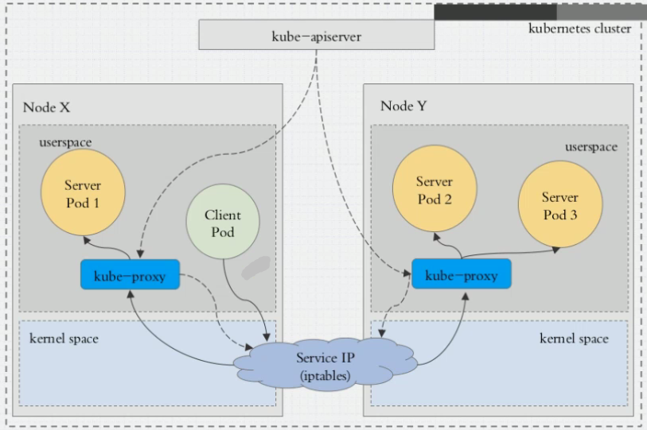
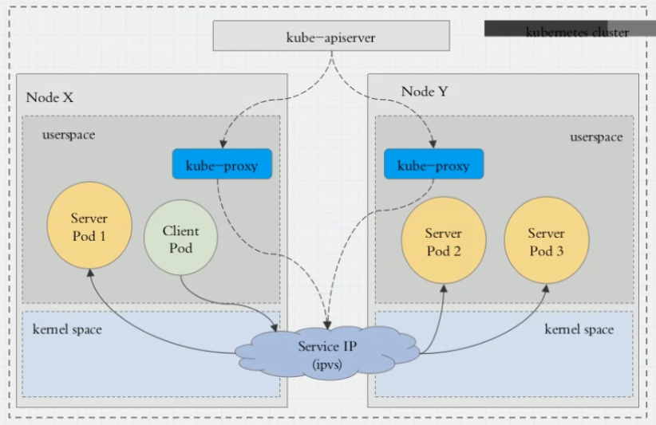
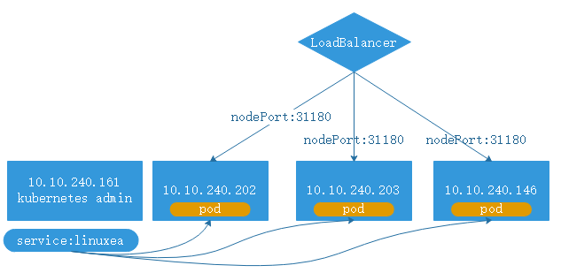
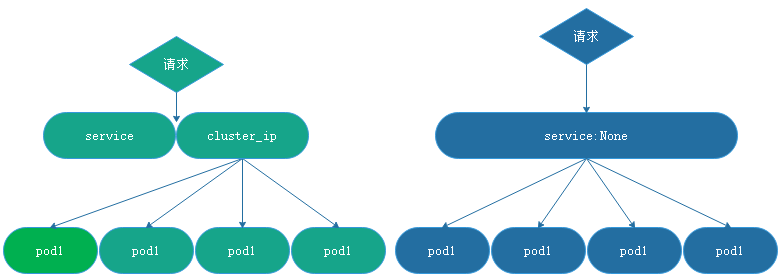

pod是有生命周期的，为了给对应的客户端提供一个固定的访问端点。在客户端与服务pod之间提供一个中间层Service，service严重依赖kubernetes(1.11.2)之上的附件CoreDNS(kube-dns)

kubernetes的名称解析，强依赖于CoreDNS，在kubernetes中的名称解析中必须存在CoreDNS

kubernetes提供的网络功能，需要依赖于第三方网络方案，通过[CNI - Container Network Interface（容器网络接口）](https://jimmysong.io/kubernetes-handbook/concepts/cni.html)来进行接入任何遵循此标准的方案，常见的：flannel等

其中，在kubernetes中有三类网络，node网络，pod网络，cluster网络，node和pod网络是实时存在配置的，而cluster（集群）网络是虚拟网络(virtual)，并没有实时存在，仅存在Service的virtual当中

在每个节点之上，工作有kube-proxy，kube-proxy通过watch始终监视api-server中关于service资源有关资源变动信息。一旦有service资源发生变动，kube-proxy都会转换成当前节点之上，实现service资源调度，用户请求调度的规则。如：iptables,ipvs,这取决于service实现方式

而service实现方式在kubernetes上有三种模型

- userspace: 用户空间

如果来自内部则到达Service上：

请求到达service，service(内核空间)转发到本地的(用户空间)kube-proxy来进行处理，处理完成后在转交给service IP(内核空间),而后在分发(iptables,ipvs)给各个pod，实现调度，如下：



在用户空间和内核空间转换两次，这种方式效率很低。因此，又到了第二种方式

client pod请求直接到service ip,这个请求被本地内核空间的service 规则所截取，直接调动到server pod上，这种方式直接工作在内核空间，由IPtables或者ipvs规则负责调度。而上图的方式是由工作在用户空间的kube-proxy负责调度的

在1.1之前 用的是userspace,在1.1默认用的是ipvs(如果ipvs被激活的，如果未被激活，则降级为iptables)



如果某服务背后的pod资源发生改变，标签选择器中适用的资源会返回到apiserver的etcd中，而kube-proxy则会监听etcd，倘若发生变化，则会转换为ipvs或者iptables规则。不管是增加还是删除，都是立即生效。

###  创建清单
在service中，仍然是有4个字段apiVersion，kind，metadata，spec。
在spec中，重要字段：
spec：
​	ports：端口
​	selector : 关联资源
​	sessionAffinity:  会话粘性
​		ClientIP: 同一个客户端IP调度到同一个pod
​		None: 默认随机调度
​	externalName: CNAME记录，能够被解析
type：	
​	clusterIP: 固定IP，仅用于集群内部通信
​		port: service端口
​		targePort: 协议，默认tcp，pod上端口
​	NodePort:  节点IP，节点类型有用
​	LoadBalancer: 负载均衡一键调用，自动触发在外部创建负载均衡器
​	ExternalName: 将集群外部的服务应用到集群内部
​	None: 无头service

#### redis pod创建

```
[marksugar@linuxea linuxea]# kubectl apply -f redis.yaml 
deployment.apps/redis created
[marksugar@linuxea linuxea]# kubectl get pods -o wide
NAME                     READY     STATUS    RESTARTS   AGE       IP            NODE                 NOMINATED NODE
redis-66ccc9b5df-4qq9q   1/1       Running   0          2m        172.16.3.45   linuxea.node-3.com   <none>
```
svc yaml
在yaml文件中，selector字段的值需要和创建redis字段的值一样
```
[marksugar@linuxea linuxea]# cat svc-redis.yaml 
apiVersion: v1
kind: Service
metadata:
  name: redis
  namespace: default
spec:
  selector:
    app: redis
    role: Logstorage
  clusterIP: 10.96.65.65
  type: ClusterIP
  ports:
  - port: 6379
    targetPort: 6379
```
`kubectl apply -f svc-redis.yaml `创建
```
[marksugar@linuxea linuxea]# kubectl apply -f svc-redis.yaml 
service/redis created
```
查看redis ip定义
```
[marksugar@linuxea linuxea]# kubectl get svc
NAME         TYPE        CLUSTER-IP    EXTERNAL-IP   PORT(S)    AGE
kubernetes   ClusterIP   10.96.0.1     <none>        443/TCP    12d
redis        ClusterIP   10.96.65.65   <none>        6379/TCP   4s
```
`kubectl describe svc redis`查看svc详情 
```
[marksugar@linuxea linuxea]# kubectl describe svc redis
Name:              redis
Namespace:         default
Labels:            <none>
Annotations:       kubectl.kubernetes.io/last-applied-configuration={"apiVersion":"v1","kind":"Service","metadata":{"annotations":{},"name":"redis","namespace":"default"},"spec":{"clusterIP":"10.96.65.65","ports":[{"por...
Selector:          app=redis,role=Logstorage
Type:              ClusterIP
IP:                10.96.65.65
Port:              <unset>  6379/TCP
TargetPort:        6379/TCP
Endpoints:         172.16.3.45:6379
Session Affinity:  None
Events:            <none>
[marksugar@linuxea linuxea]# 
```

Endpoints(地址加端口)：service到pod是有一个中间层，service先到Endpoints，Endpoints在关联到后端的pod。并且可以手动为service 创建Endpoints资源

当一个服务创建完成，会自动在kubernetes的coredns中动态添加service的资源记录，A记录等，添加完成就可以进行解析

### 创建nodePort

- 通过访问集群端口来访问

将现有的pod加入

现有的yaml如下:

```
[marksugar@linuxea linuxea]# cat nginx.yaml 
apiVersion: apps/v1
kind: DaemonSet
metadata:
  name: nginx-linuxea
  namespace: default
spec:
  selector:
    matchLabels:
      app: nginx
      release: www
  template:
    metadata:
      labels:
        app: nginx
        release: www
    spec:
#      hostNetwork: true
      containers:
      - name: linuxea
        image: "marksugar/nginx:1.14.a"
        ports:
        - name: http
          containerPort: 80
 #         hostPort: 80
```

创建的pod节点

```
[marksugar@linuxea linuxea]# kubectl get pods -o wide --show-labels
NAME                     READY     STATUS    RESTARTS   AGE       IP            NODE                 NOMINATED NODE   LABELS
nginx-linuxea-2qkmf      1/1       Running   0          29s       172.16.2.44   linuxea.node-2.com   <none>           app=nginx,controller-revision-hash=3080738842,pod-template-generation=1,release=www
nginx-linuxea-8hvk6      1/1       Running   0          29s       172.16.3.46   linuxea.node-3.com   <none>           app=nginx,controller-revision-hash=3080738842,pod-template-generation=1,release=www
nginx-linuxea-dk5hg      1/1       Running   0          29s       172.16.1.42   linuxea.node-1.com   <none>           app=nginx,controller-revision-hash=3080738842,pod-template-generation=1,release=www
redis-66ccc9b5df-8hmp5   1/1       Running   0          3h        172.16.1.41   linuxea.node-1.com   <none>           app=redis,pod-template-hash=2277756189,role=Logstorage
```

yaml文件如下：

将上述的现有的pod加入到service中，标签需要和pod中的标签一样

```
  selector:
    app: nginx
    release: www
```

nodePort不指定也會被默認分配

service的80端口被映射为31180端口，如下：

```
  - port: 80     # service 端口
    targetPort: 80  # pod中的端口
    nodePort: 31180  # node中的端口(此端口在node上唯一)，范围从30000-32767，不设置则动态分配
```

- 最终如下

```
apiVersion: v1
kind: Service
metadata:
  name: linuxea
  namespace: default
spec:
  selector:
    app: nginx
    release: www
  clusterIP: 10.96.66.66
  type: NodePort
  ports:
  - port: 80
    targetPort: 80
    nodePort: 31180
```

apply

```
[marksugar@linuxea linuxea]# kubectl apply -f linuxea.yaml 
service/linuxea created
[marksugar@linuxea linuxea]# kubectl get svc
NAME           TYPE        CLUSTER-IP    EXTERNAL-IP   PORT(S)        AGE
kubernetes     ClusterIP   10.96.0.1     <none>        443/TCP        18d
linuxea        NodePort    10.96.66.66   <none>        80:31180/TCP   3s
```

而后在集群外部进行访问任意一个node节点ip:31180端口都可以

```
[marksugar@DS-VM-Node_10_10_240_143 ~]$  while true;do curl 10.10.240.161:31180/linuxea.html; sleep 1; done
linuxea-nginx-linuxea-8hvk6.com ▍ 33b9df88388ed ▍version number 1.0
linuxea-nginx-linuxea-dk5hg.com ▍ 665b7a9dc2d42 ▍version number 1.0
linuxea-nginx-linuxea-8hvk6.com ▍ 33b9df88388ed ▍version number 1.0
linuxea-nginx-linuxea-8hvk6.com ▍ 33b9df88388ed ▍version number 1.0
linuxea-nginx-linuxea-8hvk6.com ▍ 33b9df88388ed ▍version number 1.0
linuxea-nginx-linuxea-2qkmf.com ▍ d5535d8023a09 ▍version number 1.0
linuxea-nginx-linuxea-dk5hg.com ▍ 665b7a9dc2d42 ▍version number 1.0
linuxea-nginx-linuxea-2qkmf.com ▍ d5535d8023a09 ▍version number 1.0
linuxea-nginx-linuxea-8hvk6.com ▍ 33b9df88388ed ▍version number 1.0
linuxea-nginx-linuxea-2qkmf.com ▍ d5535d8023a09 ▍version number 1.0
linuxea-nginx-linuxea-2qkmf.com ▍ d5535d8023a09 ▍version number 1.0
```
此刻或许可使用负载均衡进行调度到每台node上的31180端口，或许需要配置`sessionAffinity`，如下：


其中从nodeport 31180(节点IP:PORT)转换到service port 80(其中将会内部解析调度到cluster_ip上)，在从service port 80转换到pod port 80，会经过三次转换。
从nodeport转换到service port，在从service port转换到pod port
可见service中的nodeport的效果便如此
#### sessionAffinity
打补丁进行测试
```
[marksugar@linuxea linuxea]# kubectl patch svc linuxea -p '{"spec":{"sessionAffinity":"ClientIP"}}'
service/linuxea patched
```
验证`Session Affinity:         ClientIP`
```
[marksugar@linuxea linuxea]# kubectl describe svc linuxea
Name:                     linuxea
Namespace:                default
Labels:                   <none>
Annotations:              kubectl.kubernetes.io/last-applied-configuration={"apiVersion":"v1","kind":"Service","metadata":{"annotations":{},"name":"linuxea","namespace":"default"},"spec":{"clusterIP":"10.96.66.66","ports":[{"n...
Selector:                 app=nginx,release=www
Type:                     NodePort
IP:                       10.96.66.66
Port:                     <unset>  80/TCP
TargetPort:               80/TCP
NodePort:                 <unset>  31180/TCP
Endpoints:                172.16.1.42:80,172.16.2.44:80,172.16.3.46:80
Session Affinity:         ClientIP
External Traffic Policy:  Cluster
Events:                   <none>
```
在访问时，来自同一个ip的客户端请求始终发往同一个后端pod
```
[marksugar@DS-VM-Node100 ~]# while true;do curl 10.10.240.203:31180/linuxea.html; sleep 1; done
linuxea-nginx-linuxea-dk5hg.com ▍ 665b7a9dc2d42 ▍version number 1.0
linuxea-nginx-linuxea-dk5hg.com ▍ 665b7a9dc2d42 ▍version number 1.0
linuxea-nginx-linuxea-dk5hg.com ▍ 665b7a9dc2d42 ▍version number 1.0
linuxea-nginx-linuxea-dk5hg.com ▍ 665b7a9dc2d42 ▍version number 1.0
linuxea-nginx-linuxea-dk5hg.com ▍ 665b7a9dc2d42 ▍version number 1.0
linuxea-nginx-linuxea-dk5hg.com ▍ 665b7a9dc2d42 ▍version number 1.0
linuxea-nginx-linuxea-dk5hg.com ▍ 665b7a9dc2d42 ▍version number 1.0
linuxea-nginx-linuxea-dk5hg.com ▍ 665b7a9dc2d42 ▍version number 1.0
linuxea-nginx-linuxea-dk5hg.com ▍ 665b7a9dc2d42 ▍version number 1.0
linuxea-nginx-linuxea-dk5hg.com ▍ 665b7a9dc2d42 ▍version number 1.0
linuxea-nginx-linuxea-dk5hg.com ▍ 665b7a9dc2d42 ▍version number 1.0
linuxea-nginx-linuxea-dk5hg.com ▍ 665b7a9dc2d42 ▍version number 1.0
```
###  ExternalName

当pod内的客户端去访问kubernes集群外的服务，(外部名称)ExternalName便用于实现于此。

- 外部名称：外部的服务的名称，通过服务名称来访问外部服务。从而使得集群内部的pod像使用集群内部的服务一样使用集群外部的服务。并且pod client访问的是一个名称(通过coredns解析)


pod client想要访问kubernetes外部服务，需要通过service层级转换到(SNAT)，请求到外部服务中，外部服务响应与node ip，再由node ip转交给service，service转交给pod client,从而使得pod client访问外部服务。

### None
- 无头服务(No ClusterIP)：此前，每一个service都会有一个service名称，解析的结果都是cluster ip，请求由cluster ip DNAT到后端的pod上。因此cluster ip的解析结果只会有一个ip。但是，现在可以去掉中间这层cluster ip(既不会动态分配也不会手动指定)，而后的解析将会解析到pod ip上，而pod的ip是取决于集群大小。这类的service就是无头service。直达后端pod。如下图：


测试yaml

```
apiVersion: apps/v1
kind: DaemonSet
metadata:
  name: nginx-linuxea
  namespace: default
spec:
  selector:
    matchLabels:
      app: nginx
      release: www
  template:
    metadata:
      labels:
        app: nginx
        release: www
    spec:
      containers:
      - name: linuxea
        image: "marksugar/nginx:1.14.a"
        ports:
        - name: http
          containerPort: 80
```
apply

```
apiVersion: v1
kind: Service
metadata:
  name: none-linuxea
  namespace: default
spec:
  selector:
    app: nginx
    release: www
  clusterIP: None
  ports:
  - port: 80
    targetPort: 80
```

```
[marksugar@linuxea linuxea]# kubectl apply -f none-linuxea.yaml 
service/none-linuxea created
```
启动之后`CLUSTER-IP`这列为`None`
```
[marksugar@linuxea linuxea]# kubectl get svc
NAME           TYPE        CLUSTER-IP    EXTERNAL-IP   PORT(S)    AGE
kubernetes     ClusterIP   10.96.0.1     <none>        443/TCP    18d
none-linuxea   ClusterIP   None          <none>        80/TCP     4s
redis          ClusterIP   10.96.65.65   <none>        6379/TCP   5d
```
此刻获取的pod IP与解析的ip是一样的
```
[marksugar@linuxea linuxea]# kubectl get pods -o wide
NAME                     READY     STATUS    RESTARTS   AGE       IP            NODE                 NOMINATED NODE
nginx-linuxea-2qkmf      1/1       Running   0          2m        172.16.2.44   linuxea.node-2.com   <none>
nginx-linuxea-8hvk6      1/1       Running   0          2m        172.16.3.46   linuxea.node-3.com   <none>
nginx-linuxea-dk5hg      1/1       Running   0          2m        172.16.1.42   linuxea.node-1.com   <none>
```

```
[marksugar@linuxea linuxea]# dig -t A none-linuxea.default.svc.cluster.local. @10.96.0.10

; <<>> DiG 9.9.4-RedHat-9.9.4-61.el7 <<>> -t A none-linuxea.default.svc.cluster.local. @10.96.0.10
;; global options: +cmd
;; Got answer:
;; ->>HEADER<<- opcode: QUERY, status: NOERROR, id: 32900
;; flags: qr aa rd ra; QUERY: 1, ANSWER: 3, AUTHORITY: 0, ADDITIONAL: 1

;; OPT PSEUDOSECTION:
; EDNS: version: 0, flags:; udp: 4096
;; QUESTION SECTION:
;none-linuxea.default.svc.cluster.local.	IN A

;; ANSWER SECTION:
none-linuxea.default.svc.cluster.local.	5 IN A	172.16.1.42
none-linuxea.default.svc.cluster.local.	5 IN A	172.16.2.44
none-linuxea.default.svc.cluster.local.	5 IN A	172.16.3.46

;; Query time: 0 msec
;; SERVER: 10.96.0.10#53(10.96.0.10)
;; WHEN: Mon Sep 10 14:10:34 BST 2018
;; MSG SIZE  rcvd: 229

[marksugar@linuxea linuxea]# 
```

如果此时解析有头的(有ClusterIP的)就会解析到ClusterIP上，在前面提到过，请求到service的ClusterIP，而后DNAT到pod IP的

其中，service定义后，尤其在nodePort中需要做两级代理，甚至两级转换或者调度，无论是iptables还是ipvs都是四层调度。倘若运行https服务的话，那意味着每台nodePort service都需要配置成https主机。在四层调度中本身是无法卸载https会话。kubeneres的ingress可以引入进群外部流量的七层调度(7层pod)，将流量引入到内部来，引入方式如：nginx,haproxy等等！


