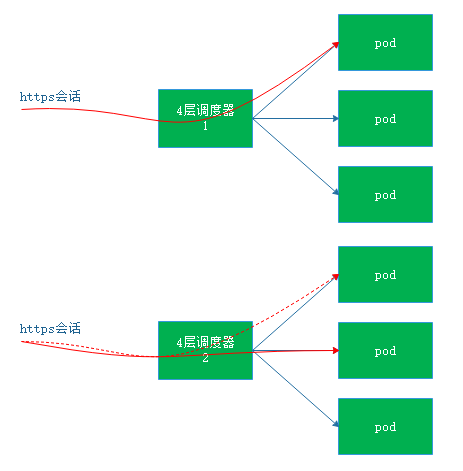
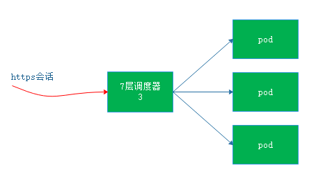
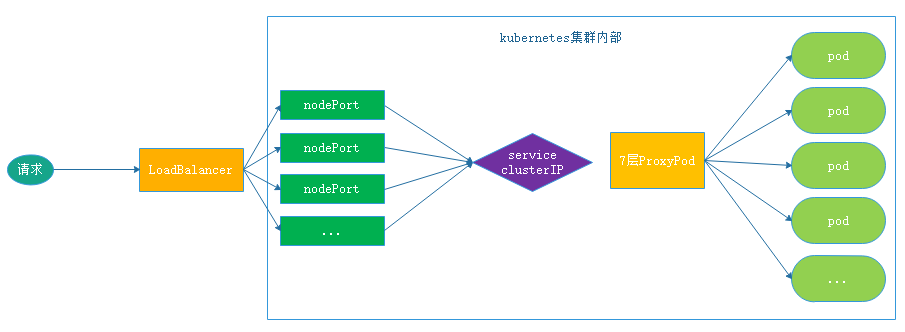
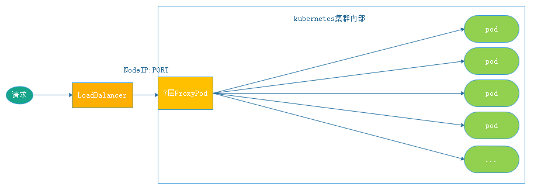
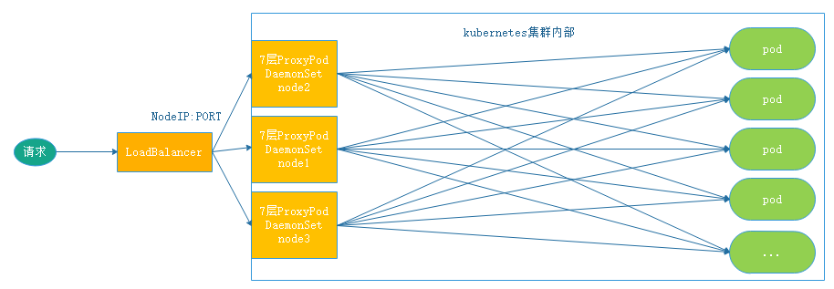
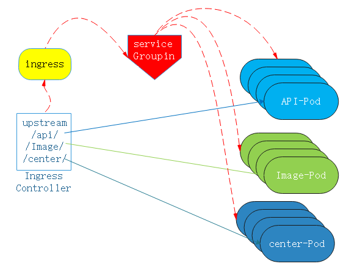
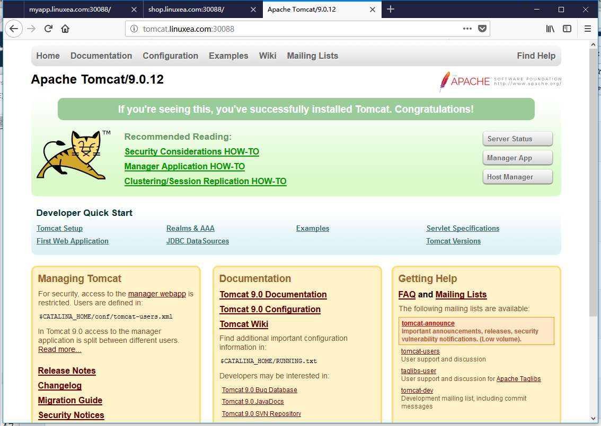
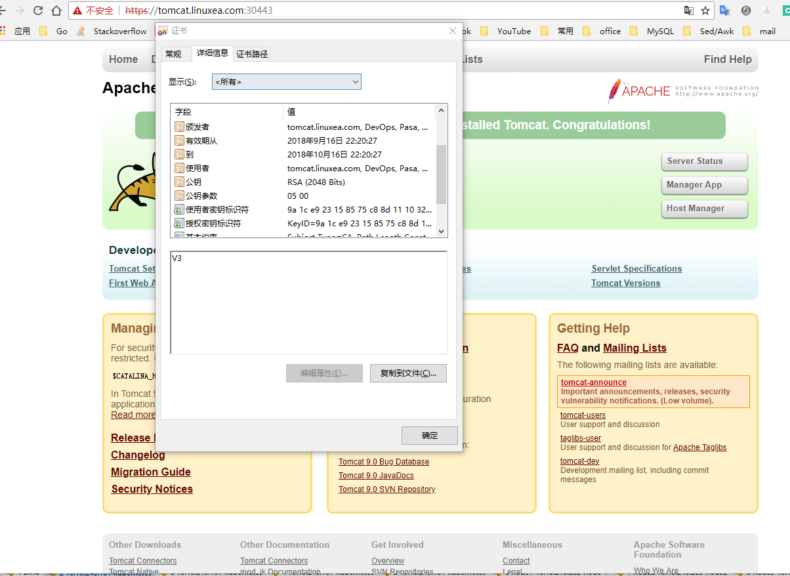

无论service还是ipvs都是四层调度，四层调度工作在七层模型的第四层，如果用户访问https,那么四层是无法解析https回话，如果要使用https便只能在后端pod配置https来使用https，这样一来，那便意味着客户端与后端服务器之间直接建立ssl会话(图1)，此刻，如果下一个请求被调度到第二个pod，那么这个会话需要重新建立(2)

倘若后端到调度器之间的网络上安全的，https会话可以在前端负载卸载，就需要七层负载均衡机制。那么在互联网到七层负载之间使用https,在7层负载到pod之间使用http,如下图3

在service调度中，clusterIP使用的是ipvs和iptables,无论哪种方式都是四层，且无法卸载会话

## 引入
在集群中调度时，后端被调度的pod是http的，使用一个独特的七层调度器(pod)，如nginx，haproxy

当用户访问某一个服务时，先请求到集群外部的Loadbalanocer(假如你有的话)，而后到各个Node IP:nodePort，而后转发到service ClusterIP，由ClusterIP DNAT到7层调度的pod。而后才会到后端pod(每台node中都会有一个flannel网卡桥接到pod网段中，那便意味着node能够和pod进行通讯)。由调度的pod(nginx，配置的https服务)反代到后端提供服务的http pod。如下：

如上图：由此一来，调度便三次以上，性能过于损耗。可直接共享节点网络名称空间，监听宿主机IP地址。这样一来集群外部直接访问宿主机IP(nodeip:port)和端口(此前的hostNetwork)就能直接处理请求了。如下图:

但是，这样一来，访问就只能访问一个固定的单节点(和service不同，7层Proxy pod要监听节点的网络名称空间，并且请求也是通过网络名称空间直达此pod)。

## DaemonSet
DaemonSet控制器可以在每个节点上都运行一个pod，且每个节点只运行一个，每一个pod都能实现负载均衡。并且任何一个节点宕机，只要调度器能够做健康状态检测仍然不受影响。DaemonSet可配置    

一旦确定节点数量，则可以使用标签选择器打标，并且打上污点(将不会被调度)，DaemonSet并且可以容忍这些污点，每个节点只运行这一个反代pod用来接入流量，这类pod在kubernetes中称为Ingress Controller
## Ingress Controller

Ingress Controller和之前的DaemonSet等都不一样，在kubernetes中有4个重要组件分别是api server,ectd,scheduler,controller-manager。其中DaemonSet，ReplicaSet，Deployment等是作为controoler-manager的一部分存在的。但是Ingress Controller却是独立运行的一组pod资源，通常就是一组应用程序，并且拥有七成代理和调度的应用程序。

由此有4种选择，Haproxy，Nginx，Envoy，Traefik可作为调度手段

倘若在调度的过程中不止要调度一个服务，可做URL映射，分别使用不同的URL路径来映射到对应的pod中。但是我们之前介绍过，pod是存在生命周期，可能随时都会挂掉，随时也都会被替换成新的pod，然而每个新的pod地址会随之发生变化。并且pod集群的大小会随着业务动态伸缩而发生改变。

在之前的service中是通过service标签选择器关联标签，service始终关注api server中的api，只要资源发生变化就会通知这个service，service立即做出改变。service通过labels始终关联着对应labels适配的后端pod

假如这个pod调度器(Ingress Controller)运行的是nginx，配置文件也是在pod内部，且后端服务pod(被代理资源)时常会发生变动,那么nginx(Ingress Controller)如何得知后端pod变动的资源信息呢？如下：

Ingress Controller本身是无法做到后端被代理资源信息的收集，收集这些信息便是service。每一个upstream组对应一个service资源，每一个service资源关联到相应的pod上。尤为注意的是这里的这个service并不是当作代理节点，仅仅作为分类(将pod和service信息进行分组,协助调度，调度并不经过service)，分类后得到的并不是service的ip，而是pod的ip。如果pod资源发生改变，这些信息通过ingress资源反应到Ingress Controller pod中的nginx配置文件(动态注入到配置文件)中。也就是说如果后端被代理节点发生改变，信息反应到ingress(信息包括IP地址等)，ingress会及时的将这些信息注入到Ingress Controller pod(nginx upstream)中，并且触发主容器进程重载配置文件。这是动态的修改，如上图。当然，nginx并不能天生做到配置文件变动重载，需要借助其他工具。而Envoy，Traefik则可以！

## 准备ingress环境
其中包括之前所述的apiVersion,kind,metadata,spec等，在spec中较为特别：
其中rules调度的是host或者http,如果是https则是tls。在http中是paths路径调度，或者之前的host调度
backend指明后端pod数量。FIELDS中serviceName,servicePort便是定义的service，即后端pod资源，pod变化则service变化，service变化则ingress变化，最后动态反应到集群中

在github中找到[ingress-nginx](https://github.com/kubernetes/ingress-nginx)，而后克隆下来。假如克隆太慢，也可以单独下载：如下：
namespace.yaml : 名称空间创建
configmap.yaml ： 注入配置功能
rbac.yaml  : rbac角色
with-rbac.yaml ： rbac角色的功能等
tcp-services-configmap.yaml
udp-services-configmap.yaml
```
for file in namespace.yaml configmap.yaml rbac.yaml tcp-services-configmap.yaml  with-rbac.yaml udp-services-configmap.yaml;do wget  https://raw.githubusercontent.com/kubernetes/ingress-nginx/master/deploy/$file; done
```
```
[marksugar@linuxea ~]# git clone https://github.com/kubernetes/ingress-nginx.git
Cloning into 'ingress-nginx'...
remote: Counting objects: 63206, done.
remote: Compressing objects: 100% (52/52), done.
remote: Total 63206 (delta 35), reused 50 (delta 26), pack-reused 63124
Receiving objects: 100% (63206/63206), 71.39 MiB | 91.00 KiB/s, done.
Resolving deltas: 100% (33101/33101), done.
```
此时可切入目录直接执行`kubectl apply -f ./`启动所有的(你可能需要删除目录并且执行两次，因为存在创建顺序依赖)。甚至可以只下载mandatory.yaml即可
```[root@linuxea ~]# cd ingress-nginx/deploy/
[marksugar@linuxea ~]# cd ingress-nginx/deploy/
[marksugar@linuxea deploy]# kubectl apply -f ./
```
此刻在ingrees-nginx在下载(image镜象可以单独的pull` docker pull quay.io/kubernetes-ingress-controller/nginx-ingress-controller:0.19.0`)。完成后已经是running状态。其中backend后端和nginx-ingress的七层pod 
```
[marksugar@linuxea deploy]# kubectl get pods -n ingress-nginx -w
NAME                                        READY     STATUS    RESTARTS   AGE
default-http-backend-6586bc58b6-n9qbt       1/1       Running   0          13m
nginx-ingress-controller-6bd7c597cb-krz4m   1/1       Running   0          13m
```
```
[marksugar@linuxea deploy]# kubectl get pods -n ingress-nginx -o wide
NAME                                        READY     STATUS    RESTARTS   AGE       IP             NODE                 NOMINATED NODE
default-http-backend-6586bc58b6-n9qbt       1/1       Running   0          13m       172.16.4.209   linuxea.node-2.com   <none>
nginx-ingress-controller-6bd7c597cb-krz4m   1/1       Running   0          13m       172.16.5.71    linuxea.node-3.com   <none>
```
### ingress-nginx service定义
在[ingress-nginx](https://kubernetes.github.io/ingress-nginx/deploy/#bare-metal)的网站提供了service-nodeport的文件。以便于区别，修改端口`nodePort: 30088``nodePort: 30443`,这些端口修改完成后便会通过添加到node节点端口进行访问
http

```
    port: 80 # service端口
    targetPort: 80 # 容器端口
    nodePort: 30088  # node节点端口
```
https
```
    targetPort: 443 # service端口
    nodePort: 30443 # 容器端口
    protocol: TCP   # node节点端口
```
资源清单如下：
```
apiVersion: v1
kind: Service
metadata:
  name: ingress-nginx
  namespace: ingress-nginx
  labels:
    app.kubernetes.io/name: ingress-nginx
    app.kubernetes.io/part-of: ingress-nginx
spec:
  type: NodePort
  ports:
  - name: http
    port: 80
    targetPort: 80
    nodePort: 30088
    protocol: TCP
  - name: https
    port: 443
    targetPort: 443
    nodePort: 30443
    protocol: TCP
  selector:
    app.kubernetes.io/name: ingress-nginx
    app.kubernetes.io/part-of: ingress-nginx
```
```
[marksugar@linuxea deploy]# kubectl apply -f service-nodeport.yaml 
service/ingress-nginx created
```
apply之后，80已经映射到node 30088端口，443映射到30443端口，在后面的nginx代理中虚拟主机则是使用域名：端口进行测试
```
[marksugar@linuxea deploy]# kubectl get svc -n ingress-nginx
NAME                   TYPE        CLUSTER-IP     EXTERNAL-IP   PORT(S)                      AGE
default-http-backend   ClusterIP   10.100.45.45   <none>        80/TCP                       38m
ingress-nginx          NodePort    10.96.216.35   <none>        80:30088/TCP,443:30443/TCP   49s
```
集群外部试图访问一次`curl 10.10.240.203:30088`，此刻没有定义backend所以响应404。能够响应404，可见service调度成功
```
[marksugar@DS-VM-Node_10_0_1_61 ~]# curl 10.10.240.203:30088
default backend - 404
```
## 代理测试
那么现在，ingress nginx提供两个端口，分别是30088和30443作为七层代理，分别代理http和https
### 代理nginx
准备一个名称为myapp的service和7个使用Deployment的pod进行测试.这里定义的myapp service后面在ingress的backend会被调用，文件如下：

```
[marksugar@linuxea ingress]# cat deploy-demt.yaml 
apiVersion: v1
kind: Service
metadata:
  name: myapp
  namespace: default
spec:
  selector:
    app: linuxea_app
    version: v0.1.32
  ports:
  - name: http
    targetPort: 80
    port: 80
---
apiVersion: apps/v1
kind: Deployment
metadata:
  name: dpment-linuxea
  namespace: default
spec:
  replicas: 7
  selector:
    matchLabels:
      app: linuxea_app
      version: v0.1.32
  template:
    metadata:
      labels:
        app: linuxea_app
        version: v0.1.32
    spec:
      containers:
      - name: nginx-a
        image: marksugar/nginx:1.14.b
        ports:
        - name: http
          containerPort: 80
```

```
[marksugar@linuxea deploy]# kubectl get pods
NAME                              READY     STATUS    RESTARTS   AGE
dpment-linuxea-648d599b5f-fxn7s   1/1       Running   0          8m
dpment-linuxea-648d599b5f-lrz4r   1/1       Running   0          8m
dpment-linuxea-648d599b5f-m5p2f   1/1       Running   0          8m
dpment-linuxea-648d599b5f-qhrtf   1/1       Running   0          8m
dpment-linuxea-648d599b5f-tgwnx   1/1       Running   0          8m
dpment-linuxea-648d599b5f-vkcj6   1/1       Running   0          8m
dpment-linuxea-648d599b5f-zccrg   1/1       Running   0          8m
```

```
[marksugar@linuxea deploy]# kubectl get svc
NAME         TYPE        CLUSTER-IP       EXTERNAL-IP   PORT(S)   AGE
kubernetes   ClusterIP   10.96.0.1        <none>        443/TCP   1h
myapp        ClusterIP   10.106.239.216   <none>        80/TCP    8m
```

这组后端节点通过部署的ingress向外提供访问，也就是说ingress来接入流量，因此，创建一个ingress的nodePort来接入外部流量

### 定义ingress backend规则

将myapp通过ingress发布，myapp之前已经准备好了，`service`的`name`是`myapp`,`service`的`port`是80，host唯一是`myapp.linuxea.com`
其他：
```
apiVersion: extensions/v1beta1 : 独特标识,扩展群组
kind: Ingress
```
注解的填写便于ingress调度，以便匹配到相应使用的规则，如：nginx，则使用nginx模式，生成nignx配置等
```
  annotations: 
    kubernetes.io/ingress.class: "nginx"
```
- 这里用了host，也就说使用了虚拟主机名来代理，那么paths默认是根"/"。如果你会用nginx，你肯定明白了。


如下

```
[marksugar@linuxea ingress]# cat  myapp-ingress.yaml 
apiVersion: extensions/v1beta1
kind: Ingress
metadata:
  name: myapp-ingress
  namespace: default
  annotations: 
    kubernetes.io/ingress.class: "nginx"
spec:
  rules:
  - host: myapp.linuxea.com
    http:
      paths:
      - path: 
        backend:
          serviceName: myapp
          servicePort: 80
```
稍后，便用这个host的域名来进行访问，要清楚的是，这个域名需要解析到这台ingress的机器上

- 这里的`serviceName: myapp`是之前准备好的7台pod节点的创建的service名称，这些pod将作为ingress nginx的代理后端节点

#### 应用

定义完成apply起来

```
[marksugar@linuxea deploy]# kubectl apply -f myapp-ingress.yaml 
```

get查看

```
[marksugar@linuxea deploy]# kubectl get ingress
NAME            HOSTS               ADDRESS   PORTS     AGE
myapp-ingress   myapp.linuxea.com             80        3m
```

查看详情`kubectl describe ingress myapp-ingress`,`myapp.linuxea.com `已经配置

```
[marksugar@linuxea deploy]# kubectl describe ingress myapp-ingress
Name:             myapp-ingress
Namespace:        default
Address:          
Default backend:  default-http-backend:80 (<none>)
Rules:
  Host               Path  Backends
  ----               ----  --------
  myapp.linuxea.com  
                        myapp:80 (<none>)
Annotations:
  kubectl.kubernetes.io/last-applied-configuration:  {"apiVersion":"extensions/v1beta1","kind":"Ingress","metadata":{"annotations":{"kubernetes.io/ingress.class":"nginx"},"name":"myapp-ingress","namespace":"default"},"spec":{"rules":[{"host":"myapp.linuxea.com","http":{"paths":[{"backend":{"serviceName":"myapp","servicePort":80},"path":null}]}}]}}

  kubernetes.io/ingress.class:  nginx
Events:                         <none>
```

- 一旦apply应用后，配置就会注入到ingress nginx中转换成配置文件

```
[marksugar@linuxea deploy]# kubectl get pods -n ingress-nginx
NAME                                        READY     STATUS    RESTARTS   AGE
default-http-backend-6586bc58b6-n9qbt       1/1       Running   0          5m
nginx-ingress-controller-6bd7c597cb-krz4m   1/1       Running   0          5m
```

进入到容器内查看

```
[marksugar@linuxea deploy]# kubectl exec -n ingress-nginx -it nginx-ingress-controller-6bd7c597cb-krz4m -- /bin/bash
```
过滤下`myapp.linuxea.com`
```
www-data@nginx-ingress-controller-6bd7c597cb-krz4m:/etc/nginx$ grep myapp.linuxea.com nginx.conf
	## start server myapp.linuxea.com
		server_name myapp.linuxea.com ;
	## end server myapp.linuxea.com
www-data@nginx-ingress-controller-6bd7c597cb-krz4m:/etc/nginx$ 
```

- 外部访问

```
[marksugar@DS-VM-Node_10_0_1_61 ~]# while true;do for url in myapp.linuxea.com;do curl $url:30088;sleep 1; done; done
linuxea-dpment-linuxea-648d599b5f-qhrtf.com-127.0.0.1/8 172.16.4.211/24
linuxea-dpment-linuxea-648d599b5f-fxn7s.com-127.0.0.1/8 172.16.3.7/24
linuxea-dpment-linuxea-648d599b5f-tgwnx.com-127.0.0.1/8 172.16.5.74/24
linuxea-dpment-linuxea-648d599b5f-fxn7s.com-127.0.0.1/8 172.16.3.7/24
linuxea-dpment-linuxea-648d599b5f-vkcj6.com-127.0.0.1/8 172.16.3.6/24
linuxea-dpment-linuxea-648d599b5f-tgwnx.com-127.0.0.1/8 172.16.5.74/24
linuxea-dpment-linuxea-648d599b5f-qhrtf.com-127.0.0.1/8 172.16.4.211/24
linuxea-dpment-linuxea-648d599b5f-tgwnx.com-127.0.0.1/8 172.16.5.74/24
linuxea-dpment-linuxea-648d599b5f-fxn7s.com-127.0.0.1/8 172.16.3.7/24
linuxea-dpment-linuxea-648d599b5f-vkcj6.com-127.0.0.1/8 172.16.3.6/24
linuxea-dpment-linuxea-648d599b5f-fxn7s.com-127.0.0.1/8 172.16.3.7/24
linuxea-dpment-linuxea-648d599b5f-m5p2f.com-127.0.0.1/8 172.16.4.210/24
linuxea-dpment-linuxea-648d599b5f-lrz4r.com-127.0.0.1/8 172.16.5.73/24
linuxea-dpment-linuxea-648d599b5f-vkcj6.com-127.0.0.1/8 172.16.3.6/24
linuxea-dpment-linuxea-648d599b5f-m5p2f.com-127.0.0.1/8 172.16.4.210/24
linuxea-dpment-linuxea-648d599b5f-m5p2f.com-127.0.0.1/8 172.16.4.210/24
linuxea-dpment-linuxea-648d599b5f-zccrg.com-127.0.0.1/8 172.16.5.72/24
linuxea-dpment-linuxea-648d599b5f-lrz4r.com-127.0.0.1/8 172.16.5.73/24
linuxea-dpment-linuxea-648d599b5f-zccrg.com-127.0.0.1/8 172.16.5.72/24
linuxea-dpment-linuxea-648d599b5f-vkcj6.com-127.0.0.1/8 172.16.3.6/24
linuxea-dpment-linuxea-648d599b5f-m5p2f.com-127.0.0.1/8 172.16.4.210/24
linuxea-dpment-linuxea-648d599b5f-qhrtf.com-127.0.0.1/8 172.16.4.211/24
linuxea-dpment-linuxea-648d599b5f-lrz4r.com-127.0.0.1/8 172.16.5.73/24
linuxea-dpment-linuxea-648d599b5f-qhrtf.com-127.0.0.1/8 172.16.4.211/24
linuxea-dpment-linuxea-648d599b5f-tgwnx.com-127.0.0.1/8 172.16.5.74/24
linuxea-dpment-linuxea-648d599b5f-zccrg.com-127.0.0.1/8 172.16.5.72/24
```

### 代理httpd

创建7个pod，并且创建一个名称为linuxea-shop-backend的service

```
[marksugar@linuxea ingress]# cat httpd.yaml
apiVersion: v1
kind: Service
metadata:
  name: linuxea-shop-backend
  namespace: default
spec:
  selector:
    app: linuxea-shopapp
    version: v3.2
  ports:
  - name: http
    targetPort: 80
    port: 80
---
apiVersion: apps/v1
kind: Deployment
metadata:
  name: linuxea-backend-group
  namespace: default
spec:
  replicas: 7
  selector:
    matchLabels:
      app: linuxea-shopapp
      version: v3.2
  template:
    metadata:
      labels:
        app: linuxea-shopapp
        version: v3.2
    spec:
      containers:
      - name: linuxea-shopapp
        image: httpd:2.4.34-alpine
        ports:
        - name: http
          containerPort: 80
```

```
[marksugar@linuxea ingress]# kubectl apply -f httpd.yaml 
service/linuxea-shop-backend created
deployment.apps/linuxea-backend-group created
```

```
[marksugar@linuxea ingress]# kubectl get pods -l version=v3.2
NAME                                     READY     STATUS    RESTARTS   AGE
linuxea-backend-group-7fb757ff95-88tzq   1/1       Running   0          37s
linuxea-backend-group-7fb757ff95-9jkhf   1/1       Running   0          37s
linuxea-backend-group-7fb757ff95-br4d8   1/1       Running   0          37s
linuxea-backend-group-7fb757ff95-cqjxm   1/1       Running   0          37s
linuxea-backend-group-7fb757ff95-kmlnb   1/1       Running   0          37s
linuxea-backend-group-7fb757ff95-lfjvr   1/1       Running   0          37s
linuxea-backend-group-7fb757ff95-vrlb5   1/1       Running   0          37s
```

而后验证下端口是否启动`kubectl exec linuxea-backend-group-7fb757ff95-lfjvr -- netstat -tnl`

```
[marksugar@linuxea ingress]#  kubectl exec linuxea-backend-group-7fb757ff95-lfjvr -- netstat -tnl
Active Internet connections (only servers)
Proto Recv-Q Send-Q Local Address           Foreign Address         State       
tcp        0      0 :::80                   :::*                    LISTEN   
```

#### httpd-ingress

将创建的service添加到ingress的backend的serviceName里，配置hosts域名

```
[marksugar@linuxea ingress]# cat httpd-ingress.yaml 
apiVersion: extensions/v1beta1
kind: Ingress
metadata:
  name: httpd-ingress
  namespace: default
  annotations: 
    kubernetes.io/ingress.class: "nginx"
spec:
  rules:
  - host: shop.linuxea.com
    http:
      paths:
      - path: 
        backend:
          serviceName: linuxea-shop-backend
          servicePort: 80
```

```
[marksugar@linuxea ingress]# kubectl apply -f httpd-ingress.yaml 
ingress.extensions/httpd-ingress created
```

这里在service中`linuxea-shop-backend`已经创建，端口已经被映射

```
[marksugar@linuxea ingress]# kubectl get svc
NAME                   TYPE        CLUSTER-IP       EXTERNAL-IP   PORT(S)   AGE
kubernetes             ClusterIP   10.96.0.1        <none>        443/TCP   7h
linuxea-shop-backend   ClusterIP   10.100.237.244   <none>        80/TCP    1m
myapp                  ClusterIP   10.101.103.203   <none>        80/TCP    4m
```

ingress 也创建成功

```
[marksugar@linuxea ingress]#  kubectl get ingress
NAME            HOSTS               ADDRESS   PORTS     AGE
httpd-ingress   shop.linuxea.com              80        33s
myapp-ingress   myapp.linuxea.com             80        8m
```
而后使用` kubectl describe ingress tomcat-linuxea`查看详情
```
[marksugar@linuxea ingress]# kubectl describe ingress httpd-ingress
Name:             httpd-ingress
Namespace:        default
Address:          
Default backend:  default-http-backend:80 (<none>)
Rules:
  Host              Path  Backends
  ----              ----  --------
  shop.linuxea.com  
                       linuxea-shop-backend:80 (<none>)
Annotations:
  kubectl.kubernetes.io/last-applied-configuration:  {"apiVersion":"extensions/v1beta1","kind":"Ingress","metadata":{"annotations":{"kubernetes.io/ingress.class":"nginx"},"name":"httpd-ingress","namespace":"default"},"spec":{"rules":[{"host":"shop.linuxea.com","http":{"paths":[{"backend":{"serviceName":"linuxea-shop-backend","servicePort":80},"path":null}]}}]}}

  kubernetes.io/ingress.class:  nginx
Events:
  Type    Reason  Age   From                      Message
  ----    ------  ----  ----                      -------
  Normal  CREATE  1m    nginx-ingress-controller  Ingress default/httpd-ingress
```
* 从集群外部访问

```
[marksugar@DS-VM-Node_10_0_1_61 ~]# while true;do curl shop.linuxea.com:30088;sleep 1;done
<html><body><h1>It works!</h1></body></html>
<html><body><h1>It works!</h1></body></html>
<html><body><h1>It works!</h1></body></html>
<html><body><h1>It works!</h1></body></html>
<html><body><h1>It works!</h1></body></html>
<html><body><h1>It works!</h1></body></html>
<html><body><h1>It works!</h1></body></html>
<html><body><h1>It works!</h1></body></html>
```

### 代理tomcat

创建7个tomcat镜像的pod，并且创建名称为linuxea-tomcat的serivce

```
[marksugar@linuxea ingress]# cat tomcat.yaml 
apiVersion: v1
kind: Service
metadata:
  name: linuxea-tomcat
  namespace: default
spec:
  selector:
    app: linuxea-tomcat
    version: v3.2
  ports:
  - name: http
    targetPort: 8080
    port: 8080
  - name: ajp
    targetPort: 8009
    port: 8009
---
apiVersion: apps/v1
kind: Deployment
metadata:
  name: linuxea-tomcat-group
  namespace: default
spec:
  replicas: 7
  selector:
    matchLabels:
      app: linuxea-tomcat
      version: v3.2
  template:
    metadata:
      labels:
        app: linuxea-tomcat
        version: v3.2
    spec:
      containers:
      - name: linuxea-tomcat
        image: tomcat:9.0.12-jre8-alpine
        ports:
        - name: http
          containerPort: 8080
        - name: ajp
          containerPort: 8009
```

```
[marksugar@linuxea ingress]# kubectl apply -f tomcat.yaml
```

```
[marksugar@linuxea ingress]# kubectl get pods -l app=linuxea-tomcat
NAME                                   READY     STATUS    RESTARTS   AGE
linuxea-tomcat-group-b77666d76-4jmjh   1/1       Running   0          30s
linuxea-tomcat-group-b77666d76-4pbn2   1/1       Running   0          30s
linuxea-tomcat-group-b77666d76-56fvr   1/1       Running   0          30s
linuxea-tomcat-group-b77666d76-6vph2   1/1       Running   0          30s
linuxea-tomcat-group-b77666d76-8r8qg   1/1       Running   0          30s
linuxea-tomcat-group-b77666d76-h6nfd   1/1       Running   0          30s
linuxea-tomcat-group-b77666d76-rv74d   1/1       Running   0          30s
```

#### tomcat-ingress

创建完成后仍然需要修改关键的hosts,backend。这里的servicePort端口是pod内应用端口

```
[marksugar@linuxea ingress]# cat tomcat-ingress.yaml 
apiVersion: extensions/v1beta1
kind: Ingress
metadata:
  name: tomcat-ingress
  namespace: default
  annotations: 
    kubernetes.io/ingress.class: "nginx"
spec:
  rules:
  - host: tomcat.linuxea.com
    http:
      paths:
      - path: 
        backend:
          serviceName: linuxea-tomcat
          servicePort: 8080
```

```
[marksugar@linuxea ingress]# kubectl apply -f tomcat-ingress.yaml 
ingress.extensions/tomcat-ingress created
```
```
[marksugar@linuxea ingress]# kubectl get ingress
NAME             HOSTS                ADDRESS   PORTS     AGE
httpd-ingress    shop.linuxea.com               80        8m
myapp-ingress    myapp.linuxea.com              80        15m
tomcat-ingress   tomcat.linuxea.com             80        12s
```
```
[marksugar@linuxea ingress]# kubectl describe ingress  tomcat-ingress
Name:             tomcat-ingress
Namespace:        default
Address:          
Default backend:  default-http-backend:80 (<none>)
Rules:
  Host                Path  Backends
  ----                ----  --------
  tomcat.linuxea.com  
                         linuxea-tomcat:8080 (<none>)
Annotations:
  kubectl.kubernetes.io/last-applied-configuration:  {"apiVersion":"extensions/v1beta1","kind":"Ingress","metadata":{"annotations":{"kubernetes.io/ingress.class":"nginx"},"name":"tomcat-ingress","namespace":"default"},"spec":{"rules":[{"host":"tomcat.linuxea.com","http":{"paths":[{"backend":{"serviceName":"linuxea-tomcat","servicePort":8080},"path":null}]}}]}}

  kubernetes.io/ingress.class:  nginx
Events:
  Type    Reason  Age   From                      Message
  ----    ------  ----  ----                      -------
  Normal  CREATE  26s   nginx-ingress-controller  Ingress default/tomcat-ingress
[marksugar@linuxea ingress]# 
```
外部访问


#### https

直接自签一个证书，来测试tomcat的https用法

```
[marksugar@linuxea ingress]# openssl genrsa -out linuxea.key 2048 
Generating RSA private key, 2048 bit long modulus
...........................+++
..............................................+++
e is 65537 (0x10001)
```

```
[marksugar@linuxea ingress]# openssl req -new -x509 -key linuxea.key -out linuxea.crt -subj /C=PH/ST=Manila/L=Pasa/O=DevOps/CN=tomcat.linuxea.com
```

转换格式，创建secret存储卷

```
[marksugar@linuxea ingress]# kubectl create secret tls tomcat-ingress-secret --cert=linuxea.crt --key=linuxea.key
secret/tomcat-ingress-secret created
```

```
[marksugar@linuxea ingress]# kubectl get secret
NAME                    TYPE                                  DATA      AGE
default-token-k25gj     kubernetes.io/service-account-token   3         8h
tomcat-ingress-secret   kubernetes.io/tls                     2         23s
```
` kubectl describe secret tomcat-ingress-secret`这些信息由特殊的格式进行"隐藏起来",base64编码

```
[marksugar@linuxea ingress]# kubectl describe secret tomcat-ingress-secret
Name:         tomcat-ingress-secret
Namespace:    default
Labels:       <none>
Annotations:  <none>

Type:  kubernetes.io/tls

Data
====
tls.crt:  1285 bytes
tls.key:  1679 bytes
[marksugar@linuxea ingress]# 
```

在spec.tls中有secretName字段和hosts字段来设置

- 创建tls.yaml文件

```
[marksugar@linuxea ingress]# cat tomcat-tls.yaml 
apiVersion: extensions/v1beta1
kind: Ingress
metadata:
  name: tomcat-ingress
  namespace: default
  annotations: 
    kubernetes.io/ingress.class: "nginx"
spec:
  tls:
  - hosts:
    - tomcat.linuxea.com
    secretName: tomcat-ingress-secret
  rules:
  - host: tomcat.linuxea.com
    http:
      paths:
      - path: 
        backend:
          serviceName: linuxea-tomcat
          servicePort: 8080
```

```
[marksugar@linuxea ingress]# kubectl apply -f tomcat-tls.yaml 
ingress.extensions/tomcat-ingress configured
```

```
[marksugar@linuxea ingress]# kubectl get ingress
NAME             HOSTS                ADDRESS   PORTS     AGE
httpd-ingress    shop.linuxea.com               80        33m
myapp-ingress    myapp.linuxea.com              80        41m
tomcat-ingress   tomcat.linuxea.com             80, 443   25m
```

```
[marksugar@linuxea ingress]# kubectl describe ingress tomcat-ingress
```

当apply启动后，配置会注入到ingress nginx中，配置文件就会发生改变，tls文件已经加入到nginx配置文件中，如下：

```
www-data@nginx-ingress-controller-6bd7c597cb-krz4m:/etc/nginx$ grep tomcat nginx.conf
	## start server tomcat.linuxea.com
		server_name tomcat.linuxea.com ;
		ssl_certificate                         /etc/ingress-controller/ssl/default-tomcat-ingress-secret.pem;
		ssl_certificate_key                     /etc/ingress-controller/ssl/default-tomcat-ingress-secret.pem;
		ssl_trusted_certificate                 /etc/ingress-controller/ssl/default-tomcat-ingress-secret-full-chain.pem;
			set $ingress_name   "tomcat-ingress";
			set $service_name   "linuxea-tomcat";
			set $proxy_upstream_name "default-linuxea-tomcat-8080";
	## end server tomcat.linuxea.com
www-data@nginx-ingress-controller-6bd7c597cb-krz4m:/etc/nginx$ 
```
通过浏览器访问即可（这里访问的是映射的443端口，也就是30443）
