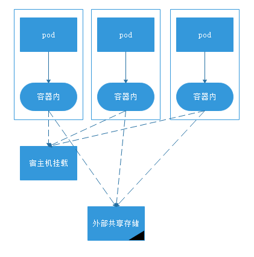
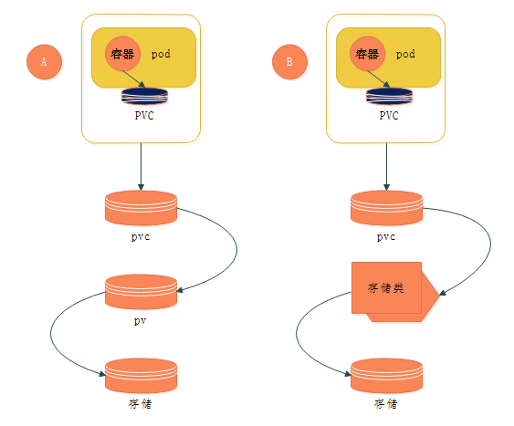
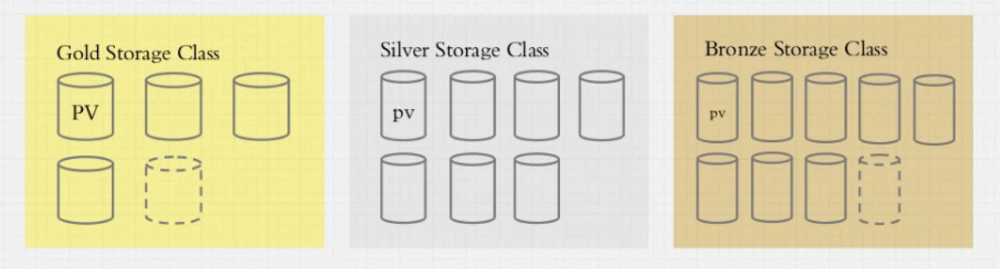
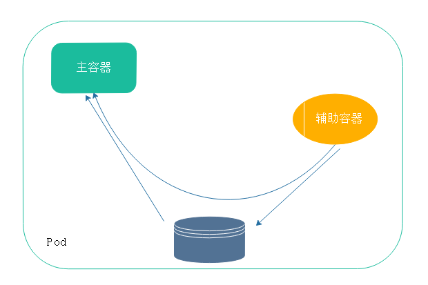
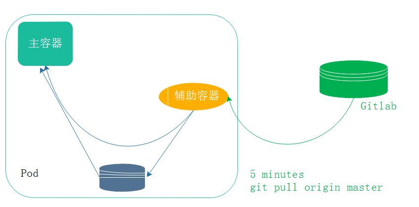
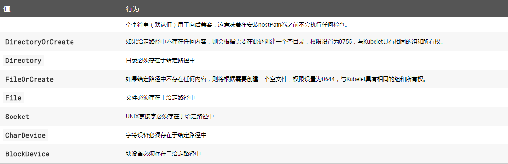
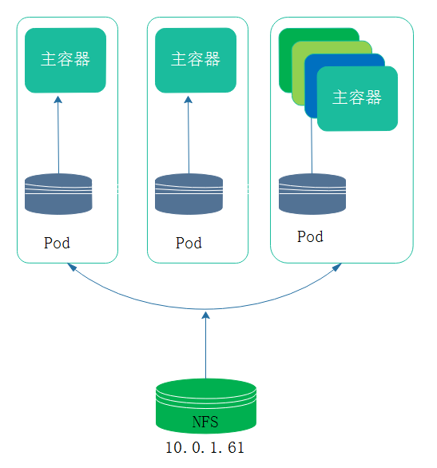
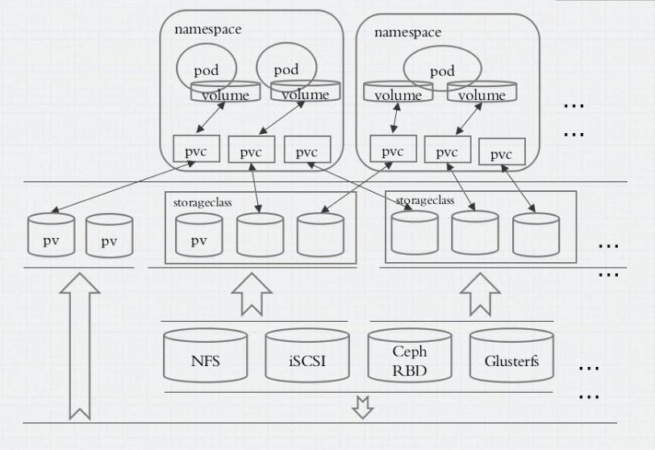

大多数有状态的应用都是需要持续存储数据的。容器本身有生命周期，容器终结后，或者编排到其他节点运行，那就意味着数据不能存放在容器内，否则在删除或者容器损坏时数据会丢失

## 引言

在k8s中，pod一直运行在机器上，除非机器宕机pod才会被调度到其他机器，顶多重启。一旦这个pod被删除(故障)，或者机器宕机(被编排到其他节点)，这个pod就会重构。如果数据存放在pod的名称空间中，数据随着pod的终结而消失了。为了突破这种现状，就需要将数据放在pod之外的地方

- 在docker中可以使用-v将本地目录挂载到容器内，在删除容器后在up容器，数据是不会随着容器删除而丢失，在一定的意义上实现数据持久存储(如果节点挂了，也会随着本地宿主机终结而终结)。当然，这种方式不适用于在kubernetes上。

kubernetes提供了专门应用不同类型的存储卷：持久，半持久，没有持久

对k8s来讲存储卷不属于容器，属于pod，我们能够在容器内挂载。

- 在pod中是有一个基础容器，不过他并不启动，是依靠一个镜像来完成。在Kubernetes中，每个pod都有一个IP，在一个pod中有一个所谓的基础架构容器，它是Kubelet实例化的第一个容器，它获取pod的IP并设置网络命名空间。然后，pod中的所有其他容器都加入infra容器的网络和IPC命名空间。infra容器启用了网桥模式，并且pod中的所有其他容器通过容器模式共享其命名空间。在infra容器中运行的初始进程实际上没有任何效果，因为它的唯一目的是充当命名空间的主页。

  也就说，所有pod网络名称空间都是由他分配的，如下：

```
k8s.gcr.io/pause    3.1         da86e6ba6ca1        9 months ago        742kB
```

在pod中运行的主容器也是共享`k8s.gcr.io/pause `的网络名称空间。容器要挂载他的存储卷也是挂载(复制)``k8s.gcr.io/pause ``的存储卷，这也是基础架构容器。

那么，同一个pod内的所有容器共享pause容器的网络名称空间，这也就是为什么同一个pause能够使用同一个地址共享同一个tcp/ip协议栈，使用同一组主机名的原因。

pod中的存储卷也就是基础架构容器的存储卷，而容器的存储卷只不过是容器目录与宿主机目录建立的关联关系，如果宿主机目录就是宿主机本地的，那么也会随着宿主机的终结而终结。因此，宿主机的目录，如果要真正实现持久性，宿主机的目录必然是挂载的外部存储设备。
如下：

pod内的数据会随着pod的创建和删除而消失
挂载到宿主机的数据只要pod在次被调度到被挂载的宿主机且宿主机可用便可用
而外部共享存储只需要支持插件，能够被驱动，并且存储可访问则可用，已经脱离宿主机

## **empryDir**

只在节点本地使用。创建一个pod，一个存储卷，pod被删除，存储卷也会被删除.**empryDir**数据随着pod的创建而创建，随着删除而删除
empryDir可以当临时目录，或者缓存使用(关联宿主机的目录可以是宿主机的内存，将内存放到pod存储卷)。没有持久化

## **hostPath**

主机路径，在宿主机创建目录挂载。一定意义的持久性
##  **网络存储**

网络存储设备：san(iscsi),nas(nfs,cifs)
分布式存储：文件系统glusterfs,ceph(rbd),cephfs
云存储：EBS,RDS,Azure Disk

众多的支持类型使用` kubectl explain pods.spec.volumes`查看，其中`persistentVolumeClaim`称为持久存储卷请求，简称PVC
## pvc
当用户使用k8s创建pod，为了实现持久存储，就需要定义存储卷。其中需要定义认证信息，地址，文件系统配置等等，然而这些信息的定制需要更专业的存储水准才能够更好的使用k8s做持久存储。为了降低这种需求，则可以使用pvc(当需要创建存储卷，就发送创建请求，不关注使用什么存储，只关注存储空间，存储及服务)。

容器挂载存储卷，pvc与pvc建立关联关系，pvc与pv建立关联关系，pv与存储建立关联关系。如下A：


当创建一个pod，并定义的存储卷类型为pvc，pvc则会关联到pod所在的"名称空间"，在此名称空间(pvc)中查找已存在的pvc资源，此关联只是申请（当pod申请后就会在pod所在的名称空间创建此pvc，这个pvc要能够存储需要与pv建立关联关系）。申请信息将会关联到pv上，要能够真正能够存储需要与pv建立关联关系。pv是存储系统之上的一段存储空间。上图A所示

但是，对于pv来讲，我们并不清楚pod什么时候需要创建pvc，也不知道创建的容量。我们可以人为通知创建。但是在云环境中，要做到按需创建就需要将存储空间抽象成存储类，存储类是单独的层。当创建时就会请求申请到存储类，存储类生成符合请求的pv，并且使二者建立关联关系。这类pv由用户的请求触发而动态生成，就称为动态供给。上图B所示

这依赖于存储类，而存储类分为很多级别：较慢的铜牌存储，中等的银牌存储，ssd速度较快的金牌存储。这类存储按照性能指标做出分类，大概如下：


## emptyDir存储卷
1，pod上定义volume,volume指明关联的存储设备
2，容器中使用存储卷挂载
在emptyDir中，可以使用Memory或者disk(medium).sizeLimit(大小)

- 定义emptyDir

```
  volumes:
  - name: linuxea-code
    emptyDir: {} 
```

其中`volumes`与`containers`同一个层级
`emptyDir: {}` {}为空，没有键值，大小不限制，命名叫`linuxea-code`

在镜象里面使用`volumeMounts`挂载，如下:

```
    volumeMounts:
    - name: linuxea-code
      mountPath: /data/wwwroot/
```
`mountPath`挂载路径，`- name`挂载名称，与``emptyDir`定义一致。

顺序是先挂载存储卷而后启动，yaml文件如下：

```
[marksugar@linuxea volume]# cat emptyDir.yaml 
apiVersion: v1
kind: Pod
metadata: 
  name: linuxea-emptydir
  namespace: default
  labels:
    www: linuxea-com
    tier: backend
  annotations:
    www.linuxea.com/ops-by: "linuxea admin"
spec:
  containers:
  - name: linuxea-pod1-com
    image: "marksugar/nginx:1.14.a"
    ports:
      - containerPort: 88
    volumeMounts:
    - name: linuxea-code
      mountPath: /data/wwwr oot/

  - name: linuxea-pod2-com
    image: "marksugar/nginx:1.14.b"
    ports:
      - containerPort: 88
    volumeMounts:
    - name: linuxea-code
      mountPath: /data/wwwroot/
  volumes:
  - name: linuxea-code
    emptyDir: {} 
```
apply
```
[marksugar@linuxea volume]# kubectl  apply -f emptyDir.yaml 
pod/linuxea-emptydir created
[marksugar@linuxea volume]# kubectl get pods
NAME                                     READY     STATUS    RESTARTS   AGE
linuxea-emptydir                         2/2       Running   0          2s
```
进入第一个pod内的容器`linuxea-pod1-com`在共享的目录/data/wwwroot下写入一个文件`echo "$(date)_linuxea-pod1-com" >> /data/wwwroot/index.html`
```
[marksugar@linuxea volume]# kubectl exec -it  linuxea-emptydir -c linuxea-pod1-com -- /bin/sh
/ # echo "$(date)_linuxea-pod1-com" >> /data/wwwroot/index.html
/ # cat /data/wwwroot/index.html
linuxea-linuxea-emptydir.com-127.0.0.1/8 172.16.4.253/24
Wed Sep 19 15:28:40 UTC 2018_linuxea-pod1-com
```
而后在第二个pod的容器`linuxea-pod2-com`可以查看到写入的内容。
```
[marksugar@linuxea volume]# kubectl exec -it linuxea-emptydir -c linuxea-pod2-com -- /bin/sh
/ # cat /data/wwwroot/index.html 
linuxea-linuxea-emptydir.com-127.0.0.1/8 172.16.4.253/24
Wed Sep 19 15:28:40 UTC 2018_linuxea-pod1-com
/ # echo "$(date)_linuxea-pod2-com" >> /data/wwwroot/index.html
```
说明共享是有效的
```
/ # cat /data/wwwroot/index.html 
linuxea-linuxea-emptydir.com-127.0.0.1/8 172.16.4.253/24
Wed Sep 19 15:28:40 UTC 2018_linuxea-pod1-com
Wed Sep 19 15:32:17 UTC 2018_linuxea-pod2-com
```

- command

在一个pod中有两类容器，一个是主容器，一个是辅助容器，辅助容器用来生成新的内容，主容器加载使用。如下:



也可在command中设置

```
[marksugar@linuxea volume]# cat emptyDir.yaml 
apiVersion: v1
kind: Pod
metadata: 
  name: linuxea-emptydir
  namespace: default
  labels:
    www: linuxea-com
    tier: backend
  annotations:
    www.linuxea.com/ops-by: "linuxea admin"
spec:
  containers:
  - name: linuxea-pod1-com
    image: "marksugar/nginx:1.14.a"
    ports:
      - containerPort: 88
    volumeMounts:
    - name: linuxea-code
      mountPath: /data/wwwroot/

  - name: linuxea-pod2-com
    image: "marksugar/nginx:1.14.b"
    ports:
      - containerPort: 88
    volumeMounts:
    - name: linuxea-code
      mountPath: /data/wwwroot/
    command:
    - "/bin/sh"
    args: ["-c","while true;do echo linuxea-pod2-com $(date) >> /data/wwwroot/index.html;sleep 1;done"]
  volumes:
  - name: linuxea-code
    emptyDir: {}
```

```
[marksugar@linuxea volume]# kubectl apply -f emptyDir.yaml 
pod/linuxea-emptydir created
```

通过` kubectl get pods -o wide`查看状态

```
[marksugar@linuxea volume]# kubectl get pods -o wide
NAME                                     READY     STATUS    RESTARTS   AGE       IP             NODE                 NOMINATED NODE
linuxea-emptydir                         2/2       Running   0          8s        172.16.4.4     linuxea.node-2.com   <none>
```

而后通过集群内ip访问

```
linuxea-linuxea-emptydir.com-127.0.0.1/8 172.16.4.4/24
linuxea-pod2-com Thu Sep 20 05:22:20 UTC 2018
linuxea-pod2-com Thu Sep 20 05:22:21 UTC 2018
linuxea-pod2-com Thu Sep 20 05:22:22 UTC 2018
linuxea-pod2-com Thu Sep 20 05:22:23 UTC 2018
linuxea-pod2-com Thu Sep 20 05:22:24 UTC 2018
linuxea-pod2-com Thu Sep 20 05:22:25 UTC 2018
linuxea-pod2-com Thu Sep 20 05:22:26 UTC 2018
linuxea-pod2-com Thu Sep 20 05:22:27 UTC 2018
linuxea-pod2-com Thu Sep 20 05:22:28 UTC 2018
linuxea-pod2-com Thu Sep 20 05:22:29 UTC 2018
linuxea-pod2-com Thu Sep 20 05:22:30 UTC 2018
linuxea-pod2-com Thu Sep 20 05:22:31 UTC 2018
linuxea-pod2-com Thu Sep 20 05:22:32 UTC 2018
linuxea-pod2-com Thu Sep 20 05:22:33 UTC 2018
linuxea-pod2-com Thu Sep 20 05:22:34 UTC 2018
```

## gitrepo

当pod创建时候，会拉取git(依赖于宿主机git命令驱动)仓库中数据克隆到本地，并且作为存储卷定义在pod之上。gitrepo基于emptyDir,此存储卷是emptyDir，git仓库中拉取的代码存放在emptyDir后被定义到pod。其他如git使用一般无二。鉴于git使用的代码只在克隆时拉取代码，如果更新则无法同步，可配置辅助容器拉取代码，如下：


## hostPath
pod所在宿主机之上的，脱离pod容器名称空间之外的，宿主机的文件系统某一个目录与pod建立关系。当pod被删除，存储卷不会被删除。只要同一个pod调度到同一个节点，数据依然可被正常使用。
```
volumes：
  hostPath:
    path: 
      type
```
type字段支持



为了测试效果，在三台node上都创建这个目录，并写上标注信息

```
[marksugar@Linuxea-VM-Node146 ~]# mkdir -p /data/linuxea/image && echo $(date)_$(hostname)/data/linuxea/image.com >> /data/linuxea/image/linuxeacom.html
[marksugar@Linuxea-VM-Node146 ~]# cat /data/linuxea/image/linuxeacom.html
2018年 09月 20日 星期四 16:46:44 CST_Linuxea-VM-Node146.cluster.com/data/linuxea/image.com
```

```
[marksugar@Linuxea-VM-Node203 ~]# mkdir -p /data/linuxea/image && echo $(date)_$(hostname)/data/linuxea/image.com >> /data/linuxea/image/linuxeacom.html
[marksugar@Linuxea-VM-Node203 ~]# cat /data/linuxea/image/linuxeacom.html
2018年 09月 20日 星期四 16:46:43 CST_Linuxea-VM-Node203.cluster.com/data/linuxea/image.com
```

```
[marksugar@Linuxea-VM-Node_10_10_240_202 ~]# mkdir -p /data/linuxea/image && echo $(date)_$(hostname)/data/linuxea/image.com >> /data/linuxea/image/linuxeacom.html
[marksugar@Linuxea-VM-Node_10_10_240_202 ~]# cat /data/linuxea/image/linuxeacom.html
2018年 09月 20日 星期四 16:46:36 CST_Linuxea-VM-Node_10_10_240_202.dwhd.org/data/linuxea/image.com
```

apply

```
[marksugar@linuxea volume]# cat  pod-hostPath.yaml 
apiVersion: v1
kind: Pod
metadata: 
  name: linuxea-hostpath
  namespace: default
spec:
  containers:
  - name: linuxea-pod1-com
    image: "marksugar/nginx:1.14.a"
    ports:
      - containerPort: 88
    volumeMounts:
    - name: linuxea-image
      mountPath: /data/wwwroot/

  volumes:
  - name: linuxea-image
    hostPath:
      path: /data/linuxea/image
      type: DirectoryOrCreate
```

```
[marksugar@linuxea volume]# kubectl apply -f pod-hostPath.yaml 
pod/linuxea-hostpath created
```
```
[marksugar@linuxea volume]# kubectl get pods -o wide
NAME                                     READY     STATUS    RESTARTS   AGE       IP             NODE                 NOMINATED NODE
linuxea-hostpath                         1/1       Running   0          4s        172.16.5.109   linuxea.node-3.com   <none>
```

内部访问

```
[marksugar@linuxea volume]# curl 172.16.5.109/linuxeacom.html
2018年 09月 20日 星期四 16:46:44 CST_Linuxea-VM-Node146.cluster.com/data/linuxea/image.com
```

此刻内部访问时被调度到`Linuxea-VM-Node146.cluster.com`，倘若`Linuxea-VM-Node146.cluster.com`node宿主机不故障则会一直调度在`Linuxea-VM-Node146.cluster.com`（一定程度上完成了“节点”持久存储。）。因此，此刻删除pod后在创建数据卷仍然可被调度。

## 共享存储-nfs

我们可以测试共享存储特性，不管node是否挂掉，pod中容器是否在同一个节点，数据都不丢失，数据不存放在某一个单独的node之上

```
  - name: linuxea-image
    nfs:
      path: PATH
      server:  Server
```

### 安装nfs

安装并且配置nfs访问(10.0.1.61)

```
[marksugar@Linuxea-VM-Node_10_0_1_61 ~]# yum install nfs-utils -y
```

```
[marksugar@Linuxea-VM-Node_10_0_1_61 ~]# mkdir /data/linuxea-volumes
```

```
[marksugar@Linuxea-VM-Node_10_0_1_61 ~]# cat /etc/exports
/data/linuxea-volumes 10.0.0.0/8(rw,no_root_squash)
```

```
[marksugar@Linuxea-VM-Node_10_0_1_61 ~]# systemctl start nfs
```

在每台挂载节点安装

```
[marksugar@Linuxea-VM-Node_10_10_240_202 ~]# yum install nfs-utils -y
[marksugar@Linuxea-VM-Node203 ~]# yum install nfs-utils -y
[marksugar@Linuxea-VM-Node146 ~]# yum install nfs-utils -y
```

手动尝试挂载一次

```
[marksugar@Linuxea-VM-Node_10_10_240_202 ~]# mount -t nfs 10.0.1.61:/data/linuxea-volumes /mnt
[marksugar@Linuxea-VM-Node_10_10_240_202 ~]# mount|grep linuxea
10.0.1.61:/data/linuxea-volumes on /mnt type nfs4 (rw,relatime,vers=4.1,rsize=524288,wsize=524288,namlen=255,hard,proto=tcp,timeo=600,retrans=2,sec=sys,clientaddr=10.10.240.202,local_lock=none,addr=10.0.1.61)
[marksugar@Linuxea-VM-Node_10_10_240_202 ~]# umount /mnt/
```

- yaml

```
[marksugar@linuxea volume]# cat nfs-pod-hostPath.yaml 
apiVersion: v1
kind: Pod
metadata: 
  name: linuxea-nfs
  namespace: default
spec:
  containers:
  - name: linuxea-pod1-com
    image: "marksugar/nginx:1.14.a"
    ports:
      - containerPort: 88
    volumeMounts:
    - name: linuxea-image
      mountPath: /data/wwwroot/

  volumes:
  - name: linuxea-image
    nfs :
      path: /data/linuxea-volumes
      server: 10.0.1.61
```

```
[marksugar@linuxea volume]# kubectl apply -f nfs-pod-hostPath.yaml 
pod/linuxea-nfs created
[marksugar@linuxea volume]# kubectl get pods
NAME                                     READY     STATUS    RESTARTS   AGE
linuxea-nfs                              1/1       Running   0          2s
[marksugar@linuxea volume]# kubectl exec -it linuxea-nfs -c linuxea-pod1-com -- /bin/sh
/ # ls /data/wwwroot/
index.html    linuxea.html
```

在nfs server机器上的nfs data目录中。原本容器内的html文件已经被映射到nfs中

```
[marksugar@Linuxea-VM-Node_10_0_1_61 /data/linuxea-volumes]# ll
总用量 8
-rw-r--r-- 1 400 400 50 9月  20 21:04 index.html
-rw-r--r-- 1 400 400 64 9月  20 21:04 linuxea.html
```

追加一条信息到index.html中验证下效果

```
[marksugar@Linuxea-VM-Node_10_0_1_61 /data/linuxea-volumes]# echo $(date) and nfs server node.linuxea.com >> index.html 
```

在集群内通过IP访问测试

```
[marksugar@linuxea volume]# curl 172.16.4.6
linuxea-linuxea-nfs.com-127.0.0.1/8 172.16.4.6/24
2018年 09月 20日 星期四 21:07:52 CST and nfs server node.linuxea.com
```
此刻无论pod中的任意一个容器挂载都可以获得相同的数据，且容器或者pod删除更新，亦或者node主机故障，数据仍然可以用。基本实现数据持久能力。但是唯独nfs是单独的单点，并且效率并不如意，如下：


## PVC
在pod中只需要定义存储卷，定义时只需要说明需要用到的大小，这个类型就是pvcl类型存储卷

而pvc存储卷必须与当前名称空间中的pvc，建立直接绑定关系，而pvc必须与pv建立绑定关系，而pv则是某个真正存储设备的存储空间，如下：



pv与pvs是kubernetes上抽象的，且标准的资源，与创建其他的pod中资源一样
- 用法

在存储类型中有很多存储类型被划分成预想的存储空间，这些存储空间被kubernetes映射到pv，在创建资源时，定义pod，且定义pod中的pvc即可。前提是pvc已经被创建好。pvc与pv之间没有被调用则空载，当pvc调用时则会与某个pv进行绑定(数据存放在pv之上)

pvc绑定那个pv取决于pod创建的用户定义volumes请求，如下：
​	1，满足空间大小则绑定，不满足则不绑定
​	2，满足访问类型：单读，单写，单读/写（pv只有）。多读写，多读，多写，

这样一来就分成大小三组来定义kubernetes。如下：

对于存储设备由存储管理员进行管理，pv与pvc由k8s集群管理员或者用户来管理。集群管理员将存储空间引入到集群内定义为PV，随后用户(创建pod用户)创建pvc(pv create)，（创建pod之前创建pvc）pvc根据配置信息查找合适pv申请（如果没有适当的pv则绑定失败，直到创建一个合适的符合条件的pv）。

- pv与pvc是一 一对应的，一旦pv被某个pvc占用，显示绑定状态，就不会被其他pvc使用。但是，一旦pvc创建完成(与pv绑定)，pvc就相当于一个存储卷，而存储卷(绑定过pv的pvc)能够被多个pod使用。而多个pod挂载一个pvc存储卷，这种方式就是多路访问（是否支持取决于`accessMode`）。

claimName: pvc名称
可以使用` kubectl  explain pvc`查看标准使用，其中pvc kind是`PersistentVolumeClaim`,在spec中需要指明：
`accessMode`(访问模型。是否支持多人读写，或者单人读写等。accessmode支持列表，意味着可以支持多中模式。这里定义的权限只能是存储设备的子集）
​		`ReadWriteOnce` - 卷可以由单个节点以读写方式挂载
​		`ReadOnlyMany` - 卷可以由许多节点以只读方式挂载
​		`ReadWriteMany` - 卷可以由许多节点以读写方式挂载	
​			RWO - 单路读写
​			ROX - 多路只读
​			RWX - 多路读写
并不是每个卷都支持多路，参考[官网的表格](https://kubernetes.io/docs/concepts/storage/persistent-volumes/#access-modes),NFS多路单路都支持
​	`resources`:资源限制。（至少多少空间）	
​	`selector`: 标签选择器。使用标签选择器进行绑定
​	`storageClassName`：存储类名称
​	`volumeMode`： 后端存储卷模式。PV类型限制。如果有合适的pv则会绑定，如果没有则会挂起
​	`volumeName`: 存储卷名称。填写则直接绑定。
`capacity` : 指定空间大小通过[资源访问模型](https://github.com/kubernetes/community/blob/master/contributors/design-proposals/scheduling/resources.md)进行定义,关注[resources](https://github.com/kubernetes/community/blob/master/contributors/design-proposals/scheduling/resources.md#resource-quantities),我们可以定义成`Ei，Pi，Ti，Gi，Mi，Ki`

`storage: 5Gi`表示5G

```
apiSersion: v1
kind: PersistentVolume
metadata:
  name: linuxea-5
  labels: 
    name: v5
spec:
  nfs:
    path: /data/volumes/linuxea-5
    server: 10.0.1.61
  accessModes: ["ReadWriteMany","ReadWriteOnce"]
  capacity:
    storage: 5Gi
```

### 创建

### 1，准备存储(NFS)

10.0.1.61 创建几个目录进行单独的挂载，分别是`linuxea-1-5`

```
[marksugar@Linuxea-VM-Node_10_0_1_61 /data/linuxea-volumes]# mkdir linuxea-{1,2,3,4,5}
[marksugar@Linuxea-VM-Node_10_0_1_61 /data/linuxea-volumes]# ls
index.html  linuxea-1  linuxea-2  linuxea-3  linuxea-4  linuxea-5  linuxea.html
```
```
[marksugar@Linuxea-VM-Node_10_0_1_61 /data/linuxea-volumes]# cat /etc/exports
/data/linuxea-volumes/linuxea-1 10.0.0.0/8(rw,no_root_squash)
/data/linuxea-volumes/linuxea-2 10.0.0.0/8(rw,no_root_squash)
/data/linuxea-volumes/linuxea-3 10.0.0.0/8(rw,no_root_squash)
/data/linuxea-volumes/linuxea-4 10.0.0.0/8(rw,no_root_squash)
/data/linuxea-volumes/linuxea-5 10.0.0.0/8(rw,no_root_squash)
```
```
[marksugar@Linuxea-VM-Node_10_0_1_61 /data/linuxea-volumes]# exportfs -arv
exporting 10.0.0.0/8:/data/linuxea-volumes/linuxea-5
exporting 10.0.0.0/8:/data/linuxea-volumes/linuxea-4
exporting 10.0.0.0/8:/data/linuxea-volumes/linuxea-3
exporting 10.0.0.0/8:/data/linuxea-volumes/linuxea-2
exporting 10.0.0.0/8:/data/linuxea-volumes/linuxea-1
```
```
[marksugar@Linuxea-VM-Node_10_0_1_61 /data/linuxea-volumes]# showmount -e
Export list for Linuxea-VM-Node_10_0_1_61.dwhd.org:
/data/linuxea-volumes/linuxea-5 10.0.0.0/8
/data/linuxea-volumes/linuxea-4 10.0.0.0/8
/data/linuxea-volumes/linuxea-3 10.0.0.0/8
/data/linuxea-volumes/linuxea-2 10.0.0.0/8
/data/linuxea-volumes/linuxea-1 10.0.0.0/8
```

### 2，创建pv

 这里定义pv时候，不能定义在`namespace`。pv是集群级别的，不在名称空间中，所有的名称空间都可以用。但是pvc是属于名称空间的 

namespace不能嵌套，namespcace属于集群资源 ，不能定义在名称空间中。所谓集群资源就是不能定义在名称空间中的。而pod,service必须定义在名称空间中。属于名称空间级别

我们之前，事先分别定义了5个pv，分别是1-5Gi的pv大小，支持单点读写和多路读写(稍后方便写入数据测试)。yaml如下：

```
[marksugar@linuxea volume]# cat pv-demo.yaml 
apiVersion: v1
kind: PersistentVolume
metadata:
  name: linuxea-1
  labels: 
    name: v1
spec:
  nfs:
    path: /data/volumes/linuxea-1
    server: 10.0.1.61
  accessModes: ["ReadWriteMany","ReadWriteOnce"]
  capacity:
    storage: 1Gi
---
apiVersion: v1
kind: PersistentVolume
metadata:
  name: linuxea-2
  labels: 
    name: v2
spec:
  nfs:
    path: /data/volumes/linuxea-2
    server: 10.0.1.61
  accessModes: ["ReadWriteMany","ReadWriteOnce"]
  capacity:
    storage: 2Gi
---
apiVersion: v1
kind: PersistentVolume
metadata:
  name: linuxea-3
  labels: 
    name: v3
spec:
  nfs:
    path: /data/volumes/linuxea-3
    server: 10.0.1.61
  accessModes: ["ReadWriteMany","ReadWriteOnce"]
  capacity:
    storage: 3Gi
---
apiVersion: v1
kind: PersistentVolume
metadata:
  name: linuxea-4
  labels: 
    name: v4
spec:
  nfs:
    path: /data/volumes/linuxea-4
    server: 10.0.1.61
  accessModes: ["ReadWriteMany","ReadWriteOnce"]
  capacity:
    storage: 4Gi
---
apiVersion: v1
kind: PersistentVolume
metadata:
  name: linuxea-5
  labels: 
    name: v5
spec:
  nfs:
    path: /data/volumes/linuxea-5
    server: 10.0.1.61
  accessModes: ["ReadWriteMany","ReadWriteOnce"]
  capacity:
    storage: 5Gi
```
定义完成后apply启动
```
[marksugar@linuxea volume]# kubectl apply -f pv-demo.yaml 
persistentvolume/linuxea-1 created
persistentvolume/linuxea-2 created
persistentvolume/linuxea-3 created
persistentvolume/linuxea-4 created
persistentvolume/linuxea-5 created
```
启动后使用`kubectl get pv`查看状态信息
```
[marksugar@linuxea volume]# kubectl get pv
NAME        CAPACITY   ACCESS MODES   RECLAIM POLICY   STATUS      CLAIM     STORAGECLASS   REASON    AGE
linuxea-1   1Gi        RWO,RWX        Retain           Available                                      3s
linuxea-2   2Gi        RWO,RWX        Retain           Available                                      3s
linuxea-3   3Gi        RWO,RWX        Retain           Available                                      3s
linuxea-4   4Gi        RWO,RWX        Retain           Available                                      3s
linuxea-5   5Gi        RWO,RWX        Retain           Available                                      3s
```

其中`RECLAIM POLICY` 叫回收策略：当一个pvc绑定某个pv，并且存储了数据，如果pv删掉，那么绑定就会失效。删除前存放有数据就会丢失，`Retain`保留。`Recycle`(回收)，删除数据，将pv制空，让其他pv绑定。当然还有`delelte`，默认`delete`。参考[change-pv-reclaim-policy](https://kubernetes.io/docs/tasks/administer-cluster/change-pv-reclaim-policy/)。`Available`表示当前处于可用状态。

### 3，创建pvc
`resources`的选择是要大于等于定义的`resources`值

当创建好pvc后，就算删除pvc，pod数据也会保留，因为pv的回收策略是`Retain`（取决于回收策略），也不会删除。因此，只要不删除pvc，而删除pod，就算pv策略是`Recycle`(回收)，也不会被删除数据。

pvc是标准的k8s资源，存储在etcd中，只要etcd没有问题，pvc就没有问题，而pod是节点资源，运行在节点之上。其他资源保存在api server集群状态存储etcd当中。

- 在最新的版本中pv被绑定的状态下是不能够单独删除的。`kubectl delete pv PVNAME`

`PersistentVolumeClaim`是独特的kind，pvc需要定义`namespace`

在pvc中的`accessModes`是pv`accessModes`的子集，也就是说pv有权限，这里才有权限。在之前定义了PV的大小是1-5Gi，在这里定义的spec中`storage: 5Gi`（这里打大小至少要大于等于才行），假如这里定义的大小在pv中不存在则会失效。这里仍然可以使用标签管理器管理。而后在pod中定义pvc名称和volumes挂载到相应的目录

- 我们事先已经定了pv大小，现在才能进行绑定

yaml

```
[marksugar@linuxea volume]# cat pvc-demo.yaml 
apiVersion: v1
kind: PersistentVolumeClaim
metadata:
  name: linuxea-pvc
  namespace: default
spec:
  accessModes: ["ReadWriteMany"]
  resources: 
    requests: 
      storage: 5Gi
---
apiVersion: v1
kind: Pod
metadata: 
  name: linuxea-pvc-pod
  namespace: default
spec:
  containers:
  - name: linuxea-pod1-pvc
    image: "marksugar/nginx:1.14.a"
    ports:
      - containerPort: 88
    volumeMounts:
    - name: linuxea-image
      mountPath: /data/wwwroot/
  volumes:
  - name: linuxea-image
    persistentVolumeClaim:
      claimName: linuxea-pvc
```
apply创建
```
[marksugar@linuxea volume]# kubectl apply -f pvc-demo.yaml 
persistentvolumeclaim/linuxea-pvc created
pod/linuxea-pvc-pod created
```
可使用`kubectl get pvc`查看已经创建好的pvc已经被Bound
```
[marksugar@linuxea volume]# kubectl get pvc
NAME          STATUS    VOLUME      CAPACITY   ACCESS MODES   STORAGECLASS   AGE
linuxea-pvc   Bound     linuxea-5   5Gi        RWO,RWX                       6s
```
以及pod
```
[marksugar@linuxea volume]# kubectl get pods -o wide
NAME              READY     STATUS    RESTARTS   AGE       IP           NODE                 NOMINATED NODE
linuxea-pvc-pod   1/1       Running   0          22s       172.16.4.7   linuxea.node-2.com   <none>
```
而后创建pvc之后，可查看pv已经被绑定到`linuxea-5`上的pv上（大于等于5G）
```
[marksugar@linuxea volume]# kubectl get pv
NAME        CAPACITY   ACCESS MODES   RECLAIM POLICY   STATUS      CLAIM                 STORAGECLASS   REASON    AGE
linuxea-1   1Gi        RWO,RWX        Retain           Available                                                  2m
linuxea-2   2Gi        RWO,RWX        Retain           Available                                                  2m
linuxea-3   3Gi        RWO,RWX        Retain           Available                                                  2m
linuxea-4   4Gi        RWO,RWX        Retain           Available                                                  2m
linuxea-5   5Gi        RWO,RWX        Retain           Bound       default/linuxea-pvc                            2m
```
也可以使用`kubectl describe pods linuxea-pvc-pod|grep root`查看信息
```
[marksugar@linuxea volume]# kubectl describe pods linuxea-pvc-pod|grep root
      /data/wwwroot/ from linuxea-image (rw)
```
### pv写入测试

在集群内访问

```
[marksugar@linuxea volume]# curl 172.16.4.7
linuxea-linuxea-pvc-pod.com-127.0.0.1/8 172.16.4.7/24
```
而后回到nfs修改
```
[marksugar@Linuxea-VM-Node_10_0_1_61 ~]# echo `date` >> /data/linuxea-volumes/linuxea-5/index.html 
```
在集群内第二次访问查看
```
[marksugar@linuxea volume]# curl 172.16.4.7
linuxea-linuxea-pvc-pod.com-127.0.0.1/8 172.16.4.7/24
2018年 09月 23日 星期日 18:22:49 CST
[marksugar@linuxea volume]# 
```
由此可见，创建多大的pv，需要事先设定好，pvc才能适配，这种方式有些麻烦，可以考虑使用动态供给


