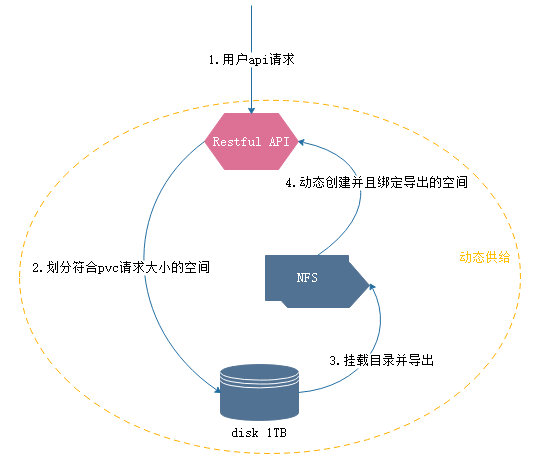
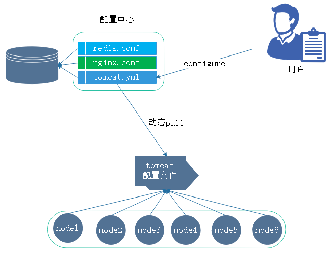
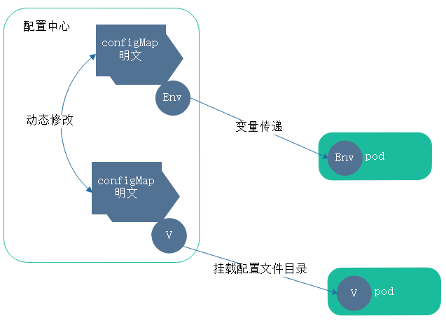
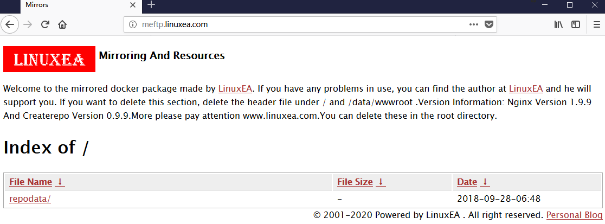
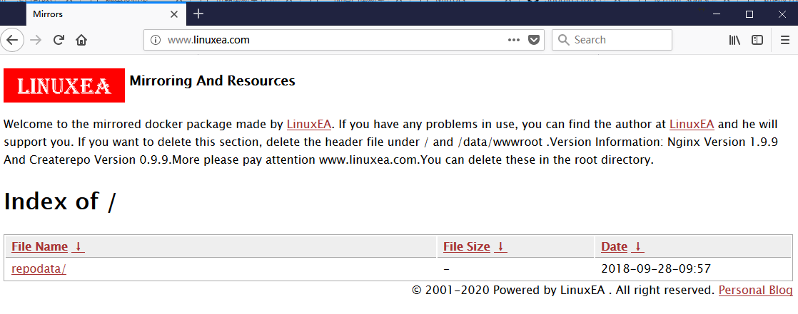

在之前的描述中，我们知道pv和pvc在使用中存在一种问题。pvc申请的的大小并不意味着就有符合pvc申请条件的pv。之前有意设定了符合pvc条件的pv，并成功的被pod绑定所使用。

## StorageClass

k8s也考虑到这种情况，于是有意的设计了一种工作逻辑，能够让pvc在申请pv时候，借助存储类--->中间层(StorageClass)完成资源分配

首先，将众多存储归类，将相同的存储分为一个类别 ，这些被区分的存储类别分配后进行定义。定义成存储类(这类存储类是k8s标准资源)。这里资源定义完成后，k8s再去申请资源时候，将不会针对某个pv进行，而是针对存储类进行

- 定义存储类：以存储类型或者性能，在或者某一种标识特性进行分别区分来定义的类，就是存储类

## restful

存储设备必须支持restful，并且存储空间必须满足pvc申请的空间，至少大于等于。

以NFS为例，假设此时并没有提前创建空间，也没有手动创建PV。在前端定义一个restful 风格的接口。用户请求在磁盘划分一个符合pvc大小的分区，而后编辑NFS的配置文件将划分的分区挂载至本地的某个目录并且导出。动态创建一个pv并且绑定导出的空间。而后与pvc绑定。这个过程的动作都是动态生成的。如下： 



也就是说事先并没有手动创建任何，只是输入了管理接口后远程创建，这类有ceph，Glusterfs等。

## configMap与secret

secret与configMap也算是存储卷，但是secret与configMap存在的目的并不是为pod提供存储空间来用的，而是给用户提供从集群外部向pod内部应用注入配置信息的方式

引入：

在之前，一个容器内的应用配置文件，在起初制作image的时候已经配置在镜像内制作完成。顶多使用变量传递而修改一些配置参数。但是，倘若修改后的容器在运行了一段时间后，又需要修改配置。需要重新传递参数，这时候就需要重启容器内的进程，或者脚本。从而使配置生效。 

并且，在之前的场景中，配置文件写死在镜像内，如果有不同的配置那可能以为这需要制作多个镜像。倘若使用不同的镜像标识来做配置的更新迭代，那么就会出现很多不同版本的镜像。这在之前的场景中是常见的。 但是，如果仅仅修改一个配置文件，就需要重构一个镜像，这样的方式代价无疑较大。在一些非容器化常见的场景中，可以使用配置中心来进行管理配置文件，如下：



配置文件存放在配置中心，tomcat在启动时候加载配置文件是从配置中心拉取的内容，而后启动tomcat进程。而后如果需要修改配置文件，只需要修改配置中心的集中配置文件，而后通知程序重新加载配置即可

## configMap

在kubernetes中引用一个新的标准资源，configMap来解决这个问题。configMap中存放的配置信息，启动一个pod的时候，可以共享configMap资源，资源对象可以作为存储卷或者环境变量。

configMap的作用在与可以与镜像解耦，配置信息通过configMap注入，一个配置文件可以应对多个pod容器，一个镜像也可以应付(配置)多个配置文件。这样一来便增强了应用的复用性和配置的一致性。一个configMap就是一系列配置数据的集合，而这些数据注入到pod对象容器中使用，注入方式有两种：
1，直接使用configMap作为存储卷
2，使用ENV FROM引用
并且支持动态修改：修改完成同步到其他容器



comfigMap的存储模式是键值对：key1:value1。每个value的长度可以是一个，也可以是一串，没有字符长短限制。

comfigMap存放的数据是明文的，而secret是base64

## 创建configMap

在`configMap`中，会用到`configMapKeyRef`和`secretKeyRef`.`configMap`也属于名称空间资源。在创建时，没有spec，而有data，结构相对简单。并且可以直接在命令行创建(`kubectl create configmap ...`)，也可以定义配置清单。

### 1，命令行创建
创建一个名称为`linuxea-config`的cm，键值分别是：
- ` NGINX_PORT：80`
- `SERVER_NAME:meftp.linuxea.com`

如下：
```
[marksugar@linuxea linuxea]# kubectl create configmap linuxea-config --from-literal=NGINX_PORT=80 --from-literal=SERVER_NAME=meftp.linuxea.com
configmap/linuxea-config created
```
`kubectl get cm`其中DATA下 有两个key
```
[marksugar@linuxea linuxea]# kubectl get cm
NAME             DATA      AGE
linuxea-config   2         4s
```
使用`kubectl describe cm linuxea-config`查看键值内容。并且这里的comfigmap能够被pod启动时候调用
```
[marksugar@linuxea configMap]# kubectl describe cm linuxea-config
Name:         linuxea-config
Namespace:    default
Labels:       <none>
Annotations:  <none>

Data
====
NGINX_PORT:
----
80
SERVER_NAME:
----
meftp.linuxea.com
Events:  <none>
```
### 2，文件创建
`kubectl create configmap CM名称 --from-file=键=./值FILE` 如果不指定键键，文件名称就为键
编写一个文件

```
[marksugar@linuxea configMap]# cat 80.conf 
    server_name meftp.linuxea.com;
    listen 80;
```
创建一个comfigmap,名称为linuxea-nginx，键名称和文件一样
```
[marksugar@linuxea configMap]# kubectl create configmap linuxea-nginx --from-file=./80.conf 
```
使用`kubectl get cm`查看定义的`linuxea-nginx`的data有一个键
```
[marksugar@linuxea configMap]# kubectl get cm
NAME             DATA      AGE
linuxea-config   2         13h
linuxea-nginx    1         3m
```
使用` kubectl get cm linuxea-nginx -o yaml`查看定义过的内容
其中80.conf为键：

```
data:
  80.conf: |2
        server_name meftp.linuxea.com;
        listen 80;
```
如下
```
[marksugar@linuxea configMap]# kubectl get cm linuxea-nginx -o yaml
apiVersion: v1
data:
  80.conf: |2
        server_name meftp.linuxea.com;
        listen 80;
kind: ConfigMap
metadata:
  creationTimestamp: 2018-09-28T08:26:24Z
  name: linuxea-nginx
  namespace: default
  resourceVersion: "1712102"
  selfLink: /api/v1/namespaces/default/configmaps/linuxea-nginx
  uid: 2f948b0e-c2f8-11e8-a8ab-88882fbd1028
```
在或者使用`kubectl describe cm linuxea-nginx`查看定义过的键值
```
[marksugar@linuxea configMap]# kubectl describe cm linuxea-nginx
Name:         linuxea-nginx
Namespace:    default
Labels:       <none>
Annotations:  <none>

Data
====
80.conf:
----
    server_name meftp.linuxea.com;
    listen 80;

Events:  <none>
```

### 3，应用环境变量CM到POD

- 环境变量的配置的configMap，在我们修改后是不会立即生效到pod中的

变量name需要使用下滑线，如果是减号"-"，也会被转换成下划线

```
    env:
    - name: NGINX_PORT
      valueFrom:
        configMapKeyRef:  # 引用configmap, 默认需要实现存在，如果不存在启动会报错
          name: linuxea-config  # 被应用的configmap，已经事先定义好的
          key: NGINX_PORT # 将NGINX_PORT的值传递给name的NGINX_PORT，最终映射到容器内的是name的值
	      optional: true #这样一个场景，倘若在启动pod时候，configMap事先并没有创建好。但是我们知道，如果没有事先创建这里会报错。optional设置为true可以解决这个问题。也就是说配置optional设置为true后，启动不会失败，启动后再创建configMap，而后重载pod生效configMap
    - name: SERVER_NAME
      valueFrom:
        configMapKeyRef:
          name: linuxea-config
          key: SERVER_NAME        
```

定义资源清单，为了方便访问，这里直接定义了`hostNetwork: true`,当然，如果使用`hostnetwork`就要加

```
    - name: http
      containerPort: 80
      hostPort: 80
```

最后如下

```
[marksugar@linuxea configMap]# cat pod-configmap.yaml 
apiVersion: v1
kind: Pod
metadata: 
  name: pod-meftp
  namespace: default
  labels:
    www: meftplinuxea
    tier: backend
  annotations:
    www.linuxea.com/ops-by: "linuxea ftp and mirrors"
spec:
  hostNetwork: true
  containers:
  - name: linuxea-pod1-com
    image: "marksugar/nginx_createrepo"
    ports:
    - name: http
      containerPort: 80
      hostPort: 80
    env:
    - name: NGINX_PORT
      valueFrom:
        configMapKeyRef: 
          name: linuxea-config
          key: NGINX_PORT
    - name: SERVER_NAME
      valueFrom:
        configMapKeyRef:
          name: linuxea-config
          key: SERVER_NAME
```

将资源清单中定义的pod apply 启动

```
[marksugar@linuxea configMap]# kubectl apply -f pod-configmap.yaml 
pod/pod-meftp created
```

而后pod被启动，得到的ip是172.16.5.112

```
[marksugar@linuxea configMap]# kubectl get pods -o wide
NAME              READY     STATUS    RESTARTS   AGE       IP              NODE                 NOMINATED NODE
linuxea-pvc-pod   1/1       Running   0          4d        172.16.4.7      linuxea.node-2.com   <none>
pod-meftp         1/1       Running   0          9s        10.10.240.146   linuxea.node-3.com   <none>
```

而后直接访问`meftp.linuxea.com`(假如你解析了的话)


而后进入容器

```
[marksugar@linuxea configMap]# kubectl exec -it pod-meftp -- /bin/sh
```
我们过滤下环境变量确定是否被正常传入
```
sh-4.2# printenv |egrep "NGINX_PORT|SERVER_NAME"
SERVER_NAME=meftp.linuxea.com
NGINX_PORT=80
```
以及被变量替换
```
sh-4.2# cat /etc/nginx/vhost/ps.conf 
listen 80;
server_name meftp.linuxea.com;
```

### 4，应用文件CM到POD

- 在上面提到，环境变量修改是不会同步到POD中，而使用configMap的文件设置键值，当修改后，一段时间后就会同步到POD中(这个文件在pod中表现为链接文件)，自动完成同步。这个同步时间取决于api server的同步时间

#### 4.1，准备configMap

我们将80.conf重命名到ps.conf而后重新创建,内容和80.conf一致。主要是镜像中对配置文件的名称已经写死了

```
[marksugar@linuxea configMap]# cat ps.conf 
    server_name meftp.linuxea.com;
    listen 80;
```

create

```
[marksugar@linuxea configMap]# kubectl create configmap linuxea-nginx --from-file=./ps.conf 
configmap/linuxea-nginx created
[marksugar@linuxea configMap]# kubectl get cm
NAME             DATA      AGE
linuxea-config   2         5h
linuxea-nginx    1         4s
```

#### 4.2，应用到pod

编写资源清单,而后定义存储卷，将configMap引用进来

```
  volumes:
  - name: nginxconf
    configMap:
      name: linuxea-nginx  #这里挂在的是之前创建好的configMap以linuxea-nginx为名称的键名
```

而后在pod中调用

```
    volimeMounts:
    - name: nginxconf
      mountPath: /etc/nginx/vhost/ # 将创建的configMap文件挂载到此目录下
      readOnly: true # 这里配置readOnly为true说明不允许容器内修改，只读模式
```

完成的资源清单如下：

```
[marksugar@linuxea configMap]# cat pod-configmap-file.yaml 
apiVersion: v1
kind: Pod
metadata: 
  name: pod-meftp-cmfile
  namespace: default
  labels:
    www: meftplinuxea
    tier: backend
  annotations:
    www.linuxea.com/ops-by: "linuxea ftp and mirrors"
spec:
  hostNetwork: true
  containers:
  - name: linuxea-pod1-com
    image: "marksugar/nginx_createrepo"
    ports:
    - name: http
      containerPort: 80
      hostPort: 80
    volumeMounts:
    - name: nginxconf
      mountPath: /etc/nginx/vhost/ps.conf
      readOnly: true
  volumes:
  - name: nginxconf
    configMap:
      name: linuxea-nginx
```

apply

```
[marksugar@linuxea configMap]# kubectl apply -f pod-configmap-file.yaml 
pod/pod-meftp-cmfile created
```

```
[marksugar@linuxea configMap]# kubectl get pods -w
NAME               READY     STATUS    RESTARTS   AGE
linuxea-pvc-pod    1/1       Running   0          4d
pod-meftp          1/1       Running   0          2h
pod-meftp-cmfile   1/1       Running   0          7s
```

而后进入容器内，验证是否被挂在到容器

```
[marksugar@linuxea configMap]# kubectl exec -it pod-meftp-cmfile -- /bin/sh
sh-4.2# cat /etc/nginx/vhost/ps.conf 
    server_name meftp.linuxea.com;
    listen 80;
sh-4.2# 
```

#### 4.3，修改configMap

此时修改在pod外的configMap文件，在短暂的同步后就会生效到容器内

使用`kubectl edit cm linuxea-nginx`编辑，修改`server_name www.linuxea.com`

```
# Please edit the object below. Lines beginning with a '#' will be ignored,
# and an empty file will abort the edit. If an error occurs while saving this file will be
# reopened with the relevant failures.
#
apiVersion: v1
data:
  ps.conf: |2
        server_name www.linuxea.com;
        listen 80;
kind: ConfigMap
metadata:
  creationTimestamp: 2018-09-28T09:10:58Z
  name: linuxea-nginx
  namespace: default
  resourceVersion: "1716528"
  selfLink: /api/v1/namespaces/default/configmaps/linuxea-nginx
  uid: 69c0d927-c2fe-11e8-a8ab-88882fbd1028
```
进入容器
```
[marksugar@linuxea configMap]# kubectl exec -it pod-meftp-cmfile -- /bin/sh
```
而后循环的进行监控观察，一点时间后已经同步到容器内。这个同步时间取决于api server的同步时间！此刻，配置发生改变，说明修改生效。
```
sh-4.2# while true;do cat /etc/nginx/vhost/ps.conf ;sleep 1;done
    server_name meftp.linuxea.com;
    listen 80;
    server_name meftp.linuxea.com;
    listen 80;
    server_name www.linuxea.com;
    listen 80;
    server_name www.linuxea.com;
    listen 80;
```

同时， 这个配置文件也是一个链接文件

```
sh-4.2# ls -sl
total 0
0 lrwxrwxrwx 1 root root 14 Sep 28 09:16 ps.conf -> ..data/ps.conf
```
### 5，挂载部分键
只挂载部分键值，而非所有
​	items: 列出的键
​	key: 列出的值。对应文件内容以key对应的value
​	mode: 指定权限
​	path: 路径不能使用“..”

## secret
在之前的ingress的tomcat https中已经使用过secret，secret适用于密钥文件，密码等。secret也有很多类型
- generic：通用的，保存密码
- tls：保存私钥和证书
- docker-registry：docker的认证信息：当up一个容器的时候，首选会检查本地是否有这个镜象，如果没有就会到registry拉取。如果是私有的仓库，则需要输入账号信息登录，而后拉取。这些过程通过kubelet实现的。
  在spec资源标准清单里面，链接私有仓库链接的用户认证存放：imagePullSecrets。

创建一个generic的secret

```
[marksugar@linuxea configMap]#  kubectl create secret generic redis-passwd --from-literal=password=kjksada@#2lsmx
secret/redis-passwd created
[marksugar@linuxea configMap]# kubectl get secret
NAME                    TYPE                                  DATA      AGE
default-token-k25gj     kubernetes.io/service-account-token   3         12d
redis-passwd            Opaque                                1         4s
tomcat-ingress-secret   kubernetes.io/tls                     2         11d
```

当使用`kubectl describe secret redis-passwd`查看时，只会显示字节数，并不会显示信息
```
[marksugar@linuxea configMap]# kubectl describe secret redis-passwd
Name:         redis-passwd
Namespace:    default
Labels:       <none>
Annotations:  <none>

Type:  Opaque

Data
====
password:  14 bytes
```
当然，可以换种方式查看` kubectl get secret redis-passwd -o yaml`得到的密码是由bese64加密的密码：`a2prc2FkYUAjMmxzbXg=`
```
[marksugar@linuxea configMap]# kubectl get secret redis-passwd -o yaml
apiVersion: v1
data:
  password: a2prc2FkYUAjMmxzbXg=
kind: Secret
metadata:
  creationTimestamp: 2018-09-28T13:34:53Z
  name: redis-passwd
  namespace: default
  resourceVersion: "1742431"
  selfLink: /api/v1/namespaces/default/secrets/redis-passwd
  uid: 485aae93-c323-11e8-a8ab-88882fbd1028
type: Opaque
```
可以尝试解码`echo a2prc2FkYUAjMmxzbXg=|base64 -d`就可以进行解码。
```
[marksugar@linuxea configMap]# echo a2prc2FkYUAjMmxzbXg=|base64 -d
kjksada@#2lsmx
```
我们可以以同样的方式挂载。并且这个密码会存在在容器内是名明文的，并不是加密的
在pod中定义
```
    env:
    - name: REDIS_PASSWORD  # 传递到容器内的环境变量key
      valueFrom:
        secretKeyRef:  # 独特的secretKeyRef
          name: redis-passwd  # secret 名称
          key: password  # 创建key的kye名称，并非key:value
```
资源清单如下（主要查看变量的传递）
```
[marksugar@linuxea configMap]# cat pod-configmap-redis.yaml 
apiVersion: v1
kind: Pod
metadata: 
  name: pod-redis-test
  namespace: default
spec:
  containers:
  - name: linuxea-pod1-com
    image: "marksugar/nginx_createrepo"
    ports:
    - name: http
      containerPort: 80
    env:
    - name: REDIS_PASSWORD
      valueFrom:
        secretKeyRef: 
          name: redis-passwd
          key: password
```
apply起来
```
[marksugar@linuxea configMap]# kubectl apply -f pod-configmap-redis.yaml 
pod/pod-redis-test created
```
```
[marksugar@linuxea configMap]# kubectl get pods 
NAME               READY     STATUS    RESTARTS   AGE
linuxea-pvc-pod    1/1       Running   0          5d
pod-meftp          1/1       Running   0          7h
pod-meftp-cmfile   1/1       Running   0          3h
pod-redis-test     1/1       Running   0          6s
```
过滤下传入的`REDIS_PASSWORD`
```
[marksugar@linuxea configMap]# kubectl exec -it pod-redis-test printenv |grep REDIS
REDIS_PASSWORD=kjksada@#2lsmx
```